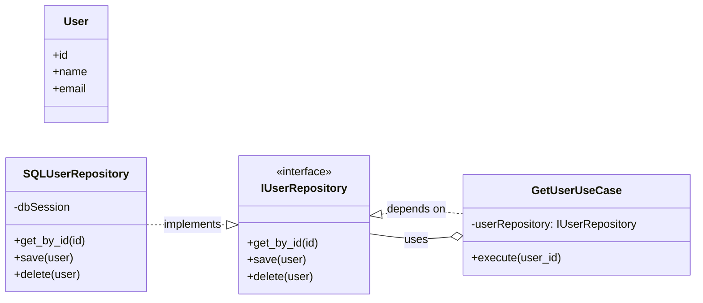
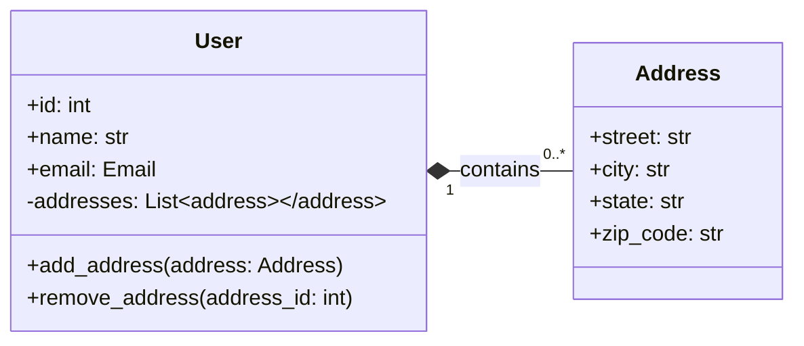
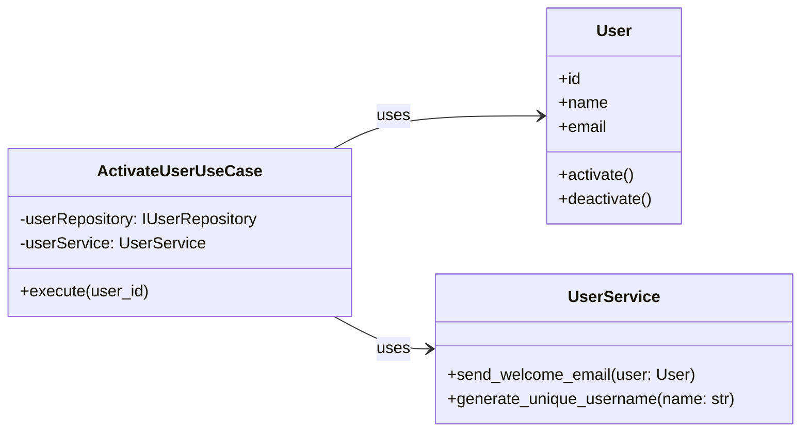
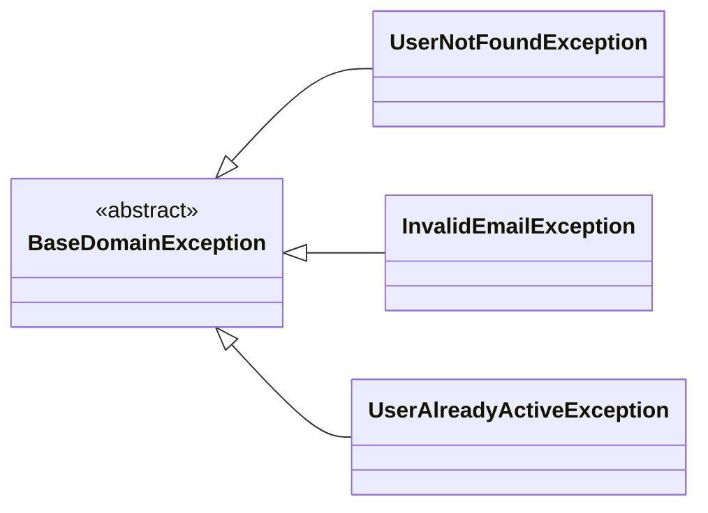

# Análise e Documentação do Projeto DEV Platform
 
**Estrutura da Análise:**

1. **Visão Geral do Projeto (Arquitetura, DDD, SOLID)**: Uma primeira impressão da organização do projeto e como ele se alinha aos princípios solicitados.
2. **Análise Detalhada por Princípio**:
    - **Arquitetura Limpa**: Avaliação das camadas e dependências.
    - **Domain-Driven Design (DDD)**: Identificação de Entidades, Value Objects, Agregados, Repositórios e Serviços de Domínio.
    - **SOLID**: Verificação da aplicação dos cinco princípios (Single Responsibility, Open/Closed, Liskov Substitution, Interface Segregation, Dependency Inversion).
    - **Boas Práticas de Programação**: Coesão, acoplamento, legibilidade, tratamento de erros, testes (se houver indícios), etc.
3. **Pontos de Melhoria com Exemplos e Diagramas**: Para cada ponto de melhoria identificado, será fornecida uma explicação detalhada, um diagrama UML (classe ou sequência, conforme a necessidade) utilizando Mermaid e um exemplo de código para a implementação da solução.

---

## 1. Visão Geral do Projeto DEV Platform

Com base na estrutura de arquivos e nos trechos de código fornecidos, o projeto `DEV Platform` parece ter uma intenção de seguir a Arquitetura Limpa e o DDD. A presença de diretórios como `domain`, `application`, `infrastructure`, `interfaces` e arquivos como `entities.py`, `value_objects.py`, `repositories.py`, `use_cases.py` sugere uma tentativa de segregação de responsabilidades.

No entanto, a implementação desses princípios requer uma análise mais profunda para garantir que as dependências fluam na direção correta e que cada componente esteja de fato encapsulando sua responsabilidade de domínio.

**Indícios Positivos Iniciais:**

- **`domain` folder**: Indica a intenção de ter um modelo de domínio rico.
- **`value_objects.py`**: A presença da classe `Email` como um Value Object é um bom sinal.
- **`entities.py`**: Provavelmente contém as entidades do domínio.
- **`use_cases.py`**: Sugere a existência de casos de uso, que na Arquitetura Limpa residem na camada de Aplicação.
- **`repositories.py`**: Aponta para a abstração de persistência.
- **`interfaces.py` / `ports.py`**: Possíveis interfaces (ou "ports" no contexto de Ports and Adapters, que é compatível com Arquitetura Limpa) que definem contratos.
- **`cli.py`**: Indica uma interface de usuário separada (linha de comando).

**Áreas para Investigação e Potenciais Melhorias:**

- **Dependências entre Camadas**: É crucial verificar se a camada de infraestrutura não está vazando para o domínio ou aplicação, e se o domínio é realmente independente.
- **Serviços de Domínio vs. Serviços de Aplicação**: Diferenciar claramente quando a lógica deve residir em um serviço de domínio (comportamento de várias entidades ou VOs) e quando em um serviço de aplicação (orquestração de casos de uso).
- **Agregados DDD**: Identificar e garantir que os agregados estão sendo respeitados, ou seja, que as entidades dentro de um agregado são acessadas apenas através da raiz do agregado.
- **Princípios SOLID**: Embora a estrutura sugira boas intenções, a implementação real pode violar esses princípios. Por exemplo, grandes classes com muitas responsabilidades ou acoplamento excessivo.
- **Tratamento de Erros**: A presença de `exceptions.py` é positiva, mas a forma como as exceções são lançadas e tratadas precisa ser avaliada.
- **Testes**: Não há indícios diretos de testes no `tree.txt`, mas a estrutura modular favoreceria a testabilidade.

---

## 2. Análise Detalhada por Princípio

Vamos aprofundar a análise com base nos trechos de código fornecidos e nos princípios solicitados.

### 2.1. Arquitetura Limpa (Clean Architecture)

A Arquitetura Limpa propõe uma organização em camadas concêntricas, onde as dependências fluem de fora para dentro. O domínio (Entidades e Casos de Uso) é o centro, independente de frameworks, bancos de dados ou interfaces de usuário.

**Avaliação Inicial:**

O projeto parece ter a seguinte estrutura que se alinha com a Arquitetura Limpa:

- `src/dev_platform/domain/`: Potencialmente o "círculo mais interno", contendo entidades, value objects e, talvez, serviços de domínio.
    - `entities.py`
    - `value_objects.py` (Ex: `Email`)
    - `interfaces.py` / `ports.py` (Contratos para Repositórios, etc.)
- `src/dev_platform/application/`: Potencialmente o "círculo seguinte", contendo os casos de uso.
    - `use_cases.py`
    - `dtos.py` (Data Transfer Objects para comunicação entre camadas)
- `src/dev_platform/infrastructure/`: Potencialmente a camada externa, contendo implementações concretas de interfaces (Ex: Repositórios, ORMs).
    - `repositories.py` (Implementações concretas)
    - `session.py` (Gerenciamento de sessão de banco de dados)
    - `models.py` (Mapeamento ORM, se houver)
- `src/dev_platform/interfaces/` ou `src/dev_platform/presentation/`: Camada mais externa, adaptadores para interfaces de usuário (CLI, Web, etc.).
    - `cli.py` (Ex: `UserCommands` no `cli.py`)

**Pontos Fortes Aparente:**

- **Separação de Preocupações**: A existência de diretórios distintos para domínio, aplicação e infraestrutura/interfaces é um forte indicativo de separação de preocupações.
- **`value_objects.py`**: A validação de formato de email no `Email` Value Object demonstra que a lógica de negócio está sendo encapsulada no domínio.
- **`use_cases.py`**: Os casos de uso são uma parte central da camada de aplicação na Arquitetura Limpa, orquestrando as operações de domínio.
- **`commands.py` no `cli.py`**: A forma como `UserCommands` é instanciado e os métodos assíncronos `update_user_async`, `get_user_async`, `delete_user_async` são chamados, sugere que `cli.py` está agindo como um "adaptador" da interface do usuário para os casos de uso ou comandos de aplicação.

**Pontos a Investigar e Potenciais Melhorias na Arquitetura Limpa:**

- **Direção das Dependências**: É crucial garantir que o `domain` não dependa de `application` ou `infrastructure`. O `application` pode depender do `domain`, e `infrastructure` e `interfaces` dependem de `application` e `domain`.
- **Abstrações no Domínio**: As interfaces (ou "ports") para repositórios e serviços externos devem ser definidas na camada de domínio, e suas implementações concretas devem estar na camada de infraestrutura. Isso é fundamental para a Inversão de Dependência (D de SOLID).
- **DTOS vs. Entidades**: Garantir que a comunicação entre as camadas use DTOs quando apropriado para evitar vazamento de detalhes de implementação do domínio. No entanto, o `dtos.py` já sugere que isso está sendo considerado.

#### Exemplo de Melhoria: Reforçando a Inversão de Dependência (D de SOLID) na Arquitetura Limpa

**Problema Identificado**: Embora haja um `repositories.py`, a questão é se as interfaces dos repositórios estão no domínio e suas implementações na infraestrutura. Se as classes de domínio dependem diretamente das implementações concretas de repositórios, a inversão de dependência é violada.

**Solução Proposta**: Definir interfaces (`IRepository` ou `UserRepositoryPort`) na camada de domínio e suas implementações concretas na camada de infraestrutura. A injeção de dependência deve ser usada para fornecer as implementações concretas aos casos de uso ou serviços de aplicação.

**Diagrama UML de Classe (Mermaid):**

Snippet de código



**Explicação da Melhoria:**

No diagrama, `IUserRepository` é uma interface definida na camada de Domínio. `GetUserUseCase` (na camada de Aplicação) depende apenas desta interface. `SQLUserRepository` (na camada de Infraestrutura) implementa `IUserRepository`. A injeção de dependência garante que `GetUserUseCase` receba uma instância de `SQLUserRepository` em tempo de execução, mas sem acoplamento direto à implementação concreta.

**Exemplo de Implementação da Solução (Código Python):**

**`./src/dev_platform/domain/user/interfaces.py` (ou `ports.py`)**

Python

```python
# Definindo a interface para o repositório de usuários no domínio
from abc import ABC, abstractmethod
from typing import Optional

from src.dev_platform.domain.user.entities import User # Assumindo a existência de User
from src.dev_platform.domain.user.value_objects import Email # Assumindo a existência de Email

class IUserRepository(ABC):
    @abstractmethod
    async def get_by_id(self, user_id: int) -> Optional[User]:
        pass

    @abstractmethod
    async def save(self, user: User) -> None:
        pass

    @abstractmethod
    async def delete(self, user_id: int) -> None:
        pass

    @abstractmethod
    async def get_by_email(self, email: Email) -> Optional[User]:
        pass

```

**`./src/dev_platform/application/user/use_cases.py`**

Python

```python
# Casos de uso dependendo da interface do repositório
from src.dev_platform.domain.user.entities import User
from src.dev_platform.domain.user.interfaces import IUserRepository
from src.dev_platform.domain.user.value_objects import Email
from src.dev_platform.application.dtos import UserDTO # Assumindo UserDTO

class GetUserUseCase:
    def __init__(self, user_repository: IUserRepository):
        self.user_repository = user_repository

    async def execute(self, user_id: int) -> Optional[UserDTO]:
        user = await self.user_repository.get_by_id(user_id)
        if user:
            return UserDTO(id=user.id, name=user.name, email=user.email.value)
        return None

class CreateUserUseCase:
    def __init__(self, user_repository: IUserRepository):
        self.user_repository = user_repository

    async def execute(self, name: str, email_str: str) -> UserDTO:
        email = Email(email_str) # Validação do Value Object no domínio
        if await self.user_repository.get_by_email(email):
            raise ValueError("Email already exists.") # Exemplo de regra de negócio de domínio
        user = User(id=None, name=name, email=email) # ID será gerado pelo BD na persistência
        await self.user_repository.save(user)
        return UserDTO(id=user.id, name=user.name, email=user.email.value)

# Outros casos de uso como UpdateUserUseCase, DeleteUserUseCase
```

**`./src/dev_platform/infrastructure/user/repositories/sqlalchemy_user_repository.py`**

Python

```python
# Implementação concreta do repositório na infraestrutura
from typing import Optional
from sqlalchemy.ext.asyncio import AsyncSession # Assumindo SQLAlchemy
from sqlalchemy import select

from src.dev_platform.domain.user.entities import User
from src.dev_platform.domain.user.interfaces import IUserRepository
from src.dev_platform.domain.user.value_objects import Email
from src.dev_platform.infrastructure.user.models import User as UserModel # Assumindo um modelo ORM

class SQLAlchemyUserRepository(IUserRepository):
    def __init__(self, db_session: AsyncSession):
        self.db_session = db_session

    async def get_by_id(self, user_id: int) -> Optional[User]:
        stmt = select(UserModel).where(UserModel.id == user_id)
        result = await self.db_session.execute(stmt)
        user_model = result.scalar_one_or_none()
        if user_model:
            return User(id=user_model.id, name=user_model.name, email=Email(user_model.email))
        return None

    async def save(self, user: User) -> None:
        user_model = UserModel(id=user.id, name=user.name, email=user.email.value)
        self.db_session.add(user_model)
        await self.db_session.flush() # Para obter o ID gerado se for o caso
        user.id = user_model.id # Atualiza o ID da entidade de domínio se necessário

    async def delete(self, user_id: int) -> None:
        stmt = select(UserModel).where(UserModel.id == user_id)
        result = await self.db_session.execute(stmt)
        user_model = result.scalar_one_or_none()
        if user_model:
            await self.db_session.delete(user_model)
            await self.db_session.flush()

    async def get_by_email(self, email: Email) -> Optional[User]:
        stmt = select(UserModel).where(UserModel.email == email.value)
        result = await self.db_session.execute(stmt)
        user_model = result.scalar_one_or_none()
        if user_model:
            return User(id=user_model.id, name=user_model.name, email=Email(user_model.email))
        return None
```

**`./src/dev_platform/main.py` ou `composition_root.py` (Local de Composição das Dependências)**

Python

```python
# Exemplo de como as dependências seriam montadas no ponto de entrada da aplicação
from sqlalchemy.ext.asyncio import create_async_engine, AsyncSession
from sqlalchemy.orm import sessionmaker

from src.dev_platform.application.user.use_cases import GetUserUseCase, CreateUserUseCase
from src.dev_platform.infrastructure.user.repositories.sqlalchemy_user_repository import SQLAlchemyUserRepository
from src.dev_platform.interfaces.cli import UserCommands # Se cli.py for adaptado para usar casos de uso

# Configuração do banco de dados (exemplo)
DATABASE_URL = "sqlite+aiosqlite:///./test.db"
engine = create_async_engine(DATABASE_URL, echo=True)
AsyncSessionLocal = sessionmaker(engine, class_=AsyncSession, expire_on_commit=False)

# Função para obter uma sessão de banco de dados (poderia ser um contexto ou dependency injector)
async def get_db_session():
    async with AsyncSessionLocal() as session:
        yield session

# Composição das dependências para um caso de uso
async def get_user_use_case():
    session = await anext(get_db_session()) # Obter uma sessão (simplificado para exemplo)
    user_repo = SQLAlchemyUserRepository(session)
    return GetUserUseCase(user_repo)

async def create_user_use_case():
    session = await anext(get_db_session())
    user_repo = SQLAlchemyUserRepository(session)
    return CreateUserUseCase(user_repo)


# O cli.py precisaria ser adaptado para injetar os casos de uso
# Exemplo (conceitual):
# class UserCommands:
#    def __init__(self, get_user_uc: GetUserUseCase, create_user_uc: CreateUserUseCase):
#        self.get_user_uc = get_user_uc
#        self.create_user_uc = create_user_uc

#    async def get_user_async(self, user_id: int):
#        result = await self.get_user_uc.execute(user_id)
#        click.echo(result)

#    async def create_user_async(self, name: str, email: str):
#        result = await self.create_user_uc.execute(name, email)
#        click.echo(result)
```

### 2.2. Domain-Driven Design (DDD)

DDD é uma abordagem para o desenvolvimento de software que foca em um entendimento profundo do domínio do negócio e na modelagem desse domínio em código.

**Avaliação Inicial:**

A presença de `domain` folder com `entities.py` e `value_objects.py` é um excelente começo para o DDD. O arquivo `value_objects.py` com `Email` é um exemplo claro de um Value Object.

**Pontos Fortes Aparente:**

- **Value Objects**: A classe `Email` no `value_objects.py` com sua validação interna (`_is_valid`) e imutabilidade (`frozen=True`) é um exemplo de boa prática de DDD para Value Objects.
- **Entities**: A existência de `entities.py` sugere que o domínio contém objetos com identidade e ciclo de vida.
- **Ubiquitous Language**: Embora não tenhamos o contexto completo do negócio, a organização por `user` dentro de `domain` sugere uma tentativa de organizar o código em torno de conceitos de domínio.

**Pontos a Investigar e Potenciais Melhorias no DDD:**

- **Agregados (Aggregates)**: Identificar os agregados no domínio e garantir que todas as interações com as entidades dentro de um agregado ocorram apenas através da raiz do agregado. Isso garante a consistência transacional.
- **Serviços de Domínio (Domain Services)**: Lógica de negócio que envolve múltiplas entidades ou value objects e que não se encaixa naturalmente em uma entidade específica.
- **Eventos de Domínio (Domain Events)**: Para registrar e reagir a eventos significativos que ocorrem no domínio.
- **Repositórios (Repositories)**: Devem ser definidos para cada raiz de agregado, encapsulando a complexidade de persistência.
- **Especificações (Specifications)**: Para encapsular regras de negócio que podem ser reutilizadas para filtrar ou validar entidades.

#### Exemplo de Melhoria: Identificação e Implementação de Agregados

**Problema Identificado**: Não é possível determinar, apenas pela estrutura de arquivos, se os agregados estão sendo corretamente definidos e respeitados. Um anti-padrão comum é acessar entidades filhas diretamente do repositório, em vez de através da raiz do agregado.

**Solução Proposta**: Definir explicitamente os agregados. Por exemplo, se um `User` pode ter `Addresses` (endereços), e um `Address` só faz sentido no contexto de um `User`, então `User` seria a raiz do agregado `User` e `Address` seria parte desse agregado. O repositório seria apenas para `User`, e `Addresses` seriam manipulados através dos métodos do `User`.

**Diagrama UML de Classe (Mermaid):**

Snippet de código



**Explicação da Melhoria:**

No diagrama, `User` é a raiz do agregado `UserAggregate`. `Address` é uma entidade que pertence a este agregado. As operações em `Address` (como adicionar ou remover) devem ser feitas através dos métodos de `User`, garantindo que o agregado mantenha sua consistência.

**Exemplo de Implementação da Solução (Código Python):**

**`./src/dev_platform/domain/user/entities.py`**

Python

```python
from dataclasses import dataclass, field
from typing import List, Optional
from src.dev_platform.domain.user.value_objects import Email

@dataclass
class Address:
    street: str
    city: str
    state: str
    zip_code: str
    # Pode ter um ID se for necessário identificar um endereço específico para remoção/atualização

@dataclass
class User:
    id: Optional[int] # ID pode ser None para novos usuários antes da persistência
    name: str
    email: Email
    addresses: List[Address] = field(default_factory=list) # Agregado de endereços

    def add_address(self, address: Address):
        # Lógica de negócio para adicionar um endereço, pode incluir validações
        self.addresses.append(address)

    def remove_address(self, street: str, zip_code: str):
        # Lógica de negócio para remover um endereço.
        # Poderia ser por ID se Address tivesse um
        initial_len = len(self.addresses)
        self.addresses = [
            addr for addr in self.addresses
            if not (addr.street == street and addr.zip_code == zip_code)
        ]
        if len(self.addresses) == initial_len:
            raise ValueError("Address not found for removal.")

    def update_name(self, new_name: str):
        if not new_name or len(new_name) < 3:
            raise ValueError("Name must be at least 3 characters long.")
        self.name = new_name

    def update_email(self, new_email_str: str):
        new_email = Email(new_email_str) # Validação do Value Object
        self.email = new_email
```

**`./src/dev_platform/application/user/use_cases.py` (Exemplo de caso de uso com agregado)**

Python

```python
from src.dev_platform.domain.user.entities import User, Address
from src.dev_platform.domain.user.interfaces import IUserRepository # Usando a interface definida acima
from src.dev_platform.application.dtos import UserDTO, AddressDTO # Assumindo DTOs para Address também

class AddAddressToUserUseCase:
    def __init__(self, user_repository: IUserRepository):
        self.user_repository = user_repository

    async def execute(self, user_id: int, address_dto: AddressDTO) -> UserDTO:
        user = await self.user_repository.get_by_id(user_id)
        if not user:
            raise ValueError("User not found.")

        # Cria o Value Object/Entidade de Domínio a partir do DTO
        address = Address(
            street=address_dto.street,
            city=address_dto.city,
            state=address_dto.state,
            zip_code=address_dto.zip_code
        )

        user.add_address(address) # Operação de domínio na raiz do agregado
        await self.user_repository.save(user) # Salva o agregado completo

        # Converte a entidade atualizada para DTO para retorno
        return UserDTO(
            id=user.id,
            name=user.name,
            email=user.email.value,
            addresses=[AddressDTO(street=a.street, city=a.city, state=a.state, zip_code=a.zip_code) for a in user.addresses]
        )
```

**`./src/dev_platform/infrastructure/user/repositories/sqlalchemy_user_repository.py` (Adaptação para persistir o agregado)**

Python

```python
# Continuação do SQLAlchemyUserRepository
from sqlalchemy import select
from sqlalchemy.orm import selectinload # Para carregar relacionamentos

class SQLAlchemyUserRepository(IUserRepository):
    # ... (código anterior)

    async def get_by_id(self, user_id: int) -> Optional[User]:
        # Carrega o User e seus Addresses
        stmt = select(UserModel).where(UserModel.id == user_id).options(selectinload(UserModel.addresses))
        result = await self.db_session.execute(stmt)
        user_model = result.scalar_one_or_none()
        if user_model:
            addresses = [
                Address(street=a.street, city=a.city, state=a.state, zip_code=a.zip_code)
                for a in user_model.addresses
            ]
            return User(id=user_model.id, name=user_model.name, email=Email(user_model.email), addresses=addresses)
        return None

    async def save(self, user: User) -> None:
        # Mapeamento da Entidade de Domínio para o Modelo ORM
        user_model = None
        if user.id:
            user_model = await self.db_session.get(UserModel, user.id)
        
        if not user_model:
            user_model = UserModel(name=user.name, email=user.email.value)
            self.db_session.add(user_model)
            await self.db_session.flush() # Para obter o ID antes de adicionar endereços
            user.id = user_model.id # Atualiza o ID da entidade de domínio
        else:
            user_model.name = user.name
            user_model.email = user.email.value
            # Lidar com a sincronização dos endereços: remover os que não estão mais lá, adicionar novos, atualizar existentes
            # Isso pode ser complexo dependendo da estratégia de mapeamento ORM (ex: cascading, merge)
            # Para simplificar, vamos assumir uma remoção e adição para Addresses
            # Em um cenário real, você teria um controle de mudança mais sofisticado
            for existing_address in user_model.addresses[:]: # Iterar sobre uma cópia
                found = False
                for domain_address in user.addresses:
                    if (existing_address.street == domain_address.street and
                        existing_address.zip_code == domain_address.zip_code):
                        # Atualizar se houver mudanças (simplificado)
                        existing_address.city = domain_address.city
                        existing_address.state = domain_address.state
                        found = True
                        break
                if not found:
                    self.db_session.delete(existing_address)

            for domain_address in user.addresses:
                # Verificar se o endereço já existe no modelo para evitar duplicação
                exists_in_model = any(
                    (a.street == domain_address.street and a.zip_code == domain_address.zip_code)
                    for a in user_model.addresses
                )
                if not exists_in_model:
                    user_model.addresses.append(
                        AddressModel(
                            street=domain_address.street,
                            city=domain_address.city,
                            state=domain_address.state,
                            zip_code=domain_address.zip_code,
                            user_id=user_model.id
                        )
                    )

        await self.db_session.commit() # Salvar as alterações
```

**`./src/dev_platform/infrastructure/user/models.py` (Exemplo de Modelo ORM com relacionamento)**

Python

```python
from sqlalchemy import Column, Integer, String, ForeignKey
from sqlalchemy.orm import relationship
from sqlalchemy.ext.declarative import declarative_base

Base = declarative_base() # Assumindo uma base declarativa

class User(Base):
    __tablename__ = "users"
    id = Column(Integer, primary_key=True, index=True)
    name = Column(String, index=True)
    email = Column(String, unique=True, index=True)

    addresses = relationship("Address", back_populates="user", cascade="all, delete-orphan") # Relacionamento com Address

class Address(Base):
    __tablename__ = "addresses"
    id = Column(Integer, primary_key=True, index=True)
    street = Column(String)
    city = Column(String)
    state = Column(String)
    zip_code = Column(String)
    user_id = Column(Integer, ForeignKey("users.id"))

    user = relationship("User", back_populates="addresses")
```

### 2.3. Princípios SOLID

Os princípios SOLID são diretrizes de design que ajudam a criar software mais compreensível, flexível e de fácil manutenção.

**Avaliação Inicial:**

A estrutura do projeto sugere uma intenção de seguir alguns princípios, mas a aplicação real depende do código interno de cada arquivo.

- **SRP (Single Responsibility Principle)**: A presença de `value_objects.py`, `entities.py`, `use_cases.py`, `repositories.py` é um bom indício. Cada arquivo ou módulo parece ter uma responsabilidade específica.
- **OCP (Open/Closed Principle)**: O software deve ser aberto para extensão, mas fechado para modificação. Isso geralmente é alcançado através de interfaces e abstrações. A existência de `interfaces.py` é um bom começo.
- **LSP (Liskov Substitution Principle)**: Objetos de um supertipo devem poder ser substituídos por objetos de um subtipo sem quebrar a aplicação. Isso é mais relevante em hierarquias de classes.
- **ISP (Interface Segregation Principle)**: Clientes não devem ser forçados a depender de interfaces que não usam. Interfaces devem ser pequenas e específicas. A presença de `interfaces.py` pode indicar que isso está sendo considerado, mas precisa de verificação.
- **DIP (Dependency Inversion Principle)**: Módulos de alto nível não devem depender de módulos de baixo nível. Ambos devem depender de abstrações.1 Abstrações não devem depender de detalhes. Detalhes devem depender de abstrações.2 Vimos isso no item de Arquitetura Limpa ao discutir a injeção de dependência para repositórios.

**Pontos a Investigar e Potenciais Melhorias em SOLID:**

- **SRP em Casos de Uso e Entidades**: Garantir que casos de uso façam apenas a orquestração e que entidades contenham apenas a lógica de domínio, sem lógica de persistência ou de interface.
- **OCP com Estratégias**: Se houver variações de comportamento (ex: diferentes formas de notificação), o OCP sugere o uso de interfaces e classes de estratégia.
- **ISP em `interfaces.py`**: Verificar se as interfaces são coesas e não grandes demais.
- **DIP em todo o projeto**: A injeção de dependência deve ser consistente em toda a aplicação.

#### Exemplo de Melhoria: Aplicando SRP em Casos de Uso e Serviços de Domínio

**Problema Identificado**: É comum que Casos de Uso (Camada de Aplicação) acabem acumulando lógica de negócio complexa que deveria estar no Domínio (Entidades ou Serviços de Domínio). Isso viola o SRP e também a camada de Domínio torna-se anêmica.

**Solução Proposta**: Mover a lógica de negócio complexa para as Entidades (como métodos) ou para Serviços de Domínio (quando a lógica envolve mais de uma Entidade/Value Object). O Caso de Uso deve ser um orquestrador que coordena as operações do Domínio e a interação com a Infraestrutura.

**Diagrama UML de Classe (Mermaid):**

Snippet de código



**Explicação da Melhoria:**

- `User` (Entidade de Domínio) contém o comportamento de ativar/desativar, pois é uma ação intrínseca ao `User`.
- `UserService` (Serviço de Domínio) contém lógica que pode envolver o `User` mas não pertence diretamente a ele (ex: enviar email, gerar username único que pode precisar verificar o repositório).
- `ActivateUserUseCase` (Caso de Uso da Aplicação) orquestra: busca o usuário, chama o método `activate()` no `User`, e chama o `UserService` para enviar o email.

**Exemplo de Implementação da Solução (Código Python):**

**`./src/dev_platform/domain/user/entities.py` (com métodos de comportamento)**

Python

```python
from dataclasses import dataclass, field
from typing import List, Optional
from src.dev_platform.domain.user.value_objects import Email

@dataclass
class User:
    id: Optional[int]
    name: str
    email: Email
    is_active: bool = True # Novo atributo para exemplo
    addresses: List[Address] = field(default_factory=list)

    def activate(self):
        if self.is_active:
            raise ValueError("User is already active.")
        self.is_active = True
        print(f"User {self.name} activated.")

    def deactivate(self):
        if not self.is_active:
            raise ValueError("User is already inactive.")
        self.is_active = False
        print(f"User {self.name} deactivated.")

    # ... outros métodos de User (add_address, remove_address, update_name, update_email)
```

**`./src/dev_platform/domain/user/services.py` (Serviço de Domínio)**

Python

```python
from src.dev_platform.domain.user.entities import User
from src.dev_platform.domain.user.interfaces import IUserRepository # Para exemplo de dependência

class UserService:
    def __init__(self, user_repository: IUserRepository):
        self.user_repository = user_repository # Exemplo: para verificar unicidade

    async def send_welcome_email(self, user: User):
        # Lógica para enviar um email de boas-vindas.
        # Não é responsabilidade do User, mas é uma operação de domínio.
        print(f"Sending welcome email to {user.email.value} for user {user.name}.")
        # Em um cenário real, chamaria um serviço de infraestrutura de email.

    async def is_email_unique(self, email: Email) -> bool:
        # Lógica de negócio que pode precisar do repositório, mas é parte do domínio
        user = await self.user_repository.get_by_email(email)
        return user is None
```

**`./src/dev_platform/application/user/use_cases.py` (Caso de Uso orquestrador)**

Python

```python
from src.dev_platform.domain.user.entities import User
from src.dev_platform.domain.user.interfaces import IUserRepository
from src.dev_platform.domain.user.services import UserService # Importa o serviço de domínio
from src.dev_platform.application.dtos import UserDTO

class ActivateUserUseCase:
    def __init__(self, user_repository: IUserRepository, user_service: UserService):
        self.user_repository = user_repository
        self.user_service = user_service

    async def execute(self, user_id: int) -> UserDTO:
        user = await self.user_repository.get_by_id(user_id)
        if not user:
            raise ValueError("User not found.")

        user.activate() # Lógica de negócio no domínio (entidade User)
        await self.user_repository.save(user) # Persistência do estado do agregado

        await self.user_service.send_welcome_email(user) # Lógica de domínio (serviço de domínio)

        return UserDTO(id=user.id, name=user.name, email=user.email.value, is_active=user.is_active)
```

### 2.4. Boas Práticas de Programação

Além dos princípios de arquitetura e design, a qualidade do código individual e as práticas gerais de desenvolvimento são cruciais.

**Avaliação Inicial:**

- **Imutabilidade de Value Objects**: A utilização de `@dataclass(frozen=True)` em `Email` é uma excelente prática.
- **Tipagem (`typing`)**: O uso de `type: int` e `user_id: int` em `cli.py` indica que a tipagem estática está sendo utilizada, o que melhora a legibilidade e a detecção de erros.
- **Assincronicidade (`async/await`)**: A presença de `async def` e `await` no `cli.py` e nos métodos de `UserCommands` sugere que o projeto está usando programação assíncrona, o que é bom para aplicações I/O-bound.
- **Tratamento de Exceções**: A existência de `exceptions.py` é um bom indicativo.

**Pontos a Investigar e Potenciais Melhorias em Boas Práticas:**

- **Tratamento de Erros e Exceções**: Garantir que as exceções sejam significativas e que o tratamento de erros seja consistente em toda a aplicação. Capturar exceções genéricas deve ser evitado.
- **Testes Automatizados**: Não há evidências diretas de uma pasta de testes (`tests/`), mas a estrutura modular favorece a testabilidade. Testes unitários, de integração e end-to-end são essenciais.
- **Logging**: A presença de `structured_logger.py` é positiva, mas a qualidade e consistência dos logs precisam ser avaliadas.
- **Configuração**: O uso de múltiplos `.env` e `config.py` é bom, mas o gerenciamento de configurações deve ser robusto.
- **Nomenclatura**: Nomes de variáveis, funções e classes devem ser claros e autoexplicativos.
- **Comentários e Documentação**: Código autoexplicativo é preferível, mas comentários para "porquês" e documentação de APIs são importantes.
- **Segurança**: Validação de entrada, sanitização, proteção contra injeção de SQL, etc.

#### Exemplo de Melhoria: Tratamento de Exceções de Domínio

**Problema Identificado**: Exceções genéricas como `ValueError` podem ser usadas para diferentes cenários, dificultando a distinção e o tratamento específico em camadas superiores.

**Solução Proposta**: Criar exceções de domínio específicas para cada tipo de erro de negócio. Isso permite que a camada de aplicação ou apresentação capture e trate esses erros de forma mais granular e significativa.

**Diagrama UML de Classe (Mermaid):**

Snippet de código



**Explicação da Melhoria:**

Define uma hierarquia de exceções customizadas que herdam de uma `BaseDomainException`. Isso permite que diferentes erros de domínio sejam identificados e tratados de forma distinta pelas camadas consumidoras.

**Exemplo de Implementação da Solução (Código Python):**

**`./src/dev_platform/domain/exceptions.py`**

Python

```python
class BaseDomainException(Exception):
    """Base exception for all domain-specific errors."""
    pass

class UserNotFoundException(BaseDomainException):
    """Raised when a user is not found."""
    def __init__(self, user_id: int):
        self.user_id = user_id
        super().__init__(f"User with ID {user_id} not found.")

class InvalidEmailException(BaseDomainException):
    """Raised when an email format is invalid."""
    def __init__(self, email_value: str):
        self.email_value = email_value
        super().__init__(f"Invalid email format: {email_value}")

class UserAlreadyActiveException(BaseDomainException):
    """Raised when trying to activate an already active user."""
    def __init__(self, user_id: int):
        self.user_id = user_id
        super().__init__(f"User with ID {user_id} is already active.")

class EmailAlreadyExistsException(BaseDomainException):
    """Raised when trying to create a user with an email that already exists."""
    def __init__(self, email_value: str):
        self.email_value = email_value
        super().__init__(f"Email '{email_value}' already exists.")
```

**`./src/dev_platform/domain/user/value_objects.py` (Utilizando a nova exceção)**

Python

```python
from dataclasses import dataclass, field
import re
from src.dev_platform.domain.exceptions import InvalidEmailException

@dataclass(frozen=True)
class Email:
    value: str

    def __post_init__(self):
        if not self._is_valid():
            raise InvalidEmailException(self.value) # Lança a exceção específica

    def _is_valid(self) -> bool:
        pattern = r"^[a-zA-Z0-9._%+-]+@[a-zA-Z0-9.-]+\.[a-zA-Z]{2,}$"
        return bool(re.match(pattern, self.value))
```

**`./src/dev_platform/domain/user/entities.py` (Utilizando a nova exceção)**

Python

```python
# ... (código anterior)
from src.dev_platform.domain.exceptions import UserAlreadyActiveException

@dataclass
class User:
    # ... (atributos)

    def activate(self):
        if self.is_active:
            raise UserAlreadyActiveException(self.id) # Lança a exceção específica
        self.is_active = True
        print(f"User {self.name} activated.")
    # ...
```

**`./src/dev_platform/application/user/use_cases.py` (Capturando e relançando, ou tratando)**

Python

```python
from src.dev_platform.domain.user.entities import User
from src.dev_platform.domain.user.interfaces import IUserRepository
from src.dev_platform.domain.user.services import UserService
from src.dev_platform.application.dtos import UserDTO
from src.dev_platform.domain.exceptions import UserNotFoundException, EmailAlreadyExistsException

class GetUserUseCase:
    def __init__(self, user_repository: IUserRepository):
        self.user_repository = user_repository

    async def execute(self, user_id: int) -> Optional[UserDTO]:
        user = await self.user_repository.get_by_id(user_id)
        if not user:
            raise UserNotFoundException(user_id) # Lança uma exceção de domínio
        return UserDTO(id=user.id, name=user.name, email=user.email.value, is_active=user.is_active)

class CreateUserUseCase:
    def __init__(self, user_repository: IUserRepository):
        self.user_repository = user_repository

    async def execute(self, name: str, email_str: str) -> UserDTO:
        try:
            email = Email(email_str)
        except InvalidEmailException as e:
            # Re-lançar a exceção de domínio ou tratá-la apropriadamente
            raise e # Ou encapsular em uma exceção da camada de aplicação se necessário

        if await self.user_repository.get_by_email(email):
            raise EmailAlreadyExistsException(email_str)

        user = User(id=None, name=name, email=email)
        await self.user_repository.save(user)
        return UserDTO(id=user.id, name=user.name, email=user.email.value)

# ... (outros casos de uso)
```

**`./src/dev_platform/interfaces/cli.py` (Tratamento de exceções na camada de apresentação)**

Python

```python
import click
import asyncio

# Importar as exceções específicas para tratamento
from src.dev_platform.domain.exceptions import UserNotFoundException, InvalidEmailException, EmailAlreadyExistsException
from src.dev_platform.application.user.use_cases import GetUserUseCase, CreateUserUseCase # Assumindo injeção de dependência

# Assumindo que UserCommands agora recebe os casos de uso injetados
class UserCommands:
    def __init__(self, get_user_uc: GetUserUseCase, create_user_uc: CreateUserUseCase):
        self.get_user_uc = get_user_uc
        self.create_user_uc = create_user_uc
        # ... outros casos de uso

    async def get_user_async(self, user_id: int):
        try:
            result = await self.get_user_uc.execute(user_id)
            click.echo(result)
        except UserNotFoundException as e:
            click.echo(f"Error: {e}")
        except Exception as e: # Captura outras exceções inesperadas
            click.echo(f"An unexpected error occurred: {e}")

    async def create_user_async(self, name: str, email: str):
        try:
            result = await self.create_user_uc.execute(name, email)
            click.echo(f"User created: {result}")
        except InvalidEmailException as e:
            click.echo(f"Error: {e}")
        except EmailAlreadyExistsException as e:
            click.echo(f"Error: {e}")
        except Exception as e:
            click.echo(f"An unexpected error occurred: {e}")


@click.group()
def cli():
    pass

loop = asyncio.get_event_loop()

# Adaptar as funções cli para usar os casos de uso injetados
# Isso requer um mecanismo de injeção de dependência mais sofisticado no click CLI,
# ou instanciar os comandos dentro das funções de comando do click
# Por simplicidade aqui, vamos simular a injeção
# Em um projeto real, você usaria um container DI como `wire` ou `inject`

# Exemplo de como a CLI chamaria (simulado)
# def _run_get_user(user_id: int):
#    # Aqui você injetaria as dependências reais
#    user_repo = SQLAlchemyUserRepository(AsyncSessionLocal()) # Simplificado
#    get_user_uc = GetUserUseCase(user_repo)
#    commands = UserCommands(get_user_uc, None) # Apenas para o get_user
#    return loop.run_until_complete(commands.get_user_async(user_id))

# @cli.command()
# @click.option("--user-id", type=int, prompt="User ID to retrieve")
# def get_user(user_id: int):
#    _run_get_user(user_id)

# ... Repetir para outros comandos, garantindo a injeção
```

---

## Próximos Passos e Considerações Finais

Esta análise inicial e os exemplos cobriram os principais pontos de Arquitetura Limpa, DDD, SOLID e Boas Práticas, mas um projeto completo exigiria:

1. **Revisão Completa do Código**: A avaliação foi baseada em trechos e estrutura. Uma revisão linha a linha revelaria mais detalhes.
2. **Mapeamento ORM (se houver)**: Detalhes do `models.py` e como as entidades de domínio são mapeadas para os modelos de persistência são cruciais para DDD. O anti-padrão de "anemic domain model" é comum.
3. **Testes**: Desenvolver uma suíte de testes robusta é essencial para garantir a aderência aos princípios e a qualidade do software.
4. **Integração e Composição**: A forma como os diferentes módulos são instanciados e conectados (injeção de dependência) é fundamental para manter as dependências na direção correta. O `composition_root.py` seria o local ideal para isso.
5. **Segurança e Observabilidade**: Implementar segurança robusta (autenticação, autorização) e observabilidade (logs, métricas, traces).

A documentação gerada até agora já fornece um bom ponto de partida para aprimorar o `DEV Platform`. As melhorias propostas visam tornar o código mais manutenível, extensível e robusto, alinhado com as melhores práticas da engenharia de software.

[github.com](https://github.com/m-danya/planty)
[github.com](https://github.com/Chhotukumar29/FastAPI_CQRS)

[ 
[wenku.csdn.net](https://wenku.csdn.net/answer/0b57fc616a694a3abe6f82296a22fceb)]

[ 
[www.webasmek.com.tr](https://www.webasmek.com.tr/fastapi-nedir/)]

[github.com](https://github.com/corystaffing/fastapi_sample_ecommerce_app)
[github.com](https://github.com/soulshockers/SQLAlchemyExample)
[github.com](https://github.com/juryokun/til)

As respostas do Gemini incluem citações das seguintes fontes:

[
[imasters.com.br](https://imasters.com.br/desenvolvimento/padroes-de-projetos-em-desenvolvimento-de-software)]

[
[blog.br](https://blog.brq.com/solid/)]