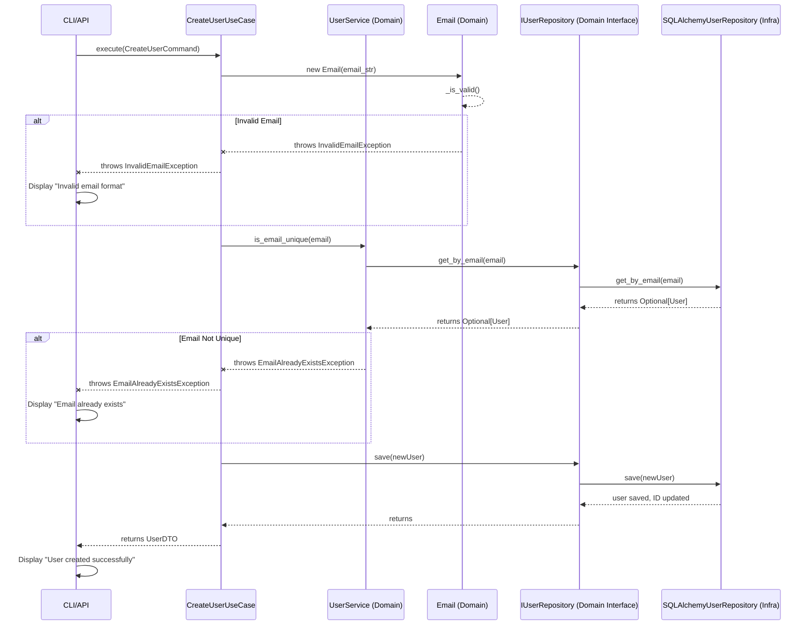
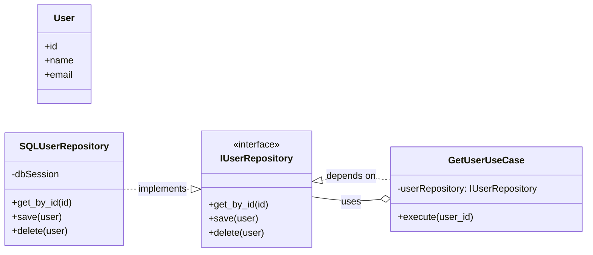
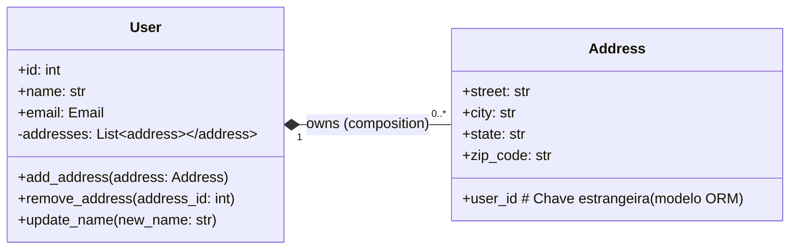
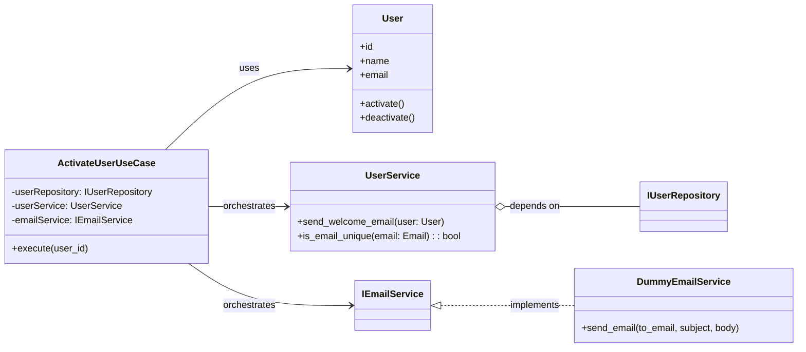
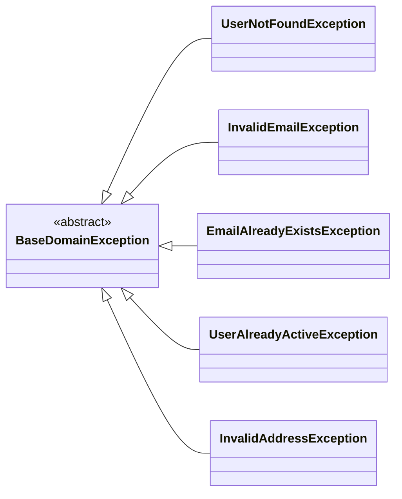
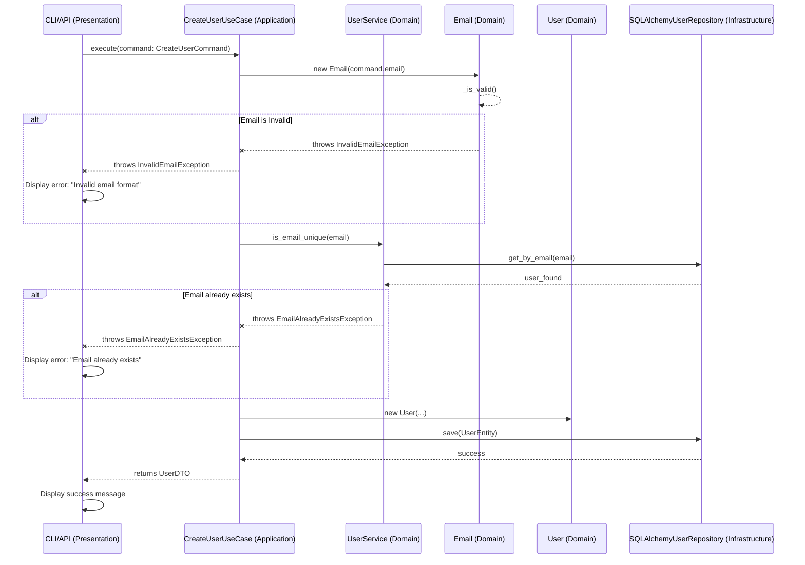

# Manual de Onboarding para Desenvolvedores - DEV Platform

## 1. Bem-vindo ao DEV Platform!

Bem-vindo(a) à equipe de desenvolvimento do DEV Platform! Estamos muito felizes em tê-lo(a) conosco. Este manual foi criado para ser seu guia principal no entendimento e desenvolvimento do nosso sistema.

O DEV Platform é construído com base em princípios sólidos de engenharia de software, como a **Arquitetura Limpa (Clean Architecture)**, o **Domain-Driven Design (DDD)** e os **Princípios SOLID**. Nosso objetivo é criar um software manutenível, escalável, testável e robusto, e a compreensão e aplicação desses conceitos são fundamentais para o sucesso do projeto e da sua jornada aqui.

Este manual é dividido em seções que cobrem desde a filosofia do projeto até guias práticos para a criação de novos artefatos. Ele é pensado para ser útil tanto para estagiários e desenvolvedores com pouca familiaridade com esses conceitos, quanto para programadores veteranos que buscam uma referência rápida ou aprofundar seus conhecimentos.

**Nosso Compromisso:**

- **Qualidade do Código**: Priorizamos código limpo, legível e bem testado.
- **Design Orientado ao Domínio**: Nossa lógica de negócio é a estrela do show, e o código a reflete fielmente.
- **Manutenibilidade e Extensibilidade**: As decisões de design visam facilitar futuras modificações e adições de funcionalidades.
- **Aprendizado Contínuo**: Encorajamos a exploração, perguntas e a busca por aprimoramento constante.

Vamos começar!

## 2. Filosofia e Pilares do Projeto

O DEV Platform não é apenas um conjunto de funcionalidades; é uma aplicação que reflete uma abordagem intencional ao design de software. Compreender a "filosofia" por trás dele é crucial.

### 2.1. Arquitetura Limpa (Clean Architecture)

A Arquitetura Limpa, proposta por Robert C. Martin (Uncle Bob), é o nosso pilar fundamental. Ela organiza o código em camadas concêntricas, garantindo que as dependências fluam sempre de fora para dentro.

- **Independência**: O sistema é independente de frameworks, bancos de dados, UIs e quaisquer agentes externos.
- **Testabilidade**: As regras de negócio podem ser testadas sem a UI, o banco de dados ou o servidor web.
- **Separação de Preocupações**: Cada camada tem uma responsabilidade bem definida.

**Nossas Camadas:**

1. **Domínio (Entities & Use Cases)**: O núcleo. Contém as regras de negócio essenciais e as entidades que encapsulam essas regras. É a camada mais interna e **não deve ter dependências de camadas externas**.
    
    - **`src/dev_platform/domain/`**:
        - `entities.py`: Nossas Entidades de Domínio.
        - `value_objects.py`: Nossos Value Objects.
        - `interfaces.py` / `ports.py`: Contratos (interfaces) que definem como o domínio interage com o mundo exterior (ex: `IUserRepository`).
        - `services.py`: Serviços de Domínio, quando a lógica de negócio envolve várias entidades ou VOs e não se encaixa naturalmente em uma entidade.
2. **Aplicação (Application Business Rules)**: Orquestra o fluxo de dados para e do domínio. Contém os casos de uso (Use Cases) que definem as operações que a aplicação pode realizar. Depende apenas da camada de Domínio.
    
    - **`src/dev_platform/application/`**:
        - `use_cases.py`: Implementa os casos de uso, coordenando entidades, serviços de domínio e repositórios.
        - `dtos.py`: Data Transfer Objects para comunicação entre as camadas de Aplicação e Apresentação/Infraestrutura.
3. **Infraestrutura (Frameworks & Drivers)**: Camada mais externa, contém os detalhes de implementação. Inclui bancos de dados, frameworks web, APIs externas, etc. **Depende das camadas de Aplicação e Domínio através de interfaces.**
    
    - **`src/dev_platform/infrastructure/`**:
        - `repositories.py`: Implementações concretas das interfaces de repositório definidas no domínio.
        - `models.py`: Mapeamento ORM para o banco de dados.
        - `session.py`: Gerenciamento de sessões de banco de dados.
        - `services/` (Ex: `email_service.py`): Implementações concretas de serviços externos.
4. **Apresentação / Interfaces (Adapters)**: Camada mais externa, adaptadores para as interfaces de usuário ou APIs. Ex: CLI, Web APIs, APIs REST. Depende da camada de Aplicação.
    
    - **`src/dev_platform/interfaces/`**:
        - `cli.py`: Implementação da interface de linha de comando.
        - `api/` (se houver): Implementação de APIs RESTful.

**Regra Crucial: A Regra de Dependência**

A regra de dependência é a espinha dorsal da Arquitetura Limpa: **dependências de código fonte só podem apontar para dentro**. Isso significa que uma camada interna nunca deve saber sobre uma camada externa. Se sua entidade de domínio está importando algo da camada de infraestrutura, há um problema!

Para mais detalhes, consulte o **Anexo A: Reforçando a Inversão de Dependência na Arquitetura Limpa**.

### 2.2. Domain-Driven Design (DDD)

O DDD é uma abordagem de desenvolvimento que foca na modelagem de software para refletir de perto um domínio de negócio complexo.

- **Linguagem Ubíqua (Ubiquitous Language)**: Usamos uma linguagem consistente para descrever o domínio, tanto nas conversas com especialistas quanto no código.
- **Modelo de Domínio Rico**: Nossas entidades e objetos de valor contêm o comportamento do negócio, não são apenas contêineres de dados (Evitar "Anemic Domain Model").

**Conceitos Chave do DDD em Nosso Projeto:**

- **Entidades (Entities)**: Objetos com identidade e ciclo de vida. Ex: `User`. Possuem comportamento. (Veja `src/dev_platform/domain/user/entities.py`)
- **Value Objects (VOs)**: Objetos que medem, quantificam ou descrevem uma coisa no domínio. São imutáveis e definidos pela sua igualdade de atributos. Ex: `Email`. (Veja `src/dev_platform/domain/user/value_objects.py`)
- **Agregados (Aggregates)**: Um cluster de Entidades e Value Objects tratados como uma unidade para fins de consistência de dados. Têm uma **Raiz de Agregado** que é a única forma de acesso externo. Ex: `User` pode ser a raiz de um agregado que inclui `Addresses`.
- **Repositórios (Repositories)**: Abstrações para o armazenamento e recuperação de Agregados. O cliente (ex: Caso de Uso) interage com o repositório como se fosse uma coleção em memória. Há um repositório por Raiz de Agregado.
- **Serviços de Domínio (Domain Services)**: Operações de domínio que não se encaixam naturalmente em uma Entidade ou Value Object (ex: transferir dinheiro entre duas contas).
- **Eventos de Domínio (Domain Events)**: Notificam o sistema sobre algo significativo que aconteceu no domínio.

Para aprofundar, consulte o **Anexo B: Identificação e Implementação de Agregados**.

### 2.3. Princípios SOLID

Os princípios SOLID são um conjunto de cinco princípios de design de software que ajudam a criar código mais manutenível, flexível e compreensível.

- **S - Single Responsibility Principle (SRP)**: Uma classe deve ter apenas uma razão para mudar. Isso significa que ela deve ter apenas uma responsabilidade.
    - **No DEV Platform**: Nossas Entidades cuidam da lógica de negócio intrínseca, Value Objects da sua própria validação e imutabilidade, Casos de Uso da orquestração de um processo, e Repositórios da persistência.
- **O - Open/Closed Principle (OCP)**: O software deve ser aberto para extensão, mas fechado para modificação. Isso geralmente é alcançado através do uso de interfaces e abstrações.
    - **No DEV Platform**: Usamos interfaces para abstrair dependências (ex: `IUserRepository`), permitindo que novas implementações (ex: `NoSQLUserRepository`) sejam adicionadas sem modificar o código que depende da interface.
- **L - Liskov Substitution Principle (LSP)**: Objetos em um programa devem ser substituíveis por instâncias de seus subtipos sem alterar a correção desse programa.
    - **No DEV Platform**: Isso se aplica onde temos hierarquias de classes ou interfaces. Se uma classe `A` implementa uma interface `I`, e uma classe `B` também implementa `I`, `A` e `B` devem ser intercambiáveis no código que usa `I`.
- **I - Interface Segregation Principle (ISP)**: Clientes não devem ser forçados a depender de interfaces que não usam. Interfaces devem ser pequenas e específicas.
    - **No DEV Platform**: Nossas interfaces (em `src/dev_platform/domain/interfaces.py` ou `ports.py`) devem ser granulares, como `IUserRepository` para usuários, `IProductRepository` para produtos, etc., em vez de uma única `IGenericRepository` com muitos métodos.
- **D - Dependency Inversion Principle (DIP)**: Módulos de alto nível não devem depender de módulos de baixo nível. Ambos devem depender de abstrações.1 Abstrações não devem depender de detalhes. Detalhes devem depender de abstrações.2
    - **No DEV Platform**: Esta é a base da nossa Arquitetura Limpa. Casos de Uso (alto nível) dependem de `IUserRepository` (abstração no domínio), e `SQLAlchemyUserRepository` (detalhe de baixo nível) implementa `IUserRepository`.

Para uma compreensão mais profunda, consulte o **Anexo C: Aplicando SRP e Injeção de Dependência para SOLID**.

## 3. Estrutura do Projeto e Convenções

A organização do código é fundamental para a manutenibilidade.

### 3.1. Estrutura de Diretórios

```txt
src/dev_platform/
├── domain/                               # Camada mais interna: Regras de negócio essenciais
│   ├── <context_name>/                   # Contextos Delimitados (Bounded Contexts)
│   │   ├── entities.py                   # Entidades de Domínio
│   │   ├── value_objects.py              # Value Objects
│   │   ├── interfaces.py                 # Interfaces (Ports) para Repositórios e outros serviços
│   │   ├── services.py                   # Serviços de Domínio (se necessário)
│   │   └── exceptions.py                 # Exceções de Domínio específicas
│   └── exceptions.py                     # Exceções de Domínio globais (se necessário)
├── application/                          # Camada de Aplicação: Casos de Uso e DTOs
│   ├── <context_name>/
│   │   ├── use_cases.py                  # Implementação dos Casos de Uso
│   │   └── dtos.py                       # Data Transfer Objects para entradas/saídas dos casos de uso
│   └── dtos.py                           # DTOs globais (se necessário)
├── infrastructure/                       # Camada de Infraestrutura: Implementações concretas
│   ├── <context_name>/
│   │   ├── repositories/                 # Implementações de Repositórios (SQLAlchemy, NoSQL, etc.)
│   │   │   └── sqlalchemy_repository.py
│   │   ├── models.py                     # Modelos ORM (SQLAlchemy)
│   │   ├── adapters/                     # Adapters para serviços externos (email, cache, etc.)
│   │   └── services/                     # Implementações de serviços (email, etc.)
│   ├── database/                         # Configuração e sessão de banco de dados
│   │   ├── session.py
│   │   └── migrations/ (alembic)
│   └── persistence/                      # Unit of Work (se usado)
│       └── unit_of_work.py
├── interfaces/                           # Camada de Apresentação/Interfaces: Adapters para UIs/APIs
│   ├── cli.py                            # Interface de Linha de Comando
│   └── api/ (se houver)                  # APIs RESTful (FastAPI, Flask, etc.)
│       ├── __init__.py
│       └── endpoints/
├── config/                               # Gerenciamento de Configurações
│   └── config.py
├── logging/                              # Configuração de Logging
│   └── structured_logger.py
└── main.py                               # Ponto de entrada da aplicação
```

### 3.2. Convenções de Nomenclatura

- **Módulos/Arquivos**: `snake_case` (ex: `user_use_cases.py`).
- **Classes**: `CamelCase` (ex: `User`, `GetUserUseCase`).
- **Funções/Métodos**: `snake_case` (ex: `get_by_id`, `_is_valid`).
- **Variáveis**: `snake_case` (ex: `user_id`, `email_value`).
- **Constantes**: `UPPER_SNAKE_CASE` (ex: `DATABASE_URL`).
- **Interfaces**: Preferimos o prefixo `I` (ex: `IUserRepository`) ou o sufixo `Port` (ex: `UserRepositoryPort`).

### 3.3. Tipagem Estática

Em Python, a tipagem estática (`typing`) é obrigatória em todo o código. Isso melhora a legibilidade, a refatoração e a detecção de erros em tempo de desenvolvimento.

Python

```python
from typing import Optional, List

def calculate_sum(a: int, b: int) -> int:
    return a + b

class User:
    def __init__(self, name: str, age: int):
        self.name = name
        self.age = age

def get_optional_user(user_id: int) -> Optional[User]:
    # ...
    pass
```

### 3.4. Programação Assíncrona (`async/await`)

Utilizamos `asyncio` e `async/await` para operações de I/O (banco de dados, chamadas de API, etc.) para garantir a escalabilidade e o desempenho da aplicação.

- Sempre use `await` para chamadas assíncronas.
- Funções que contêm `await` devem ser declaradas como `async def`.
- Funções que não são assíncronas não devem ser `async def`.

## 4. Guia Prático para Criação de Artefatos

Esta seção fornecerá um guia passo a passo para criar novos componentes do DEV Platform, garantindo que eles sigam as melhores práticas.

### 4.1. Criando um Novo Contexto de Domínio

Quando uma nova área de negócio distinta precisa ser adicionada ao sistema, ela deve ser modelada como um novo Contexto Delimitado (Bounded Context).

**Passos:**

1. **Crie a Estrutura de Diretórios**:
    
    ```txt
    src/dev_platform/
    ├── domain/
    │   └── <novo_contexto>/
    │       ├── __init__.py
    │       ├── entities.py
    │       ├── value_objects.py
    │       ├── interfaces.py
    │       └── exceptions.py
    ├── application/
    │   └── <novo_contexto>/
    │       ├── __init__.py
    │       ├── use_cases.py
    │       └── dtos.py
    ├── infrastructure/
    │   └── <novo_contexto>/
    │       ├── __init__.py
    │       ├── repositories/
    │       │   └── __init__.py
    │       │   └── sqlalchemy_<novo_contexto>_repository.py
    │       └── models.py
    ```
    
2. **Defina a Linguagem Ubíqua**: Reúna-se com os especialistas de domínio para entender a terminologia e os conceitos-chave. Use esses termos consistentemente no código, nomes de arquivos, classes e métodos.

**Exemplo:** Se você precisar adicionar um módulo para gerenciamento de Produtos, o `<novo_contexto>` seria `product`.

### 4.2. Modelando Entidades e Value Objects

Este é o coração do seu modelo de domínio.

**Entidades (`src/dev_platform/domain/<context_name>/entities.py`)**

- Representam coisas com identidade e ciclo de vida.
- Possuem atributos e **comportamento** (métodos) que encapsulam a lógica de negócio relacionada a essa entidade.
- Devem ser agnósticas à persistência e a frameworks.

**Exemplo Prático (com base no Anexo B - Agregados):**

Python

```python
# ./src/dev_platform/domain/user/entities.py
from dataclasses import dataclass, field
from typing import List, Optional
from src.dev_platform.domain.user.value_objects import Email
from src.dev_platform.domain.exceptions import UserAlreadyActiveException, InvalidAddressException # Assumindo InvalidAddressException

@dataclass
class Address: # Pode ser uma Entidade se tiver identidade própria ou Value Object
    # Se Address tiver um ID e um ciclo de vida independente, é uma Entidade.
    # Se Address só fizer sentido no contexto de um User e for imutável, é um Value Object.
    # Neste exemplo, estamos tratando como parte do agregado do User.
    street: str
    city: str
    state: str
    zip_code: str

    def __post_init__(self):
        if not self.street or not self.city or not self.state or not self.zip_code:
            raise InvalidAddressException("Address fields cannot be empty.")

@dataclass
class User: # Raiz do Agregado User
    id: Optional[int]
    name: str
    email: Email
    is_active: bool = True
    addresses: List[Address] = field(default_factory=list) # Coleção de Value Objects ou Entidades internas

    def activate(self):
        if self.is_active:
            raise UserAlreadyActiveException(self.id)
        self.is_active = True
        # Pode emitir um Domain Event aqui: UserActivated(self.id)

    def deactivate(self):
        if not self.is_active:
            raise ValueError("User is already inactive.") # Usando ValueError para um exemplo mais simples aqui
        self.is_active = False

    def add_address(self, address: Address):
        # Validações específicas do domínio para adicionar endereço
        if len(self.addresses) >= 5:
            raise ValueError("Cannot add more than 5 addresses.")
        self.addresses.append(address)

    def remove_address(self, street: str, zip_code: str):
        original_len = len(self.addresses)
        self.addresses = [
            addr for addr in self.addresses
            if not (addr.street == street and addr.zip_code == zip_code)
        ]
        if len(self.addresses) == original_len:
            raise UserNotFoundException(f"Address with street '{street}' and zip code '{zip_code}' not found for user {self.id}.")
```

**Value Objects (`src/dev_platform/domain/<context_name>/value_objects.py`)**

- São imutáveis e definidos pela sua igualdade de atributos, não por uma identidade.
- Encapsulam validações de formato e regras de negócio relacionadas ao seu valor.

**Exemplo Prático:**

Python

```python
# ./src/dev_platform/domain/user/value_objects.py
from dataclasses import dataclass
import re
from src.dev_platform.domain.exceptions import InvalidEmailException

@dataclass(frozen=True) # frozen=True garante imutabilidade
class Email:
    value: str

    def __post_init__(self):
        if not self._is_valid():
            raise InvalidEmailException(self.value) # Lança nossa exceção de domínio

    def _is_valid(self) -> bool:
        pattern = r"^[a-zA-Z0-9._%+-]+@[a-zA-Z0-9.-]+\.[a-zA-Z]{2,}$"
        return bool(re.match(pattern, self.value))
```

### 4.3. Definindo Interfaces (Ports)

As interfaces (ou ports) são contratos que o Domínio define para interagir com a Infraestrutura. Elas garantem que o Domínio permaneça independente.

**Local:** `src/dev_platform/domain/<context_name>/interfaces.py`

**Exemplo Prático (com base no Anexo A - Inversão de Dependência):**

Python

```python
# ./src/dev_platform/domain/user/interfaces.py
from abc import ABC, abstractmethod
from typing import Optional, List

from src.dev_platform.domain.user.entities import User
from src.dev_platform.domain.user.value_objects import Email

class IUserRepository(ABC): # I indica Interface
    @abstractmethod
    async def get_by_id(self, user_id: int) -> Optional[User]:
        pass

    @abstractmethod
    async def save(self, user: User) -> None: # Salva o agregado completo
        pass

    @abstractmethod
    async def delete(self, user_id: int) -> None:
        pass

    @abstractmethod
    async def get_by_email(self, email: Email) -> Optional[User]:
        pass

    @abstractmethod
    async def list_all(self, skip: int = 0, limit: int = 100) -> List[User]:
        pass

# Exemplo de outra interface para um serviço externo
class IEmailService(ABC):
    @abstractmethod
    async def send_email(self, to_email: Email, subject: str, body: str) -> None:
        pass
```

### 4.4. Criando DTOs (Data Transfer Objects)

DTOs são usados para transferir dados entre camadas, especialmente entre a camada de Aplicação e as camadas de Apresentação/Infraestrutura. Eles evitam que detalhes de implementação do Domínio "vazem" para fora.

**Local:** `src/dev_platform/application/<context_name>/dtos.py` ou `src/dev_platform/application/dtos.py` (para DTOs globais)

**Exemplo Prático:**

Python

```python
# ./src/dev_platform/application/user/dtos.py
from dataclasses import dataclass
from typing import Optional, List

@dataclass
class AddressDTO:
    street: str
    city: str
    state: str
    zip_code: str

@dataclass
class UserDTO:
    id: Optional[int]
    name: str
    email: str # O Value Object Email é convertido para string aqui
    is_active: bool
    addresses: List[AddressDTO] = field(default_factory=list) # DTOs para o agregado

@dataclass
class CreateUserCommand: # DTO de entrada para um caso de uso
    name: str
    email: str

@dataclass
class UpdateUserCommand: # DTO de entrada para um caso de uso
    user_id: int
    name: Optional[str] = None
    email: Optional[str] = None
```

### 4.5. Implementando Casos de Uso (Use Cases)

Casos de Uso encapsulam as regras de negócio específicas da aplicação. Eles orquestram as interações entre Entidades de Domínio, Serviços de Domínio e Repositórios.

**Local:** `src/dev_platform/application/<context_name>/use_cases.py`

**Responsabilidades:**

- Receber DTOs de entrada.
- Validar dados de entrada (se for validação da aplicação, não de domínio).
- Carregar agregados do repositório.
- Chamar métodos de domínio nas entidades ou serviços de domínio.
- Persistir alterações via repositório.
- Converter entidades de domínio para DTOs de saída.
- Tratar exceções de domínio e convertê-las em exceções da aplicação (ou relançá-las).

**Exemplo Prático (com base no Anexo C - SRP em Casos de Uso):**

Python

```python
# ./src/dev_platform/application/user/use_cases.py
from typing import Optional

from src.dev_platform.domain.user.entities import User, Address
from src.dev_platform.domain.user.interfaces import IUserRepository, IEmailService # Injetando o EmailService
from src.dev_platform.domain.user.services import UserService # Injetando o Domain Service
from src.dev_platform.domain.user.value_objects import Email
from src.dev_platform.application.user.dtos import UserDTO, AddressDTO, CreateUserCommand, UpdateUserCommand
from src.dev_platform.domain.exceptions import UserNotFoundException, InvalidEmailException, EmailAlreadyExistsException

class GetUserUseCase:
    def __init__(self, user_repository: IUserRepository):
        self.user_repository = user_repository

    async def execute(self, user_id: int) -> Optional[UserDTO]:
        user = await self.user_repository.get_by_id(user_id)
        if not user:
            raise UserNotFoundException(user_id)
        # Mapeia Entidade de Domínio para DTO de saída
        addresses_dto = [AddressDTO(street=a.street, city=a.city, state=a.state, zip_code=a.zip_code) for a in user.addresses]
        return UserDTO(id=user.id, name=user.name, email=user.email.value, is_active=user.is_active, addresses=addresses_dto)

class CreateUserUseCase:
    def __init__(self, user_repository: IUserRepository, user_service: UserService, email_service: IEmailService):
        self.user_repository = user_repository
        self.user_service = user_service
        self.email_service = email_service

    async def execute(self, command: CreateUserCommand) -> UserDTO:
        try:
            email = Email(command.email) # Validação do VO
        except InvalidEmailException as e:
            raise e # Relança a exceção de domínio

        if not await self.user_service.is_email_unique(email): # Chama o Serviço de Domínio
            raise EmailAlreadyExistsException(command.email)

        user = User(id=None, name=command.name, email=email) # Criação da Entidade
        await self.user_repository.save(user) # Persiste o agregado

        await self.email_service.send_email(email, "Welcome!", f"Hello {user.name}, welcome to DEV Platform!") # Chama serviço externo

        return UserDTO(id=user.id, name=user.name, email=user.email.value, is_active=user.is_active)

class UpdateUserUseCase:
    def __init__(self, user_repository: IUserRepository):
        self.user_repository = user_repository

    async def execute(self, command: UpdateUserCommand) -> UserDTO:
        user = await self.user_repository.get_by_id(command.user_id)
        if not user:
            raise UserNotFoundException(command.user_id)

        if command.name:
            user.update_name(command.name) # Lógica de negócio na entidade
        if command.email:
            user.update_email(command.email) # Lógica de negócio na entidade

        await self.user_repository.save(user)
        addresses_dto = [AddressDTO(street=a.street, city=a.city, state=a.state, zip_code=a.zip_code) for a in user.addresses]
        return UserDTO(id=user.id, name=user.name, email=user.email.value, is_active=user.is_active, addresses=addresses_dto)
```

### 4.6. Implementando Repositórios

Os repositórios são a camada de infraestrutura que implementa as interfaces de repositório definidas no domínio. Eles são responsáveis por mapear entidades de domínio para modelos de persistência (e vice-versa).

**Local:** `src/dev_platform/infrastructure/<context_name>/repositories/sqlalchemy_<context_name>_repository.py`

**Exemplo Prático (com base no Anexo A - Inversão de Dependência):**

Python

```python
# ./src/dev_platform/infrastructure/user/repositories/sqlalchemy_user_repository.py
from typing import Optional, List
from sqlalchemy.ext.asyncio import AsyncSession
from sqlalchemy import select
from sqlalchemy.orm import selectinload # Para carregar relacionamentos em agregados

from src.dev_platform.domain.user.entities import User, Address
from src.dev_platform.domain.user.interfaces import IUserRepository
from src.dev_platform.domain.user.value_objects import Email
from src.dev_platform.infrastructure.user.models import User as UserModel, Address as AddressModel # Importa modelos ORM

class SQLAlchemyUserRepository(IUserRepository):
    def __init__(self, db_session: AsyncSession):
        self.db_session = db_session

    async def get_by_id(self, user_id: int) -> Optional[User]:
        # Carrega o User e seus Addresses associados
        stmt = select(UserModel).where(UserModel.id == user_id).options(selectinload(UserModel.addresses))
        result = await self.db_session.execute(stmt)
        user_model = result.scalar_one_or_none()
        if user_model:
            # Mapeamento do Modelo ORM para a Entidade de Domínio
            addresses = [
                Address(street=a.street, city=a.city, state=a.state, zip_code=a.zip_code)
                for a in user_model.addresses
            ]
            return User(
                id=user_model.id,
                name=user_model.name,
                email=Email(user_model.email),
                is_active=user_model.is_active,
                addresses=addresses
            )
        return None

    async def save(self, user: User) -> None:
        if user.id:
            user_model = await self.db_session.get(UserModel, user.id)
            if not user_model:
                raise UserNotFoundException(user.id) # Levantar exceção se o usuário não existir
            
            # Atualiza os atributos da Entidade de Domínio para o Modelo ORM
            user_model.name = user.name
            user_model.email = user.email.value
            user_model.is_active = user.is_active

            # Sincroniza a lista de endereços do agregado (pode ser complexo dependendo do ORM)
            # Estratégia simples: remove todos os antigos e adiciona os novos para Address (se for Value Object)
            # Para Entidades com ID próprio, você faria um merge ou atualização mais granular.
            user_model.addresses.clear() # Limpa os antigos
            for domain_address in user.addresses:
                user_model.addresses.append(
                    AddressModel(
                        street=domain_address.street,
                        city=domain_address.city,
                        state=domain_address.state,
                        zip_code=domain_address.zip_code,
                        user_id=user.id # Garante o vínculo
                    )
                )
        else:
            # Cria um novo Modelo ORM a partir da Entidade de Domínio
            user_model = UserModel(
                name=user.name,
                email=user.email.value,
                is_active=user.is_active,
                addresses=[
                    AddressModel(
                        street=a.street, city=a.city, state=a.state, zip_code=a.zip_code
                    ) for a in user.addresses
                ]
            )
            self.db_session.add(user_model)
            await self.db_session.flush() # Força o ID a ser gerado para novos objetos
            user.id = user_model.id # Atualiza o ID na entidade de domínio

        await self.db_session.commit() # Confirma a transação

    async def delete(self, user_id: int) -> None:
        user_model = await self.db_session.get(UserModel, user_id)
        if user_model:
            await self.db_session.delete(user_model)
            await self.db_session.commit()

    async def get_by_email(self, email: Email) -> Optional[User]:
        stmt = select(UserModel).where(UserModel.email == email.value).options(selectinload(UserModel.addresses))
        result = await self.db_session.execute(stmt)
        user_model = result.scalar_one_or_none()
        if user_model:
            addresses = [
                Address(street=a.street, city=a.city, state=a.state, zip_code=a.zip_code)
                for a in user_model.addresses
            ]
            return User(id=user_model.id, name=user_model.name, email=Email(user_model.email), is_active=user_model.is_active, addresses=addresses)
        return None

    async def list_all(self, skip: int = 0, limit: int = 100) -> List[User]:
        stmt = select(UserModel).offset(skip).limit(limit).options(selectinload(UserModel.addresses))
        result = await self.db_session.execute(stmt)
        user_models = result.scalars().all()
        users = []
        for user_model in user_models:
            addresses = [
                Address(street=a.street, city=a.city, state=a.state, zip_code=a.zip_code)
                for a in user_model.addresses
            ]
            users.append(User(id=user_model.id, name=user_model.name, email=Email(user_model.email), is_active=user_model.is_active, addresses=addresses))
        return users
```

### 4.7. Mapeamento ORM (Models)

Os modelos ORM definem a estrutura da tabela no banco de dados e o mapeamento entre as colunas da tabela e os atributos do modelo.

**Local:** `src/dev_platform/infrastructure/<context_name>/models.py`

**Exemplo Prático (com base no Anexo B - Agregados e Persistência):**

Python

```python
# ./src/dev_platform/infrastructure/user/models.py
from sqlalchemy import Column, Integer, String, Boolean, ForeignKey
from sqlalchemy.orm import relationship
from sqlalchemy.ext.declarative import declarative_base

Base = declarative_base()

class User(Base):
    __tablename__ = "users"
    id = Column(Integer, primary_key=True, index=True)
    name = Column(String, index=True)
    email = Column(String, unique=True, index=True)
    is_active = Column(Boolean, default=True) # Mapeia o novo atributo

    # Relacionamento com Address. cascade="all, delete-orphan" é importante para Agregados.
    # Isso significa que operações no User (ex: delete) se propagam para Address.
    # delete-orphan garante que Addresses sem um User associado sejam removidos.
    addresses = relationship("Address", back_populates="user", cascade="all, delete-orphan")

class Address(Base):
    __tablename__ = "addresses"
    id = Column(Integer, primary_key=True, index=True) # Address aqui tem um ID próprio no banco
    street = Column(String)
    city = Column(String)
    state = Column(String)
    zip_code = Column(String)
    user_id = Column(Integer, ForeignKey("users.id")) # Chave estrangeira para o User

    user = relationship("User", back_populates="addresses") # Relacionamento de volta para User
```

### 4.8. Implementando Novas Infraestruturas (e.g., REST API Client, Outros Bancos de Dados)

Quando o projeto precisar interagir com um serviço externo ou um banco de dados diferente, você seguirá o princípio da Inversão de Dependência.

**Passos:**

1. **Defina a Interface (Port) no Domínio**: Crie uma nova interface em `src/dev_platform/domain/<context_name>/interfaces.py` que descreva o que o Domínio precisa desse serviço externo.
2. **Implemente o Adaptador na Infraestrutura**: Crie uma nova classe em `src/dev_platform/infrastructure/<context_name>/adapters/` ou `services/` que implemente essa interface. Esta classe conterá a lógica específica para interagir com o serviço externo (ex: chamadas HTTP para uma REST API, conexão com MongoDB).
3. **Injete a Dependência**: Injete a implementação concreta do adaptador nos Casos de Uso ou Serviços de Domínio que precisam dele.

**Exemplo: Conexão com uma REST API Externa (para notificações)**

**1. Interface no Domínio (`src/dev_platform/domain/user/interfaces.py`)**

Python

```python
# ./src/dev_platform/domain/user/interfaces.py (continuação)
class INotificationService(ABC):
    @abstractmethod
    async def send_notification(self, recipient_id: int, message: str) -> None:
        pass
```

**2. Implementação na Infraestrutura (`src/dev_platform/infrastructure/notification/rest_notification_service.py`)**

Python

```python
# ./src/dev_platform/infrastructure/notification/rest_notification_service.py
import httpx # Biblioteca para requisições HTTP assíncronas

from src.dev_platform.domain.user.interfaces import INotificationService

class RESTNotificationService(INotificationService):
    def __init__(self, api_base_url: str, api_key: str):
        self.api_base_url = api_base_url
        self.api_key = api_key
        self.client = httpx.AsyncClient()

    async def send_notification(self, recipient_id: int, message: str) -> None:
        url = f"{self.api_base_url}/notify"
        headers = {"Authorization": f"Bearer {self.api_key}"}
        payload = {"user_id": recipient_id, "message": message}
        try:
            response = await self.client.post(url, json=payload, headers=headers)
            response.raise_for_status() # Lança exceção para status de erro HTTP
            print(f"Notification sent to {recipient_id}: {message}")
        except httpx.HTTPStatusError as e:
            print(f"Error sending notification: {e.response.status_code} - {e.response.text}")
            raise # Re-lança para ser tratado pela camada de aplicação
        except httpx.RequestError as e:
            print(f"Network error sending notification: {e}")
            raise
```

**3. Injeção no Caso de Uso (`src/dev_platform/application/user/use_cases.py`)**

Python

```python
# ./src/dev_platform/application/user/use_cases.py (continuação)
# ... imports ...
from src.dev_platform.domain.user.interfaces import INotificationService

class CreateUserUseCase:
    def __init__(self, user_repository: IUserRepository, user_service: UserService, 
                 email_service: IEmailService, notification_service: INotificationService): # Injetando!
        self.user_repository = user_repository
        self.user_service = user_service
        self.email_service = email_service
        self.notification_service = notification_service # Atribuindo

    async def execute(self, command: CreateUserCommand) -> UserDTO:
        # ... (código existente para criar usuário) ...

        await self.email_service.send_email(email, "Welcome!", f"Hello {user.name}, welcome to DEV Platform!")
        await self.notification_service.send_notification(user.id, f"Welcome, {user.name} to DEV Platform!") # Chamada ao novo serviço

        return UserDTO(id=user.id, name=user.name, email=user.email.value, is_active=user.is_active)
```

### 4.9. Gerenciamento de Dependências (Dependency Injection)

A Injeção de Dependência (DI) é a forma como garantimos que as camadas superiores (Application) não sejam acopladas a detalhes de implementação das camadas inferiores (Infrastructure). Usamos um "Composition Root" para montar todas as dependências da aplicação.

**Local:** `src/dev_platform/composition_root.py` (ou em `main.py` para aplicações menores)

**Exemplo Prático:**

Python

```python
# ./src/dev_platform/composition_root.py
from sqlalchemy.ext.asyncio import create_async_engine, AsyncSession
from sqlalchemy.orm import sessionmaker

# Importar as interfaces do domínio
from src.dev_platform.domain.user.interfaces import IUserRepository, IEmailService, INotificationService
from src.dev_platform.domain.user.services import UserService

# Importar as implementações da infraestrutura
from src.dev_platform.infrastructure.user.repositories.sqlalchemy_user_repository import SQLAlchemyUserRepository
from src.dev_platform.infrastructure.email.dummy_email_service import DummyEmailService # Exemplo de implementacao
from src.dev_platform.infrastructure.notification.rest_notification_service import RESTNotificationService

# Importar os casos de uso da aplicação
from src.dev_platform.application.user.use_cases import GetUserUseCase, CreateUserUseCase, UpdateUserUseCase

# Configurações (geralmente lidas de variáveis de ambiente ou config.py)
DATABASE_URL = "sqlite+aiosqlite:///./dev_platform.db"
NOTIFICATION_API_URL = "http://localhost:8001/api" # Exemplo
NOTIFICATION_API_KEY = "your_api_key"

# Configuração do engine e sessão do SQLAlchemy
engine = create_async_engine(DATABASE_URL, echo=False)
AsyncSessionLocal = sessionmaker(engine, class_=AsyncSession, expire_on_commit=False)

# Função para obter uma sessão de banco de dados (usada por dependências)
async def get_db_session():
    async with AsyncSessionLocal() as session:
        yield session

# Funções para instanciar os repositórios, serviços e casos de uso com suas dependências
# Isso pode ser feito com um container DI real (ex: `wire`, `inject`) em projetos maiores.

async def get_user_repository() -> IUserRepository:
    # A sessão do DB é uma dependência que precisa ser "injetada" ou obtida no contexto de um request
    # Para o propósito deste exemplo, vamos assumir que a sessão é passada ou gerenciada por um UoW
    # Em um app real, o UoW ou a sessão seria gerenciada por um lifespan de request/response.
    session = await anext(get_db_session()) # Exemplo simples, não usar diretamente em produção
    return SQLAlchemyUserRepository(session)

async def get_user_service() -> UserService:
    user_repo = await get_user_repository() # User Service pode depender do Repositório
    return UserService(user_repo)

async def get_email_service() -> IEmailService:
    return DummyEmailService() # Implementação dummy para exemplo

async def get_notification_service() -> INotificationService:
    return RESTNotificationService(api_base_url=NOTIFICATION_API_URL, api_key=NOTIFICATION_API_KEY)

async def get_get_user_use_case() -> GetUserUseCase:
    user_repo = await get_user_repository()
    return GetUserUseCase(user_repo)

async def get_create_user_use_case() -> CreateUserUseCase:
    user_repo = await get_user_repository()
    user_service = await get_user_service()
    email_service = await get_email_service()
    notification_service = await get_notification_service()
    return CreateUserUseCase(user_repo, user_service, email_service, notification_service)

async def get_update_user_use_case() -> UpdateUserUseCase:
    user_repo = await get_user_repository()
    return UpdateUserUseCase(user_repo)

# Exemplo de como usar no main.py ou cli.py
# async def main():
#     create_user_uc = await get_create_user_use_case()
#     # ... usar o caso de uso ...
```

### 4.10. Tratamento de Exceções Consistente

Usamos exceções customizadas para erros de domínio, permitindo um tratamento mais granular e significativo em camadas superiores.

**Local:** `src/dev_platform/domain/exceptions.py` para exceções de domínio.

**Exemplo Prático (com base no Anexo D - Tratamento de Exceções):**

Python

```python
# ./src/dev_platform/domain/exceptions.py
class BaseDomainException(Exception):
    """Base exception for all domain-specific errors."""
    pass

class UserNotFoundException(BaseDomainException):
    """Raised when a user is not found."""
    def __init__(self, user_id: int):
        self.user_id = user_id
        super().__init__(f"User with ID {user_id} not found.")

class InvalidEmailException(BaseDomainException):
    """Raised when an email format is invalid."""
    def __init__(self, email_value: str):
        self.email_value = email_value
        super().__init__(f"Invalid email format: {email_value}")

class EmailAlreadyExistsException(BaseDomainException):
    """Raised when trying to create a user with an email that already exists."""
    def __init__(self, email_value: str):
        self.email_value = email_value
        super().__init__(f"Email '{email_value}' already exists.")

class UserAlreadyActiveException(BaseDomainException):
    """Raised when trying to activate an already active user."""
    def __init__(self, user_id: int):
        self.user_id = user_id
        super().__init__(f"User with ID {user_id} is already active.")

class InvalidAddressException(BaseDomainException):
    """Raised when an address has invalid fields."""
    def __init__(self, message: str):
        super().__init__(message)
```

**Uso nas Camadas:**

- **Domínio**: Lança exceções de `BaseDomainException` ou suas subclasses.
- **Aplicação (Casos de Uso)**: Captura exceções de domínio, pode re-lançar ou encapsular em exceções da aplicação se necessário (para não expor detalhes internos do domínio).
- **Apresentação (CLI/API)**: Captura exceções da aplicação ou de domínio e as traduz para respostas amigáveis ao usuário (mensagens de erro na CLI, códigos de status HTTP na API).

**Diagrama de Sequência de Tratamento de Erro (Mermaid):**

Snippet de código



## 5. Boas Práticas Adicionais e Ferramentas

### 5.1. Testes Automatizados

Testes são cruciais para garantir a qualidade, identificar regressões e validar a adesão à arquitetura.

- **Testes Unitários**: Focam em unidades pequenas e isoladas (métodos de entidades, VOs, casais de uso, métodos de repositório). Use mocks para isolar dependências externas.
    - **Prioridade**: Domínio e Casos de Uso devem ter alta cobertura de testes unitários.
- **Testes de Integração**: Verificam a interação entre componentes (ex: Caso de Uso e Repositório, ou Repositório e Banco de Dados real).
- **Testes End-to-End (E2E)**: Simulam o fluxo completo do usuário através de toda a aplicação (ex: CLI ou API).

**Local:** Crie uma pasta `tests/` na raiz do projeto, com subpastas que espelham a estrutura `src/dev_platform/` (ex: `tests/domain/user/`, `tests/application/user/`).

### 5.2. Logging Estruturado

Utilizamos `structured_logger.py` para gerar logs consistentes e fáceis de analisar.

- Sempre que possível, use logs de nível apropriado (DEBUG, INFO, WARNING, ERROR, CRITICAL).
- Inclua contexto relevante nos logs (IDs de usuário, IDs de requisição, etc.).

### 5.3. Gerenciamento de Configurações

As configurações sensíveis ou que mudam entre ambientes (URLs de BD, chaves de API) devem ser gerenciadas via variáveis de ambiente (`.env`, `.env.development`, etc.) ou um arquivo de configuração centralizado (`config.py`). Nunca "hardcode" esses valores.

### 5.4. Documentação de Código

- Use docstrings para módulos, classes, métodos e funções, explicando seu propósito, argumentos e retornos.
- Comentários de código devem explicar o "porquê" de uma decisão complexa, não o "o quê" (o código já deve explicar o que está fazendo).

### 5.5. Ferramentas e Linters

- **Mypy**: Para verificação de tipos estáticos (`mypy.ini`).
- **Black / Ruff (ou similar)**: Para formatação automática de código.
- **Flake8 (ou similar)**: Para linting e verificação de estilo de código.

## 6. Anexos de Melhoria

Esta seção é dedicada a aprofundar os pontos de melhoria identificados na avaliação do código, fornecendo exemplos práticos e pedagógicos.

---

### Anexo A: Reforçando a Inversão de Dependência na Arquitetura Limpa

**Problema Identificado**: Potencial violação da Inversão de Dependência (DIP) se as camadas internas dependerem de implementações concretas de camadas externas. Ex: um Caso de Uso depender diretamente de `SQLAlchemyUserRepository` em vez de `IUserRepository`.

**Objetivo Pedagógico**: Entender que a abstração pertence à camada mais alta (o domínio), e a implementação concreta à camada mais baixa (infraestrutura), e que a injeção de dependência é a ferramenta para unir essas partes sem acoplamento.

**Diagrama UML de Classe:**

Snippet de código



**Explicação Detalhada e Prática:**

1. **Defina a Interface no Domínio (`IUserRepository`)**: A interface `IUserRepository` está na camada de domínio (`src/dev_platform/domain/user/interfaces.py`). Ela define o _contrato_ que qualquer repositório de usuário deve seguir, independentemente de como os dados são persistidos (SQL, NoSQL, arquivo, etc.). O domínio não se importa com os "detalhes".
2. **Casos de Uso Dependem da Interface**: Na camada de aplicação, o `GetUserUseCase` (`src/dev_platform/application/user/use_cases.py`) depende da interface `IUserRepository`. Ele sabe _o que_ um repositório faz (salvar, buscar, etc.), mas não _como_ ele faz. Isso é a Inversão de Dependência em ação: módulos de alto nível (`GetUserUseCase`) dependem de abstrações (`IUserRepository`), não de detalhes.
3. **Implementação Concreta na Infraestrutura**: A classe `SQLAlchemyUserRepository` (`src/dev_platform/infrastructure/user/repositories/sqlalchemy_user_repository.py`) é a implementação concreta da interface. Ela contém os detalhes de como interagir com o SQLAlchemy e o banco de dados. Esta classe "implementa" a interface, satisfazendo o contrato.
4. **Injeção de Dependência no Composition Root**: No ponto de entrada da aplicação (como `src/dev_platform/composition_root.py`), é onde as dependências são "montadas". Aqui, você cria uma instância de `SQLAlchemyUserRepository` e a "injetar" no construtor do `GetUserUseCase`. O `GetUserUseCase` recebe uma `IUserRepository`, mas em tempo de execução, é uma `SQLAlchemyUserRepository`. Isso permite que a aplicação seja flexível: se você mudar para um banco de dados NoSQL, basta criar uma nova implementação (`NoSQLUserRepository`) e injetá-la, sem modificar o código do domínio ou dos casos de uso.

**Benefícios Pedagógicos:**

- **Clareza de Responsabilidades**: Fica claro que o domínio define "o que fazer", e a infraestrutura define "como fazer".
- **Facilita Testes**: Você pode facilmente mockar `IUserRepository` em testes unitários do `GetUserUseCase`, pois ele não depende da implementação real do banco de dados.
- **Reduz Acoplamento**: A mudança de uma tecnologia de persistência não afeta as regras de negócio.

---

### Anexo B: Identificação e Implementação de Agregados DDD

**Problema Identificado**: Não é explícito como os agregados são definidos e respeitados no projeto, o que pode levar a problemas de consistência transacional e um modelo de domínio anêmico.

**Objetivo Pedagógico**: Entender o conceito de Agregado como uma unidade transacional e como a Raiz de Agregado deve ser o único ponto de entrada para manipulação de entidades internas.

**Diagrama UML de Classe (composição de Agregado):**

Snippet de código



**Explicação Detalhada e Prática:**

1. **Defina a Raiz do Agregado**: No nosso exemplo, `User` é a Raiz do Agregado `UserAggregate`. Isso significa que qualquer operação que modifique `Addresses` deve ser feita através de métodos de `User`. `Address` é uma parte de `User`, e seu ciclo de vida é gerenciado pelo `User`.
2. **Entidades Filhas ou Value Objects**: `Address` pode ser modelado como uma Entidade (se tiver identidade e ciclo de vida próprios, como um ID único) ou como um Value Object (se for imutável e definido apenas pelos seus valores, como um endereço simples). No nosso exemplo, tratamos como uma Entidade que pertence ao agregado, mas que é manipulada pela Raiz do Agregado.
3. **Comportamento na Raiz do Agregado**: Métodos como `add_address` e `remove_address` estão em `User`. Isso garante que as regras de negócio relacionadas a endereços (ex: limite de endereços, validação) sejam aplicadas no nível do agregado, mantendo a consistência transacional.
4. **Repositórios para Raízes de Agregado**: Um repositório deve existir apenas para a Raiz do Agregado. Ou seja, teremos `IUserRepository` mas não `IAddressRepository` independente, pois `Address` é manipulado via `User`. O `IUserRepository` será responsável por carregar e salvar o `User` e todos os seus `Addresses` como uma unidade.

**Exemplo de Implementação (Revisado):**

- **`src/dev_platform/domain/user/entities.py`**: Onde a classe `User` (Raiz do Agregado) e `Address` (parte do Agregado) são definidas, com os métodos `add_address`, `remove_address`, etc.
- **`src/dev_platform/infrastructure/user/repositories/sqlalchemy_user_repository.py`**: Onde o `save` e `get_by_id` do `SQLAlchemyUserRepository` precisa garantir que o `User` e seus `Addresses` sejam carregados e persistidos juntos, usando `selectinload` e lógica de sincronização.

**Benefícios Pedagógicos:**

- **Consistência Transacional**: Garante que as mudanças dentro de um agregado sejam consistentes em uma única transação.
- **Encapsulamento**: A lógica complexa de manipulação de entidades relacionadas fica encapsulada na raiz do agregado.
- **Simplifica Repositórios**: Repositórios se tornam mais focados, operando apenas em raízes de agregados.

---

### Anexo C: Aplicando SRP e Injeção de Dependência para SOLID

**Problema Identificado**: Possível violação do Single Responsibility Principle (SRP) se Casos de Uso acumularem muita lógica de negócio ou se a Injeção de Dependência não for utilizada consistentemente.

**Objetivo Pedagógico**: Demonstrar como o SRP é aplicado ao separar a lógica de negócio intrínseca das entidades, serviços de domínio e a orquestração dos casos de uso, e como a injeção de dependência é vital para o DIP.

**Diagrama UML de Classe:**

Snippet de código



**Explicação Detalhada e Prática:**

1. **SRP nas Entidades**: A entidade `User` (`src/dev_platform/domain/user/entities.py`) é responsável por sua própria lógica de comportamento, como `activate()` e `deactivate()`. Essa lógica pertence ao domínio do `User`. Se um método de `User` precisa acessar um banco de dados ou um serviço externo, isso é um sinal de que a responsabilidade pode estar vazando.
2. **Serviços de Domínio**: Se a lógica de negócio envolve várias entidades, ou se é uma operação de domínio que não se encaixa naturalmente em uma única entidade (ex: verificar unicidade de um email que requer consultar um repositório, ou enviar um email de boas-vindas), ela deve residir em um **Serviço de Domínio** (ex: `UserService` em `src/dev_platform/domain/user/services.py`).
3. **SRP nos Casos de Uso**: O `ActivateUserUseCase` (`src/dev_platform/application/user/use_cases.py`) tem a única responsabilidade de orquestrar a ativação de um usuário. Ele não contém a lógica de "como ativar" (que está no `User`), nem "como enviar email" (que está no `IEmailService` e `UserService`). Ele apenas coordena as chamadas para essas outras partes.
4. **Injeção de Dependência para DIP**: O `ActivateUserUseCase` recebe `IUserRepository`, `UserService` e `IEmailService` em seu construtor. Isso significa que o caso de uso não se importa com as implementações concretas dessas dependências. Isso é o DIP: módulos de alto nível (casos de uso) dependem de abstrações (interfaces ou serviços de domínio), não de detalhes de baixo nível (implementações concretas na infraestrutura). A "magia" da conexão acontece no `composition_root.py`.

**Exemplo de Implementação (Revisado e Consolidado):**

- **`src/dev_platform/domain/user/entities.py`**: Comportamento `activate()` e `deactivate()` no `User`.
- **`src/dev_platform/domain/user/services.py`**: Lógica `send_welcome_email` e `is_email_unique` no `UserService`.
- **`src/dev_platform/application/user/use_cases.py`**: O `ActivateUserUseCase` (e outros) orquestram as chamadas para `User` e `UserService`, e também interagem com `IUserRepository` para persistência. Eles também recebem `IEmailService` via injeção.

**Benefícios Pedagógicos:**

- **Manutenibilidade Melhorada**: Mudanças na lógica de ativação do usuário ficam encapsuladas na entidade `User`. Mudanças no mecanismo de envio de email ficam no `IEmailService` e sua implementação.
- **Testabilidade Aprimorada**: Cada componente pode ser testado isoladamente, mockando suas dependências injetadas.
- **Flexibilidade e Extensibilidade**: Novas formas de enviar emails ou ativar usuários podem ser adicionadas implementando as interfaces ou criando novos casos de uso sem impactar o código existente.

---

### Anexo D: Tratamento de Exceções de Domínio e Fluxo de Erros

**Problema Identificado**: Uso de exceções genéricas (`ValueError`) que dificultam o tratamento específico e a comunicação clara de erros de negócio.

**Objetivo Pedagógico**: Entender a importância de exceções de domínio específicas para comunicar falhas de negócio de forma clara entre as camadas e como as camadas superiores devem reagir a essas exceções.

**Diagrama UML de Classe (Hierarquia de Exceções):**

Snippet de código



**Diagrama de Sequência (Fluxo de Erro com Exceções de Domínio):**

Snippet de código



**Explicação Detalhada e Prática:**

1. **Defina Exceções de Domínio**: Crie uma hierarquia de exceções customizadas em `src/dev_platform/domain/exceptions.py`. Todas as exceções relacionadas a regras de negócio devem herdar de `BaseDomainException`.
2. **Lançamento no Domínio**: Entidades e Value Objects (como `Email`) e Serviços de Domínio devem lançar essas exceções quando as regras de negócio são violadas. Por exemplo, `Email` lança `InvalidEmailException`, e `User` lança `UserAlreadyActiveException`.
3. **Tratamento na Camada de Aplicação (Casos de Uso)**: Os Casos de Uso devem estar cientes das exceções de domínio que podem ser lançadas. Eles podem:
    - **Re-lançar**: Se o erro de domínio é fundamental e a camada de apresentação precisa de detalhes.
    - **Capturar e Mapear**: Se a camada de aplicação precisa de um tipo de erro diferente (ex: `ApplicationError` encapsulando a `BaseDomainException`) ou para logar antes de re-lançar.
4. **Tratamento na Camada de Apresentação (CLI/API)**: Esta é a camada mais externa e é responsável por "traduzir" as exceções de domínio em algo amigável para o usuário ou para a interface do cliente (ex: uma mensagem de erro na CLI, um código de status HTTP 400 Bad Request em uma API REST). Use blocos `try...except` para capturar as exceções específicas e fornecer feedback adequado.

**Exemplo de Implementação (Consolidado):**

- **`src/dev_platform/domain/exceptions.py`**: Contém as definições de `BaseDomainException` e suas subclasses.
- **`src/dev_platform/domain/user/value_objects.py`**: `Email` lança `InvalidEmailException`.
- **`src/dev_platform/domain/user/entities.py`**: `User` lança `UserAlreadyActiveException`.
- **`src/dev_platform/domain/user/services.py`**: `UserService` pode lançar `EmailAlreadyExistsException`.
- **`src/dev_platform/application/user/use_cases.py`**: Casos de uso `try...except` para exceções de domínio e re-lançam ou as convertem.
- **`src/dev_platform/interfaces/cli.py`**: Lida com as exceções capturando-as e exibindo mensagens amigáveis.

**Benefícios Pedagógicos:**

- **Comunicação Clara**: As exceções de domínio comunicam exatamente o que deu errado no nível do negócio.
- **Separation of Concerns**: A lógica de negócio lança erros de negócio; a camada de apresentação lida com a exibição desses erros.
- **Testabilidade**: Facilita o teste de cenários de erro, pois você pode prever as exceções específicas que serão lançadas.
- **Robustez**: O sistema se torna mais robusto ao lidar com falhas de forma controlada e previsível.

---

Este manual é um documento vivo e será aprimorado com o tempo. Encorajamos você a explorá-lo, fazer perguntas, e contribuir para sua evolução.

**Aprender, Construir, Inovar!**

Equipe de Desenvolvimento do DEV Platform.


Fontes

[github.com](https://github.com/Valh88/mus_bot_base)
[github.com](https://github.com/m-danya/planty)

[
[erveti.es](https://erveti.es/python-fastapi-conexion-a-una-base-de-datos/)]

[github.com](https://github.com/AlmasBeis/KBTU_Django)

As respostas do Gemini incluem citações das seguintes fontes:

[github.com](https://github.com/SuaresDe/Algoritmos-e-Estudo-Java)

[
[blog](https://blog.brq.com/solid/)]