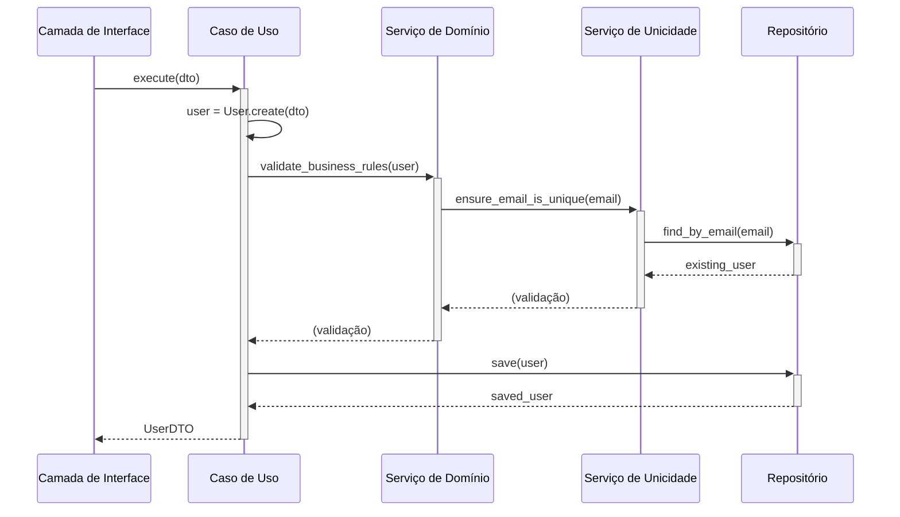
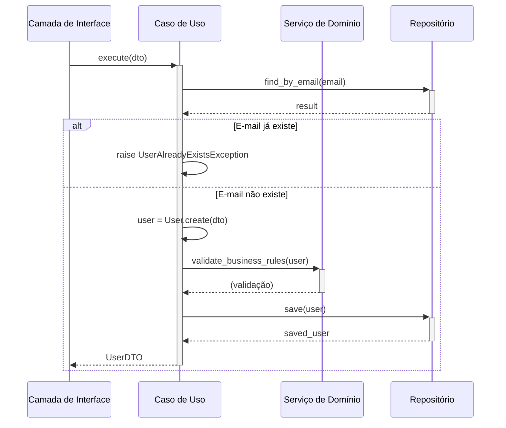
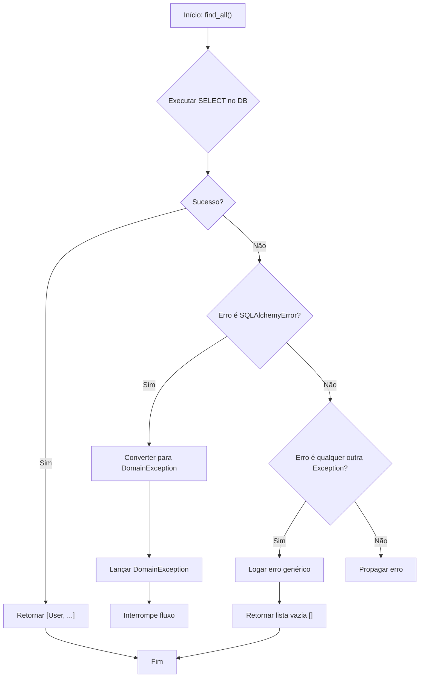
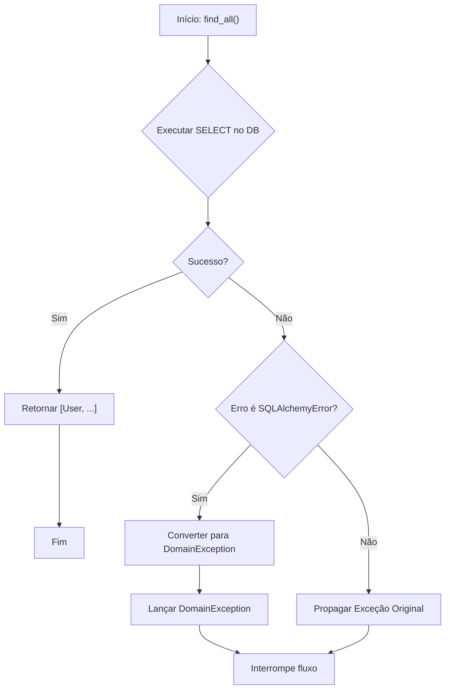

## Avaliação Arquitetural e de Código: Projeto DEV Platform

Esta documentação apresenta uma análise aprofundada do código-fonte do projeto DEV Platform, com foco em Arquitetura Limpa, Domain-Driven Design (DDD), princípios SOLID e boas práticas de programação. A seguir, detalhamos os pontos de melhoria identificados, com propostas de refatoração, diagramas e discussões sobre os impactos.

---

### **Sumário Executivo da Avaliação**

O projeto DEV Platform demonstra uma base arquitetural sólida e madura. A estrutura de diretórios e a separação de módulos em camadas de domínio (`domain`), aplicação (`application`), infraestrutura (`infrastructure`) e interface (`interface`) indicam uma forte adesão aos princípios da **Arquitetura Limpa**. A modelagem do domínio com Entidades (`User`), Objetos de Valor (`UserName`, `Email`), e a definição de interfaces de repositório (`IUserRepository` 4) mostram uma aplicação consciente de conceitos do **Domain-Driven Design**.

O uso de injeção de dependência, especialmente na `CompositionRoot` e nos casos de uso6, reflete a aplicação do **Princípio da Inversão de Dependência (DIP)** do SOLID. A configuração do projeto é robusta, com um sistema flexível que suporta múltiplos ambientes (`.env` files) e carregadores desacoplados (`config.py`).

Apesar da excelente base, foram identificados pontos de refinamento que podem aprimorar ainda mais a pureza arquitetural, a manutenibilidade e a testabilidade do sistema. As melhorias propostas a seguir visam fortalecer a separação de responsabilidades e tornar o design ainda mais resiliente a mudanças.

---

### **Ponto de Melhoria 1: Desacoplar Serviços de Domínio de Preocupações com Infraestrutura**

#### **1.1. Título Descritivo da Melhoria**

Refatorar o `UserDomainService` para remover a dependência de verificações de unicidade, transferindo a orquestração de acesso ao repositório para a camada de aplicação (Casos de Uso).

#### **1.2. Descrição Detalhada do Problema**

Atualmente, o `UserDomainService` é responsável por orquestrar a validação de regras de negócio. No entanto, ele também instancia e utiliza um `UserUniquenessService`, que por sua vez depende diretamente do `IUserRepository` para verificar se um e-mail já existe no banco de dados.

Python

```python
# ./src/dev_platform/domain/user/services.py 
class UserDomainService:
    def __init__(...):
        # ...
        self._uniqueness_service = uniqueness_service or UserUniquenessService(user_repository)

    async def validate_business_rules(self, user: User) -> None:
        # ...
        try:
            # O serviço de domínio está indiretamente acessando o banco de dados
            await self._uniqueness_service.ensure_email_is_unique(user.email.value)
        # ...
```

Isso cria um acoplamento sutil entre a camada de domínio e a infraestrutura. Embora a dependência seja de uma abstração (`IUserRepository`), a verificação de unicidade é uma operação de coordenação que envolve uma consulta externa (infraestrutura), e não uma regra de negócio pura e intrínseca ao domínio. A lógica de domínio mais pura não deveria se preocupar em como ou onde os dados são persistidos. A responsabilidade de orquestrar essas verificações pertence à camada de aplicação (casos de uso), que atua como uma mediadora entre o domínio e a infraestrutura.

#### **1.3. Diagramas UML

**Diagrama de Sequência (Antes)**

Snippet de código



**Diagrama de Sequência (Depois)**

Snippet de código



#### **1.4. Exemplo de Implementação da Solução (Antes e Depois)**

**Antes: `use_cases.py`**

Python

```python
# ./src/dev_platform/application/user/use_cases.py 
class CreateUserUseCase(BaseUseCase):
    def __init__(self, uow: UnitOfWork, logger: ILogger, domain_service: UserDomainService):
        super().__init__(uow, logger)
        self._domain_service = domain_service

    async def execute(self, dto: UserCreateDTO) -> UserDTO:
        async with self._uow:
            # ...
            user = User.create(name=dto.name, email=dto.email)
            # O serviço de domínio executa a verificação de unicidade internamente
            await self._domain_service.validate_business_rules(user)
            # ...
            saved_user = await self._uow.user_repository.save(user)
            # ...
            return user_to_dto(saved_user)
```

**Antes: `services.py`**

Python

```python
# ./src/dev_platform/domain/user/services.py 
class UserDomainService:
    def __init__(self, user_repository: IUserRepository, validation_rules: Optional[List[ValidationRule]] = None, ...):
        self._repository = user_repository
        self._validation_rules = validation_rules or []
        self._uniqueness_service = uniqueness_service or UserUniquenessService(user_repository)
    
    async def validate_business_rules(self, user: User) -> None:
        validation_errors = {}
        try:
            # Responsabilidade de checar unicidade está aqui
            await self._uniqueness_service.ensure_email_is_unique(user.email.value)
        except UserAlreadyExistsException as e:
            validation_errors["email"] = e.message
        # ... outras regras
        if validation_errors:
            raise UserValidationException(validation_errors)
```

**Depois: `use_cases.py` (Refatorado)**

Python

```python
# ./src/dev_platform/application/user/use_cases.py (proposta)
class CreateUserUseCase(BaseUseCase):
    def __init__(self, uow: UnitOfWork, logger: ILogger, domain_service: UserDomainService):
        super().__init__(uow, logger)
        self._domain_service = domain_service

    async def execute(self, dto: UserCreateDTO) -> UserDTO:
        async with self._uow:
            self._logger.info("Starting user creation", name=dto.name, email=dto.email)
            
            # 1. Caso de uso orquestra a verificação de unicidade PRIMEIRO
            existing_user = await self._uow.user_repository.find_by_email(dto.email)
            if existing_user:
                raise UserAlreadyExistsException(dto.email)

            # 2. Cria a entidade de domínio
            user = User.create(name=dto.name, email=dto.email)
            
            # 3. Executa apenas as regras de negócio puras do domínio
            await self._domain_service.validate_business_rules(user)
            self._logger.info("User validation passed", email=dto.email)

            # 4. Salva o usuário
            saved_user = await self._uow.user_repository.save(user)
            await self._uow.commit()
            self._logger.info("User created successfully", user_id=saved_user.id)
            return user_to_dto(saved_user)
```

**Depois: `services.py` (Refatorado)**

Python

```python
# ./src/dev_platform/domain/user/services.py (proposta)
class UserDomainService:
    # Removemos a dependência do repositório, pois não é mais necessária para a unicidade
    def __init__(self, validation_rules: List[ValidationRule]):
        self._validation_rules = validation_rules
    
    # ... add/remove validation rules ...

    async def validate_business_rules(self, user: User) -> None:
        """Valida apenas regras de negócio puras, sem acesso à infraestrutura."""
        validation_errors = {}
        # A verificação de unicidade FOI REMOVIDA
        
        for rule in self._validation_rules:
            error_message = await rule.validate(user)
            if error_message:
                validation_errors[rule.rule_name] = error_message
        
        if validation_errors:
            raise UserValidationException(validation_errors)
```

#### **1.5. Discussão das Vantagens e Desvantagens**

**Vantagens:**

- **Adesão à Arquitetura Limpa:** A camada de domínio se torna mais "pura", contendo apenas lógica de negócio sem conhecimento sobre persistência ou outras preocupações de infraestrutura.
- **Princípio da Responsabilidade Única (SRP):** O `UserDomainService` passa a ter a responsabilidade única de validar regras de negócio intrínsecas ao domínio. O `CreateUserUseCase` tem a responsabilidade única de orquestrar a criação de um usuário, o que inclui coordenar com a infraestrutura.
- **Testabilidade Aprimorada:** O `UserDomainService` pode ser testado de forma totalmente isolada, sem a necessidade de mocks de repositório ou banco de dados. Apenas a entidade `User` e as regras de validação precisam ser fornecidas.
- **Clareza Arquitetural:** As responsabilidades de cada camada ficam mais explícitas. Fica claro que a camada de aplicação é a orquestradora.

**Desvantagens:**

- **Lógica de Orquestração no Caso de Uso:** O código do caso de uso fica um pouco mais verboso, pois agora ele precisa explicitamente chamar o repositório para a verificação de unicidade antes de prosseguir. No entanto, essa é precisamente a sua função arquitetural.

#### **1.6. Impactos da Alteração**

- **Arquitetura:** Reforça a separação de camadas e o fluxo de dependências proposto pela Arquitetura Limpa.
- **Manutenibilidade:** Torna o `UserDomainService` mais estável e menos propenso a mudanças. Alterações na forma como a unicidade é verificada (ex: cache, outro serviço) afetariam apenas a camada de aplicação, não a de domínio.
- **Testabilidade:** Aumenta significativamente a facilidade de escrever testes unitários para a lógica de domínio.
- **Desempenho:** Pode levar a uma otimização. A verificação falha mais cedo ("fail fast"), evitando a criação do objeto `User` e a execução de outras validações se o e-mail já existir.

---

### **Ponto de Melhoria 2: Centralizar e Injetar Configurações em Vez de Usar um Singleton Global**

#### **2.1. Título Descritivo da Melhoria**

Adotar Injeção de Dependência para o objeto de configuração (`CONFIG`) em vez de importá-lo como um singleton global.

#### **2.2. Descrição Detalhada do Problema**

O módulo `config.py` implementa uma sofisticada `ConfigurationFacade` e a expõe como uma instância singleton chamada `CONFIG`. Módulos como `user_commands.py` e `composition_root.py` importam e utilizam diretamente esta instância global.

Python

```python
# ./src/dev_platform/infrastructure/config.py 
# ...
# Instância singleton da configuração
CONFIG = ConfigurationFacade()

# ./src/dev_platform/client/cli/user_commands.py 
# ...
from dev_platform.infrastructure.config import CONFIG

class UserCommands:
    def __init__(self, logger: Optional[ILogger] = None):
        # ...
        self._composition_root = CompositionRoot(
            environment=CONFIG.get("ENVIRONMENT", "production"),
            config=CONFIG # CONFIG é usado diretamente
        )
```

O uso de um singleton para configuração é um padrão comum, mas introduz um **acoplamento global e oculto**. Qualquer módulo que importe `CONFIG` fica firmemente acoplado a essa instância específica e ao estado que ela carrega (determinado por variáveis de ambiente e arquivos no momento da inicialização). Isso viola o **Princípio da Inversão de Dependência (DIP)** no ponto de uso, pois os módulos dependem de uma implementação concreta (`CONFIG`) em vez de uma abstração que poderia ser injetada. Isso torna os testes unitários mais difíceis, pois é preciso manipular o estado global (ex: `os.environ` ou mocks complexos) para testar um componente com diferentes configurações.

#### **2.3. Diagramas UML

**Diagrama de Classe (Antes)**

Snippet de código

```python
classDiagram
    class main_cli {
        +main()
    }
    class UserCommands {
        +__init__()
    }
    class CompositionRoot {
        +__init__(config)
    }
    class config_module {
        <<module>>
        +CONFIG: ConfigurationFacade
    }

    main_cli --> UserCommands : cria
    UserCommands ..> config_module : importa CONFIG
    UserCommands --> CompositionRoot : cria
    CompositionRoot ..> config_module : importa CONFIG
```

**Diagrama de Classe (Depois)**

Snippet de código

```python
classDiagram
    class main_cli {
        +main()
    }
    class UserCommands {
        +__init__(config: IConfig)
    }
    class CompositionRoot {
        +__init__(config: IConfig)
    }
    class ConfigurationFacade {
        <<concrete>>
        +get(key)
    }
    class IConfig {
        <<interface>>
        +get(key)
    }

    main_cli --> ConfigurationFacade : cria config
    main_cli --> UserCommands : cria e injeta config
    UserCommands --> CompositionRoot : cria e injeta config
    
    ConfigurationFacade ..|> IConfig
    UserCommands ..> IConfig : depende de
    CompositionRoot ..> IConfig : depende de
```

_(Nota: `IConfig` é um conceito. Em Python, isso pode ser um `Protocol` ou a própria classe `ConfigurationFacade` usada como interface implícita)_

#### **2.4. Exemplo de Implementação da Solução (Antes e Depois)**

**Antes: `user_commands.py`**

Python

```python
# ./src/dev_platform/client/cli/user_commands.py 
import click
from dev_platform.infrastructure.composition_root import CompositionRoot
from dev_platform.infrastructure.config import CONFIG # Import global

class UserCommands:
    def __init__(self, logger: Optional[ILogger] = None):
        self._logger: ILogger = logger or StructuredLogger()
        self._composition_root = CompositionRoot(
            environment=CONFIG.get("ENVIRONMENT", "production"),
            config=CONFIG # Uso direto do singleton
        )
    # ...
    
@click.command()
def list_users():
    """List all users."""
    commands: UserCommands = UserCommands() # Criação sem injeção
    # ...
```

**Depois: `user_commands.py` (Refatorado)**

Python

```python
# ./src/dev_platform/client/cli/user_commands.py (proposta)
import click
from dev_platform.infrastructure.composition_root import CompositionRoot
from dev_platform.infrastructure.config import ConfigurationFacade # Importa a classe, não a instância

class UserCommands:
    # A configuração é injetada no construtor
    def __init__(self, config: ConfigurationFacade, logger: Optional[ILogger] = None):
        self._logger: ILogger = logger or StructuredLogger()
        self._composition_root = CompositionRoot(
            environment=config.get("ENVIRONMENT", "production"),
            config=config # Usa a instância injetada
        )
    # ...

@click.group()
@click.pass_context
def cli(ctx):
    """Grupo de comandos CLI."""
    # O objeto de configuração é criado no ponto de entrada e colocado no contexto do Click
    ctx.obj = ConfigurationFacade()

@cli.command()
@click.pass_context
def list_users(ctx):
    """List all users."""
    config = ctx.obj # Obtém a configuração do contexto
    commands: UserCommands = UserCommands(config=config) # Injeta a configuração
    # ...
```

**Antes: `composition_root.py`**

Python

```python
# ./src/dev_platform/infrastructure/composition_root.py 
from dev_platform.infrastructure.config import CONFIG # Import global

class CompositionRoot:
    def __init__(
        self,
        environment: str,
        config: Dict[str, Any] = CONFIG, # Default para o singleton
        # ...
    ):
        # ...
```

**Depois: `composition_root.py` (Refatorado)**

Python

```python
# ./src/dev_platform/infrastructure/composition_root.py (proposta)
# Nenhuma importação global de CONFIG aqui

class CompositionRoot:
    # Remove o default que aponta para o singleton
    def __init__(
        self,
        environment: str,
        config: ConfigurationFacade, # Agora é um parâmetro obrigatório
        # ...
    ):
        self._environment = environment
        self._config = config # Armazena a instância injetada
        # ...
```

#### **1.5. Discussão das Vantagens e Desvantagens**

**Vantagens:**

- **Inversão de Dependência (DIP):** Os componentes de alto nível (`UserCommands`, `CompositionRoot`) não dependem mais de um detalhe de implementação global, mas sim de uma dependência que lhes é fornecida.
- **Testabilidade:** Torna-se trivial testar `UserCommands` com diferentes configurações. Basta instanciar um `ConfigurationFacade` (ou um mock dele) com os valores desejados e passá-lo para o construtor da classe em teste. Não há necessidade de alterar variáveis de ambiente globais.
- **Clareza e Transparência:** As dependências de um componente ficam explícitas em sua assinatura (`__init__`). Fica claro que `UserCommands` precisa de um objeto de configuração para funcionar.
- **Flexibilidade:** Permite, no futuro, ter múltiplas instâncias de configuração coexistindo na mesma aplicação, se necessário (embora seja um caso de uso raro).

**Desvantagens:**

- **Injeção "Manual":** Requer um pouco mais de "fiação" manual no ponto de entrada da aplicação (o chamado _Composition Root_ da aplicação em si) para criar e passar a dependência adiante. Frameworks de injeção de dependência podem automatizar isso, mas para este projeto, a passagem via contexto do `click` é uma solução elegante e sem bibliotecas extras.

#### **1.6. Impactos da Alteração**

- **Arquitetura:** Melhora a aderência ao DIP, resultando em um design mais desacoplado e modular.
- **Testabilidade:** O impacto mais significativo é a drástica melhoria na testabilidade dos componentes que dependiam da configuração. Testes podem ser executados em paralelo sem medo de interferência no estado de configuração global.
- **Manutenibilidade:** Torna o código mais fácil de entender e refatorar, pois as dependências são explícitas.

---

### **Ponto de Melhoria 3: Padronizar o Tratamento de Erros no Repositório para "Fail Fast"**

#### **3.1. Título Descritivo da Melhoria**

Remover blocos `except Exception` genéricos nos métodos do repositório que mascaram erros, adotando uma estratégia "fail fast" ao deixar que exceções não tratadas se propaguem.

#### **3.2. Descrição Detalhada do Problema**

A classe `SQLUserRepository` em `repositories.py` implementa uma boa prática ao usar a classe `RepositoryExceptionHandler` para converter `SQLAlchemyError` específicas (como `IntegrityError`) em exceções de domínio (`UserAlreadyExistsException`).

No entanto, a maioria dos métodos também inclui um bloco `except Exception as e:` genérico no final, que captura qualquer outro erro, o registra e retorna um valor "seguro", como uma lista vazia `[]`, `None` ou `False`.

Python

```python
# ./src/dev_platform/infrastructure/database/repositories.py 
async def find_all(self) -> List[User]:
    try:
        # ... lógica do banco de dados ...
    except SQLAlchemyError as e:
        RepositoryExceptionHandler.handle_sqlalchemy_error(...)
    except Exception as e:
        # Erro genérico é capturado e suprimido
        RepositoryExceptionHandler.handle_generic_error(...)
        return [] # O chamador recebe uma lista vazia e não sabe que um erro ocorreu
```

Essa abordagem, embora pareça robusta, pode ser perigosa. Ela "engole" exceções inesperadas, como um `TypeError`, um `AttributeError` por uma refatoração malfeita, ou um problema de configuração que não foi pego antes. O chamador (o caso de uso) recebe um resultado válido (uma lista vazia), mas o sistema pode estar em um estado inconsistente. Isso viola o princípio de **Fail Fast**, que preconiza que um sistema deve relatar qualquer condição que indique uma falha o mais cedo possível. Suprimir erros torna a depuração muito mais difícil.

#### **3.3. Diagramas UML

**Fluxograma (Antes)**

Snippet de código



_(Nota: O "Não" de H nunca ocorre porque `except Exception` pega tudo)_

**Fluxograma (Depois)**

Snippet de código



#### **3.4. Exemplo de Implementação da Solução (Antes e Depois)**

**Antes: `repositories.py`**

Python

```python
# ./src/dev_platform/infrastructure/database/repositories.py 
async def find_all(self) -> List[User]:
    """Find all users in the database."""
    try:
        result = await self._session.execute(select(UserModel))
        db_users = result.scalars().all()
        return [self._convert_to_domain_user(db_user) for db_user in db_users]
    except SQLAlchemyError as e:
        RepositoryExceptionHandler.handle_sqlalchemy_error(operation="find_all_users", error=e)
    except Exception as e:
        # ERRO É SUPRIMIDO E UM VALOR PADRÃO É RETORNADO
        RepositoryExceptionHandler.handle_generic_error(operation="find_all_users", error=e)
        return []
```

**Depois: `repositories.py` (Refatorado)**

Python

```python
# ./src/dev_platform/infrastructure/database/repositories.py (proposta)
async def find_all(self) -> List[User]:
    """Find all users in the database."""
    try:
        result = await self._session.execute(select(UserModel))
        db_users = result.scalars().all()
        return [self._convert_to_domain_user(db_user) for db_user in db_users]
    except SQLAlchemyError as e:
        # Converte erros de DB conhecidos em exceções de domínio/infra
        RepositoryExceptionHandler.handle_sqlalchemy_error(operation="find_all_users", error=e)
    # NENHUM 'except Exception' GENÉRICO.
    # Se ocorrer um erro inesperado (ex: TypeError), ele será propagado.
    # A camada de aplicação (caso de uso) pode então capturá-lo e logar.
```

Para completar a solução, a camada de aplicação deve estar preparada para capturar exceções mais amplas na sua fronteira:

**Depois: `use_cases.py` (Ajuste no tratamento de erro)**

Python

```python
# ./src/dev_platform/application/user/use_cases.py 
class ListUsersUseCase(BaseUseCase):
    """Use case for listing all users."""
    async def execute(self) -> List[UserDTO]:
        async with self._uow:
            try:
                self._logger.info("Starting user listing")
                users = await self._uow.user_repository.find_all()
                self._logger.info("Users retrieved successfully", count=len(users))
                return [user_to_dto(user) for user in users]
            # Captura exceções de domínio esperadas
            except UserNotFoundException: 
                self._logger.error("User not found")
                raise
            # Captura exceções inesperadas propagadas do repositório
            except Exception as e:
                self._logger.critical("An unexpected error occurred during user listing", error=str(e))
                # Re-lança uma exceção de aplicação genérica ou a original
                raise ApplicationException("Failed to list users due to an internal error.", original_exception=e)
```

#### **1.5. Discussão das Vantagens e Desvantagens**

**Vantagens:**

- **Fail Fast:** Erros são detectados e reportados imediatamente, prevenindo que o sistema continue operando em um estado possivelmente corrompido.
- **Depuração Simplificada:** O _stack trace_ de uma exceção não capturada aponta diretamente para a origem do problema. Com o erro suprimido, o bug pode se manifestar muito mais tarde e em um lugar completamente diferente, tornando a depuração um pesadelo.
- **Robustez Real:** Um sistema robusto não é aquele que nunca falha, mas aquele que falha de maneira previsível e informativa. Propagar exceções é mais robusto do que escondê-las.
- **Contratos de Método Claros:** O contrato do método do repositório se torna: "ou eu retorno a lista de usuários, ou eu lanço uma exceção se algo der errado". O contrato anterior era: "eu retorno a lista de usuários, ou uma lista vazia se algo der errado", o que é ambíguo.

**Desvantagens:**

- **Mais Tratamento de Erro nas Camadas Superiores:** As camadas que chamam o repositório (casos de uso) precisam estar preparadas para lidar com mais tipos de exceções. No entanto, isso é desejável, pois a política de tratamento de erros (o que fazer quando um erro ocorre) deve ser definida nas camadas mais altas da arquitetura.

#### **1.6. Impactos da Alteração**

- **Confiabilidade:** Aumenta a confiabilidade geral do sistema, pois falhas inesperadas não passam mais despercebidas.
- **Manutenibilidade:** Simplifica a manutenção, pois o fluxo de controle de erros é mais direto e explícito.
- **Operação e Monitoramento:** Facilita o monitoramento. Exceções não tratadas que chegam à fronteira da aplicação podem ser facilmente capturadas por ferramentas de monitoramento de erros (como Sentry, Datadog, etc.), fornecendo visibilidade imediata sobre a saúde do sistema.
