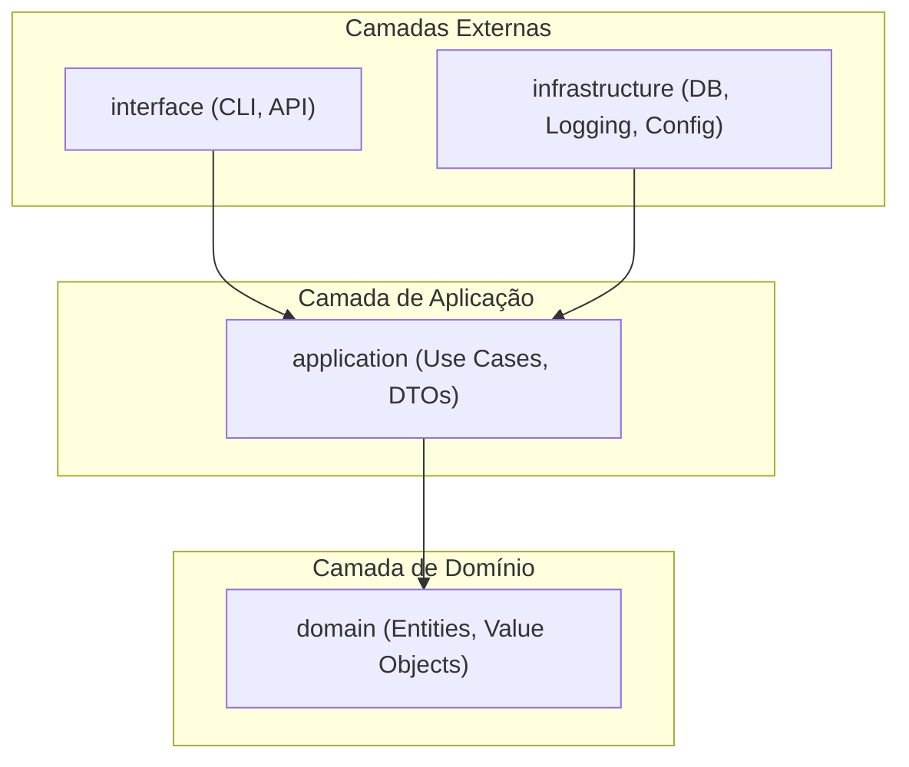
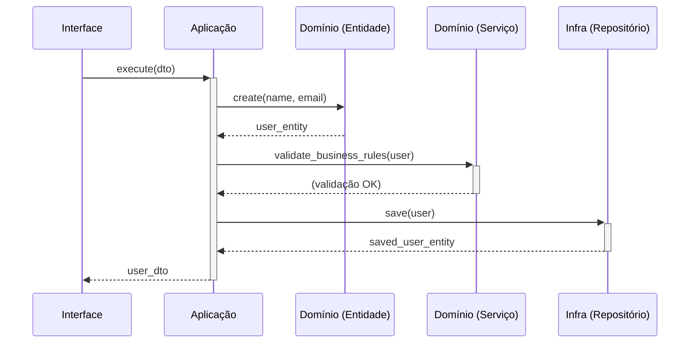

# Manual de Onboarding do Desenvolvedor - DEV Platform

## Bem-vindo(a) à Equipe!

Olá! Se você está lendo este manual, seja muito bem-vindo(a) ao time de desenvolvimento da DEV Platform. Estamos entusiasmados por ter você conosco. Este documento é o seu guia principal para entender nossa filosofia de desenvolvimento, nossa arquitetura de software e as melhores práticas que seguimos.

Nosso objetivo é construir um software robusto, manutenível e escalável. Para isso, adotamos uma abordagem disciplinada baseada em princípios de **Arquitetura Limpa (Clean Architecture)**, **Domain-Driven Design (DDD)** e **SOLID**.

Não se preocupe se esses termos forem novos para você. Este manual foi projetado para ser um recurso de aprendizado prático e pedagógico, que o guiará desde os conceitos fundamentais até a contribuição efetiva no nosso código.

### Para Quem é Este Manual?

- **Novos Desenvolvedores (Júnior/Estagiário):** Use este guia como seu ponto de partida. Ele explicará o "porquê" por trás de nossas decisões e o "como" fazer as coisas da maneira certa.
- **Desenvolvedores Experientes:** Use este guia como uma referência rápida para se alinhar com nossos padrões e convenções específicas.

Vamos começar!

---

## Sumário

1. **Entendendo a Nossa Arquitetura**
    - 1.1. Visão Geral: Arquitetura Limpa em Camadas
    - 1.2. O Coração do Software: Domain-Driven Design (DDD)
    - 1.3. Os Pilares da Qualidade: Princípios SOLID
2. **Guia de Manutenção de Código Existente**
    - 2.1. Navegando pela Base de Código
    - 2.2. Rastreando um Fluxo de Execução
    - 2.3. Modificando Código com Segurança
3. **Criando Novos Artefatos: Passo a Passo**
    - 3.1. Artefatos da Camada de Domínio (`domain`)
        - 3.1.1. Entidades (Entities)
        - 3.1.2. Objetos de Valor (Value Objects)
        - 3.1.3. Interfaces de Repositório
        - 3.1.4. Serviços de Domínio (Domain Services)
    - 3.2. Artefatos da Camada de Aplicação (`application`)
        - 3.2.1. DTOs (Data Transfer Objects)
        - 3.2.2. Casos de Uso (Use Cases)
        - 3.2.3. Mapeadores (Mappers)
    - 3.3. Artefatos da Camada de Infraestrutura (`infrastructure`)
        - 3.3.1. Implementações de Repositório
        - 3.3.2. Gerenciamento de Configuração
        - 3.3.3. Gerenciamento de Sessão de Banco de Dados
4. **Trabalhando com a Camada de Interface (`interface`)**
    - 4.1. Comandos CLI
5. **Guia de Ferramentas e Boas Práticas**
    - 5.1. Gerenciamento de Dependências com Poetry
    - 5.2. Logging Estruturado
    - 5.3. Migrações de Banco de Dados com Alembic

---

## 1. Entendendo a Nossa Arquitetura

### 1.1. Visão Geral: Arquitetura Limpa em Camadas

**O Porquê:** Adotamos a Arquitetura Limpa para separar as responsabilidades do nosso sistema em camadas independentes. Isso nos dá flexibilidade para trocar detalhes de implementação (como o banco de dados ou um serviço de e-mail) sem afetar a lógica de negócio principal. A regra mais importante é a **Regra da Dependência**: as dependências só podem apontar para dentro.

Nossa estrutura de diretórios (`tree.txt`) reflete essas camadas1:

```text
src/dev_platform/
├── domain/          # Camada mais interna: Regras de negócio puras
├── application/     # Camada de aplicação: Orquestra os fluxos de trabalho (casos de uso)
├── infrastructure/  # Camada externa: Frameworks, DB, APIs, etc.
└── interface/       # Camada mais externa: CLI, APIs REST, etc.
```

**Diagrama de Camadas**

Snippet de código



- **`domain`**: Contém a lógica de negócio essencial. Não depende de nenhuma outra camada. Aqui vivem as Entidades e as regras que não mudam, independentemente da tecnologia usada.
- **`application`**: Orquestra as entidades de domínio para executar os casos de uso do sistema. Define interfaces (Portas) que a camada de infraestrutura deve implementar.
- **`infrastructure`**: Implementa as interfaces definidas na camada de aplicação. É aqui que o código "conversa" com o banco de dados, escreve logs e lê configurações.
- **`interface`**: O ponto de entrada para o usuário ou outros sistemas. Atualmente, temos uma Interface de Linha de Comando (CLI) (`user_commands.py`).
    

### 1.2. O Coração do Software: Domain-Driven Design (DDD)

**O Porquê:** DDD nos ajuda a modelar nosso software em torno do domínio de negócio real que estamos resolvendo. Em vez de pensar em tabelas de banco de dados, pensamos em conceitos de negócio como `User` (Usuário).

**Conceitos-chave em nosso projeto:**

- **Entidade (`User`):** Um objeto com identidade, que persiste ao longo do tempo. Nossa entidade `User` em `entities.py` tem um `id`, `name` e `email`.
    
- **Objeto de Valor (`UserName`, `Email`):** Objetos imutáveis definidos por seus atributos, sem uma identidade conceitual. `UserName` e `Email` em `value_objects.py` validam seus próprios formatos e garantem que nunca tenhamos um nome ou e-mail inválido em nosso sistema4.
    
- **Repositório (`IUserRepository`):** Uma interface que define como buscar e salvar entidades, abstraindo os detalhes de persistência. A interface `IUserRepository` em `interfaces.py` define métodos como `save` e `find_by_email`.
    

### 1.3. Os Pilares da Qualidade: Princípios SOLID

**O Porquê:** SOLID é um acrônimo para cinco princípios de design que nos ajudam a escrever código mais limpo, modular e fácil de manter.

- **S - Single Responsibility Principle (SRP):** Cada classe ou módulo deve ter apenas uma razão para mudar.
    - **Exemplo:** Nosso `CreateUserUseCase` é responsável apenas por orquestrar a criação de um usuário66. O `StructuredLogger` é responsável apenas por logging.
        
- **O - Open/Closed Principle (OCP):** O software deve ser aberto para extensão, mas fechado para modificação.
    - **Exemplo:** A `ValidationRuleProvider` em `composition_root.py` permite adicionar novas regras de validação sem alterar o código da `CompositionRoot` ou dos casos de uso8. Podemos estender o comportamento do sistema adicionando novas classes de regras.
        
- **L - Liskov Substitution Principle (LSP):** Subtipos devem ser substituíveis por seus tipos base.
    - **Exemplo:** Nossa `SQLUserRepository` implementa a interface `IUserRepository`9. Qualquer parte do código que espera um `IUserRepository` pode receber uma `SQLUserRepository` sem quebrar.
        
- **I - Interface Segregation Principle (ISP):** Clientes não devem ser forçados a depender de interfaces que não utilizam.
    - **Exemplo:** A interface `ILogger` define apenas os métodos de logging. Um componente que precisa logar não precisa saber sobre outros sistemas.
        
- **D - Dependency Inversion Principle (DIP):** Módulos de alto nível não devem depender de módulos de baixo nível. Ambos devem depender de abstrações.
    
    - **Exemplo:** O `CreateUserUseCase` (alto nível) não depende da `SQLUserRepository` (baixo nível). Ele depende da abstração `IUserRepository`. A `CompositionRoot` é responsável por "injetar" a implementação concreta.
        

---

## 2. Guia de Manutenção de Código Existente

### 2.1. Navegando pela Base de Código

Use a estrutura de diretórios como seu mapa. Se você precisa entender a lógica de negócio de um usuário, comece em `src/dev_platform/domain/user/`. Se precisa ver como um usuário é criado, procure em `src/dev_platform/application/user/use_cases.py`. Para ver como ele é salvo no banco de dados, olhe `src/dev_platform/infrastructure/database/repositories.py`.

### 2.2. Rastreando um Fluxo de Execução

Vamos rastrear o comando `create-user`:

1. **Ponto de Entrada (`interface`):** O comando é definido em `user_commands.py`. Ele captura os inputs `name` e `email`.
    
2. **Orquestração (`application`):** O comando chama o `CreateUserUseCase.execute()`. Este caso de uso recebe os dados através de um `UserCreateDTO`.
    
3. **Lógica de Negócio (`domain`):** O caso de uso cria uma entidade `User` (`User.create()`). A criação da entidade já dispara as validações dos Objetos de Valor (`UserName` e `Email`). Em seguida, o `UserDomainService` é chamado para validar regras mais complexas.
    
4. **Persistência (`infrastructure`):** O caso de uso, através da Unidade de Trabalho (`SQLUnitOfWork`), chama `user_repository.save(user)`. A implementação `SQLUserRepository` converte a entidade `User` em um `UserModel` do SQLAlchemy e o salva na sessão do banco.
    

**Diagrama de Sequência: `create-user`**

Snippet de código



### 2.3. Modificando Código com Segurança

- **Comece com os Testes:** Antes de alterar, verifique se existem testes para a funcionalidade. Se não, considere adicionar um.
- **Respeite os Limites das Camadas:** Se estiver na camada de domínio, não adicione código que dependa do banco de dados. Se estiver na aplicação, não implemente regras de negócio.
- **Siga o Fluxo de Dependência:** Lembre-se, dependências sempre para dentro. `infrastructure` pode depender de `application`, mas `application` não pode depender de `infrastructure`.

---

## 3. Criando Novos Artefatos: Passo a Passo

Esta seção é o guia prático para criar novos componentes no nosso sistema.

### 3.1. Artefatos da Camada de Domínio (`domain`)

A camada de domínio é o núcleo do nosso software. Ela é independente de tecnologia e contém a lógica que define o nosso negócio.

#### 3.1.1. Entidades (Entities)

- **O Porquê:** Entidades representam objetos de negócio que têm uma identidade única e um ciclo de vida. Elas garantem que as regras de negócio fundamentais sejam sempre consistentes.
- **O Quando:** Crie uma entidade quando você identificar um conceito de negócio que precisa ser rastreado ao longo do tempo (ex: `User`, `Order`, `Product`).
- **O Como:**
    1. **Defina os Atributos:** Use o decorador `@dataclass(frozen=True)` para criar entidades imutáveis. A imutabilidade previne alterações acidentais de estado.
        
    2. **Use Objetos de Valor:** Em vez de tipos primitivos como `str`, use Objetos de Valor (`UserName`, `Email`) para os atributos. Isso encapsula a validação e o significado do dado.
        
    3. **Métodos de Fábrica:** Crie métodos de classe como `create()` para centralizar a lógica de construção da entidade.
        
    4. **Métodos de Negócio:** Métodos que alteram o estado (como `update_details`) devem retornar uma _nova instância_ da entidade, preservando a imutabilidade.
        

**Exemplo: `entities.py`**

Python

```python
# ./src/dev_platform/domain/user/entities.py
from dataclasses import dataclass, replace
from dev_platform.domain.user.value_objects import Email, UserName

@dataclass(frozen=True)
class User:
    """Entidade de domínio representando um usuário (imutável)."""
    id: Optional[int]
    name: UserName
    email: Email

    @classmethod
    def create(cls, name: str, email: str) -> "User":
        """Cria um novo usuário, validando nome e e-mail via Value Objects."""
        return cls(id=None, name=UserName(name), email=Email(email))

    def update_details(self, new_name: str, new_email: str) -> "User":
        """Retorna uma nova instância do usuário com nome e e-mail atualizados."""
        return replace(self, name=UserName(new_name), email=Email(new_email))
```

#### 3.1.2. Objetos de Valor (Value Objects)

- **O Porquê:** Para garantir que dados simples (como um e-mail ou um valor monetário) sejam sempre válidos e carreguem seu significado de negócio. Eles reduzem a "obsessão por tipos primitivos".
- **O Quando:** Use para qualquer atributo que tenha uma regra de validação ou formatação (ex: CEP, CPF, data, nome, e-mail).
- **O Como:**
    1. **Crie uma classe imutável:** Use `@dataclass(frozen=True)`.
        
    2. **Valide no Construtor:** Use o método `__post_init__` para executar as validações. Lance uma exceção (ex: `ValueError`) se a validação falhar.
        

**Exemplo: `value_objects.py`**

Python

```python
# ./src/dev_platform/domain/user/value_objects.py
from dataclasses import dataclass
import re

@dataclass(frozen=True)
class Email:
    value: str

    def __post_init__(self):
        # Validação ocorre na criação do objeto
        pattern = r"^[a-zA-Z0-9._%+-]+@[a-zA-Z0-9.-]+\.[a-zA-Z]{2,}$"
        if not re.match(pattern, self.value):
            raise ValueError(f"Invalid email format: {self.value}")
```

#### 3.1.3. Interfaces de Repositório

- **O Porquê:** Para definir um contrato de como a camada de aplicação pode obter e persistir entidades de domínio, sem se acoplar a uma tecnologia de banco de dados específica. É a chave do **Princípio da Inversão de Dependência**.
- **O Quando:** Crie uma interface de repositório para cada Agregado (um grupo de entidades e objetos de valor tratados como uma unidade, como o `User`).
- **O Como:**
    1. **Defina uma classe abstrata:** Herde de `abc.ABC` e use o decorador `@abstractmethod`.
        
    2. **Use tipos do domínio:** Os métodos devem aceitar e retornar os tipos da camada de domínio (ex: `User`, `Email`), nunca modelos de banco de dados ou DTOs.
        

**Exemplo: `interfaces.py`**

Python

```python
# ./src/dev_platform/domain/user/interfaces.py
from abc import ABC, abstractmethod
from dev_platform.domain.user.entities import User
from dev_platform.domain.user.value_objects import Email

class IUserRepository(ABC):
    @abstractmethod
    async def save(self, user: User) -> User:
        """Salva um usuário no repositório."""
        pass

    @abstractmethod
    async def find_by_email(self, email: Email) -> Optional[User]:
        """Busca um usuário pelo e-mail."""
        pass
```

#### 3.1.4. Serviços de Domínio (Domain Services)

- **O Porquê:** Algumas lógicas de negócio não pertencem naturalmente a uma única entidade (ex: transferir dinheiro entre duas contas). Serviços de domínio orquestram múltiplas entidades e contêm essa lógica.
- **O Quando:** Crie um serviço de domínio apenas quando a lógica for complexa e não se encaixar em uma entidade ou objeto de valor.
- **O Como:**
    1. **Crie uma classe sem estado:** Serviços de domínio não devem manter estado.
    2. **Receba entidades como parâmetros:** Os métodos devem operar sobre instâncias de entidades.
    3. **Mantenha-o puro:** Um serviço de domínio idealmente não deve depender de repositórios. Ele deve conter apenas lógica de negócio. A coordenação com la infraestrutura (como checar unicidade) deve ser feita pela camada de aplicação.

**Exemplo: `services.py`**

Python

```python
# ./src/dev_platform/domain/user/services.py
class UserDomainService:
    """Service for complex user domain validations and business rules."""
    def __init__(self, validation_rules: List[ValidationRule]):
        self._validation_rules = validation_rules or []

    async def validate_business_rules(self, user: User) -> None:
        """Validate all pure business rules for a user."""
        validation_errors = {}
        for rule in self._validation_rules:
            error_message = await rule.validate(user)
            if error_message:
                validation_errors[rule.rule_name] = error_message
        
        if validation_errors:
            raise UserValidationException(validation_errors)
```

### 3.2. Artefatos da Camada de Aplicação (`application`)

A camada de aplicação é a cola entre a interface do usuário e o domínio. Ela não contém lógica de negócio, mas orquestra os passos para executar uma tarefa.

#### 3.2.1. DTOs (Data Transfer Objects)

- **O Porquê:** DTOs são objetos simples que carregam dados entre as camadas, especialmente entre a camada de aplicação e a interface. Eles evitam que as entidades de domínio, com sua rica lógica de negócio, "vazem" para as camadas externas.
- **O Quando:** Use DTOs como entrada e saída dos seus Casos de Uso. Por exemplo, `UserCreateDTO` para criar um usuário e `UserDTO` para exibir um usuário.
    
- **O Como:**
    1. **Use Pydantic:** Pydantic (`BaseModel`) é excelente para definir DTOs, pois oferece validação de tipos e serialização automática.
        
    2. **Mantenha-os simples:** DTOs não devem ter lógica de negócio. São apenas estruturas de dados.

**Exemplo: `dtos.py`**

Python

```python
# ./src/dev_platform/application/user/dtos.py
from pydantic import BaseModel, StrictStr, EmailStr

class UserDTO(BaseModel):
    """Data Transfer Object for displaying a User."""
    id: StrictStr
    name: StrictStr
    email: StrictStr

class UserCreateDTO(BaseModel):
    """Data Transfer Object for creating a new User."""
    name: StrictStr
    email: EmailStr
```

#### 3.2.2. Casos de Uso (Use Cases)

- **O Porquê:** Casos de uso representam as interações que um usuário pode realizar com o sistema (ex: "Criar Usuário", "Listar Usuários"). Eles encapsulam e orquestram todo o fluxo de uma ação específica.
- **O Quando:** Para cada funcionalidade do sistema, deve haver uma classe de caso de uso correspondente.
- **O Como:**
    1. **Crie uma classe com um único método `execute`:** Isso torna a intenção da classe clara.
    2. **Injete dependências:** Um caso de uso depende de abstrações (interfaces), como `UnitOfWork` (para transações) e `ILogger`35. Essas dependências são injetadas pelo `CompositionRoot`.
        
    3. **Orquestre o fluxo:** O método `execute` deve seguir estes passos: a. Iniciar uma Unidade de Trabalho. b. Usar o repositório para buscar dados, se necessário. c. Chamar os métodos da entidade de domínio para executar a lógica de negócio. d. Usar o repositório para salvar os dados. e. Cometer a transação. f. Retornar um DTO.

**Exemplo: `use_cases.py`**

Python

```python
# ./src/dev_platform/application/user/use_cases.py
class CreateUserUseCase(BaseUseCase):
    """Use case for creating a new user."""
    def __init__(self, uow: UnitOfWork, logger: ILogger, domain_service: UserDomainService):
        super().__init__(uow, logger)
        self._domain_service = domain_service

    async def execute(self, dto: UserCreateDTO) -> UserDTO:
        async with self._uow:
            # Lógica de orquestração...
            user = User.create(name=dto.name, email=dto.email)
            await self._domain_service.validate_business_rules(user)
            saved_user = await self._uow.user_repository.save(user)
            await self._uow.commit()
            return user_to_dto(saved_user)
```

#### 3.2.3. Mapeadores (Mappers)

- **O Porquê:** Para converter objetos de uma camada para outra (ex: Entidade `User` para `UserDTO`). Isso mantém as camadas desacopladas.
- **O Quando:** Sempre que precisar passar dados através de uma fronteira de camada.
- **O Como:** Crie funções simples em um módulo `mappers.py` que recebem um objeto de uma camada e retornam o objeto correspondente da outra.
    

**Exemplo: `mappers.py`**

Python

```python
# ./src/dev_platform/application/user/mappers.py
from dev_platform.domain.user.entities import User
from dev_platform.application.user.dtos import UserDTO

def user_to_dto(user: User) -> UserDTO:
    return UserDTO(id=str(user.id), name=user.name.value, email=user.email.value)

def create_dto_to_user(dto: UserCreateDTO) -> User:
    return User.create(name=dto.name, email=dto.email)
```

### 3.3. Artefatos da Camada de Infraestrutura (`infrastructure`)

É aqui que a "mágica" acontece. A camada de infraestrutura fornece as implementações concretas para as interfaces definidas na camada de aplicação.

#### 3.3.1. Implementações de Repositório

- **O Porquê:** Para fornecer uma implementação concreta da interface do repositório, conectando a lógica de domínio a uma tecnologia de banco de dados específica (neste caso, SQLAlchemy).
- **O Quando:** Para cada interface de repositório (ex: `IUserRepository`), você deve criar uma classe de implementação (ex: `SQLUserRepository`).
- **O Como:**
    1. **Herde da Interface:** A classe deve herdar da interface do repositório correspondente (ex: `class SQLUserRepository(IUserRepository):`).
        
    2. **Dependa da Sessão do DB:** O construtor deve receber a sessão do banco de dados (ex: `AsyncSession`) para realizar as operações.
        
    3. **Traduza entre Domínio e Persistência:** Os métodos devem converter entre entidades de domínio (`User`) e modelos de persistência (`UserModel`).
        
    4. **Trate Erros Específicos:** Capture exceções específicas do banco de dados (ex: `IntegrityError`) e, se possível, traduza-as para exceções de domínio mais significativas (ex: `UserAlreadyExistsException`).
        

**Exemplo: `repositories.py`**

Python

```python
# ./src/dev_platform/infrastructure/database/repositories.py
class SQLUserRepository(IUserRepository):
    """SQLAlchemy implementation of the IUserRepository interface."""
    def __init__(self, session: AsyncSession):
        self._session = session

    async def save(self, user: User) -> User:
        """Save a user to the database."""
        try:
            db_user = UserModel(name=user.name.value, email=user.email.value)
            self._session.add(db_user)
            await self._session.flush()
            return user.with_id(new_id=db_user.id) # Retorna entidade de domínio
        except IntegrityError as e:
            raise UserAlreadyExistsException(user.email.value) from e
        # ...
```

#### 3.3.2. Gerenciamento de Configuração

- **O Porquê:** Para carregar e fornecer acesso a configurações (como URLs de banco de dados e chaves de API) de maneira flexível e desacoplada, suportando múltiplos ambientes (desenvolvimento, produção).
- **O Como:** Nosso `config.py` usa uma `ConfigurationFacade` que centraliza o carregamento de arquivos `.env` e `.json`. Em vez de importar o singleton `CONFIG` globalmente, a melhor prática é injetá-lo onde for necessário, geralmente a partir do `CompositionRoot`.
    

#### 3.3.3. Gerenciamento de Sessão de Banco de Dados

- **O Porquê:** Para gerenciar o ciclo de vida das conexões e transações com o banco de dados de forma centralizada e segura.
- **O Como:** O `DatabaseSessionManager` em `session.py` cuida disso. Ele fornece um gerenciador de contexto (`get_async_session`) que garante que a sessão seja criada, a transação seja "commitada" em caso de sucesso ou "revertida" em caso de erro, e a conexão seja fechada corretamente. A `SQLUnitOfWork` utiliza este gerenciador para orquestrar as transações para os casos de uso.
    

## 4. Trabalhando com a Camada de Interface (`interface`)

A camada de interface é a porta de entrada para o sistema.

### 4.1. Comandos CLI

- **O Porquê:** Para fornecer uma maneira de interagir com a aplicação através da linha de comando, útil para desenvolvimento, testes e tarefas administrativas.
- **O Como:**
    1. **Use `click`:** A biblioteca `click` é usada para criar comandos CLI de forma limpa e declarativa.
        
    2. **Orquestre Casos de Uso:** Um comando CLI não deve conter lógica de negócio. Sua única responsabilidade é: a. Capturar a entrada do usuário. b. Chamar o caso de uso apropriado. c. Formatar e exibir o resultado (o DTO) para o usuário.
    3. **Ponto de Composição:** É aqui que o `CompositionRoot` é instanciado para montar todas as dependências necessárias para executar o caso de uso.
        

## 5. Guia de Ferramentas e Boas Práticas

### 5.1. Gerenciamento de Dependências com Poetry

- **O Porquê:** Poetry gerencia as dependências do projeto e os ambientes virtuais, garantindo builds determinísticos e um ambiente de desenvolvimento consistente para todos.
- **O Como:** O arquivo `pyproject.toml` define todas as dependências de produção, desenvolvimento e teste48. Use `poetry install` para instalar as dependências e `poetry run <comando>` para executar scripts dentro do ambiente virtual.
    

### 5.2. Logging Estruturado

- **O Porquê:** Logs estruturados (em formato JSON) são fáceis de analisar e consultar em sistemas de monitoramento. Eles nos ajudam a rastrear problemas em produção de forma eficiente.
- **O Como:** Usamos a biblioteca `Loguru` através da nossa interface `ILogger` e da implementação `StructuredLogger`. A `CompositionRoot` injeta uma instância do logger nos casos de uso, permitindo um logging contextualizado e rico em informações.
    

### 5.3. Migrações de Banco de Dados com Alembic

- **O Porquê:** Para gerenciar e versionar as alterações no esquema do nosso banco de dados de forma segura e repetível.
- **O Como:** Alembic é configurado através do `alembic.ini`. O arquivo `migrations/env.py` é crucial, pois integra o Alembic com nossa configuração customizada (`CONFIG`), garantindo que as migrações sejam executadas contra o banco de dados correto para o ambiente atual. Ao alterar um `UserModel` em `models.py`, você precisará gerar uma nova migração com o Alembic.
