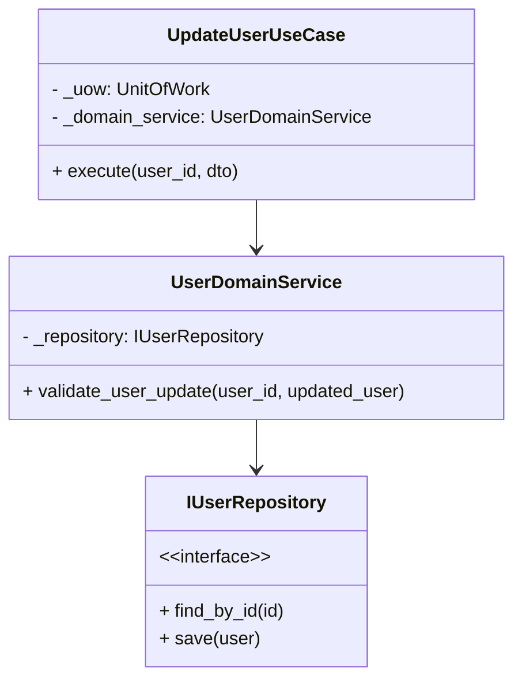
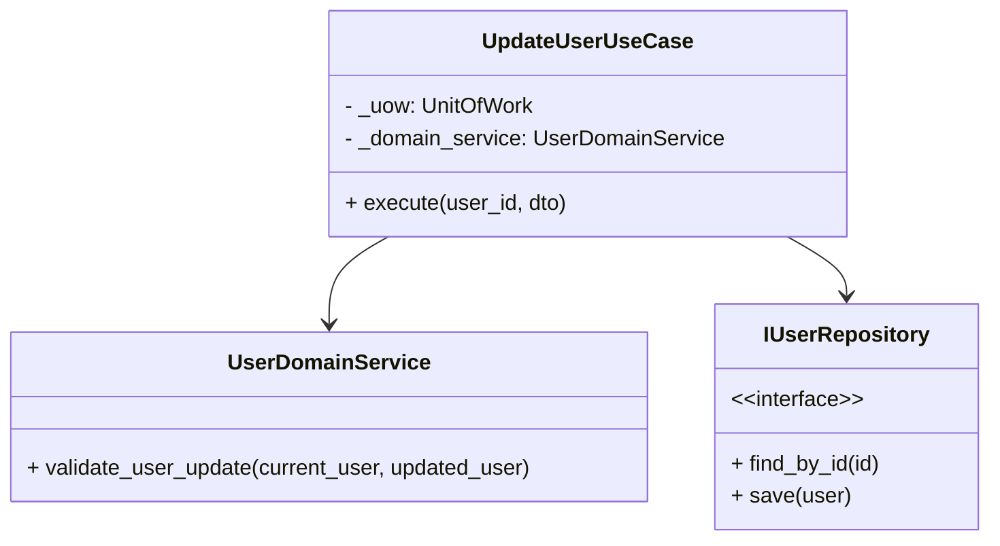
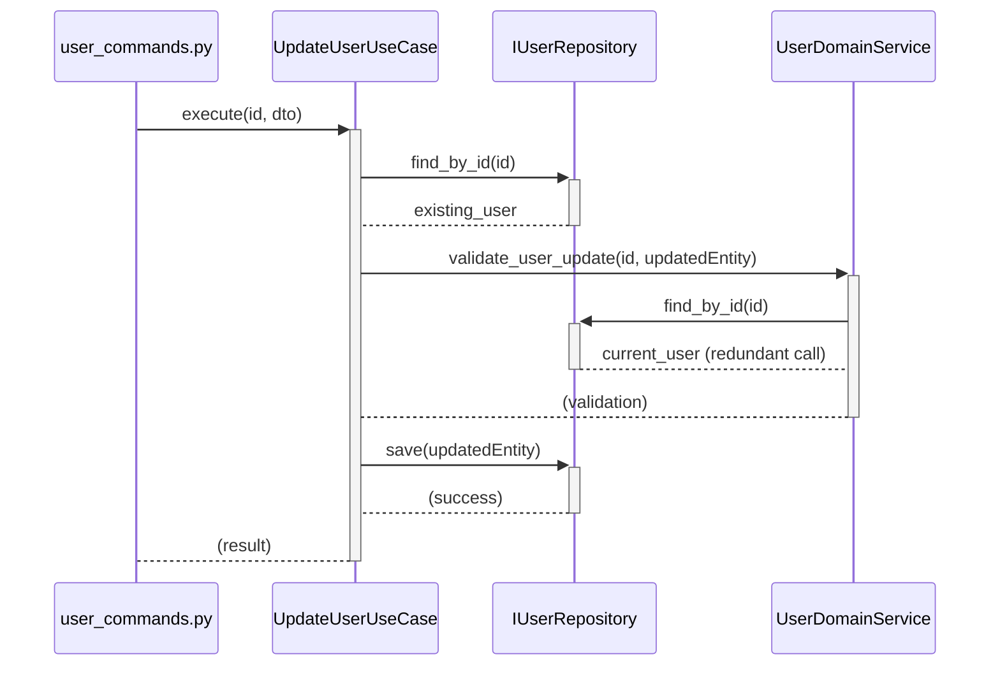
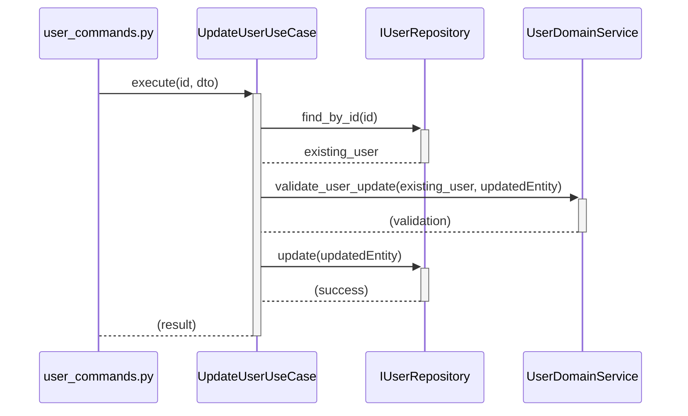
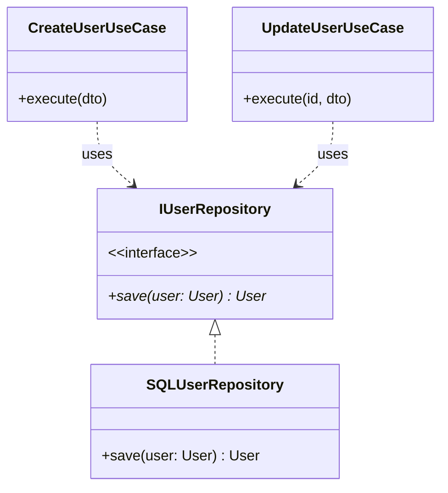
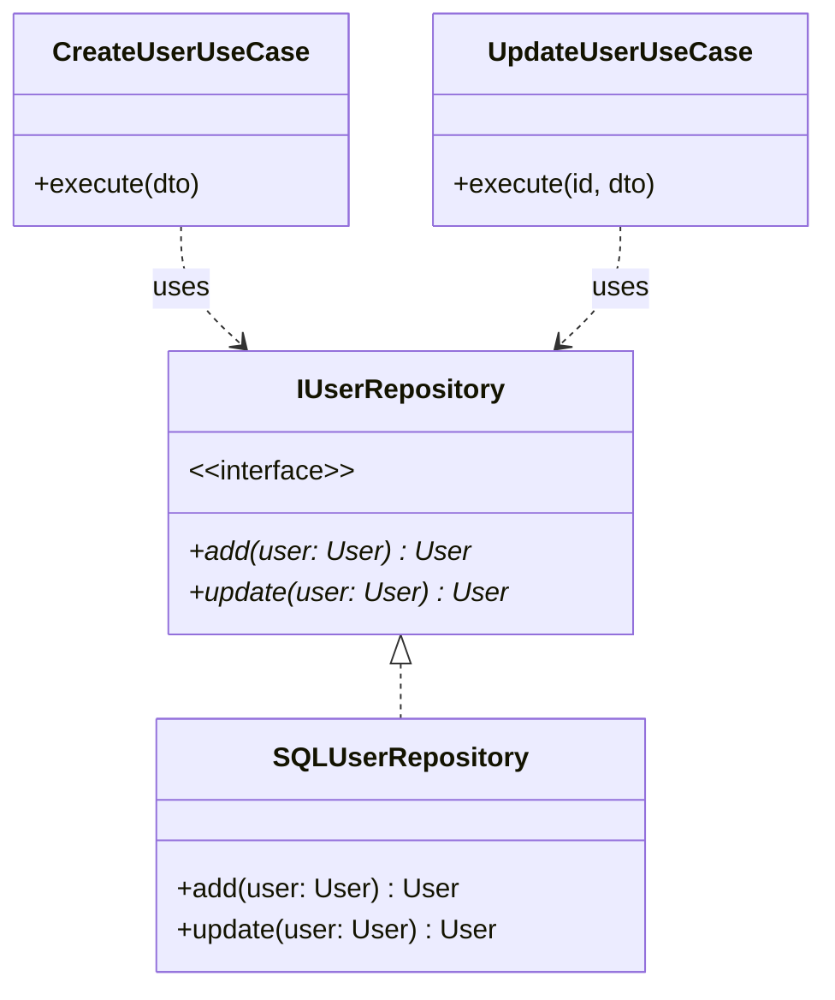
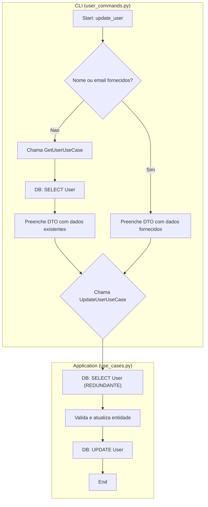
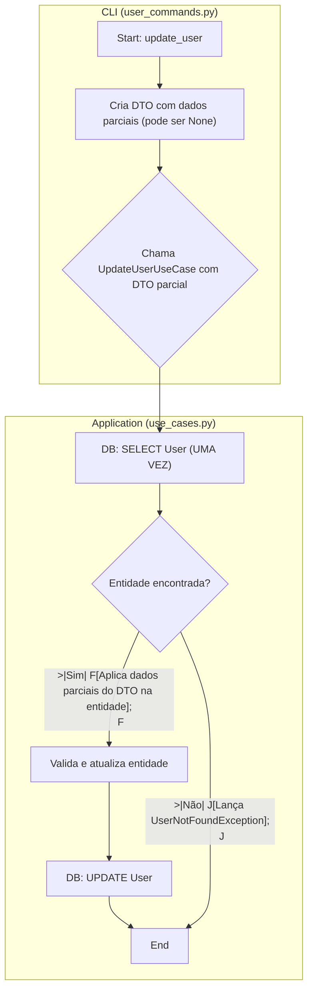

## Ponto de Melhoria 1: Desacoplar Serviços de Domínio do Acesso a Dados

### Descrição Detalhada do Problema

O `UserDomainService`, que deveria conter lógica de negócio pura, atualmente possui uma dependência direta da interface `IUserRepository`. Isso é evidenciado no método `validate_user_update`8, que executa uma busca no repositório (`self._repository.find_by_id(user_id)`).

Essa dependência viola um princípio central da Arquitetura Limpa e do DDD: **Serviços de Domínio devem ser puros e sem estado (stateless), operando exclusivamente sobre entidades e objetos de valor que são passados como argumentos.** Eles não devem ter conhecimento sobre como os dados são persistidos ou recuperados.

Essa violação acarreta dois problemas principais:

1. **Acoplamento Indesejado:** O domínio (`services.py`) fica acoplado à camada de infraestrutura (`interfaces.py`, `repositories.py`), dificultando testes unitários da lógica de negócio sem a necessidade de mocks de repositório.
2. **Ineficiência:** O Caso de Uso `UpdateUserUseCase` já busca a entidade `User`9. Em seguida, o `UserDomainService` busca a _mesma entidade novamente_, resultando em uma chamada redundante ao banco de dados.
    

### Diagramas UML (Mermaid)

#### Diagrama de Classe (Antes)


#### Diagrama de Classe (Depois) 


#### Diagrama de Sequência (Antes)


#### Diagrama de Sequência (Depois)


### Exemplo de Implementação da Solução

#### Antes

**`./src/dev_platform/domain/user/services.py`**

Python

```python
class UserDomainService:
    # ...
    async def validate_user_update(self, user_id: int, updated_user: User) -> None: # 
        validation_errors = {}
        # Get current user
        current_user = await self._repository.find_by_id(user_id) # Problema: Acesso ao repositório
        if not current_user:
            raise UserNotFoundException(str(user_id))
        # Check email uniqueness only if email changed
        if current_user.email.value != updated_user.email.value:
            # ...
```

**`./src/dev_platform/application/user/use_cases.py`**

Python

```python
class UpdateUserUseCase(BaseUseCase):
    # ...
    async def execute(self, user_id: int, dto: UserUpdateDTO) -> UserDTO: # 
        # ...
        existing_user = await self._uow.user_repository.find_by_id(user_id) # Primeira busca
        if not existing_user:
            raise UserNotFoundException(str(user_id))
        existing_user.update_details(dto.name, dto.email)
        await self._domain_service.validate_user_update(user_id, existing_user) # Chama o serviço que faz a segunda busca
        saved_user = await self._uow.user_repository.save(existing_user)
        # ...
```

#### Depois

**`./src/dev_platform/domain/user/services.py` (Proposto)**

Python

```python
class UserDomainService:
    # Removida a dependência do repositório do __init__
    def __init__(self, validation_rules: List[ValidationRule]): # 
        self._validation_rules = validation_rules
    # ...
    async def validate_user_update(self, current_user: User, updated_user: User) -> None:
        """
        Validate user update.
        Recebe a entidade atual e a atualizada, sem acessar o repositório.
        """
        validation_errors = {}
        # Uniqueness service agora é chamado pelo caso de uso, que tem acesso ao repositório
        # A validação das regras de negócio permanece
        for rule in self._validation_rules:
            error_message = await rule.validate(updated_user)
            if error_message:
                validation_errors[rule.rule_name] = error_message
        
        if validation_errors:
            raise UserValidationException(validation_errors)

```

**`./src/dev_platform/application/user/use_cases.py` (Proposto)**

Python

```python
class UpdateUserUseCase(BaseUseCase):
    # ...
    async def execute(self, user_id: int, dto: UserUpdateDTO) -> UserDTO:
        async with self._uow:
            self._logger.info("Starting user update", user_id=user_id)
            
            # 1. Busca a entidade UMA VEZ
            current_user = await self._uow.user_repository.find_by_id(user_id)
            if not current_user:
                self._logger.error("User not found for update", user_id=user_id)
                raise UserNotFoundException(str(user_id))

            # 2. Verifica unicidade do email (se mudou), responsabilidade do Caso de Uso
            if current_user.email.value != dto.email:
                existing_with_new_email = await self._uow.user_repository.find_by_email(dto.email)
                if existing_with_new_email:
                    raise UserAlreadyExistsException(dto.email)
            
            # 3. Cria a nova versão da entidade (imutável)
            updated_user = current_user.update_details(dto.name, dto.email)

            # 4. Passa AMBAS as entidades para o serviço de domínio puro
            await self._domain_service.validate_user_update(current_user, updated_user)

            # 5. Salva a entidade atualizada
            saved_user = await self._uow.user_repository.update(updated_user) # Usando método explícito 'update'
            await self._uow.commit()

            self._logger.info("User updated successfully", user_id=saved_user.id)
            return user_to_dto(saved_user)
```

### Discussão das Vantagens e Desvantagens

**Vantagens:**

- **Adesão à Arquitetura Limpa:** Reforça a regra de dependência, garantindo que o domínio não conheça a infraestrutura.
- **Testabilidade Aprimorada:** A lógica em `UserDomainService` pode ser testada unitariamente sem mocks de banco de dados, passando apenas objetos `User`.
- **Eficiência:** Elimina chamadas redundantes ao banco de dados, melhorando o desempenho da operação de atualização.
- **Clareza de Responsabilidades:** Torna explícito que o Caso de Uso orquestra o acesso a dados, e o Serviço de Domínio lida apenas com regras de negócio.

**Desvantagens:**

- **Ligeiro Aumento de Código no Caso de Uso:** A lógica para verificar a unicidade do e-mail é movida para o `UpdateUserUseCase`. No entanto, este é o local arquiteturalmente correto para ela.

### Impactos da Alteração

- **Arquitetura:** Fortalece o isolamento da camada de domínio, tornando a arquitetura mais robusta e alinhada com os princípios do DDD e da Arquitetura Limpa.
- **Desempenho:** Impacto positivo direto ao reduzir o número de queries de `SELECT` durante uma atualização de 2 para 1.
- **Manutenibilidade:** Facilita a manutenção, pois a lógica de negócio (domínio) e a orquestração de dados (aplicação) estão claramente separadas.

---

## Ponto de Melhoria 2: Adotar Métodos Explícitos de Criação e Atualização no Repositório

### Descrição Detalhada do Problema

A interface `IUserRepository` e sua implementação `SQLUserRepository` possuem um único método `save(user: User)` para persistir dados1010. Dentro deste método, uma lógica condicional (`if user.id is None:`) decide se a operação é uma inserção (`CREATE`) ou uma atualização (`UPDATE`).

Embora funcional, esta abordagem apresenta algumas desvantagens:

1. **Violação do Princípio da Responsabilidade Única (SRP):** O método `save` tem duas responsabilidades distintas: criar novos registros e modificar registros existentes.
2. **Falta de Clareza (Ambiguidade de Intenção):** O código que chama `save` não deixa explícito se a intenção é criar ou atualizar, o que pode levar a bugs sutis. Por exemplo, um desenvolvedor pode chamar `save` esperando uma atualização, mas se o ID for acidentalmente nulo, um novo registro será criado silenciosamente.
3. **Violação do Princípio Command-Query Separation (CQS):** Embora `save` não retorne dados complexos, sua natureza dupla (CREATE/UPDATE) o torna um comando com comportamento condicional complexo, o que pode ser considerado uma violação do espírito do CQS, que preza pela simplicidade e previsibilidade dos comandos.

### Diagramas UML (Mermaid)

#### Diagrama de Classe (Antes)


#### Diagrama de Classe (Depois)


### Exemplo de Implementação da Solução

#### Antes

**`./src/dev_platform/domain/user/interfaces.py`**

Python

```python
class IUserRepository(ABC):
    @abstractmethod
    async def save(self, user: User) -> User: # 
        """Salva um usuário no repositório."""
        pass
    # ...
```

**`./src/dev_platform/infrastructure/database/repositories.py`**

Python

```python
class SQLUserRepository(IUserRepository):
    # ...
    async def save(self, user: User) -> User: # 
        """Save a user to the database."""
        try:
            if user.id is None:
                # Create new user
                db_user = UserModel(name=user.name.value, email=user.email.value)
                self._session.add(db_user)
                await self._session.flush()
                return User(id=db_user.id, name=user.name, email=user.email)
            else:
                # Update existing user
                result = await self._session.execute(
                    select(UserModel).where(UserModel.id == user.id)
                )
                db_user = result.scalars().first()
                if not db_user:
                    raise UserNotFoundException(str(user.id))
                db_user.name = user.name.value
                db_user.email = user.email.value
                await self._session.flush()
                return User(id=db_user.id, name=user.name, email=user.email)
        # ...
```

#### Depois

**`./src/dev_platform/domain/user/interfaces.py` (Proposto)**

Python

```python
class IUserRepository(ABC):
    @abstractmethod
    async def add(self, user: User) -> User:
        """Adiciona um novo usuário ao repositório."""
        pass

    @abstractmethod
    async def update(self, user: User) -> User:
        """Atualiza um usuário existente no repositório."""
        pass
    # ... (demais métodos como find_by_email, etc.)
```

**`./src/dev_platform/infrastructure/database/repositories.py` (Proposto)**

Python

```python
class SQLUserRepository(IUserRepository):
    # ...
    async def add(self, user: User) -> User:
        """Adds a new user to the database."""
        if user.id is not None:
            raise DatabaseException(operation="add", reason="Cannot add a user that already has an ID.")
        
        try:
            db_user = UserModel(name=user.name.value, email=user.email.value)
            self._session.add(db_user)
            await self._session.flush()
            return user.with_id(db_user.id) # Retorna nova instância com ID
        except IntegrityError as e:
            # Transforma erro de violação de constraint em exceção de domínio
            raise UserAlreadyExistsException(user.email.value) from e
        except SQLAlchemyError as e:
            raise DatabaseException(operation="add", reason=str(e), original_exception=e)

    async def update(self, user: User) -> User:
        """Updates an existing user in the database."""
        if user.id is None:
            raise UserNotFoundException("None")

        try:
            # O find_by_id já foi feito no caso de uso, podemos ir direto para o merge ou update.
            # A forma mais segura é buscar e atualizar para garantir que o registro existe.
            db_user = await self._session.get(UserModel, user.id)
            if not db_user:
                raise UserNotFoundException(str(user.id))
            
            db_user.name = user.name.value
            db_user.email = user.email.value
            await self._session.flush()
            return user
        except SQLAlchemyError as e:
            raise DatabaseException(operation="update", reason=str(e), original_exception=e)

```

### Discussão das Vantagens e Desvantagens

**Vantagens:**

- **Clareza e Intenção:** O código nos Casos de Uso se torna mais legível e explícito (`await self._uow.user_repository.add(...)` vs `await self._uow.user_repository.update(...)`).
- **Segurança:** Reduz a chance de erros lógicos, como a criação acidental de um usuário duplicado quando a intenção era atualizar. O método `add` pode falhar explicitamente se a entidade já tiver um ID, e o `update` pode falhar se não tiver.
- **Adesão ao SRP:** Cada método agora tem uma única e bem definida responsabilidade.
- **Melhor Contrato de Interface:** A interface `IUserRepository` descreve de forma mais precisa as operações que ela suporta.

**Desvantagens:**

- **Refatoração Necessária:** Exige a atualização de todos os locais que atualmente chamam `save`. No contexto deste projeto, o impacto é controlado e afeta principalmente os Casos de Uso.

### Impactos da Alteração

- **Arquitetura:** Melhora a definição e a robustez da camada de persistência, tornando os contratos de interface mais fortes.
- **Testabilidade:** Facilita o teste dos Casos de Uso, pois o comportamento esperado do mock do repositório é mais simples e direto para `add` e `update` do que para um `save` condicional.
- **Facilidade de Modificação:** Aumenta a manutenibilidade, pois a lógica de criação e atualização está isolada, permitindo modificações futuras (ex: adicionar um evento de domínio "UserCreated") de forma mais limpa.

---

## Ponto de Melhoria 3: Otimizar o Fluxo de Dados na Operação de Atualização

### Descrição Detalhada do Problema

O fluxo de atualização de um usuário, iniciado a partir da CLI, é ineficiente devido a uma busca de dados duplicada.

1. O comando `update-user` em `user_commands.py` primeiro executa o `get_user_use_case` para obter os dados atuais do usuário11. Isso é feito para preencher os campos `name` e `email` caso eles não sejam fornecidos pelo usuário no terminal.
    
2. Em seguida, ele chama o `update_user_use_case`, que, por sua vez, busca o _mesmo usuário novamente_ do banco de dados através do método `find_by_id`12.
    

Este padrão resulta em duas chamadas `SELECT` ao banco de dados para uma única operação de atualização, o que é desnecessário e impacta o desempenho. A responsabilidade de "mesclar" os dados antigos com os novos deveria ser da camada de aplicação (Caso de Uso), e não da camada de interface (CLI).

### Diagramas UML (Mermaid)

#### Fluxograma (Antes)

#### Fluxograma (Depois)


### Exemplo de Implementação da Solução

#### Antes

**`./src/dev_platform/application/user/dtos.py`**

Python

```python
class UserUpdateDTO(BaseModel):
    # Campos obrigatórios
    name: StrictStr # 
    email: EmailStr # 
```

**`./src/dev_platform/client/cli/user_commands.py`**

Python

```python
async def update_user_async( # Renomeado de user_commands.py
    self, user_id: int, name: Optional[str] = None, email: Optional[str] = None
) -> str: # 
    try:
        async with SQLUnitOfWork() as uow:
            repo = uow.user_repository
            # Busca nº 1 (feita pela CLI)
            get_use_case = self._composition_root.get_user_use_case(uow, repo)
            existing_user: UserDTO = await get_use_case.execute(user_id=user_id) # 
            
            update_name = name if name is not None else existing_user.name
            update_email = email if email is not None else existing_user.email
            
            user_update_dto = UserUpdateDTO(name=update_name, email=update_email)
            
            update_use_case = self._composition_root.update_user_use_case(uow, repo)
            # A chamada a execute() fará a Busca nº 2
            updated_user_entity = await update_use_case.execute(user_id=user_id, dto=user_update_dto)
            # ...
```

#### Depois

**`./src/dev_platform/application/user/dtos.py` (Proposto)**

Python

```python
# Modificar o DTO para aceitar atualizações parciais
class UserUpdateDTO(BaseModel):
    name: Optional[StrictStr] = None
    email: Optional[EmailStr] = None
```

**`./src/dev_platform/client/cli/user_commands.py` (Proposto)**

Python

```python
async def update_user_async(
    self, user_id: int, name: Optional[str] = None, email: Optional[str] = None
) -> str:
    """Atualiza um usuário existente."""
    try:
        # A CLI agora apenas passa os dados, sem lógica de preenchimento
        async with SQLUnitOfWork() as uow:
            repo = uow.user_repository
            # O DTO agora aceita valores nulos
            update_dto = UserUpdateDTO(name=name, email=email)
            
            update_use_case = self._composition_root.update_user_use_case(uow, repo)
            # O caso de uso agora tem toda a responsabilidade
            updated_user = await update_use_case.execute(user_id=user_id, dto=update_dto)

            return f"User {user_id} updated successfully: Name: {updated_user.name}, Email: {updated_user.email}"
    except Exception as e:
        self._logger.error(f"Error updating user: {e}", exception=str(e))
        return f"Error: {e}"

```

**`./src/dev_platform/application/user/use_cases.py` (Proposto)**

Python

```python
class UpdateUserUseCase(BaseUseCase):
    # ...
    async def execute(self, user_id: int, dto: UserUpdateDTO) -> UserDTO:
        async with self._uow:
            self._logger.info("Starting user update", user_id=user_id, update_data=dto.model_dump())

            # 1. Busca a entidade UMA VEZ
            existing_user = await self._uow.user_repository.find_by_id(user_id)
            if not existing_user:
                raise UserNotFoundException(str(user_id))

            # 2. Lógica de atualização parcial (responsabilidade do caso de uso)
            new_name = dto.name if dto.name is not None else existing_user.name.value
            new_email = dto.email if dto.email is not None else existing_user.email.value

            # 3. Lógica de negócio e validação
            updated_user = existing_user.update_details(new_name, new_email)
            await self._domain_service.validate_user_update(existing_user, updated_user) # Usa a versão melhorada do serviço
            
            # 4. Persistência
            saved_user = await self._uow.user_repository.update(updated_user)
            await self._uow.commit()
            
            return user_to_dto(saved_user)
```

### Discussão das Vantagens e Desvantagens

**Vantagens:**

- **Melhora de Desempenho:** Reduz o número de chamadas ao banco de dados pela metade para a operação de atualização, o que é significativo para a latência da aplicação.
- **Centralização da Lógica:** Toda a lógica de negócio e orquestração de dados da atualização fica contida no Caso de Uso, que é seu lugar correto na Arquitetura Limpa.
- **Simplificação da Camada de Interface:** A CLI (`user_commands.py`) se torna mais "burra", apenas coletando input e passando para a próxima camada, como deve ser.
- **DTOs mais Flexíveis:** O `UserUpdateDTO` se torna mais flexível ao permitir campos opcionais, o que é um padrão comum para operações de `PATCH`/`UPDATE`.

**Desvantagens:**

- **Nenhuma Desvantagem Significativa:** Esta alteração representa uma otimização e um alinhamento arquitetural, sem introduzir complexidade adicional ou outros trade-offs negativos.

### Impactos da Alteração

- **Arquitetura:** Reforça a separação de responsabilidades entre a camada de Interface e a camada de Aplicação.
- **Desempenho:** Impacto positivo direto e mensurável na latência das requisições de atualização de usuário.
- **Escalabilidade:** Aplicações com melhor desempenho são inerentemente mais escaláveis. A redução de I/O de banco de dados por requisição permite que o sistema lide com mais requisições concorrentes.
