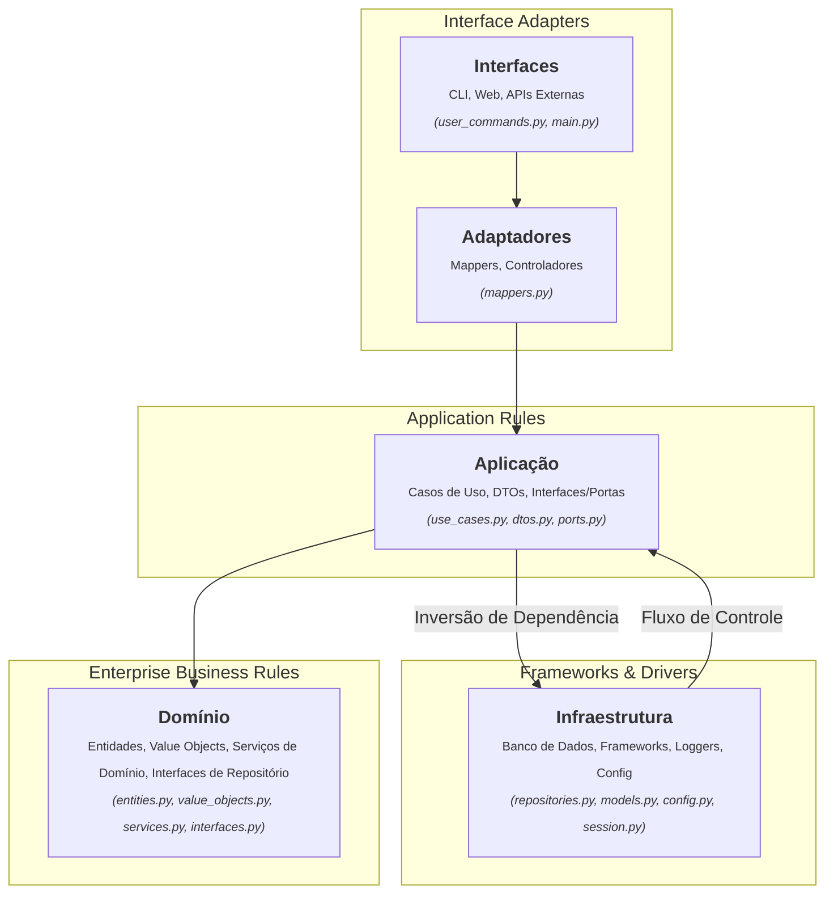
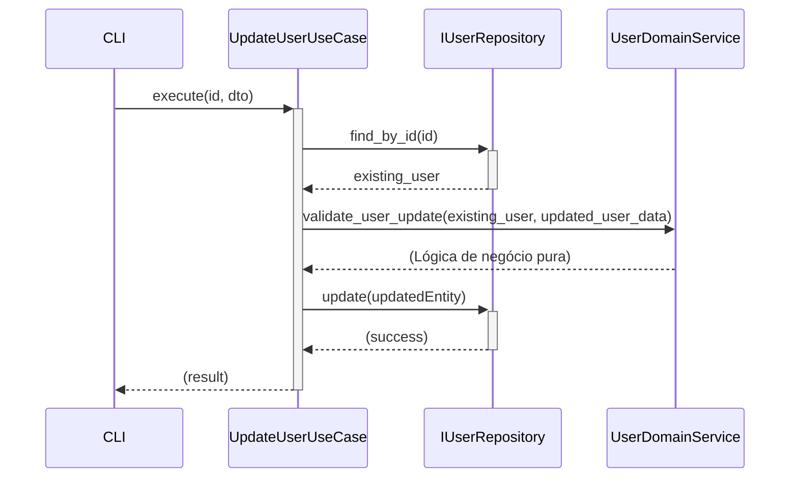
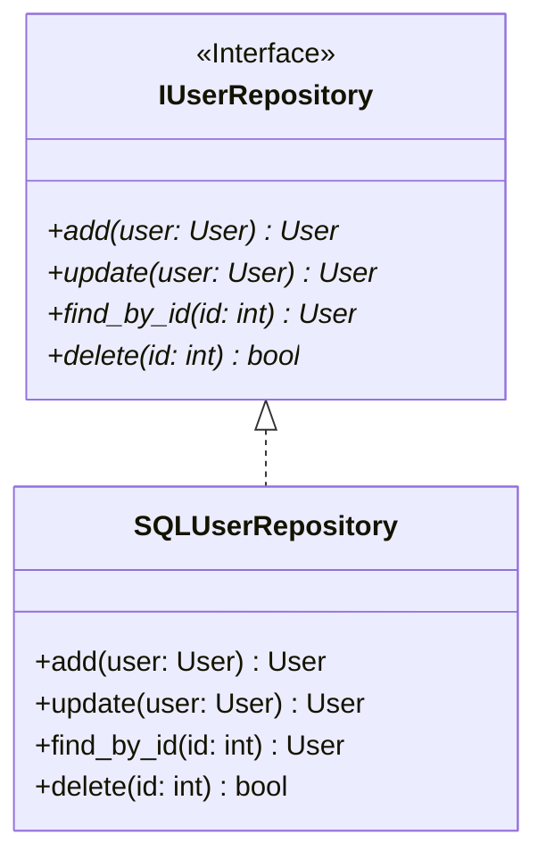
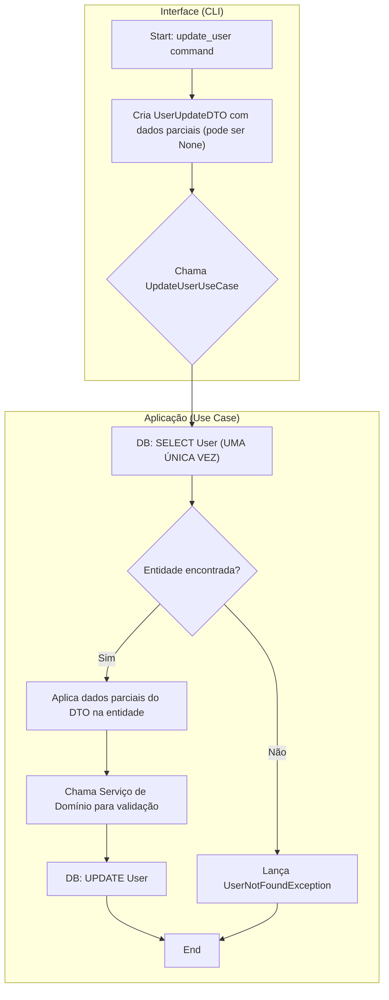

# Manual de Onboarding de Desenvolvedores - DEV Platform

## Bem-vindo à DEV Platform!

Este manual é seu guia principal para entender, manter e criar novos artefatos em nosso sistema. Nosso compromisso é com a excelência técnica, e para isso, adotamos uma filosofia de desenvolvimento baseada em **Arquitetura Limpa (Clean Architecture)** e **Domain-Driven Design (DDD)**. Aderir a estes princípios não é opcional; é a fundação que garante que nosso software seja manutenível, escalável e resiliente a mudanças.

**Nossos Pilares:**

1. **A Regra da Dependência:** O código fonte só pode ter dependências que apontem para o centro. Nada em um círculo interno pode saber qualquer coisa sobre algo em um círculo externo. Por exemplo, o domínio nunca deve saber sobre o banco de dados.
2. **O Domínio é o Coração:** A complexidade do negócio deve ser modelada no núcleo do software. Investimos tempo para entender e modelar entidades, objetos de valor e regras de negócio de forma precisa.
3. **Qualidade Contínua:** Usamos os princípios **SOLID** e boas práticas de programação como ferramentas diárias para escrever um código limpo, legível e testável.

Este guia está estruturado para levá-lo do conceito à prática, com exemplos e diagramas para ilustrar cada passo.

---

## 1. Visão Geral da Arquitetura

Nossa aplicação segue o modelo da Arquitetura Limpa, organizada em camadas concêntricas. Entender essa estrutura é o primeiro passo para saber onde encontrar e onde colocar cada peça de código.



### As Camadas em Detalhes

- **Domínio (Enterprise Business Rules):**
    
    - **O que é?** O núcleo do sistema. Contém a lógica de negócio mais pura e de mais alto nível.
    - **Componentes:**
        - `Entidades` (`entities.py`): Objetos com identidade que representam conceitos de negócio (ex: `User`). 1
            
        - `Value Objects` (`value_objects.py`): Atributos que descrevem coisas, sem identidade própria (ex: `Email`, `UserName`). São imutáveis. 2
            
        - `Interfaces de Repositório` (`interfaces.py`): Contratos que definem como as entidades são persistidas, sem conhecer a implementação. 3
            
        - `Serviços de Domínio` (`services.py`): Orquestram lógicas de negócio complexas que não se encaixam em uma única entidade. 4
            
    - **Regra de Ouro:** Não depende de nenhuma outra camada. É totalmente independente de frameworks, banco de dados ou UI.
- **Aplicação (Application Business Rules):**
    
    - **O que é?** Orquestra o fluxo de dados para executar uma tarefa de negócio específica.
    - **Componentes:**
        - `Casos de Uso` (`use_cases.py`): Classes que representam uma única ação que o sistema pode realizar (ex: `CreateUserUseCase`). 5
            
        - `DTOs (Data Transfer Objects)` (`dtos.py`): Estruturas de dados simples para transferir informação entre as camadas, evitando que o domínio vaze para o exterior. 6
            
        - `Portas` (`ports.py`): Interfaces, como a `UnitOfWork`, que definem como a camada de aplicação interage com a infraestrutura. 7
            
        - `Mapeadores` (`mappers.py`): Funções responsáveis por converter Entidades em DTOs e vice-versa. 8
            
- **Adaptadores de Interface e Infraestrutura (Círculos Externos):**
    
    - **O que são?** Os detalhes de implementação. São voláteis e podem ser trocados sem afetar as camadas internas.
    - **Componentes:**
        - `Infraestrutura`: Contém o código que interage com tecnologias externas.
            - `Repositórios` (`repositories.py`): Implementação concreta das interfaces de repositório (ex: `SQLUserRepository` para SQLAlchemy). 9
                
            - `Modelos de BD` (`models.py`): Mapeamento Objeto-Relacional (ORM) para o banco de dados. 10
                
            - `Configuração` (`config.py`, `.env.*`): Carregamento e acesso a configurações. 1111111111111111111111111111
                
            - `Gerenciamento de Sessão` (`session.py`, `unit_of_work.py`): Controle de transações e sessões com o banco de dados. 12
                
            - `Logging` (`structured_logger.py`): Implementação do logger. 13
                
        - `Interface`: A "porta de entrada" da aplicação.
            - `CLI` (`user_commands.py`, `main.py`): Comandos de linha de comando que o usuário pode executar. 14
                

---

## 2. Configurando o Ambiente

Para começar a desenvolver, siga estes passos:

1. **Clone o Repositório:** Obtenha o código-fonte do nosso repositório central.
2. **Instale as Dependências:** Usamos **Poetry** para gerenciar nossas dependências. Na raiz do projeto, execute:
    
    Bash
    
    ```powershell
    poetry install
    ```
    
    Isso criará um ambiente virtual dentro do projeto (`.venv`) e instalará todas as dependências listadas no `pyproject.toml`. 15
    
3. **Configure o Ambiente Local:**
    - Copie o arquivo `.env.development` para um novo arquivo chamado `.env`. 1616
        
    - Revise o arquivo `.env` e ajuste a `DATABASE_URL` e outras variáveis conforme necessário para sua máquina local. 17171717
        
4. **Execute as Migrações do Banco de Dados:** Usamos **Alembic** para gerenciar o schema do banco de dados. 18 Para garantir que seu banco de dados esteja atualizado, execute:
    
    Bash
    
    ```
    poetry run alembic upgrade head
    ```
    
5. **Verifique a Instalação:** Execute um comando simples para listar os usuários e confirmar que tudo está funcionando:
    
    Bash
    
    ```powershell
    poetry run python ./src/dev_platform/main.py user list-users
    ```
    

---

## 3. Nossas Regras de Ouro: Como Manter a Qualidade

A análise contínua do nosso código revelou pontos que transformamos em "Regras de Ouro". Seguir estas regras é fundamental para manter a saúde da nossa arquitetura. Elas são apresentadas aqui de forma pedagógica, com base nos pontos de melhoria identificados. 19

### Regra 1: Serviços de Domínio Devem ser Puros e Livres de I/O

**O Problema (O que evitar):** Um Serviço de Domínio (`UserDomainService`) não deve NUNCA acessar diretamente a camada de infraestrutura (como um repositório) para buscar dados. 20 No passado, nosso `validate_user_update` buscava o usuário do banco, o que causava acoplamento indesejado e chamadas redundantes ao banco de dados. 21212121

**A Solução (O Jeito Certo):** Serviços de Domínio devem receber Entidades já carregadas como parâmetros. 22 A responsabilidade de buscar dados no banco é sempre do **Caso de Uso**, na camada de Aplicação. 23

#### Diagrama de Sequência: O Fluxo Correto

Este diagrama mostra o Caso de Uso orquestrando tudo: ele busca os dados, passa para o Serviço de Domínio validar, e então comanda o repositório para salvar.



#### Exemplo Prático: Corrigindo uma Validação

**Antes (Incorreto):** O serviço buscava o usuário.

Python

```python
# MODO ANTIGO E INCORRETO - EM services.py
async def validate_user_update(self, user_id: int, updated_user: User) -> None:
    # PROBLEMA: O serviço de domínio não deveria fazer I/O.
    current_user = await self._repository.find_by_id(user_id)
    # ... resto da lógica
```

**Depois (Correto):** O serviço recebe o usuário e apenas executa a lógica. 24

Python

```python
# MODO CORRETO E ATUAL - EM services.py
# O serviço agora é puro e não depende de repositório para esta operação
async def validate_user_update(self, current_user: User, updated_user: User) -> None:
    # Perfeito! Sem I/O. Apenas lógica de negócio com os dados recebidos.
    if current_user.email.value != updated_user.email.value:
        # Lógica de validação...
    # ...
```

A responsabilidade de buscar o `current_user` foi movida para o **Caso de Uso**. 25

**Vantagens desta Abordagem:**

- **Domínio Puro:** Mantém a camada de domínio livre de dependências externas. 26
    
- **Testes Fáceis:** Permite testar a lógica de negócio complexa sem precisar de mocks de banco de dados. 27
    
- **Eficiência:** Evita chamadas duplicadas ao banco de dados, melhorando o desempenho. 28
    

### Regra 2: Repositórios com Intenções Claras (add vs. update)

**O Problema (O que evitar):** Usar um método genérico como `save()` que decide internamente se deve criar (`INSERT`) ou atualizar (`UPDATE`) um registro. 29 Isso viola o Princípio da Responsabilidade Única (SRP) e torna o código menos explícito, podendo levar a bugs. 30

**A Solução (O Jeito Certo):** Nossas interfaces de repositório (`IUserRepository`) e suas implementações devem ter métodos explícitos para cada operação: `add(entity)` para criar e `update(entity)` para modificar.

#### Diagrama de Classe: O Contrato Correto



#### Exemplo Prático: Implementando o Repositório

**Antes (Incorreto):** Um método `save` genérico. 31

Python

```python
# MODO ANTIGO E INCORRETO - EM repositories.py
async def save(self, user: User) -> User:
    if user.id is None:
        # Lógica de INSERT
    else:
        # Lógica de UPDATE
```

**Depois (Correto):** Métodos explícitos e com responsabilidade única. 32

Python

```python
# MODO CORRETO E ATUAL - EM repositories.py
async def add(self, user: User) -> User:
    """Adiciona um novo usuário ao banco de dados."""
    # Lógica focada apenas em INSERT.
    # Pode lançar exceção se user.id não for None.
    ...

async def update(self, user: User) -> User:
    """Atualiza um usuário existente no banco de dados."""
    # Lógica focada apenas em UPDATE.
    # Pode lançar UserNotFoundException se o usuário não existir.
    ...
```

**Vantagens desta Abordagem:**

- **Clareza e Intenção:** O código que utiliza o repositório é inequívoco.
- **Segurança:** Reduz o risco de erros lógicos, como criar um usuário quando a intenção era atualizar. 33
    
- **Adesão ao SRP:** Cada método tem uma, e apenas uma, razão para mudar. 34
    

### Regra 3: Otimize o Fluxo de Dados e Evite Buscas Duplicadas

**O Problema (O que evitar):** Múltiplas camadas buscando a mesma informação do banco de dados dentro do mesmo fluxo de requisição. 35 Um exemplo anterior mostrava a camada de CLI buscando um usuário para obter dados padrão, e em seguida, o Caso de Uso buscava o mesmo usuário novamente para realizar a atualização. 36363636 Isso é ineficiente. 37

**A Solução (O Jeito Certo):** A camada de Aplicação (Caso de Uso) é a única responsável por orquestrar o fluxo de dados. Ela deve buscar uma entidade **uma única vez**, realizar todas as operações necessárias e, em seguida, persistir o resultado. A camada de interface (CLI) apenas coleta a entrada e a passa para o Caso de Uso. 38

#### Fluxograma: O Fluxo de Dados Otimizado



#### Exemplo Prático: Otimizando o DTO e o Caso de Uso

**1. Tornar o DTO de atualização parcial:**

Os campos no `UserUpdateDTO` devem ser opcionais para que a CLI possa enviar apenas o que o usuário deseja alterar.

Python

```python
# MODO CORRETO E ATUAL - EM dtos.py
from typing import Optional
from pydantic import BaseModel, StrictStr, EmailStr

class UserUpdateDTO(BaseModel):
    # Campos agora são opcionais
    name: Optional[StrictStr] = None
    email: Optional[EmailStr] = None
```

**2. Centralizar a lógica no Caso de Uso:**

O `UpdateUserUseCase` agora é inteligente. Ele busca o usuário, aplica as alterações parciais do DTO e então continua o fluxo.

Python

```python
# MODO CORRETO E ATUAL - EM use_cases.py
async def execute(self, user_id: int, dto: UserUpdateDTO) -> UserDTO:
    async with self._uow:
        # 1. Busca a entidade UMA VEZ
        existing_user = await self._uow.user_repository.find_by_id(user_id)
        if not existing_user:
            raise UserNotFoundException(str(user_id))

        # 2. Mescla os dados do DTO com a entidade existente
        # Se o DTO não fornecer um valor, o valor antigo é mantido.
        new_name = dto.name if dto.name is not None else existing_user.name.value
        new_email = dto.email if dto.email is not None else existing_user.email.value
        
        updated_user = existing_user.update_details(new_name, new_email)
        
        # ... continua com validação e salvamento ...
        saved_user = await self._uow.user_repository.update(updated_user)
        await self._uow.commit()
        return user_to_dto(saved_user)
```

**Vantagens desta Abordagem:**

- **Desempenho:** Reduz as chamadas de banco de dados, tornando a aplicação mais rápida. 39
    
- **Lógica Centralizada:** A responsabilidade da atualização fica inteiramente no Caso de Uso, o lugar correto.
- **Interfaces Limpas:** A camada de interface (CLI) fica mais simples, apenas delegando trabalho.

---

## 4. Playbooks: Guias Práticos para o Dia a Dia

### Playbook 1: Criando um Novo Contexto de Domínio (Ex: "Produto")

Vamos supor que precisamos adicionar um novo conceito, "Produto", ao sistema.

1. **Domínio Primeiro:**
    
    - **`domain/product/value_objects.py`**: Crie VOs como `ProductName(str)` e `SKU(str)`, com suas validações.
    - **`domain/product/entities.py`**: Crie a entidade `@dataclass(frozen=True) class Product: ...` usando os VOs.
    - **`domain/product/interfaces.py`**: Defina a interface `IProductRepository(ABC)` com métodos como `add`, `update`, `find_by_sku`.
    - **`domain/product/services.py`**: Se houver regras complexas (ex: `ProductInventoryService`), crie-as aqui.
2. **Camada de Aplicação:**
    
    - **`application/product/dtos.py`**: Crie `ProductDTO`, `ProductCreateDTO`, etc.
    - **`application/product/mappers.py`**: Crie `product_to_dto` e outras funções de mapeamento.
    - **`application/product/use_cases.py`**: Crie os casos de uso como `CreateProductUseCase`. Eles dependerão da `UnitOfWork` e da `IProductRepository`.
3. **Camada de Infraestrutura:**
    
    - **`infrastructure/database/models.py`**: Adicione `ProductModel(Base)` para o ORM da SQLAlchemy.
    - **`infrastructure/database/repositories.py`**: Crie `SQLProductRepository(IProductRepository)` que implementa a interface de domínio usando o `ProductModel` e a `AsyncSession`.
    - **`infrastructure/database/unit_of_work.py`**: Adicione o `product_repository` à classe `SQLUnitOfWork`.
    - **`infrastructure/composition_root.py`**: Adicione métodos `create_product_use_case(...)` para injetar as dependências. 40
        
4. **Camada de Interface:**
    
    - **`interface/cli/product_commands.py`**: Crie os novos comandos CLI para interagir com os casos de uso de produto.
5. **Migrations:**
    
    - Execute `poetry run alembic revision --autogenerate -m "create product table"` para que o Alembic detecte o novo `ProductModel` e crie o script de migração.
    - Execute `poetry run alembic upgrade head` para aplicar a migração ao banco.

### Playbook 2: Conectando a uma Nova Fonte de Dados (Ex: API REST)

Se precisar buscar dados de uma API externa em vez do nosso banco:

1. **Defina a Porta (Interface):** Na camada de domínio ou aplicação (dependendo do caso), defina uma interface que descreva os dados que você precisa.
    
    - Exemplo em `domain/weather/interfaces.py`:
        
        Python
        
        ```python
        class IWeatherService(ABC):
            @abstractmethod
            async def get_temperature(self, city: str) -> float:
                pass
        ```
        
2. **Crie o Adaptador de Infraestrutura:** Na camada de infraestrutura, implemente a interface.
    
    - Exemplo em `infrastructure/weather/api_client.py`:
        
        Python
        
        ```python
        class WeatherApiClient(IWeatherService):
            def __init__(self, api_key: str):
                self._api_key = api_key
                self._base_url = "https://api.weather.com"
        
            async def get_temperature(self, city: str) -> float:
                # Lógica para chamar a API com aiohttp/httpx
                ...
        ```
        
3. **Injeção de Dependência:** Na `CompositionRoot`, crie um método para instanciar e injetar sua nova implementação no Caso de Uso que precisa dela. O Caso de Uso dependerá apenas da interface `IWeatherService`, não da implementação `WeatherApiClient`.
    

Este padrão garante que, se a API do tempo mudar ou for substituída, você só precisará alterar o `WeatherApiClient`, e o resto da sua aplicação (domínio e casos de uso) permanecerá intacto.
