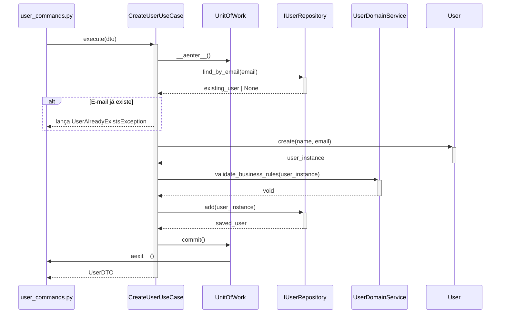
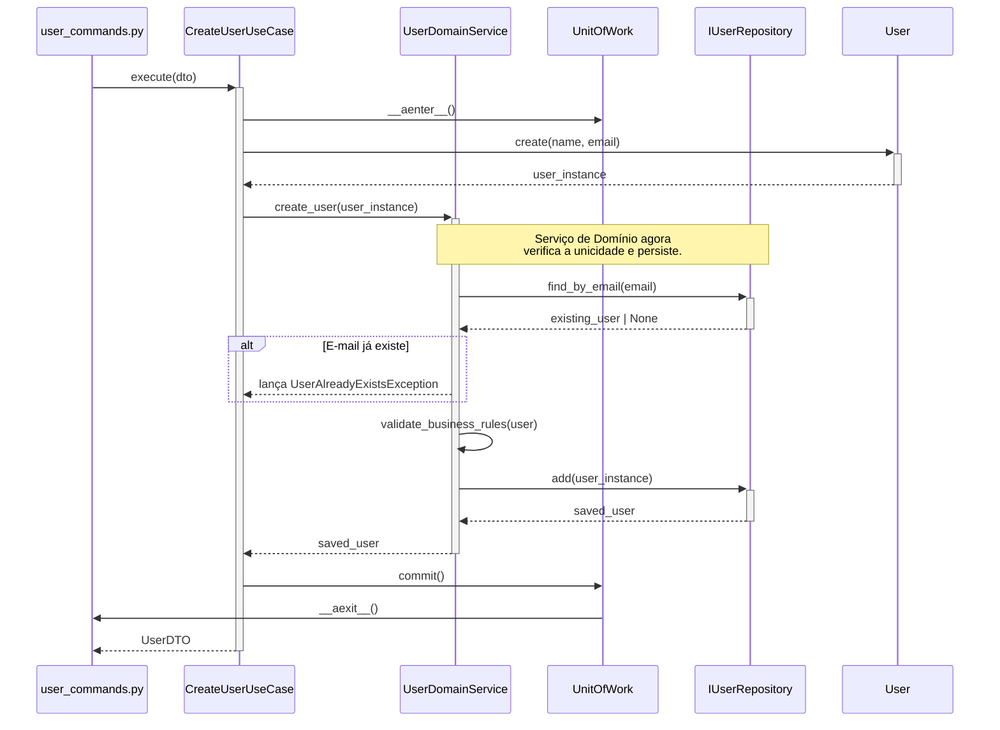
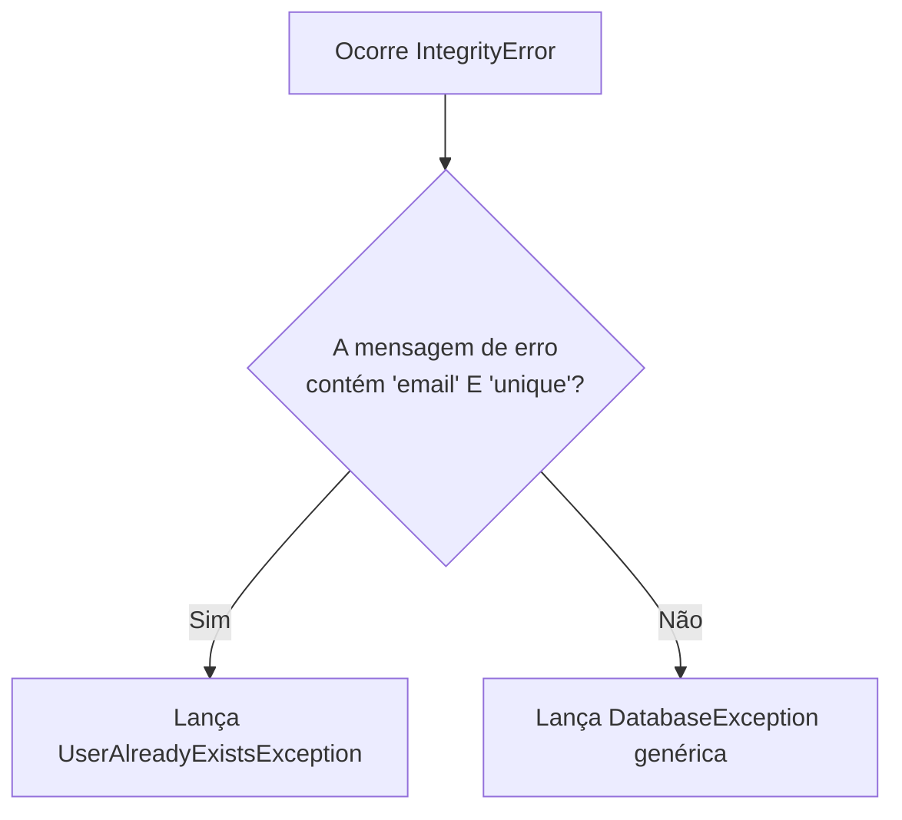
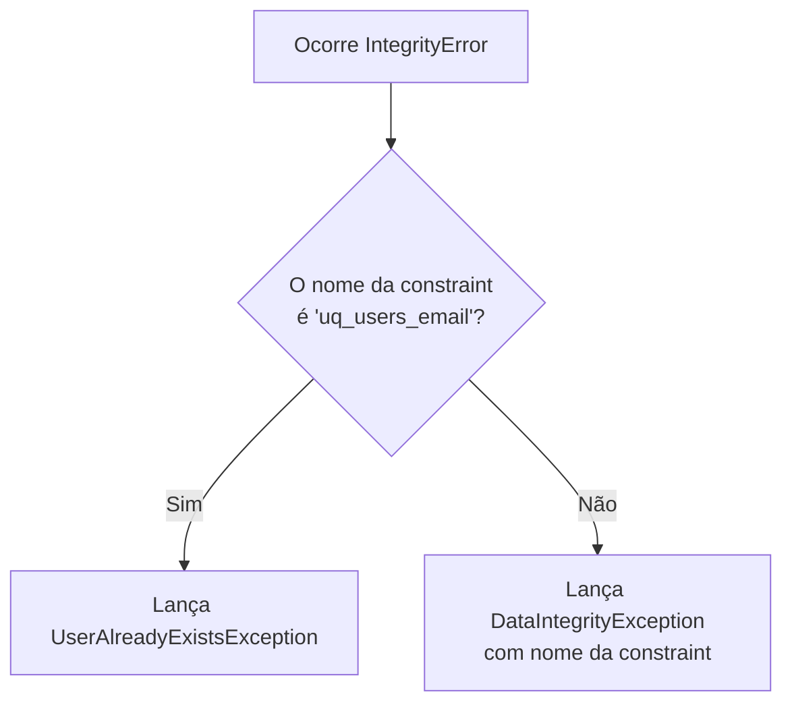
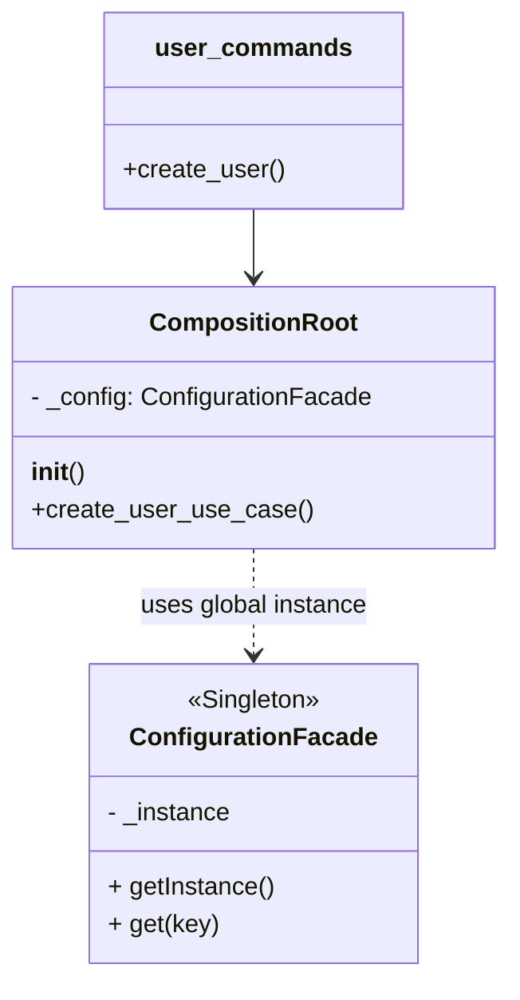
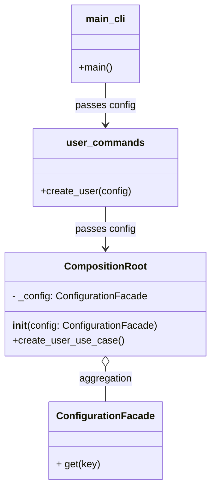
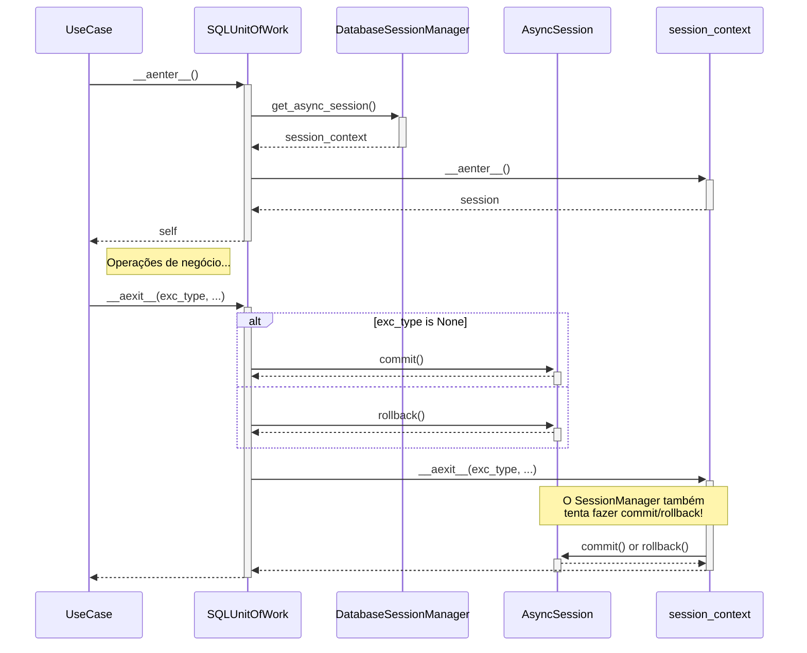
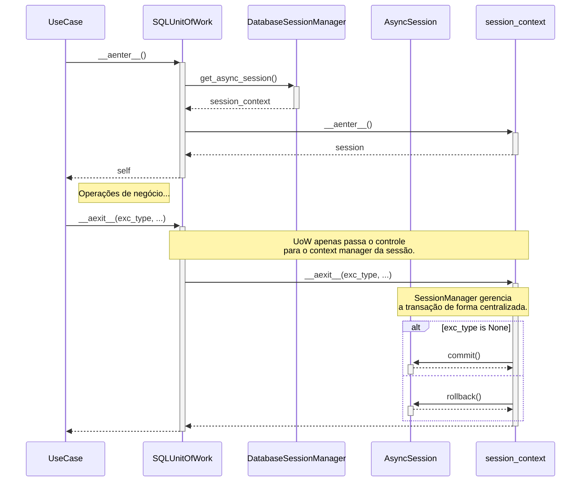

## Avaliação Geral do Projeto

O projeto `DEV Platform` demonstra uma base arquitetural sólida e um bom entendimento de princípios modernos de design de software. A estrutura de diretórios e a separação em camadas (`application`, `domain`, `infrastructure`, `interface`) alinham-se bem com a **Arquitetura Limpa**. A utilização de conceitos como Entidades, Objetos de Valor, Repositórios, Casos de Uso e Unit of Work indica uma forte influência do **DDD**.

A implementação do `CompositionRoot` é um excelente exemplo da aplicação do princípio da Inversão de Dependência (DIP), centralizando a criação de dependências e facilitando a manutenibilidade e testabilidade.

Apesar da excelente base, identifiquei quatro oportunidades principais para refatoração que podem elevar ainda mais a qualidade, coesão e manutenibilidade do código.

---

## 1. Refatorar a Validação de Unicidade para o Serviço de Domínio (DDD/SRP)

### Título Descritivo da Melhoria

**Centralizar a Regra de Unicidade de E-mail no Serviço de Domínio**

### Descrição Detalhada do Problema

Atualmente, o caso de uso `CreateUserUseCase` é responsável por verificar se um e-mail já existe antes de criar a entidade `User`.

- **`./src/dev_platform/application/user/use_cases.py`**:
    
    Python
    
    ```python
    # Linha 45-47
    existing_user = await self._uow.user_repository.find_by_email(dto.email)
    if existing_user:
        raise UserAlreadyExistsException(dto.email)
    ```
    

Essa abordagem, embora funcional, atribui uma responsabilidade de regra de negócio (a unicidade de um e-mail é uma invariante do domínio) à camada de aplicação. Segundo os princípios do DDD, a camada de domínio deve ser a guardiã de todas as regras de negócio. O caso de uso deve orquestrar o fluxo, mas não implementar a lógica da regra em si. Isso torna o domínio menos robusto, pois a criação de um usuário válido depende da disciplina do desenvolvedor do caso de uso em sempre checar a duplicidade primeiro.

### Diagramas UML (Mermaid)

#### Diagrama de Sequência (Antes)


#### Diagrama de Sequência (Depois)


### Exemplo de Implementação da Solução (Antes e Depois)

#### Antes: `use_cases.py` e `services.py`

- **`./src/dev_platform/application/user/use_cases.py`**
    
    Python
    
    ```python
    # Trecho do CreateUserUseCase.execute
    async def execute(self, dto: UserCreateDTO) -> UserDTO:
        async with self._uow:
            # 1. Caso de uso verifica a unicidade
            existing_user = await self._uow.user_repository.find_by_email(dto.email)
            if existing_user:
                raise UserAlreadyExistsException(dto.email)
    
            # 2. Cria a entidade de domínio
            user = User.create(name=dto.name, email=dto.email)
    
            # 3. Executa as regras de negócio
            await self._domain_service.validate_business_rules(user)
    
            # 4. Salva o usuário
            saved_user = await self._uow.user_repository.add(user) # Assumindo 'add' em vez de 'save'
            await self._uow.commit()
    
            return user_to_dto(saved_user)
    ```
    

#### Depois: `use_cases.py` e `services.py` (Proposta)

- **`./src/dev_platform/domain/user/services.py` (Modificado)**
    
    Python
    
    ```python
    class UserDomainService:
        """Service for complex user domain validations and business rules."""
        def __init__(self, user_repository: IUserRepository, validation_rules: List[ValidationRule]):
            self._repository = user_repository
            self._validation_rules = validation_rules
    
        async def create_user(self, user: User) -> User:
            """
            Creates a new user, ensuring all domain rules, including uniqueness, are met.
            """
            # 1. Verifica unicidade como parte da operação de criação
            existing = await self._repository.find_by_email(user.email.value)
            if existing:
                raise UserAlreadyExistsException(user.email.value)
    
            # 2. Valida outras regras de negócio
            await self.validate_business_rules(user)
    
            # 3. Persiste o usuário
            saved_user = await self._repository.add(user)
            return saved_user
    
        async def validate_business_rules(self, user: User) -> None:
            # ... (lógica de validação existente) ...
    ```
    
- **`./src/dev_platform/application/user/use_cases.py` (Simplificado)**
    
    Python
    
    ```python
    # Trecho do CreateUserUseCase.execute
    async def execute(self, dto: UserCreateDTO) -> UserDTO:
        async with self._uow:
            try:
                self._logger.info("Starting user creation", name=dto.name, email=dto.email)
    
                # 1. Cria a entidade de domínio
                user_to_create = User.create(name=dto.name, email=dto.email)
    
                # 2. Orquestra a criação através do serviço de domínio
                saved_user = await self._domain_service.create_user(user_to_create)
    
                await self._uow.commit()
                self._logger.info("User created successfully", user_id=saved_user.id)
                return user_to_dto(saved_user)
            except (UserValidationException, UserAlreadyExistsException) as e:
                self._logger.error(f"Domain validation failed: {e}")
                await self._uow.rollback()
                raise
    ```
    

### Discussão das Vantagens e Desvantagens

**Vantagens:**

- **Domínio Rico e Coeso (DDD):** A lógica de negócio reside inteiramente na camada de domínio, tornando-a mais robusta e autocontida.
- **Princípio da Responsabilidade Única (SRP):** O `CreateUserUseCase` agora tem a única responsabilidade de orquestrar o fluxo (DTO -> Entidade -> Serviço -> DTO), enquanto o `UserDomainService` é responsável por aplicar as regras de negócio.
- **Redução de Duplicação:** Se outro caso de uso ou serviço precisar criar um usuário no futuro, a lógica de validação de unicidade não precisará ser re-implementada.
- **Manutenibilidade:** A lógica de criação de usuário está em um único lugar (`UserDomainService`), facilitando futuras modificações.

**Desvantagens:**

- **Nenhuma significativa:** Esta alteração representa uma melhoria clara no alinhamento com os princípios de design adotados pelo projeto.

### Impactos da Alteração

- **Arquitetura:** Reforça a separação de responsabilidades entre as camadas de aplicação e domínio, aderindo mais estritamente à Arquitetura Limpa.
- **Testabilidade:** Torna os testes mais focados. O teste do `UserDomainService` pode validar de forma isolada todo o processo de criação de usuário (regras + persistência), enquanto o teste do `CreateUserUseCase` pode focar na orquestração e conversão de dados.

---

## 2. Melhorar o Tratamento de Exceções de Integridade no Repositório

### Título Descritivo da Melhoria

**Remover a Dependência de Mensagens de Erro de String para Detecção de Violação de Constraints**

### Descrição Detalhada do Problema

No arquivo `repositories.py`, a classe `RepositoryExceptionHandler` detecta uma violação de constraint de unicidade de e-mail através da verificação de substrings na mensagem de erro original do driver do banco de dados.

- **`./src/dev_platform/infrastructure/database/repositories.py`**:
    
    Python
    
    ```python
    # Linha 178-181
    if isinstance(error, IntegrityError):
        if (
            "email" in str(error.orig).lower()
            and "unique" in str(error.orig).lower()
        ):
    ```
    

Esta é uma prática frágil (**brittle**) porque:

1. **Acoplamento à Implementação:** O código fica acoplado à formatação da mensagem de erro de uma versão específica do `aiomysql` ou `PyMySQL`. Uma atualização do driver pode quebrar essa lógica sem aviso.
2. **Falta de Portabilidade:** Se o banco de dados for trocado (ex: para PostgreSQL), as mensagens de erro serão diferentes, exigindo a reescrita desta lógica.
3. **Ambiguidade:** A verificação por strings como "email" e "unique" pode, em teoria, levar a falsos positivos se essas palavras aparecerem em outros contextos de erro de integridade.

A maioria dos dialetos de banco de dados e drivers SQLAlchemy fornecem acesso ao nome da constraint que foi violada, o que é uma forma muito mais robusta e explícita de identificar o erro.

### Diagramas UML (Mermaid)

#### Fluxograma da Lógica (Antes)



#### Fluxograma da Lógica (Depois)


### Exemplo de Implementação da Solução (Antes e Depois)

**Pré-requisito:** Garantir que a constraint de unicidade na tabela `users` tenha um nome previsível. No modelo SQLAlchemy, isso pode ser feito da seguinte forma:

- **`./src/dev_platform/infrastructure/database/models.py` (Adicionar nome à constraint)**
    
    Python
    
    ```python
    from sqlalchemy import Column, Integer, String, UniqueConstraint
    # ...
    class UserModel(Base):
        __tablename__ = "users"
        __table_args__ = (
            UniqueConstraint('email', name='uq_users_email'),
        )
        id = Column(Integer, primary_key=True, index=True)
        name = Column(String(100), nullable=False)
        email = Column(String(100), nullable=False, unique=True) # unique=True é um atalho, mas __table_args__ é mais explícito para nomeação
    ```
    

#### Antes: `repositories.py`

- **`./src/dev_platform/infrastructure/database/repositories.py`** 14
    
    Python
    
    ```python
    # Trecho do RepositoryExceptionHandler
    @staticmethod
    def handle_sqlalchemy_error(operation: str, error: SQLAlchemyError, **context):
        if isinstance(error, IntegrityError):
            if (
                "email" in str(error.orig).lower()
                and "unique" in str(error.orig).lower()
            ):
                email = context.get("email", "unknown")
                raise UserAlreadyExistsException(email)
        # ... Lógica genérica
        raise DatabaseException(operation=operation, reason=str(error), original_exception=error)
    ```
    

#### Depois: `repositories.py` (Proposta)

- **`./src/dev_platform/infrastructure/database/repositories.py` (Modificado)**
    
    Python
    
    ```python
    # Trecho do RepositoryExceptionHandler
    @staticmethod
    def handle_sqlalchemy_error(operation: str, error: SQLAlchemyError, **context):
        if isinstance(error, IntegrityError):
            # Acessa o erro original do driver DBAPI
            dbapi_exception = error.orig
    
            # Checa se o driver fornece o nome da constraint (ex: psycopg2, mysql-connector)
            # A forma exata pode variar um pouco entre drivers, mas o princípio é o mesmo.
            # Para PyMySQL/aiomysql, a análise do erro pode ser necessária.
            # No entanto, a forma mais robusta é checar o código de erro do MySQL.
            # Erro 1062 do MySQL é para entrada duplicada.
    
            # Exemplo para MySQL (código de erro 1062)
            if hasattr(dbapi_exception, 'errno') and dbapi_exception.errno == 1062:
                error_msg = str(dbapi_exception)
                if "'uq_users_email'" in error_msg: # Checa o nome da constraint
                    email = context.get("email", "unknown")
                    raise UserAlreadyExistsException(email) from error
                else:
                    # Outra violação de unicidade
                    raise DataIntegrityException(
                        constraint_name="unknown", # ou extrair o nome da constraint da msg
                        details=error_msg,
                        original_exception=error
                    ) from error
    
        # ... Lógica genérica
        raise DatabaseException(operation=operation, reason=str(error), original_exception=error) from error
    ```
    

### Discussão das Vantagens e Desvantagens

**Vantagens:**

- **Robustez:** A lógica de tratamento de erro não quebra com atualizações de bibliotecas que alterem mensagens de erro.
- **Explicitude:** O código se torna mais claro sobre _qual_ erro está sendo tratado, baseando-se em códigos de erro ou nomes de constraints em vez de "palavras mágicas".
- **Portabilidade:** Facilita a migração para outros sistemas de banco de dados, pois a lógica pode ser adaptada para os códigos de erro específicos do novo sistema, mantendo o contrato da exceção (`UserAlreadyExistsException`).
- **Melhor Diagnóstico:** Se uma nova constraint for adicionada, o sistema lançará uma `DataIntegrityException` mais genérica em vez de falhar silenciosamente ou lançar a exceção errada.

**Desvantagens:**

- **Complexidade do Driver:** Pode exigir um conhecimento um pouco mais aprofundado sobre o objeto de exceção específico do driver DBAPI sendo utilizado (ex: `mysql.connector.Error`, `psycopg2.errors`).

### Impactos da Alteração

- **Confiabilidade:** Aumenta significativamente a confiabilidade do sistema, tornando o tratamento de erros de banco de dados menos suscetível a fatores externos.
- **Manutenibilidade:** Simplifica a depuração de erros de integridade, pois a causa raiz (a constraint específica) é identificada de forma mais precisa.

---

## 3. Substituir o Padrão Singleton por Injeção de Dependência Explícita na Configuração

### Título Descritivo da Melhoria

**Adotar Injeção de Dependência Explícita para o `ConfigurationFacade`**

### Descrição Detalhada do Problema

A classe `ConfigurationFacade` é implementada usando o padrão Singleton.

- **`./src/dev_platform/infrastructure/config.py`**:
    
    Python
    
    ```python
    # Linha 123-126
    _instance: Optional["ConfigurationFacade"] = None
    def __new__(cls, *args, **kwargs) -> "ConfigurationFacade":
        if cls._instance is None:
            cls._instance = super().__new__(cls)
        return cls._instance
    ```
    

Embora o Singleton possa parecer uma solução fácil para acessar configurações globalmente, ele introduz um estado global que pode levar a problemas, especialmente em testes e em aplicações complexas:

1. **Estado Global Oculto:** Classes que usam o `ConfigurationFacade` dependem de um estado global oculto, o que viola os princípios de acoplamento fraco. A dependência não é clara na assinatura da classe ou do método.
2. **Dificuldade de Teste:** Testar componentes isoladamente se torna difícil. É preciso manipular ou "resetar" o estado do Singleton entre os testes, como evidenciado pela presença do método `_reset_singleton`, que é um forte "code smell" (um indício de um problema mais profundo no design).
    
3. **Flexibilidade Reduzida:** Torna quase impossível rodar configurações diferentes em paralelo dentro do mesmo processo (por exemplo, em um cenário de testes complexos).

A solução é instanciar o `ConfigurationFacade` **uma vez** no ponto de entrada da aplicação (o `main` da CLI) e passá-lo explicitamente (injeção de dependência) para os componentes que precisam dele, como o `CompositionRoot`.

### Diagramas UML (Mermaid)

#### Diagrama de Classe (Antes)


#### Diagrama de Classe (Depois)


### Exemplo de Implementação da Solução (Antes e Depois)

#### Antes: `config.py` e `user_commands.py`

- **`./src/dev_platform/infrastructure/config.py`** 
    
    Python
    
    ```python
    # Com o padrão Singleton
    class ConfigurationFacade:
        _instance: Optional["ConfigurationFacade"] = None
        def __new__(cls, *args, **kwargs) -> "ConfigurationFacade":
            if cls._instance is None:
                cls._instance = super().__new__(cls)
            return cls._instance
        # ...
        @classmethod
        def _reset_singleton(cls) -> None:
            cls._instance = None
    ```
    
- **`./src/dev_platform/client/cli/user_commands.py`**
    
    Python
    
    ```python
    # composition_root é criado sem passar a configuração explicitamente
    composition_root = CompositionRoot(environment="production", logger=logger)
    ```
    

#### Depois: `config.py`, `user_commands.py` e `composition_root.py` (Proposta)

- **`./src/dev_platform/infrastructure/config.py` (Simplificado)**
    
    Python
    
    ```python
    # Removido o padrão Singleton
    class ConfigurationFacade:
        def __init__(
            self,
            # ... (construtor existente, mas sem a lógica de __new__)
        ) -> None:
            # ... (a lógica de inicialização permanece)
    
        # Removido o método _reset_singleton
    ```
    
- **`./src/dev_platform/client/cli/user_commands.py` (Modificado)**
    
    Python
    
    ```python
    # ...
    logger = StructuredLogger()
    
    # Ponto de entrada cria as dependências de infraestrutura
    def get_dependencies():
        config = ConfigurationFacade(environment=os.getenv("ENVIRONMENT", "production"), logger=logger)
        comp_root = CompositionRoot(config=config, logger=logger)
        return comp_root
    
    @click.group()
    def cli():
        pass
    
    @cli.command()
    # ...
    def create_user(name: str, email: str):
        """Create a new user."""
        comp_root = get_dependencies()
        commands: UserCommands = UserCommands(comp_root, logger)
        # ...
    ```
    
- **`./src/dev_platform/infrastructure/composition_root.py` (Modificado)**
    
    Python
    
    ```python
    class CompositionRoot:
        def __init__(
            self,
            config: ConfigurationFacade, # Recebe a configuração explicitamente
            logger: Optional[ILogger] = None,
            # ...
        ):
            self._config = config # Usa a instância injetada
            self._logger = logger or StructuredLogger()
            # ...
    ```
    

### Discussão das Vantagens e Desvantagens

**Vantagens:**

- **Acoplamento Fraco:** As dependências se tornam explícitas, melhorando a clareza e a manutenibilidade do código.
- **Testabilidade Aprimorada:** É trivial passar uma `ConfigurationFacade` mockada ou com configurações de teste para os componentes, eliminando a necessidade de hacks como `_reset_singleton`.
- **Flexibilidade:** Permite maior controle sobre o ciclo de vida dos objetos de configuração.
- **Alinhamento com Injeção de Dependência:** O padrão se alinha perfeitamente com a abordagem de DI já utilizada no restante do projeto (`CompositionRoot`).

**Desvantagens:**

- **"Verbosity" (um pouco mais de código):** Requer passar a instância de configuração explicitamente através de algumas camadas. No entanto, em uma arquitetura bem definida, isso geralmente se limita ao ponto de entrada e à raiz de composição.

### Impactos da Alteração

- **Arquitetura:** Remove o estado global, tornando a arquitetura mais limpa, previsível e robusta.
- **Testabilidade:** Causa o maior impacto positivo na testabilidade, simplificando drasticamente a configuração de testes unitários e de integração.

---

## 4. Simplificar a Gestão de Transações no `SQLUnitOfWork`

### Título Descritivo da Melhoria

**Delegar o Controle de Commit/Rollback para o Gerenciador de Sessão**

### Descrição Detalhada do Problema

O projeto tem duas camadas que gerenciam o ciclo de vida da transação (commit/rollback):

1. **`DatabaseSessionManager`**: No método `get_async_session`, ele usa um `asynccontextmanager` que já implementa um bloco `try...except` para fazer `commit` em caso de sucesso e `rollback` em caso de exceção.
    
2. **`SQLUnitOfWork`**: No método `__aexit__`, ele replica essa mesma lógica, verificando o tipo de exceção para decidir se chama `commit` ou `rollback`.
    

- **`./src/dev_platform/infrastructure/database/unit_of_work.py`**:
    
    Python
    
    ```python
    # Linha 30-35
    async def __aexit__(self, exc_type, exc_val, exc_tb):
        # ...
        if exc_type is None:
            await self._session.commit()
        else:
            await self._session.rollback()
    ```
    

Isso é uma duplicação de responsabilidade. O `DatabaseSessionManager` foi projetado para ser a única fonte de verdade para a gestão de sessões e transações. O `UnitOfWork` (UoW) deve apenas _usar_ a sessão fornecida pelo gerenciador, sem se preocupar em gerenciar a transação. O contexto `async with` no caso de uso, que envolve o UoW, já garante que o `__aexit__` do gerenciador de sessão será chamado, cuidando do commit/rollback.

A implementação atual no UoW não só é redundante como também pode causar comportamentos inesperados se a lógica divergir daquela no `DatabaseSessionManager`.

### Diagramas UML (Mermaid)

#### Diagrama de Sequência (Antes)


#### Diagrama de Sequência (Depois)


### Exemplo de Implementação da Solução (Antes e Depois)

#### Antes: `unit_of_work.py`

- **`./src/dev_platform/infrastructure/database/unit_of_work.py`**
    
    Python
    
    ```python
    class SQLUnitOfWork(UnitOfWork):
        # ...
        async def __aenter__(self):
            self._session_context = db_manager.get_async_session()
            self._session = await self._session_context.__aenter__()
            self._user_repository = SQLUserRepository(self._session, logger=self._logger)
            return self
    
        async def __aexit__(self, exc_type, exc_val, exc_tb):
            if not self._session:
                return
            try:
                if exc_type is None:
                    await self._session.commit()
                else:
                    await self._session.rollback()
            except Exception as e:
                # ...
            finally:
                # ...
                await self._session_context.__aexit__(exc_type, exc_val, exc_tb)
                # ...
    ```
    

#### Depois: `unit_of_work.py` (Proposta)

- **`./src/dev_platform/infrastructure/database/unit_of_work.py` (Simplificado)**
    
    Python
    
    ```python
    class SQLUnitOfWork(UnitOfWork):
        def __init__(self, logger: Optional[ILogger] = None):
            self._session_context: Optional[AbstractAsyncContextManager[AsyncSession]] = None
            self._logger: ILogger = logger or StructuredLogger()
            self._user_repository: Optional[IUserRepository] = None
            self._session: Optional[AsyncSession] = None
    
        async def __aenter__(self):
            # A lógica de entrada permanece a mesma
            self._session_context = db_manager.get_async_session()
            self._session = await self._session_context.__aenter__()
            self._user_repository = SQLUserRepository(self._session, logger=self._logger)
            return self
    
        async def __aexit__(self, exc_type, exc_val, exc_tb):
            # Delega TODA a lógica de saída para o gerenciador de sessão.
            # O gerenciador já cuida do commit, rollback e fechamento.
            if self._session_context:
                await self._session_context.__aexit__(exc_type, exc_val, exc_tb)
    
            # Limpa as referências
            self._session = None
            self._user_repository = None
            self._session_context = None
    
        # Os métodos de commit/rollback explícitos podem ser mantidos para casos
        # onde o controle manual é necessário dentro do bloco 'with', mas a
        # gestão automática no __aexit__ deve ser removida.
        async def commit(self):
            if self._session:
                await self._session.commit()
    
        async def rollback(self):
            if self._session:
                await self._session.rollback()
    
    ```
    
    _Nota: Uma implementação ainda mais simples seria remover os métodos `commit` e `rollback` explícitos do UoW, forçando o uso do padrão "unit of work por caso de uso", onde o commit acontece apenas no final._

### Discussão das Vantagens e Desvantagens

**Vantagens:**

- **Princípio DRY (Don't Repeat Yourself):** Elimina a lógica de transação duplicada.
- **Fonte Única de Verdade:** O `DatabaseSessionManager` se torna a única autoridade sobre como as transações são gerenciadas, simplificando a manutenção e prevenindo bugs.
- **Redução da Complexidade:** O `SQLUnitOfWork` se torna mais simples e focado em sua real responsabilidade: agrupar repositórios dentro de um único contexto transacional.
- **Menos Propenso a Erros:** Reduz o risco de lógicas de transação conflitantes ou inconsistentes entre as camadas.

**Desvantagens:**

- **Nenhuma:** Esta refatoração é uma clara simplificação e melhoria da consistência do código.

### Impactos da Alteração

- **Arquitetura:** Melhora a clareza e a definição de responsabilidades dentro da camada de infraestrutura.
- **Manutenibilidade:** Torna o código do UoW trivialmente simples e fácil de entender. Qualquer alteração na lógica de transação (ex: adicionar retentativas) precisará ser feita em um único lugar (`DatabaseSessionManager`).

---
