# Relatório de Avaliação de Código: DEV Platform - Módulo de Usuários

### 1. Introdução

#### 1.1. Visão Geral do Projeto e Escopo da Análise

O projeto "DEV Platform" apresenta uma estrutura inicial que reflete a intenção de incorporar princípios de arquitetura de software contemporâneos, notadamente Clean Architecture e Domain-Driven Design (DDD). A avaliação aqui detalhada concentra-se no código-fonte do módulo de usuários, conforme disponibilizado no documento `compilado_36.pdf`. O objetivo primordial desta análise é fornecer uma avaliação aprofundada da aplicação de padrões arquiteturais, princípios de design e boas práticas de programação dentro deste módulo específico. A estrutura de diretórios do projeto, que inclui

`domain`, `application`, `infrastructure`, e `interface`, já sugere um esforço consciente para segregar responsabilidades e aderir a uma arquitetura limpa.

#### 1.2. Metodologia de Avaliação e Limitações (Baseado em PDF)

A avaliação do código-fonte foi realizada estritamente com base no conteúdo textual extraído do `compilado_36.pdf`. Esta metodologia, embora permita uma análise minuciosa da estrutura, do design e da sintaxe do código, impõe certas restrições inerentes. A ausência de um ambiente de execução funcional impede a validação dinâmica do comportamento do sistema, a execução de testes de unidade ou integração, e a análise de desempenho em tempo real. Consequentemente, a presente análise é de natureza estática, focando na conformidade com os princípios de design e na identificação de padrões e antipadrões visíveis na estrutura do código. Todas as observações e recomendações são derivadas diretamente do texto fornecido, sem suposições sobre a funcionalidade em tempo de execução.

### 2. Avaliação Detalhada e Pontos de Melhoria

#### 2.1. Adesão à Arquitetura Limpa (Clean Architecture)

A organização do projeto em camadas como `domain`, `application`, `infrastructure` e `interface` é um indicativo claro da intenção de seguir os preceitos da Clean Architecture, que visa à separação de interesses e à independência do domínio em relação a detalhes de infraestrutura. Contudo, uma análise mais aprofundada revela áreas onde a implementação atual diverge dos princípios fundamentais, em particular no que tange à Inversão de Dependência (DIP).

##### Ponto de Melhoria CA: Violação do Princípio da Inversão de Dependência (DIP) na Injeção de Repositórios

Descrição Detalhada do Problema:

O CompositionRoot e o `SQLUnitOfWork` exibem uma dependência direta em implementações concretas da camada de infraestrutura, em vez de se apoiarem em abstrações. Mais especificamente, o `CompositionRoot` passa uma instância de `SQLUnitOfWork` (uma classe concreta de infraestrutura) para os casos de uso. Por sua vez, o `SQLUnitOfWork` instancia internamente o `SQLUserRepository`, que é outra implementação concreta de infraestrutura. Essa prática estabelece um acoplamento indesejado entre as camadas, contrariando o objetivo da Clean Architecture de manter o domínio e a aplicação independentes da infraestrutura.

Descrição da Causa Raiz (Antes):

A causa raiz reside na aplicação inconsistente do Princípio da Inversão de Dependência (DIP). Embora o projeto defina interfaces como UnitOfWork e `IUserRepository`, as camadas de alto nível, como a de aplicação (representada pelos casos de uso e pelo `CompositionRoot`), e até mesmo a implementação da `UnitOfWork` (`SQLUnitOfWork`), dependem diretamente de classes concretas da infraestrutura. Isso impede a substituição fácil de componentes de infraestrutura e dificulta a testabilidade, pois os módulos de alto nível estão intrinsecamente ligados a detalhes de implementação de baixo nível. A intenção de usar interfaces é clara, mas a execução final na injeção de dependências não a segue completamente.

- **Figura 01 - Fluxograma (Antes):**
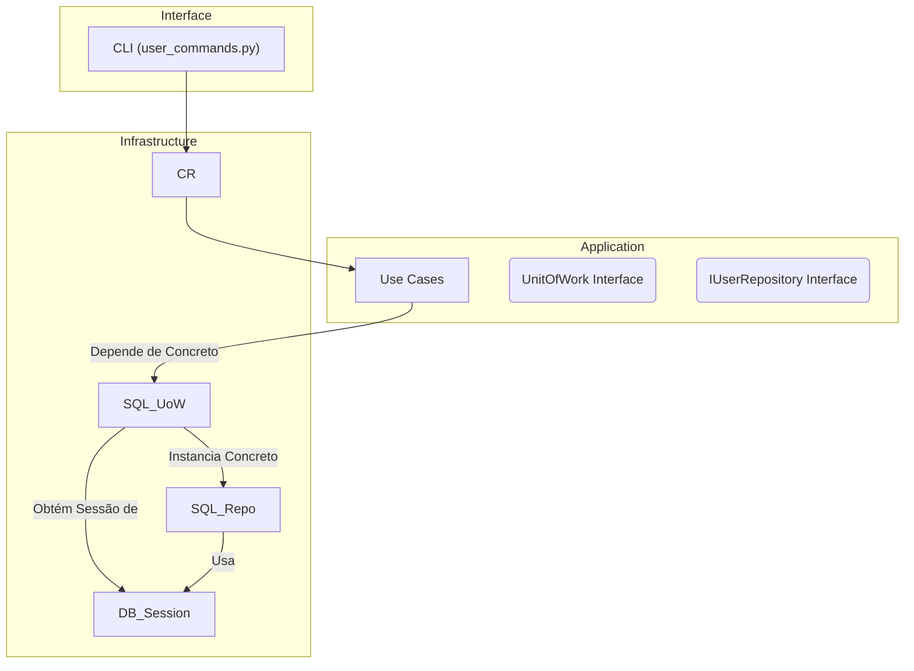


- **Figura 02 - Diagrama de Classe (Antes):**
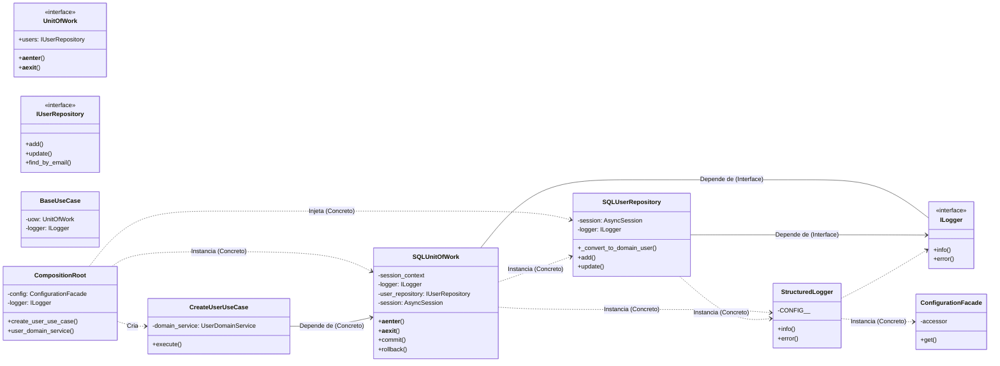


- **Figura 03 - Diagrama de Sequência (Antes):**  
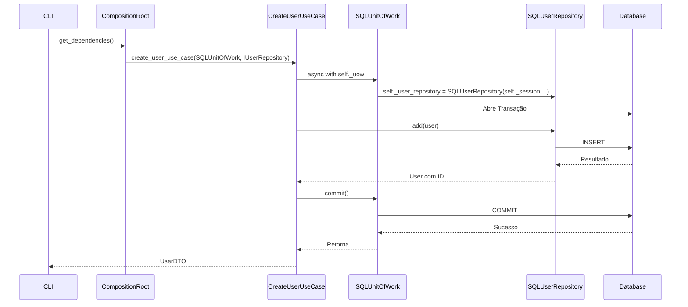
    
- Trechos de código (Antes):
    
    src/dev_platform/infrastructure/composition_root.py:
    
    Python
    
```python
#...
from dev_platform.infrastructure.database.unit_of_work import SQLUnitOfWork
from dev_platform.domain.user.interfaces import IUserRepository
#...
class CompositionRoot:
	#...
	def create_user_use_case(self, uow: SQLUnitOfWork, user_repository: IUserRepository) -> CreateUserUseCase:
		# Causa Raiz: 'uow' é tipado como SQLUnitOfWork (concreto),
		# e 'user_repository' é passado para o domain_service, que não deveria ter essa dependência.
		return CreateUserUseCase(
			uow=uow,
			domain_service=self.user_domain_service(user_repository), # Problema: user_repository passado aqui
			logger=self._logger,
		)
	#...
```
    
    `src/dev_platform/infrastructure/database/unit_of_work.py`:
    
    Python
    
```python
#...
from dev_platform.infrastructure.database.repositories import SQLUserRepository
#...
class SQLUnitOfWork(UnitOfWork):
	#...
	async def __aenter__(self):
		#...
		self._session = await self._session_context.__aenter__()
		self._user_repository = SQLUserRepository(self._session, logger=self._logger) # Causa Raiz: Instanciação concreta
		return self
	#...
```
    
    `src/dev_platform/application/user/use_cases.py`:
    
    Python
    
```python
#...
from dev_platform.application.user.ports import UnitOfWork
#...
class CreateUserUseCase(BaseUseCase):
	def __init__(
		self,
		uow: UnitOfWork, # Causa Raiz: Espera UnitOfWork, mas CompositionRoot passa SQLUnitOfWork (que é concreto)
		logger: ILogger,
		domain_service: UserDomainService,
	):
		super().__init__(uow, logger)
		self._domain_service = domain_service
```
    

Proposta para Implementação da Solução (Depois):

Para resolver esta questão, é fundamental que o CompositionRoot injete as interfaces apropriadas, e que o SQLUnitOfWork receba suas dependências (como o IUserRepository) por injeção, em vez de instanciá-las diretamente. Isso significa que o CompositionRoot será o único ponto que "conhece" as implementações concretas, orquestrando a criação e a injeção de todas as dependências. A SQLUnitOfWork deve ser capaz de operar com qualquer IUserRepository que lhe seja fornecido, e os casos de uso devem depender apenas da interface UnitOfWork.

- **Figura 04 - Fluxograma (Depois):**
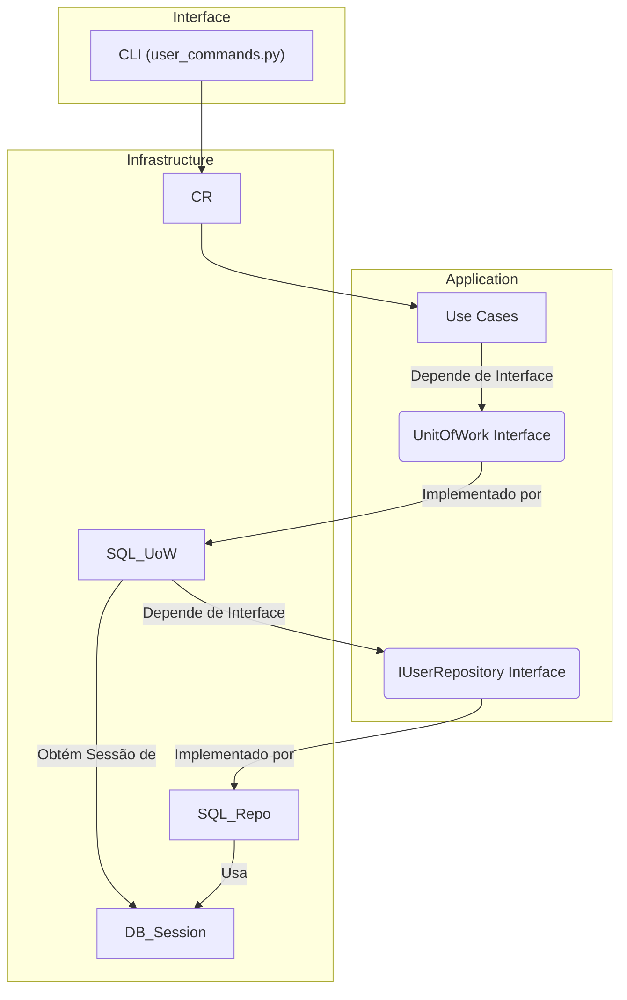


- **Figura 05 - Diagrama de Classe (Depois):**
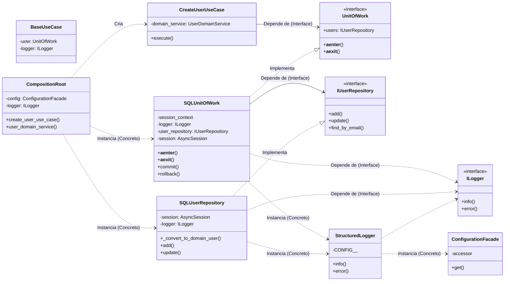


- **Figura 06 - Diagrama de Sequência (Depois):**
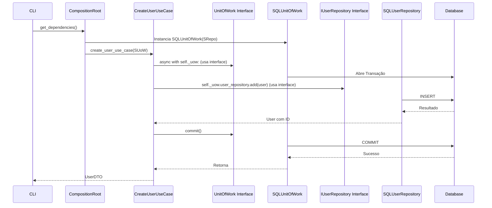
    
- Trechos de código (Depois):
    
    src/dev_platform/infrastructure/composition_root.py (Proposta de alteração):
    
    Python
    
```python
#...
from dev_platform.application.user.ports import UnitOfWork # Importa a interface
from dev_platform.domain.user.interfaces import IUserRepository # Importa a interface
from dev_platform.infrastructure.database.unit_of_work import SQLUnitOfWork # Ainda precisa da implementação concreta para instanciar
from dev_platform.infrastructure.database.repositories import SQLUserRepository # Ainda precisa da implementação concreta para instanciar
#...
class CompositionRoot:
	#...
	def create_user_use_case(self, uow: UnitOfWork) -> CreateUserUseCase: # Injeta a interface do UoW
		# O domain_service agora deve ser criado sem o repositório aqui,
		# pois o repositório é uma dependência do UoW, não do domain_service diretamente para persistência.
		# O domain_service deve receber apenas o que ele precisa para as regras de domínio.
		return CreateUserUseCase(
			uow=uow,
			domain_service=self.user_domain_service(), # user_repository removido daqui
			logger=self._logger,
		)

	# Novo método para criar o UoW, que encapsula a criação do repositório concreto
	def create_unit_of_work(self) -> UnitOfWork:
		# O SQLUnitOfWork agora recebe o repositório via injeção ou uma factory
		# Para simplificar, vamos injetar o logger e o repositório aqui
		user_repo = SQLUserRepository(session=None, logger=self._logger) # A sessão será injetada pelo UoW
		return SQLUnitOfWork(logger=self._logger, user_repository=user_repo) # Passa o repositório concreto

	#... (outros use cases adaptados para receber UnitOfWork)
	def user_domain_service(self, user_type: str = "default") -> UserDomainService: # Removido user_repository
		"""
		Cria UserDomainService com regras de validação baseadas em configuração e tipo de usuário.
		"""
		rules = self._validation_rule_provider.get_rules(user_type)
		# UserDomainService não deve receber o repositório, pois não deve persistir.
		return UserDomainService(validation_rules=rules)
```
    
    `src/dev_platform/infrastructure/database/unit_of_work.py` (Proposta de alteração):
    
    Python
    
```python
#...
from dev_platform.application.user.ports import UnitOfWork
from dev_platform.domain.user.interfaces import IUserRepository # Importa a interface
from dev_platform.infrastructure.database.repositories import SQLUserRepository # Ainda precisa da implementação concreta para instanciar
#...
class SQLUnitOfWork(UnitOfWork):
	def __init__(self, logger: Optional[ILogger] = None, user_repository: Optional = None): # Recebe IUserRepository
		self._session_context: Optional] = None
		self._logger: ILogger = logger or StructuredLogger(CONFIG__=ConfigurationFacade())
		self._user_repository: Optional = user_repository # Atribui o repositório injetado
		self._session: Optional = None

	@property
	def user_repository(self) -> IUserRepository: # Retorna a interface
		if self._user_repository is None:
			raise RuntimeError("User repository not initialized within Unit of Work context.")
		return self._user_repository

	async def __aenter__(self):
		self._session_context = db_manager.get_async_session()
		self._session = await self._session_context.__aenter__()
		# Garante que o repositório injetado use a sessão correta
		if self._user_repository:
			# Se o repositório foi injetado, atualiza sua sessão interna
			if hasattr(self._user_repository, '_session'): # Assumindo que a implementação concreta tem _session
				self._user_repository._session = self._session
			else:
				# Alternativa: o repositório é uma factory que recebe a sessão
				pass # Lógica mais complexa para factories, fora do escopo deste exemplo
		else:
			# Fallback: se não injetado, cria um SQLUserRepository aqui, mas isso é menos ideal
			self._user_repository = SQLUserRepository(self._session, logger=self._logger)
		return self
	#...
```
    
    `src/dev_platform/application/user/use_cases.py` (Sem alteração significativa na assinatura, pois já usa `UnitOfWork`):
    
    Python
    
```python
#...
from dev_platform.application.user.ports import UnitOfWork
#...
class CreateUserUseCase(BaseUseCase):
	def __init__(
		self,
		uow: UnitOfWork, # Continua esperando a interface
		logger: ILogger,
		domain_service: UserDomainService,
	):
		super().__init__(uow, logger)
		self._domain_service = domain_service
```
    

**Discussão das Vantagens e Desvantagens:**

- **Vantagens:**
    
    - **Maior Testabilidade:** A injeção de interfaces permite que os casos de uso e o Unit of Work sejam testados com mocks ou stubs, isolando-os de implementações de banco de dados reais. Isso acelera os testes e os torna mais confiáveis, pois o comportamento do sistema pode ser validado sem a necessidade de um ambiente de banco de dados completo.
        
    - **Flexibilidade e Manutenibilidade:** Esta abordagem facilita a substituição da implementação do banco de dados (por exemplo, de SQLAlchemy para outro ORM ou uma solução NoSQL) sem a necessidade de modificar a lógica de negócio central nos casos de uso. O `CompositionRoot` se torna o único ponto que precisa ter conhecimento das implementações concretas, centralizando as mudanças de infraestrutura.
        
    - **Adesão ao DIP:** Fortalece a aderência ao Princípio da Inversão de Dependência, onde módulos de alto nível (como os casos de uso) não dependem de módulos de baixo nível (como repositórios SQL concretos), mas sim de abstrações. Isso cria um sistema mais robusto e menos acoplado.
        
    - **Clareza Arquitetural:** Reforça a separação de camadas, tornando a arquitetura mais compreensível e alinhada com os princípios da Clean Architecture. A responsabilidade de cada camada torna-se mais explícita, facilitando a colaboração e o entendimento do fluxo de dados.
        
- **Desvantagens:**
    
    - **Aumento Inicial de Complexidade:** A configuração da injeção de dependências na `CompositionRoot` pode se tornar mais complexa à medida que o número de dependências e suas variações aumentam. Isso exige um planejamento cuidadoso e pode adicionar um certo "boilerplate" inicial ao código.
        
    - **Curva de Aprendizado:** Desenvolvedores menos familiarizados com os conceitos de DIP e Injeção de Dependência podem enfrentar uma curva de aprendizado inicial. No entanto, os benefícios a longo prazo geralmente superam esse desafio.
        
    - **Overhead de Código:** Pode introduzir um pequeno aumento no código boilerplate para a configuração inicial das dependências. No entanto, esse custo é geralmente compensado pela maior flexibilidade e manutenibilidade.
        

**Impactos da Alteração:**

- **Impactos em outras partes do Código:**
    
    - `CompositionRoot`:
        
        Esta classe será significativamente modificada para assumir a responsabilidade de instanciar e injetar as interfaces `UnitOfWork` e `IUserRepository` (ou uma factory para ela) nos casos de uso e no `SQLUnitOfWork`, respectivamente. Isso centraliza o controle de dependências.
        
    - `SQLUnitOfWork`:
        
        O construtor do `SQLUnitOfWork` precisará ser ajustado para aceitar uma instância de `IUserRepository` (ou uma factory que a crie), e o método `__aenter__` precisará garantir que essa instância utilize a `AsyncSession` correta que é gerenciada pelo Unit of Work.
        
    - `user_commands.py`:
        
        A função `get_dependencies` precisará ser atualizada para utilizar os novos métodos do `CompositionRoot` que fornecem as instâncias de interface corretas para os casos de uso.
        
    - **Testes:** As alterações propostas simplificarão significativamente a escrita e manutenção de testes. Será possível mockar ou stubar as dependências (como `UnitOfWork` e `IUserRepository`) com facilidade, permitindo testes de unidade mais isolados e rápidos.
        
- **Impactos Esperados no Projeto como um todo:**
    
    - **Arquitetura:** O projeto alcançará um fortalecimento substancial da Clean Architecture, com camadas mais desacopladas e independentes. A direção do fluxo de dependências será invertida, apontando para abstrações.
        
    - **Desempenho:** Não há impacto direto esperado no desempenho em tempo de execução, uma vez que as mudanças são de natureza arquitetural e de design. No entanto, haverá melhorias significativas na velocidade de desenvolvimento e na confiabilidade dos testes.
        
    - **Escalabilidade:** A base de código se tornará mais escalável, pois novas implementações de persistência ou outras infraestruturas poderão ser "plugadas" no sistema sem a necessidade de reescrever a lógica de negócio existente.
        
    - **Testabilidade:** A testabilidade de unidades e de integração será drasticamente aprimorada, resultando em um código mais robusto e com menos defeitos.
        
    - **Facilidade de Futuras Modificações:** A redução do acoplamento diminuirá o risco de "efeito cascata" em futuras modificações, tornando o código mais resiliente a mudanças e mais fácil de adaptar a novos requisitos.
        

##### Ponto de Melhoria CA: Responsabilidade de Persistência Incorreta no `UserDomainService`

Descrição Detalhada do Problema: 

O UserDomainService contém um método assíncrono `create_user` que tenta realizar operações de persistência, especificamente `self._repository.add(user)` e `self._repository.find_by_email(user.email.value)`. Em uma arquitetura limpa, a lógica de domínio deve ser agnóstica à persistência, concentrando-se puramente nas regras de negócio. A orquestração da persistência, que envolve a interação com repositórios e unidades de trabalho, é uma responsabilidade da camada de aplicação (Use Cases). Além disso, há uma inconsistência crítica no código atual: o construtor do `UserDomainService` em `services.py` não aceita uma instância de repositório, mas o `CompositionRoot` tenta passá-lo. Isso resultaria em um erro em tempo de execução, pois `self._repository` não existiria ou seria `None` dentro do `UserDomainService` se o método `create_user` fosse invocado.

Descrição da Causa Raiz (Antes):

A causa raiz desta questão é uma clara violação da separação de interesses, um pilar da Clean Architecture, e do Princípio da Responsabilidade Única (SRP). O UserDomainService está indevidamente misturando lógica de domínio pura (validações de negócio) com a orquestração de operações de persistência. A camada de domínio deve ser o "coração" da aplicação, contendo as regras de negócio essenciais, mas sem conhecimento de como os dados são armazenados ou recuperados. A inconsistência na injeção de dependência, onde o CompositionRoot tenta fornecer uma dependência (user_repository) que o UserDomainService não está configurado para receber em seu __init__, é um erro de design ou um bug que tornaria o método create_user no UserDomainService inoperante, mesmo que a responsabilidade estivesse corretamente atribuída.

- **Figura 07 - Fluxograma (Antes):**
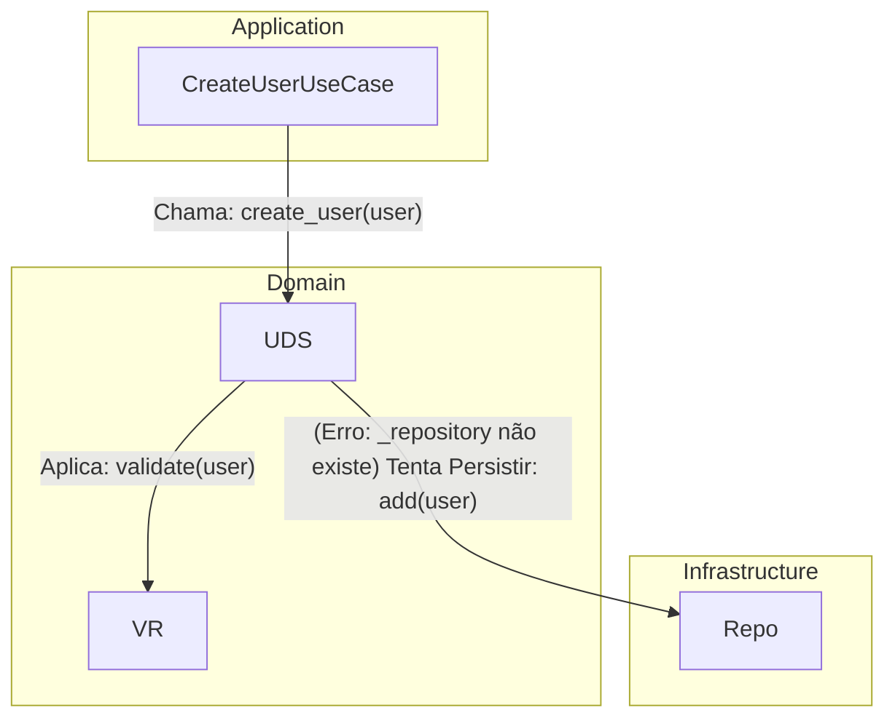
    
- **Figura 08 - Diagrama de Classe (Antes):**
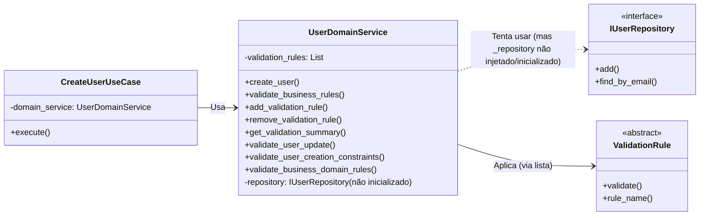
    
- **Figura 09 - Diagrama de Sequência (Antes):**
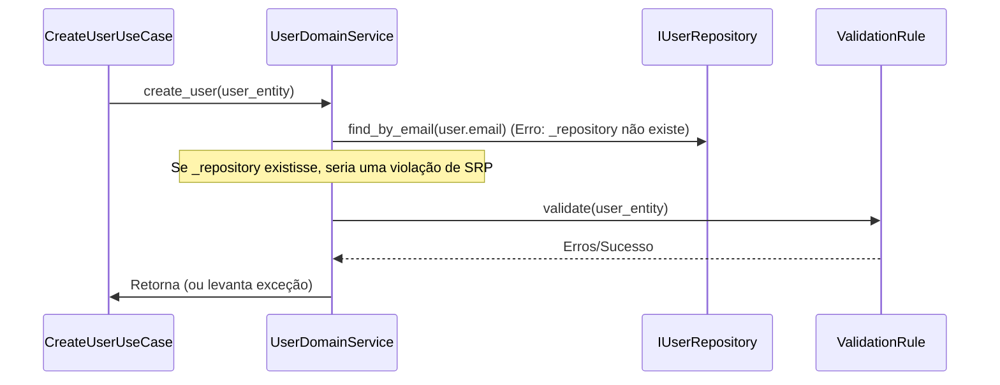
    
- Trechos de código (Antes):
    
    src/dev_platform/domain/user/services.py:
    
    Python
    
```python
#...
class UserDomainService:
	"""
	Service for complex user domain validations and business rules.
	Recebe explicitamente as regras de validação a serem aplicadas.
	"""
	def __init__(self, validation_rules: List): # Causa Raiz: Não recebe IUserRepository
		self._validation_rules = validation_rules
		# self._repository = user_repository # <--- Faltando esta linha se o método create_user for usado

	async def create_user(self, user: User) -> User:
		"""
		Creates a new user, ensuring all domain rules, including
		uniqueness, are met.
		"""
		# 1. Verifica unicidade
		existing = await self._repository.find_by_email(user.email.value) # Causa Raiz: _repository não existe
		if existing:
			raise UserAlreadyExistsException(user.email.value)
		# 2. Valida outras regras
		await self.validate_business_rules(user)
		# 3. Persiste
		saved_user = await self._repository.add(user) # Causa Raiz: Lógica de persistência no Domain Service
		return saved_user
```
    
    `src/dev_platform/infrastructure/composition_root.py`:
    
    Python
    
```python
	#...
	def create_user_use_case(self, uow: SQLUnitOfWork, user_repository: IUserRepository) -> CreateUserUseCase:
		return CreateUserUseCase(
			uow=uow,
			domain_service=self.user_domain_service(user_repository), # Causa Raiz: user_repository é passado para user_domain_service
			logger=self._logger,
		)
	def user_domain_service(self, user_repository: IUserRepository, user_type: str = "default") -> UserDomainService:
		"""
		Cria UserDomainService com regras de validação baseadas em configuração e tipo de usuário.
		"""
		rules = self._validation_rule_provider.get_rules(user_type)
		return UserDomainService(user_repository, rules) # Causa Raiz: UserDomainService.__init__ não aceita user_repository
```
    

Proposta para Implementação da Solução (Depois):

A solução proposta é mover a responsabilidade de orquestrar a persistência para o CreateUserUseCase. O UserDomainService deve ser refatorado para focar exclusivamente em regras de negócio e validações de domínio, sem qualquer conhecimento direto ou dependência de repositórios para operações de persistência. Consequentemente, o método create_user deve ser removido do UserDomainService. A validação de unicidade, que é uma regra de negócio que depende da consulta ao repositório, pode ser encapsulada em um UserUniquenessService separado, que é um serviço de domínio que recebe o IUserRepository para realizar sua função específica.

- **Figura 10 - Fluxograma (Depois):**
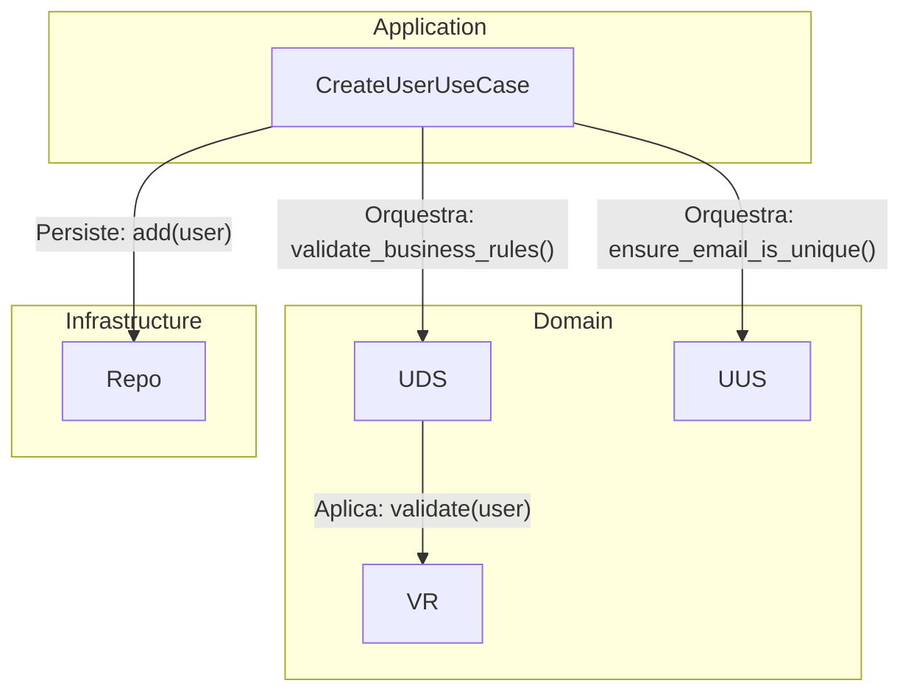


- **Figura 11 - Diagrama de Classe (Depois):**
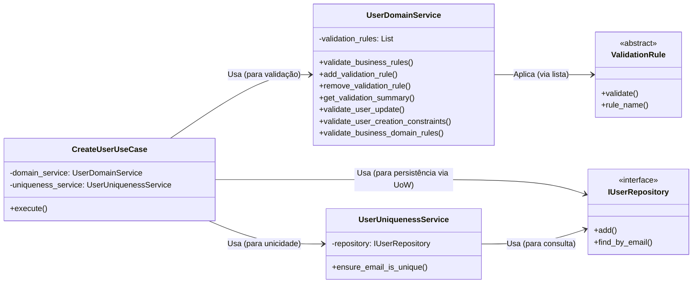


- **Figura 12 - Diagrama de Sequência (Depois):**
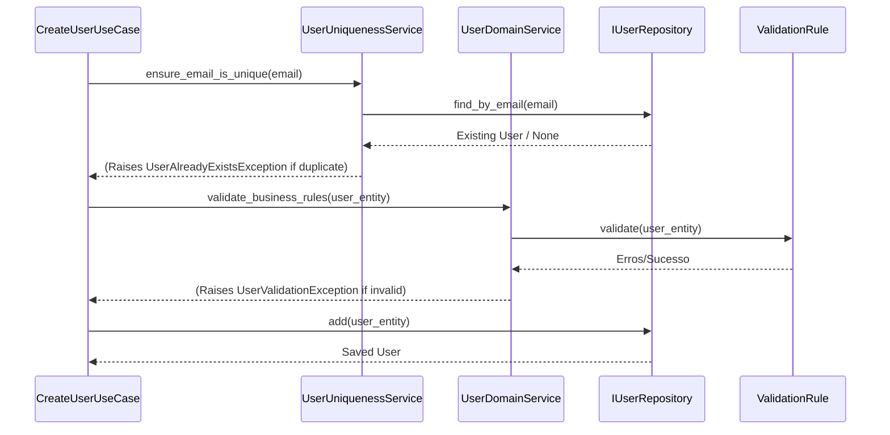
    
- Trechos de código (Depois):
    
    src/dev_platform/domain/user/services.py (Proposta de alteração):
    
    Python
    
```python
#...
# UserDomainService seria renomeado ou refatorado para UserValidatorService
class UserUniquenessService: # Serviço de domínio para unicidade
	def __init__(self, user_repository: IUserRepository):
		self._repository = user_repository

	async def ensure_email_is_unique(
		self, email: str, exclude_user_id: Optional[int] = None
	) -> None:
		existing_user = await self._repository.find_by_email(email)
		if existing_user and (
			exclude_user_id is None or existing_user.id!= exclude_user_id
		):
			raise UserAlreadyExistsException(email)

class UserDomainService: # Serviço de domínio focado em regras de negócio e validações
	def __init__(self, validation_rules: List):
		self._validation_rules = validation_rules
		# Removido self._repository e o método create_user

	async def validate_business_rules(self, user: User) -> None:
		"""
		Valida todas as regras de negócio para um usuário.
		Levanta UserValidationException se alguma regra falhar.
		"""
		validation_errors = {}
		for rule in self._validation_rules:
			error_message = await rule.validate(user)
			if error_message:
				validation_errors[rule.rule_name] = error_message
		if validation_errors:
			raise UserValidationException(validation_errors)

	#... (outros métodos de validação existentes, mas sem persistência)
```
    
    `src/dev_platform/application/user/use_cases.py` (Proposta de alteração):
    
    Python
    
```python
#...
from dev_platform.domain.user.services import UserDomainService, UserUniquenessService # Importa UserUniquenessService
#...
class CreateUserUseCase(BaseUseCase):
	def __init__(
		self,
		uow: UnitOfWork,
		logger: ILogger,
		domain_service: UserDomainService,
		user_uniqueness_service: UserUniquenessService, # Nova dependência
	):
		super().__init__(uow, logger)
		self._domain_service = domain_service
		self._user_uniqueness_service = user_uniqueness_service # Atribui a nova dependência

	async def execute(self, dto: UserCreateDTO) -> UserDTO:
		async with self._uow:
			self._logger.info("Starting user creation", name=dto.name, email=dto.email)
			try:
				# 1. Orquestração: Verificar unicidade primeiro (agora via serviço dedicado)
				await self._user_uniqueness_service.ensure_email_is_unique(dto.email)

				# 2. Criar a entidade de domínio
				user_to_create = User.create(name=dto.name, email=dto.email)

				# 3. Chamar o serviço de domínio apenas para validação de regras de negócio
				await self._domain_service.validate_business_rules(user_to_create)

				# 4. Persistir a entidade (responsabilidade do Use Case)
				saved_user = await self._uow.user_repository.add(user_to_create)
				await self._uow.commit()
				self._logger.info(
					"User created successfully",
					user_id=saved_user.id,
					name=saved_user.name.value if hasattr(saved_user.name, "value") else saved_user.name,
					email=saved_user.email.value if hasattr(saved_user.email, "value") else saved_user.email,
				)
				return user_to_dto(saved_user)
			except UserAlreadyExistsException as e:
				await self._uow.rollback()
				self._logger.warning(
					"Validação de domínio tentou criar usuário duplicado", email=dto.email
				)
				raise
			except UserValidationException as e: # Captura exceção específica de validação
				await self._uow.rollback()
				self._logger.warning(
					"Validação de regras de negócio falhou", validation_errors=e.validation_errors
				)
				raise
			except Exception as e:
				await self._uow.rollback()
				self._logger.error(
					"Erro durante a criação do usuário",
					error=str(e),
				)
				raise
```
    
    `src/dev_platform/infrastructure/composition_root.py` (Proposta de alteração):
    
    Python
    
```python
#...
from dev_platform.domain.user.services import UserDomainService, UserAnalyticsService, UserUniquenessService # Importa UserUniquenessService
#...
class CompositionRoot:
	#...
	def create_user_use_case(self, uow: UnitOfWork, user_repository: IUserRepository) -> CreateUserUseCase:
		# user_repository é necessário para UserUniquenessService
		return CreateUserUseCase(
			uow=uow,
			domain_service=self.user_domain_service(), # Não precisa de user_repository aqui
			user_uniqueness_service=self.user_uniqueness_service(user_repository), # Injeta UserUniquenessService
			logger=self._logger,
		)

	def user_domain_service(self, user_type: str = "default") -> UserDomainService:
		"""
		Cria UserDomainService com regras de validação baseadas em configuração e tipo de usuário.
		"""
		rules = self._validation_rule_provider.get_rules(user_type)
		return UserDomainService(validation_rules=rules) # Não passa repositório

	def user_uniqueness_service(self, user_repository: IUserRepository) -> UserUniquenessService:
		"""
		Cria UserUniquenessService, que depende do repositório.
		"""
		return UserUniquenessService(user_repository)
```
    

**Discussão das Vantagens e Desvantagens:**

- **Vantagens:**
    
    - **Adesão ao SRP:** O `UserDomainService` se torna puramente responsável pela lógica de domínio e validações de negócio, sem se preocupar com persistência. Isso significa que a classe só precisa ser modificada se as regras de validação mudarem, não se a forma de persistência ou a orquestração mudarem.
        
    - **Clareza Arquitetural:** Reforça a distinção entre a camada de Domínio (que contém as regras de negócio essenciais e agnósticas à infraestrutura) e a camada de Aplicação (que orquestra o fluxo de dados, incluindo interações com repositórios e serviços de domínio). Isso torna a arquitetura mais fácil de entender e manter.
        
    - **Maior Testabilidade do Domínio:** O `UserDomainService` pode ser testado isoladamente, sem a necessidade de um banco de dados real ou mocks de repositório, pois ele não interage diretamente com a persistência. Isso resulta em testes de unidade mais rápidos e confiáveis para a lógica de negócio.
        
    - **Manutenibilidade:** Mudanças na estratégia de persistência (por exemplo, trocar o tipo de banco de dados) não afetam o domínio, e mudanças nas regras de domínio não precisam considerar como os dados são armazenados. Isso reduz o acoplamento e simplifica a manutenção.
        
    - **Reutilização:** A lógica de domínio (o `UserDomainService` e as `ValidationRule`s) pode ser reutilizada em diferentes contextos de aplicação (por exemplo, uma API REST, um serviço de mensageria) sem estar acoplada a um mecanismo de persistência específico.
        
- **Desvantagens:**
    
    - **Aumento de Orquestração no Use Case:** O `CreateUserUseCase` se torna ligeiramente mais complexo, pois agora ele é explicitamente responsável pela orquestração da validação de unicidade (via `UserUniquenessService`), das validações de negócio (via `UserDomainService`) e da persistência (via `UnitOfWork`). No entanto, essa é a responsabilidade correta para um caso de uso, que atua como um coordenador.
        
    - **Refatoração Necessária:** A implementação desta solução requer a remoção do método `create_user` do `UserDomainService` e a adaptação do `CreateUserUseCase` e do `CompositionRoot` para refletir as novas responsabilidades e injeções de dependência.
        

**Impactos da Alteração:**

- **Impactos em outras partes do Código:**
    
    - `UserDomainService`:
        
        O método `create_user` será removido, e o construtor não aceitará mais `user_repository`. A classe se concentrará apenas em `validate_business_rules` e métodos relacionados a regras de validação puras.
        
    - `CreateUserUseCase`:
        
        Esta classe se tornará o principal orquestrador para a criação de usuários. Ela chamará o `UserUniquenessService` para verificar a unicidade, o `UserDomainService` para aplicar as validações de negócio, e `self._uow.user_repository` para a persistência. Seu construtor precisará de uma nova dependência: uma instância de `UserUniquenessService`.
        
    - `CompositionRoot`:
        
        Esta classe precisará ser atualizada para criar e injetar a nova instância de `UserUniquenessService` nos casos de uso que a necessitem. Além disso, o método `user_domain_service` não passará mais o repositório, garantindo que o serviço de domínio seja agnóstico à persistência.
        
    - **Testes:** Os testes para `UserDomainService` se tornarão mais simples, focando apenas na lógica de validação de regras de negócio. Os testes para `CreateUserUseCase` precisarão mockar tanto o `UserUniquenessService` quanto o `UserDomainService`, além do `UnitOfWork`.
        
- **Impactos Esperados no Projeto como um todo:**
    
    - **Arquitetura:** Haverá um alinhamento mais forte com a Clean Architecture e os princípios do DDD, promovendo uma separação de responsabilidades mais clara e explícita entre as camadas de Domínio e Aplicação.
        
    - **Manutenibilidade:** O código se tornará mais fácil de entender e modificar, pois cada componente terá uma responsabilidade bem definida e menos acoplamento.
        
    - **Testabilidade:** A capacidade de testar unidades de código isoladamente será significativamente aprimorada, levando a um código mais robusto e confiável.
        
    - **Flexibilidade:** A lógica de domínio, agora desacoplada da persistência, poderá ser mais facilmente reutilizada em diferentes contextos ou adaptada a novas necessidades de negócio sem impactar a infraestrutura.
        

##### Ponto de Melhoria CA: Acoplamento da Infraestrutura de Logging e Configuração

Descrição Detalhada do Problema:

A classe StructuredLogger, que é a implementação concreta da interface `ILogger`, e, por extensão, o `SQLUserRepository`, instanciam diretamente a `ConfigurationFacade` em seus construtores. Por exemplo, `StructuredLogger(CONFIG__=ConfigurationFacade())` e `SQLUserRepository(session, logger=StructuredLogger(CONFIG__=ConfigurationFacade()))`. Essa prática estabelece um acoplamento direto entre os componentes de infraestrutura (logging e repositório) e o sistema de configuração. Isso viola o Princípio da Inversão de Dependência (DIP) e compromete a testabilidade e a flexibilidade do sistema.

Descrição da Causa Raiz (Antes):

A causa raiz é a quebra do Princípio da Inversão de Dependência (DIP) e, em certa medida, do Princípio da Responsabilidade Única (SRP). O StructuredLogger não deveria ter a responsabilidade de obter suas próprias configurações de ambiente. Essa configuração deveria ser injetada nele. Ao instanciar ConfigurationFacade internamente, o StructuredLogger se acopla a uma implementação concreta de configuração. Além disso, se a ConfigurationFacade não for um singleton gerenciado explicitamente (o que ela tenta ser, mas com um _reset_singleton para testes que pode introduzir inconsistências se mal utilizado), cada nova instância de StructuredLogger ou SQLUserRepository poderia criar sua própria instância de ConfigurationFacade, potencialmente levando a estados de configuração inconsistentes ou a um overhead desnecessário. O SQLUserRepository também viola o DIP ao instanciar StructuredLogger diretamente, em vez de depender da interface ILogger que já recebe em seu construtor.

- **Figura 13 - Fluxograma (Antes):**
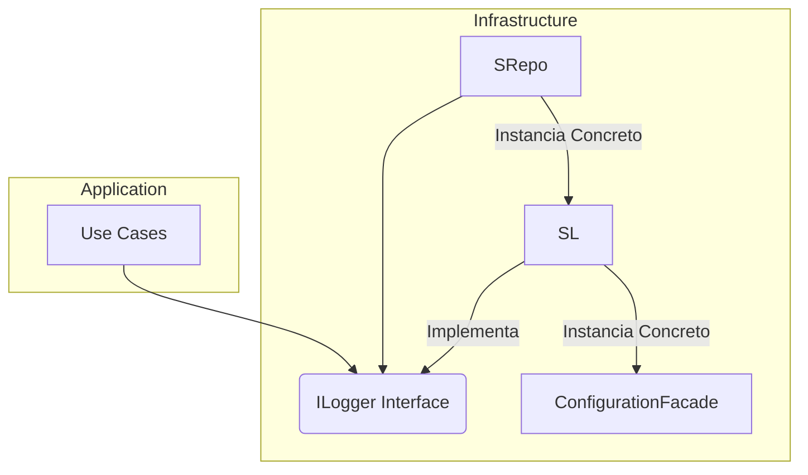


- **Figura 14 - Diagrama de Classe (Antes):**
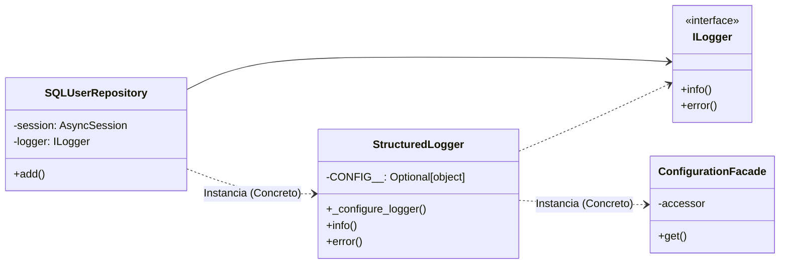


- **Figura 15 - Diagrama de Sequência (Antes):**
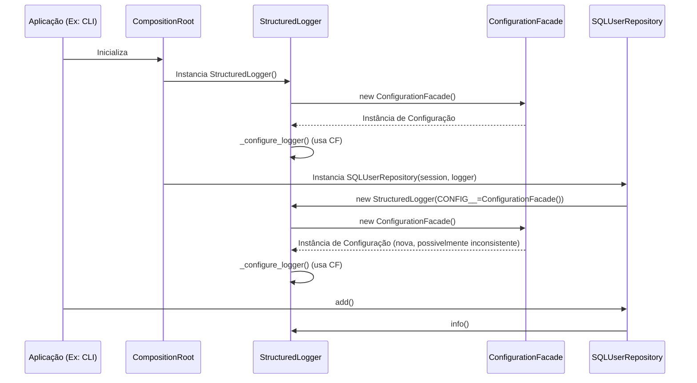
    
- Trechos de código (Antes):
    
    src/dev_platform/infrastructure/logging/structured_logger.py:
    
    Python
    
```python
#...
# from dev_platform.infrastructure.config import CONFIG # Comentado, mas a lógica de instanciar ConfigurationFacade é similar
from dev_platform.infrastructure.config import ConfigurationFacade # Importado
#...
class StructuredLogger(ILogger):
	def __init__(self, name: str = "DEV Platform", CONFIG__: Optional[object] = None):
		self._name = name
		self._CONFIG__ = CONFIG__ or {} # Causa Raiz: Se CONFIG__ não for passado, usa um dict vazio
		self._configure_logger()

	def _configure_logger(self):
		#...
		# Obter nível de log com base no ambiente
		environment = self._CONFIG__.get("environment", "production") # Causa Raiz: Usa _CONFIG__ que pode ser vazio
		log_level = self._CONFIG__.get("logging_level", "INFO").upper() # Causa Raiz: Usa _CONFIG__ que pode ser vazio
		#...
```
    
    `src/dev_platform/infrastructure/database/repositories.py`:
    
    Python
    
```python
#...
from dev_platform.infrastructure.config import ConfigurationFacade
from dev_platform.infrastructure.logging.structured_logger import StructuredLogger
#...
class SQLUserRepository(IUserRepository):
	def __init__(self, session: AsyncSession, logger: Optional[ILogger]):
		self._session = session
		self._logger: ILogger = logger or StructuredLogger(CONFIG__=ConfigurationFacade()) # Causa Raiz: Instanciação concreta de StructuredLogger com ConfigurationFacade
```
    

Proposta para Implementação da Solução (Depois):

A ConfigurationFacade e o ILogger devem ser injetados nos componentes que os utilizam, em vez de serem instanciados internamente. A CompositionRoot deve ser o ponto central responsável por instanciar a `ConfigurationFacade` uma única vez e, em seguida, injetá-la no `StructuredLogger`. Da mesma forma, o `StructuredLogger` (como uma implementação de `ILogger`) deve ser injetado no `SQLUserRepository` e em qualquer outro componente que precise de serviços de log. Isso garante que todos os componentes usem a mesma instância de configuração e logger, gerenciada centralmente.

![[Note Narration Audio\note_-_24_de_jun._de_2025_02-02.mp3]]


- **Figura 16 - Fluxograma (Depois):**
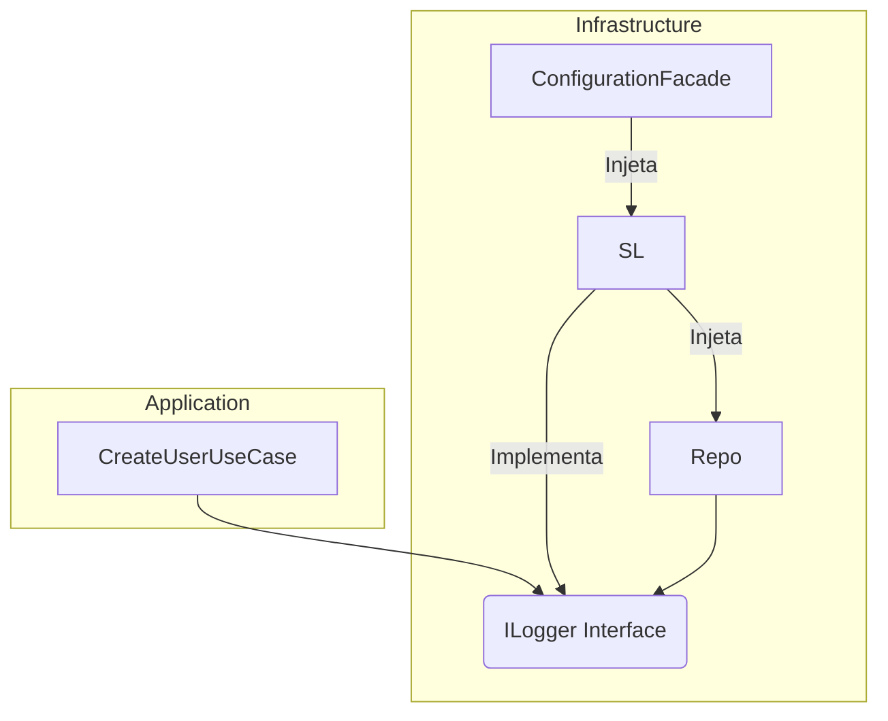


- **Figura 17 - iagrama de Classe (Depois):**

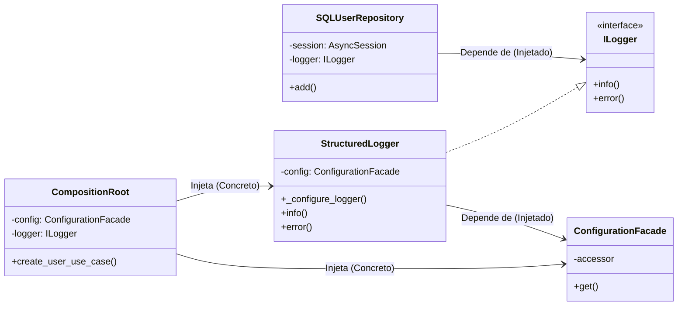


- **Figura 18 - Diagrama de Sequência (Depois):**
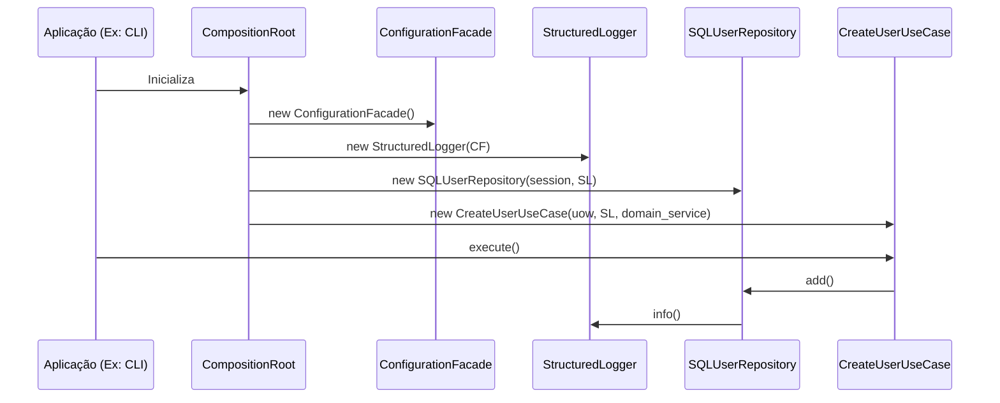
    
- Trechos de código (Depois):
    
    src/dev_platform/infrastructure/logging/structured_logger.py (Proposta de alteração):
    
    Python
    
```python
#...
from dev_platform.infrastructure.config import ConfigurationFacade # Importa
#...
class StructuredLogger(ILogger):
	def __init__(self, name: str = "DEV Platform", config: Optional[ConfigurationFacade] = None): # Recebe ConfigurationFacade
		self._name = name
		self._config = config # Atribui a configuração injetada
		self._configure_logger()

	def _configure_logger(self):
		# Obter nível de log com base no ambiente
		# Usa a configuração injetada
		environment = self._config.get("environment", "production") if self._config else "production"
		log_level = self._config.get("logging_level", "INFO").upper() if self._config else "INFO"
		#...
```
    
    `src/dev_platform/infrastructure/database/repositories.py` (Proposta de alteração):
    
    Python
    
```python
#...
from dev_platform.application.ports.logger import ILogger # Importa a interface
#...
class SQLUserRepository(IUserRepository):
	def __init__(self, session: AsyncSession, logger: ILogger): # Recebe ILogger
		self._session = session
		self._logger: ILogger = logger # Atribui o logger injetado
```
    
    `src/dev_platform/infrastructure/composition_root.py` (Proposta de alteração):
    
    Python
    
```python
#...
from dev_platform.infrastructure.logging.structured_logger import StructuredLogger
from dev_platform.infrastructure.config import ConfigurationFacade
#...
class CompositionRoot:
	def __init__(
		self,
		config: ConfigurationFacade, # Configuração injetada
		logger: Optional[ILogger] = None, # Logger injetado
	):
		self._config = config
		self._logger = logger or StructuredLogger(config=self._config) # Passa a config para o logger padrão
		#...
	def create_user_use_case(self, uow: UnitOfWork, user_repository: IUserRepository) -> CreateUserUseCase:
		return CreateUserUseCase(
			uow=uow,
			domain_service=self.user_domain_service(),
			user_uniqueness_service=self.user_uniqueness_service(user_repository),
			logger=self._logger, # Passa o logger injetado
		)
	#...
```
    

**Discussão das Vantagens e Desvantagens:**

- **Vantagens:**
    
    - **Adesão ao DIP:** Componentes de infraestrutura, como o logger e o repositório, passarão a depender de abstrações (`ILogger` e uma `ConfigurationFacade` injetada) em vez de implementações concretas. Isso promove um baixo acoplamento, tornando o sistema mais flexível e fácil de modificar.
        
    - **Maior Testabilidade:** A injeção de dependências facilita a criação de mocks ou stubs para o logger e a configuração em testes de unidade para `StructuredLogger` e `SQLUserRepository`. Isso permite testar a lógica de negócios e os componentes de infraestrutura de forma isolada, resultando em testes mais rápidos e confiáveis.
        
    - **Flexibilidade:** Esta abordagem facilita a troca da implementação de logging (por exemplo, de Loguru para um sistema de agregação de logs como ELK stack) ou do sistema de configuração sem a necessidade de alterar o código do repositório ou de outros componentes que utilizam o logger.
        
    - **Consistência de Configuração:** Garante que todos os componentes da aplicação utilizem a mesma instância de `ConfigurationFacade` gerenciada centralmente. Isso elimina o risco de estados de configuração inconsistentes que poderiam surgir se cada componente instanciasse sua própria fachada de configuração.
        
- **Desvantagens:**
    
    - **Aumento de Parâmetros no Construtor:** A injeção de dependências pode levar a construtores com um número maior de parâmetros, especialmente em classes que dependem de muitos serviços. No entanto, isso é um trade-off aceitável e pode ser gerenciado de forma eficaz com um `CompositionRoot` bem projetado.
        
    - **Refatoração Abrangente:** A implementação desta melhoria requer modificações em vários locais do código onde `StructuredLogger` ou `ConfigurationFacade` são instanciados ou utilizados implicitamente. Isso pode ser um esforço inicial significativo, mas os benefícios a longo prazo justificam o investimento.
        

**Impactos da Alteração:**

- **Impactos em outras partes do Código:**
    
    - `StructuredLogger`:
        
        O construtor desta classe será alterado para receber uma instância de `ConfigurationFacade`, que será utilizada para configurar o nível de log e outros aspectos.
        
    - `SQLUserRepository`:
        
        Embora o construtor já aceite um `ILogger`, a forma como esse logger é instanciado por padrão (com `StructuredLogger(CONFIG__=ConfigurationFacade())`) será removida, e o `ILogger` será sempre injetado.
        
    - `CompositionRoot`:
        
        Esta classe se tornará o ponto central para instanciar a `ConfigurationFacade` e o `StructuredLogger` (ou qualquer outra implementação de `ILogger`) e injetá-los em todos os componentes que os utilizam. Isso reforça seu papel como a "raiz de composição" da aplicação.
        
    - `user_commands.py`:
        
        A função `get_dependencies` precisará ser ajustada para criar e passar as instâncias corretas de `ConfigurationFacade` e `ILogger` para o `CompositionRoot`.
        
- **Impactos Esperados no Projeto como um todo:**
    
    - **Arquitetura:** Haverá um fortalecimento significativo da Clean Architecture, com dependências mais claras, controladas e explícitas. Isso contribuirá para um design mais limpo e modular.
        
    - **Manutenibilidade:** O código se tornará mais fácil de entender e modificar devido ao baixo acoplamento entre os componentes, reduzindo a complexidade e o risco de introduzir novos defeitos.
        
    - **Testabilidade:** A capacidade de testar componentes isoladamente será drasticamente melhorada, permitindo a criação de uma suíte de testes mais abrangente e eficaz.
        
    - **Confiabilidade:** A garantia de que todos os componentes operam com uma configuração consistente e um logger centralizado aumentará a confiabilidade geral do sistema e facilitará a depuração de problemas.
        

#### 2.2. Aplicação de Domain-Driven Design (DDD)

O projeto demonstra um entendimento inicial e a aplicação de alguns blocos de construção fundamentais do Domain-Driven Design, notadamente a presença de Entidades (`User`) e Value Objects (`Email`, `UserName`) bem definidos. No entanto, existem oportunidades claras para refinar a aplicação de Serviços de Domínio e a orquestração da lógica de domínio, garantindo que as responsabilidades estejam alinhadas com os princípios do DDD.

##### Ponto de Melhoria DDD: Responsabilidade Mista e Bug no `UserDomainService`

Descrição Detalhada do Problema:

Conforme já abordado em CA, o UserDomainService exibe uma responsabilidade mista ao tentar realizar operações de persistência, como `_repository.add(user)` e `_repository.find_by_email(user.email.value)`, dentro de seu método `create_user`. No contexto do Domain-Driven Design, os Serviços de Domínio devem encapsular lógica de negócio que não pertence diretamente a uma Entidade ou Value Object, mas que coordena operações entre eles. Eles não devem, contudo, ser responsáveis pela persistência dos dados. Além disso, uma inconsistência crítica presente no código é que o construtor do `UserDomainService` em `services.py` não aceita uma instância de repositório, mas o `CompositionRoot` tenta passá-lo, o que resultaria em um erro em tempo de execução (`AttributeError` ou similar) se o método `create_user` fosse invocado.

Descrição da Causa Raiz (Antes):

A causa raiz desta questão é uma sobrecarga de responsabilidades no UserDomainService, o que viola tanto o Princípio da Responsabilidade Única (SRP) quanto a clara separação de camadas preconizada pelo DDD. No DDD, um Serviço de Domínio deve focar em operações que envolvem múltiplos objetos de domínio ou que representam um comportamento significativo do domínio que não se encaixa naturalmente em uma única Entidade. A persistência, por outro lado, é uma preocupação técnica e deve ser delegada a Repositórios, que pertencem à camada de Infraestrutura. A inconsistência na injeção de dependência, onde o CompositionRoot tenta injetar uma dependência de repositório que o UserDomainService não está preparado para receber, é um erro de implementação que impede o funcionamento correto e mascara a violação de design. Isso indica uma falta de alinhamento entre o design pretendido e a implementação real.

- **Figura 19 - Fluxograma (Antes):** (Idêntico ao CA Antes)


- **Figura 20 - Diagrama de Classe (Antes):** (Idêntico ao CA Antes)


- **Figura 21 - Diagrama de Sequência (Antes):** (Idêntico ao CA Antes)
```mermaid
sequenceDiagram
	participant UCU as CreateUserUseCase
	participant UDS as UserDomainService
	participant Repo as IUserRepository
	participant VR as ValidationRule

	UCU->>UDS: create_user(user_entity)
	UDS->>Repo: find_by_email(user.email) (Erro: _repository não existe)
	Note over UDS: Se _repository existisse, seria uma violação de SRP
	UDS->>VR: validate(user_entity)
	VR-->>UDS: Erros/Sucesso
	UDS->>UCU: Retorna (ou levanta exceção)
```
    
- Trechos de código (Antes): (Idêntico ao CA Antes)
    
    src/dev_platform/domain/user/services.py:
    
    Python
    
```python
#...
class UserDomainService:
	#...
	def __init__(self, validation_rules: List): # Causa Raiz: Não recebe IUserRepository
		self._validation_rules = validation_rules
		# self._repository = user_repository # <--- Faltando esta linha se o método create_user for usado

	async def create_user(self, user: User) -> User:
		#...
		existing = await self._repository.find_by_email(user.email.value) # Causa Raiz: _repository não existe
		#...
		saved_user = await self._repository.add(user) # Causa Raiz: Lógica de persistência no Domain Service
		return saved_user
```
    
    `src/dev_platform/infrastructure/composition_root.py`:
    
    Python
    
```python
	#...
	def create_user_use_case(self, uow: SQLUnitOfWork, user_repository: IUserRepository) -> CreateUserUseCase:
		return CreateUserUseCase(
			uow=uow,
			domain_service=self.user_domain_service(user_repository), # Causa Raiz: user_repository é passado para user_domain_service
			logger=self._logger,
		)
	def user_domain_service(self, user_repository: IUserRepository, user_type: str = "default") -> UserDomainService:
		#...
		return UserDomainService(user_repository, rules) # Causa Raiz: UserDomainService.__init__ não aceita user_repository
```
    

Proposta para Implementação da Solução (Depois):

A solução é idêntica àquela proposta em CA, pois o problema fundamental é o mesmo: a responsabilidade de orquestrar a persistência deve ser removida do UserDomainService e transferida para a camada de aplicação, especificamente para o CreateUserUseCase. O UserDomainService deve ser puramente agnóstico à persistência, focando apenas em regras de negócio e validações de domínio. O método create_user deve ser removido do UserDomainService. A validação de unicidade, que é uma regra de negócio que depende da consulta ao repositório, deve ser encapsulada em um UserUniquenessService separado, que é um serviço de domínio que recebe o IUserRepository para realizar sua função específica.

- **Figura 22 - Fluxograma (Depois):** (Idêntico ao CA Depois)
```mermaid
graph TD
    subgraph Application
        UC[CreateUserUseCase]
    end
    subgraph Domain
        UDS
        VR
        UUS
    end
    subgraph Infrastructure
        Repo
    end

    UC -- Orquestra: ensure_email_is_unique() --> UUS
    UC -- Orquestra: validate_business_rules() --> UDS
    UDS -- Aplica: validate(user) --> VR
    UC -- Persiste: add(user) --> Repo
```


- **Figura 23 - Diagrama de Classe (Depois):** (Idêntico ao CA Depois)
```mermaid
classDiagram
	direction LR
	class CreateUserUseCase {
		-domain_service: UserDomainService
		-uniqueness_service: UserUniquenessService
		+execute()
	}
	class UserDomainService {
		-validation_rules: List<ValidationRule>
		+validate_business_rules()
		+add_validation_rule()
		+remove_validation_rule()
		+get_validation_summary()
		+validate_user_update()
		+validate_user_creation_constraints()
		+validate_business_domain_rules()
	}
	class UserUniquenessService {
		-repository: IUserRepository
		+ensure_email_is_unique()
	}
	class IUserRepository {
		<<interface>>
		+add()
		+find_by_email()
	}
	class ValidationRule {
		<<abstract>>
		+validate()
		+rule_name()
	}

	CreateUserUseCase --> UserDomainService : Usa (para validação)
	CreateUserUseCase --> UserUniquenessService : Usa (para unicidade)
	CreateUserUseCase --> IUserRepository : Usa (para persistência via UoW)
	UserUniquenessService --> IUserRepository : Usa (para consulta)
	UserDomainService --> ValidationRule : Aplica (via lista)
```


- **Figura 24 - Diagrama de Sequência (Depois):** (Idêntico ao CA Depois)
```mermaid
sequenceDiagram
	participant UCU as CreateUserUseCase
	participant UUS as UserUniquenessService
	participant UDS as UserDomainService
	participant Repo as IUserRepository
	participant VR as ValidationRule

	UCU->>UUS: ensure_email_is_unique(email)
	UUS->>Repo: find_by_email(email)
	Repo-->>UUS: Existing User / None
	UUS-->>UCU: (Raises UserAlreadyExistsException if duplicate)
	UCU->>UDS: validate_business_rules(user_entity)
	UDS->>VR: validate(user_entity)
	VR-->>UDS: Erros/Sucesso
	UDS-->>UCU: (Raises UserValidationException if invalid)
	UCU->>Repo: add(user_entity)
	Repo-->>UCU: Saved User
```
    
- Trechos de código (Depois): (Idêntico ao CA Depois)
    
    src/dev_platform/domain/user/services.py (Proposta de alteração):
    
    Python
    
```python
#...
# UserDomainService seria renomeado ou refatorado para UserValidatorService
class UserUniquenessService: # Serviço de domínio para unicidade
	def __init__(self, user_repository: IUserRepository):
		self._repository = user_repository

	async def ensure_email_is_unique(
		self, email: str, exclude_user_id: Optional[int] = None
	) -> None:
		existing_user = await self._repository.find_by_email(email)
		if existing_user and (
			exclude_user_id is None or existing_user.id!= exclude_user_id
		):
			raise UserAlreadyExistsException(email)

class UserDomainService: # Serviço de domínio focado em regras de negócio e validações
	def __init__(self, validation_rules: List):
		self._validation_rules = validation_rules
		# Removido self._repository e o método create_user

	async def validate_business_rules(self, user: User) -> None:
		"""
		Valida todas as regras de negócio para um usuário.
		Levanta UserValidationException se alguma regra falhar.
		"""
		validation_errors = {}
		for rule in self._validation_rules:
			error_message = await rule.validate(user)
			if error_message:
				validation_errors[rule.rule_name] = error_message
		if validation_errors:
			raise UserValidationException(validation_errors)

	#... (outros métodos de validação existentes, mas sem persistência)
```
    
    `src/dev_platform/application/user/use_cases.py` (Proposta de alteração):
    
    Python
    
```python
#...
from dev_platform.domain.user.services import UserDomainService, UserUniquenessService
#...
class CreateUserUseCase(BaseUseCase):
	def __init__(
		self,
		uow: UnitOfWork,
		logger: ILogger,
		domain_service: UserDomainService,
		user_uniqueness_service: UserUniquenessService,
	):
		super().__init__(uow, logger)
		self._domain_service = domain_service
		self._user_uniqueness_service = user_uniqueness_service

	async def execute(self, dto: UserCreateDTO) -> UserDTO:
		async with self._uow:
			#...
			try:
				await self._user_uniqueness_service.ensure_email_is_unique(dto.email)
				user_to_create = User.create(name=dto.name, email=dto.email)
				await self._domain_service.validate_business_rules(user_to_create)
				saved_user = await self._uow.user_repository.add(user_to_create)
				await self._uow.commit()
				#...
			#...
```
    
    `src/dev_platform/infrastructure/composition_root.py` (Proposta de alteração):
    
    Python
    
```python
#...
from dev_platform.domain.user.services import UserDomainService, UserAnalyticsService, UserUniquenessService
#...
class CompositionRoot:
	#...
	def create_user_use_case(self, uow: UnitOfWork, user_repository: IUserRepository) -> CreateUserUseCase:
		return CreateUserUseCase(
			uow=uow,
			domain_service=self.user_domain_service(),
			user_uniqueness_service=self.user_uniqueness_service(user_repository),
			logger=self._logger,
		)
	def user_domain_service(self, user_type: str = "default") -> UserDomainService:
		rules = self._validation_rule_provider.get_rules(user_type)
		return UserDomainService(validation_rules=rules)
	def user_uniqueness_service(self, user_repository: IUserRepository) -> UserUniquenessService:
		return UserUniquenessService(user_repository)
```
    

**Discussão das Vantagens e Desvantagens:**

- **Vantagens:**
    
    - **Adesão ao SRP:** O `UserDomainService` se torna puramente responsável pela lógica de domínio e validações de negócio, sem se preocupar com persistência. Isso significa que a classe só precisa ser modificada se as regras de validação mudarem, não se a forma de persistência ou a orquestração mudarem.
        
    - **Clareza Arquitetural:** Reforça a distinção entre a camada de Domínio (que contém as regras de negócio essenciais e agnósticas à infraestrutura) e a camada de Aplicação (que orquestra o fluxo de dados, incluindo interações com repositórios e serviços de domínio). Isso torna a arquitetura mais fácil de entender e manter.
        
    - **Maior Testabilidade do Domínio:** O `UserDomainService` pode ser testado isoladamente, sem a necessidade de um banco de dados real ou mocks de repositório, pois ele não interage diretamente com a persistência. Isso resulta em testes de unidade mais rápidos e confiáveis para a lógica de negócio.
        
    - **Manutenibilidade:** Mudanças na estratégia de persistência (por exemplo, trocar o tipo de banco de dados) não afetam o domínio, e mudanças nas regras de domínio não precisam considerar como os dados são armazenados. Isso reduz o acoplamento e simplifica a manutenção.
        
    - **Reutilização:** A lógica de domínio (o `UserDomainService` e as `ValidationRule`s) pode ser reutilizada em diferentes contextos de aplicação (por exemplo, uma API REST, um serviço de mensageria) sem estar acoplada a um mecanismo de persistência específico.
        
- **Desvantagens:**
    
    - **Aumento de Orquestração no Use Case:** O `CreateUserUseCase` se torna ligeiramente mais complexo, pois agora ele é explicitamente responsável pela orquestração da validação de unicidade (via `UserUniquenessService`), das validações de negócio (via `UserDomainService`) e da persistência (via `UnitOfWork`). No entanto, essa é a responsabilidade correta para um caso de uso, que atua como um coordenador.
        
    - **Refatoração Necessária:** A implementação desta solução requer a remoção do método `create_user` do `UserDomainService` e a adaptação do `CreateUserUseCase` e do `CompositionRoot` para refletir as novas responsabilidades e injeções de dependência.
        

**Impactos da Alteração:**

- **Impactos em outras partes do Código:**
    
    - `UserDomainService`:
        
        O método `create_user` será removido, e o construtor não aceitará mais `user_repository`. A classe se concentrará apenas em `validate_business_rules` e métodos relacionados a regras de validação puras.
        
    - `CreateUserUseCase`:
        
        Esta classe se tornará o principal orquestrador para a criação de usuários. Ela chamará o `UserUniquenessService` para verificar a unicidade, o `UserDomainService` para aplicar as validações de negócio, e `self._uow.user_repository` para a persistência. Seu construtor precisará de uma nova dependência: uma instância de `UserUniquenessService`.
        
    - `CompositionRoot`:
        
        Esta classe precisará ser atualizada para criar e injetar a nova instância de `UserUniquenessService` nos casos de uso que a necessitem. Além disso, o método `user_domain_service` não passará mais o repositório, garantindo que o serviço de domínio seja agnóstico à persistência.
        
    - **Testes:** Os testes para `UserDomainService` se tornarão mais simples, focando apenas na lógica de validação de regras de negócio. Os testes para `CreateUserUseCase` precisarão mockar tanto o `UserUniquenessService` quanto o `UserDomainService`, além do `UnitOfWork`.
        
- **Impactos Esperados no Projeto como um todo:**
    
    - **Arquitetura:** Haverá um alinhamento mais forte com a Clean Architecture e os princípios do DDD, promovendo uma separação de responsabilidades mais clara e explícita entre as camadas de Domínio e Aplicação.
        
    - **Manutenibilidade:** O código se tornará mais fácil de entender e modificar, pois cada componente terá uma responsabilidade bem definida e menos acoplamento.
        
    - **Testabilidade:** A capacidade de testar unidades de código isoladamente será significativamente aprimorada, levando a um código mais robusto e confiável.
        
    - **Flexibilidade:** A lógica de domínio, agora desacoplada da persistência, poderá ser mais facilmente reutilizada em diferentes contextos ou adaptada a novas necessidades de negócio sem impactar a infraestrutura.
        

#### 2.3. Conformidade com os Princípios SOLID

A análise dos princípios SOLID no código-fonte revela tanto pontos fortes quanto oportunidades de aprimoramento. A presença de interfaces como `ILogger`, `IUserRepository` `UnitOfWork` demonstra uma intenção de aplicar o Princípio Aberto/Fechado (OCP) e o Princípio da Segregação de Interfaces (ISP). No entanto, há áreas onde a aplicação do Princípio da Responsabilidade Única (SRP) e do Princípio da Inversão de Dependência (DIP) pode ser aprimorada para aumentar a coesão e reduzir o acoplamento.

##### Ponto de Melhoria SOLID: Violação do Princípio da Responsabilidade Única (SRP) no `UserDomainService`

Descrição Detalhada do Problema: 

O UserDomainService acumula múltiplas responsabilidades que, idealmente, deveriam ser segregadas em classes distintas. Suas responsabilidades atuais incluem:

1. Aplicar regras de validação de negócio (`validate_business_rules`, `validate_user_update`, `validate_user_creation_constraints`, `validate_business_domain_rules`).
    
2. Gerenciar a coleção de regras de validação (`add_validation_rule`, `remove_validation_rule`, `get_validation_summary`).
    
3. (Incorretamente, como detalhado em CA. e DDD) Orquestrar a persistência de usuários (`create_user`, que tenta usar `_repository.add` e `_repository.find_by_email`).
    

Descrição da Causa Raiz (Antes):

A causa raiz é a aglomeração de funcionalidades relacionadas à validação e orquestração de domínio em uma única classe, o que viola o Princípio da Responsabilidade Única (SRP). O SRP estabelece que uma classe deve ter apenas uma razão para mudar. No estado atual, o UserDomainService seria afetado e precisaria ser modificado em diversas situações: se as regras de validação de negócio mudassem, se a forma como as regras são gerenciadas (adicionadas, removidas, sumarizadas) mudasse, ou se a lógica de criação/persistência (que já é um problema de responsabilidade) mudasse. Essa multiplicidade de razões para mudança indica um baixo nível de coesão e um potencial para que uma alteração em uma responsabilidade afete inesperadamente outra.

- **Figura 25 - Fluxograma (Antes):** (Idêntico ao CA Antes)
```mermaid
graph TD
	subgraph Application
		UC[CreateUserUseCase]
	end
	subgraph Domain
		UDS
		VR
	end
	subgraph Infrastructure
		Repo
	end

	UC -- "Chama: create_user(user)" --> UDS
	UDS -- "(Erro: _repository não existe) Tenta Persistir: add(user)" --> Repo
	UDS -- "Aplica: validate(user)" --> VR
```


- **Figura 25 - Diagrama de Classe (Antes):** (Idêntico ao CA Antes)
```mermaid
classDiagram
	direction LR
	class CreateUserUseCase {
		-domain_service: UserDomainService
		+execute()
	}
	class UserDomainService {
		-validation_rules: List<ValidationRule>
		+create_user()
		+validate_business_rules()
		+add_validation_rule()
		+remove_validation_rule()
		+get_validation_summary()
		+validate_user_update()
		+validate_user_creation_constraints()
		+validate_business_domain_rules()
		-repository: IUserRepository (não inicializado)
	}
	class IUserRepository {
		<<interface>>
		+add()
		+find_by_email()
	}
	class ValidationRule {
		<<abstract>>
		+validate()
		+rule_name()
	}

	CreateUserUseCase --> UserDomainService : Usa
	UserDomainService..> IUserRepository : Tenta usar (mas _repository não injetado/inicializado)
	UserDomainService --> ValidationRule : Aplica (via lista)
```


- **Figura 26 - Diagrama de Sequência (Antes):** (Idêntico ao CA Antes)
```mermaid
sequenceDiagram
	participant UCU as CreateUserUseCase
	participant UDS as UserDomainService
	participant Repo as IUserRepository
	participant VR as ValidationRule

	UCU->>UDS: create_user(user_entity)
	UDS->>Repo: find_by_email(user.email) (Erro: _repository não existe)
	Note over UDS: Se _repository existisse, seria uma violação de SRP
	UDS->>VR: validate(user_entity)
	VR-->>UDS: Erros/Sucesso
	UDS->>UCU: Retorna (ou levanta exceção)
```
    
- Trechos de código (Antes): (Idêntico ao CA Antes)
    
    src/dev_platform/domain/user/services.py :
    
    Python
    
```python
#...
class UserDomainService:
	#...
	def __init__(self, validation_rules: List):
		self._validation_rules = validation_rules

	async def create_user(self, user: User) -> User:
		#...
		existing = await self._repository.find_by_email(user.email.value)
		#...
		saved_user = await self._repository.add(user)
		return saved_user

	def add_validation_rule(self, rule: ValidationRule): # Responsabilidade de gerenciamento de regras
		self._validation_rules.append(rule)

	def remove_validation_rule(self, rule_name: str): # Responsabilidade de gerenciamento de regras
		self._validation_rules = [
			rule for rule in self._validation_rules if rule.rule_name!= rule_name
		]

	def get_validation_summary(self) -> Dict[str, str]: # Responsabilidade de gerenciamento de regras
		return {
			rule.rule_name: rule.__class__.__doc__ or "No description available"
			for rule in self._validation_rules
		}
	#... (outros métodos de validação)
```
    

Proposta para Implementação da Solução (Depois):

Para aderir ao SRP, o UserDomainService deve ser dividido em classes com responsabilidades mais granulares.

1. Um serviço focado _apenas_ na aplicação de regras de validação a um usuário (por exemplo, `UserValidatorService`). Este serviço receberia a lista de `ValidationRule`s e as aplicaria.
    
2. A responsabilidade de gerenciar a coleção de regras de validação (`add_validation_rule`, `remove_validation_rule`, `get_validation_summary`) deve ser movida para uma classe apropriada, como o `ValidationRuleProvider`, que já existe e pode ser estendido para essa finalidade, ou um `ValidationRuleRegistry`. O `ValidationRuleProvider` se tornaria o ponto central para a configuração e recuperação das regras.
    
3. Qualquer lógica de persistência ou orquestração de persistência (como o método `create_user`) deve ser removida do domínio e transferida para a camada de aplicação (Use Cases), conforme detalhado nos pontos CA e DDD.
    

- **Figura 27 - Fluxograma (Depois):**
```mermaid
graph TD
	subgraph Application
		UC[CreateUserUseCase]
	end
	subgraph Domain
		UDS --> UV
		VR
		UUS
	end
	subgraph Infrastructure
		Repo
		VRP
	end

	UC -- "Orquestra: ensure_email_is_unique()" --> UUS
	UC -- "Orquestra: validate(user)" --> UV
	UV -- "Usa: validate(user)" --> VR
	UC -- "Persiste: add(user)" --> Repo
	VRP -- "Fornece Regras para" --> UV
```
- **Figura 28 - Diagrama de Classe (Depois):**
```mermaid
classDiagram
	direction LR
	class CreateUserUseCase {
		-user_validator: UserValidatorService
		-user_uniqueness_service: UserUniquenessService
		+execute()
	}
	class UserValidatorService {
		-validation_rules: List<ValidationRule>
		+validate()
	}
	class UserUniquenessService {
		-repository: IUserRepository
		+ensure_email_is_unique()
	}
	class IUserRepository {
		<<interface>>
		+add()
		+find_by_email()
	}
	class ValidationRule {
		<<abstract>>
		+validate()
		+rule_name()
	}
	class ValidationRuleProvider {
		+get_rules()
		+add_rule()
		+remove_rule()
		+get_summary()
	}

	CreateUserUseCase --> UserValidatorService : Usa
	CreateUserUseCase --> UserUniquenessService : Usa
	CreateUserUseCase --> IUserRepository : Usa (via UoW)
	UserUniquenessService --> IUserRepository : Usa
	UserValidatorService --> ValidationRule : Aplica (via lista)
	ValidationRuleProvider --> UserValidatorService : Fornece Regras
```
    
- **Figura 29 - Diagrama de Sequência (Depois):**
```mermaid
sequenceDiagram
	participant UCU as CreateUserUseCase
	participant UUS as UserUniquenessService
	participant UVS as UserValidatorService
	participant Repo as IUserRepository
	participant VR as ValidationRule

	UCU->>UUS: ensure_email_is_unique(email)
	UUS->>Repo: find_by_email(email)
	Repo-->>UUS: Existing User / None
	UUS-->>UCU: (Raises UserAlreadyExistsException if duplicate)
	UCU->>UVS: validate(user_entity)
	UVS->>VR: validate(user_entity)
	VR-->>UVS: Erros/Sucesso
	UVS-->>UCU: (Raises UserValidationException if invalid)
	UCU->>Repo: add(user_entity)
	Repo-->>UCU: Saved User
```
    
- Trechos de código (Depois):
    
    src/dev_platform/domain/user/services.py (Proposta de alteração):
    
    Python
    
```python
#...
# O antigo UserDomainService é refatorado.
# O UserUniquenessService já foi proposto em CA.2/DDD.1.

class UserValidatorService: # Novo serviço focado em validação de regras de negócio
	def __init__(self, validation_rules: List):
		self._validation_rules = validation_rules

	async def validate(self, user: User) -> None: # Método principal de validação
		validation_errors = {}
		for rule in self._validation_rules:
			error_message = await rule.validate(user)
			if error_message:
				validation_errors[rule.rule_name] = error_message
		if validation_errors:
			raise UserValidationException(validation_errors)

	# Métodos como validate_user_update, validate_user_creation_constraints,
	# validate_business_domain_rules (se forem puramente de validação de regras)
	# seriam movidos para cá ou para regras de validação específicas.
	# Métodos de gerenciamento de regras (add/remove/summary) seriam movidos para ValidationRuleProvider ou um Registry.
```
    
    `src/dev_platform/infrastructure/composition_root.py` (Proposta de alteração):
    
    Python
    
```python
#...
from dev_platform.domain.user.services import UserDomainService, UserAnalyticsService, UserUniquenessService, UserValidatorService # Importa UserValidatorService
#...
class CompositionRoot:
	#...
	def create_user_use_case(self, uow: UnitOfWork, user_repository: IUserRepository) -> CreateUserUseCase:
		return CreateUserUseCase(
			uow=uow,
			domain_service=self.user_domain_service(), # UserDomainService agora é UserValidatorService
			user_uniqueness_service=self.user_uniqueness_service(user_repository),
			logger=self._logger,
		)

	def user_domain_service(self, user_type: str = "default") -> UserValidatorService: # Retorna UserValidatorService
		"""
		Cria UserValidatorService com regras de validação baseadas em configuração e tipo de usuário.
		"""
		rules = self._validation_rule_provider.get_rules(user_type)
		return UserValidatorService(validation_rules=rules) # Instancia UserValidatorService
```
    
    `src/dev_platform/application/user/use_cases.py` (Proposta de alteração):
    
    Python
    
```python
#...
from dev_platform.domain.user.services import UserDomainService, UserUniquenessService, UserValidatorService # Importa UserValidatorService
#...
class CreateUserUseCase(BaseUseCase):
	def __init__(
		self,
		uow: UnitOfWork,
		logger: ILogger,
		user_validator: UserValidatorService, # Nova dependência para validação
		user_uniqueness_service: UserUniquenessService,
	):
		super().__init__(uow, logger)
		self._user_validator = user_validator # Atribui o novo validador
		self._user_uniqueness_service = user_uniqueness_service

	async def execute(self, dto: UserCreateDTO) -> UserDTO:
		async with self._uow:
			self._logger.info("Starting user creation", name=dto.name, email=dto.email)
			try:
				await self._user_uniqueness_service.ensure_email_is_unique(dto.email)
				user_to_create = User.create(name=dto.name, email=dto.email)
				await self._user_validator.validate(user_to_create) # Chama o novo validador
				saved_user = await self._uow.user_repository.add(user_to_create)
				await self._uow.commit()
				#...
			#...
```
    
    `src/dev_platform/domain/validation_rules.py` (Proposta de alteração no
    
    `ValidationRuleProvider` para centralizar gerenciamento):
    
    Python
    
```python
	#... (Classes ValidationRule existentes)
	
	# Adicionar métodos de gerenciamento de regras ao ValidationRuleProvider
	# (Este trecho é uma extensão do ValidationRuleProvider existente em composition_root.py,
	# que seria o local mais apropriado para gerenciar as regras de validação)
	
	# Exemplo de como o ValidationRuleProvider poderia ser estendido:
	# (assumindo que o ValidationRuleProvider é a classe que CompositionRoot usa para obter regras)
	# class ValidationRuleProvider:
	#     def __init__(self,...):
	#         self._rules_map: Dict = {}
	#         self._load_initial_rules() # Carrega regras padrão
	
	#     def _load_initial_rules(self):
	#         # Lógica para carregar regras padrão e enterprise
	#         # Exemplo: self.add_rule(EmailFormatAdvancedValidationRule())
	#         pass
	
	#     def add_rule(self, rule: ValidationRule):
	#         self._rules_map[rule.rule_name] = rule
	
	#     def remove_rule(self, rule_name: str):
	#         self._rules_map.pop(rule_name, None)
	
	#     def get_rules(self, user_type: str) -> List:
	#         # Lógica existente para retornar regras default ou enterprise
	#         # Exemplo: return list(self._rules_map.values()) para um tipo específico
	#         pass
	
	#     def get_validation_summary(self) -> Dict[str, str]:
	#         return {
	#             rule.rule_name: rule.__class__.__doc__ or "No description available"
	#             for rule in self._rules_map.values()
	#         }
```
    

**Discussão das Vantagens e Desvantagens:**

- **Vantagens:**
    
    - **Adesão Robusta ao SRP:** Cada classe passa a ter uma única razão para mudar. O `UserValidatorService` muda apenas se a lógica de aplicação das validações mudar. O `ValidationRuleProvider` (ou um novo Registry) mudaria se a forma de gerenciar as regras mudasse. Isso resulta em classes mais coesas e fáceis de entender.
        
    - **Maior Clareza e Organização:** A separação de responsabilidades torna o design do domínio mais explícito e compreensível. É fácil identificar onde as regras de negócio são definidas, onde são aplicadas e onde são gerenciadas.
        
    - **Testabilidade Aprimorada:** Componentes menores e com responsabilidades únicas são inerentemente mais fáceis de testar em isolamento. O `UserValidatorService` pode ser testado apenas com um conjunto de regras e um usuário, sem dependências de persistência.
        
    - **Flexibilidade e Reutilização:** As regras de validação se tornam mais reutilizáveis e podem ser combinadas de diferentes maneiras para formar diferentes conjuntos de validação, sem que o `UserDomainService` precise saber os detalhes de como essas regras são gerenciadas.
        
- **Desvantagens:**
    
    - **Aumento no Número de Classes:** A segregação de responsabilidades naturalmente leva a um aumento no número de classes. Embora isso possa parecer um aumento de complexidade à primeira vista, geralmente resulta em um sistema mais modular e fácil de gerenciar a longo prazo.
        
    - **Refatoração Abrangente:** A implementação desta melhoria requer uma refatoração significativa no `UserDomainService` existente, bem como ajustes no `CompositionRoot` e nos casos de uso que interagem com ele.
        

**Impactos da Alteração:**

- **Impactos em outras partes do Código:**
    
    - `UserDomainService`:
        
        Esta classe será refatorada ou renomeada para `UserValidatorService`, e seus métodos de gerenciamento de regras (`add_validation_rule`, `remove_validation_rule`, `get_validation_summary`) serão movidos para o `ValidationRuleProvider` ou uma classe de registro de regras. O método `create_user` será removido.
        
    - `CreateUserUseCase`:
        
        O construtor do `CreateUserUseCase` passará a receber uma instância de `UserValidatorService` em vez do `UserDomainService` original. O método `execute` invocará `user_validator.validate()` para aplicar as regras de negócio.
        
    - `CompositionRoot`:
        
        Esta classe será responsável por instanciar o `UserValidatorService` e injetá-lo nos casos de uso apropriados. Além disso, o `ValidationRuleProvider` pode precisar de novos métodos para gerenciar as regras de validação de forma mais explícita.
        
    - `ValidationRuleProvider`:
        
        Esta classe, que já existe, pode ser estendida para incluir os métodos de gerenciamento de regras (`add_rule`, `remove_rule`, `get_summary`), tornando-se o ponto central para a configuração das regras de validação.
        
    - **Testes:** Os testes de unidade para a lógica de validação se tornarão mais focados e isolados, enquanto os testes de integração para os casos de uso precisarão mockar as novas dependências.
        
- **Impactos Esperados no Projeto como um todo:**
    
    - **Arquitetura:** A implementação reforçará a aderência aos princípios SOLID, especialmente o SRP, resultando em um design mais modular e coeso. Isso contribuirá para uma arquitetura mais limpa e sustentável.
        
    - **Manutenibilidade:** O código se tornará significativamente mais fácil de entender, modificar e estender, pois cada componente terá uma responsabilidade clara e bem definida. A complexidade será distribuída de forma mais eficaz.
        
    - **Testabilidade:** A capacidade de testar unidades de código isoladamente será maximizada, levando a uma suíte de testes mais robusta, rápida e confiável.
        
    - **Flexibilidade:** A separação de responsabilidades permitirá maior flexibilidade na adaptação a novos requisitos de negócio e na introdução de novas regras de validação sem impactar a lógica existente.
        
    - **Qualidade do Domínio:** O domínio se tornará uma representação mais pura do negócio, livre de preocupações de infraestrutura e com responsabilidades bem definidas para cada serviço e objeto.
        

### 3. Conclusões e Recomendações

A análise do código-fonte do módulo de usuários do "DEV Platform" revela um projeto com uma base promissora e uma clara intenção de seguir princípios de design modernos, como Clean Architecture e Domain-Driven Design. A estrutura de diretórios em camadas e a definição de interfaces para repositórios e unidades de trabalho são pontos fortes que demonstram um esforço consciente para construir um sistema robusto e manutenível.

No entanto, a avaliação detalhada identificou oportunidades significativas para aprimorar a aplicação desses princípios, especialmente no que diz respeito ao Princípio da Inversão de Dependência (DIP) e ao Princípio da Responsabilidade Única (SRP). As principais observações incluem:

- **Acoplamento Concreto na Injeção de Dependências:** A `CompositionRoot` e o `SQLUnitOfWork` atualmente injetam ou instanciam classes concretas de infraestrutura (`SQLUnitOfWork`, `SQLUserRepository`, `StructuredLogger`, `ConfigurationFacade`) em vez de depender de suas interfaces. Isso cria um acoplamento indesejado que dificulta a testabilidade e a flexibilidade.
    
- **Responsabilidade Mista no `UserDomainService`:** O `UserDomainService` acumula responsabilidades de validação de regras de negócio, gerenciamento de regras e (incorretamente) orquestração de persistência. Além disso, há um bug de inicialização onde o repositório não é injetado corretamente, tornando a lógica de persistência dentro do serviço inoperante.
    

**Recomendações Acionáveis:**

1. **Reforçar a Inversão de Dependência (DIP):**
    
    - **Ação:** Modificar o `CompositionRoot` para que ele seja o único local que "conhece" as implementações concretas. Ele deve instanciar as classes de infraestrutura (como `SQLUnitOfWork`, `SQLUserRepository`, `StructuredLogger`, `ConfigurationFacade`) e injetá-las em seus consumidores como interfaces (`UnitOfWork`, `IUserRepository`, `ILogger`, `ConfigurationFacade`).
        
    - **Exemplo:** O `SQLUnitOfWork` deve receber o `IUserRepository` (ou uma factory para ele) via injeção em seu construtor, em vez de instanciá-lo internamente. O `StructuredLogger` deve receber a `ConfigurationFacade` por injeção.
        
    - **Benefício:** Isso resultará em um sistema mais desacoplado, com maior flexibilidade para trocar implementações de infraestrutura e uma testabilidade significativamente aprimorada, permitindo testes de unidade mais isolados e rápidos.
        
2. **Segregar Responsabilidades no Domínio (SRP):**
    
    - **Ação:** Refatorar o `UserDomainService` para que ele se concentre exclusivamente na aplicação de regras de validação de negócio. Remover a lógica de persistência (`create_user` e uso de `_repository`) para a camada de aplicação (`CreateUserUseCase`).
        
    - **Ação:** Criar um `UserUniquenessService` separado dentro do domínio para encapsular a lógica de verificação de unicidade, que dependerá da interface `IUserRepository` para consultas.
        
    - **Ação:** Mover os métodos de gerenciamento de regras (`add_validation_rule`, `remove_validation_rule`, `get_validation_summary`) para o `ValidationRuleProvider` existente ou para uma nova classe de registro de regras, centralizando a configuração das regras.
        
    - **Benefício:** Esta segregação garantirá que cada classe tenha uma única razão para mudar, aumentando a coesão do código e a clareza da arquitetura de domínio. O domínio se tornará uma representação mais pura das regras de negócio, facilitando a manutenção e a reutilização.
        

Ao implementar estas recomendações, o projeto "DEV Platform" não apenas corrigirá os problemas identificados, mas também fortalecerá fundamentalmente sua base arquitetural. Isso levará a um código mais robusto, flexível, testável e, em última instância, mais fácil de manter e evoluir a longo prazo. A dedicação a esses princípios de design é um investimento que trará retornos significativos na qualidade e sustentabilidade do software.
