## 1. Melhoria: Inversão de Dependência para Validação de Horário Comercial

### 1.1. Descrição Detalhada do Problema: Acoplamento Direto com `datetime.now()`

O código atual da classe `BusinessHoursValidationRule` possui um acoplamento direto com a função `datetime.now()`. Isso viola o Princípio da Inversão de Dependência (DIP) e o Princípio da Responsabilidade Única (SRP), pois a regra de validação tem a responsabilidade de saber o horário atual, além de sua responsabilidade principal de validar as horas de negócio.

#### 1.1.1. Descrição da Causa Raiz (Antes): Dependência de Tempo Estática

A causa raiz do problema é a dependência estática da função `datetime.now()` dentro do método `validate`. Isso torna a classe difícil de testar, pois o comportamento depende do tempo de execução real, e a flexibilidade para simular diferentes cenários de tempo é limitada.

##### 1.1.1.1. Fluxograma
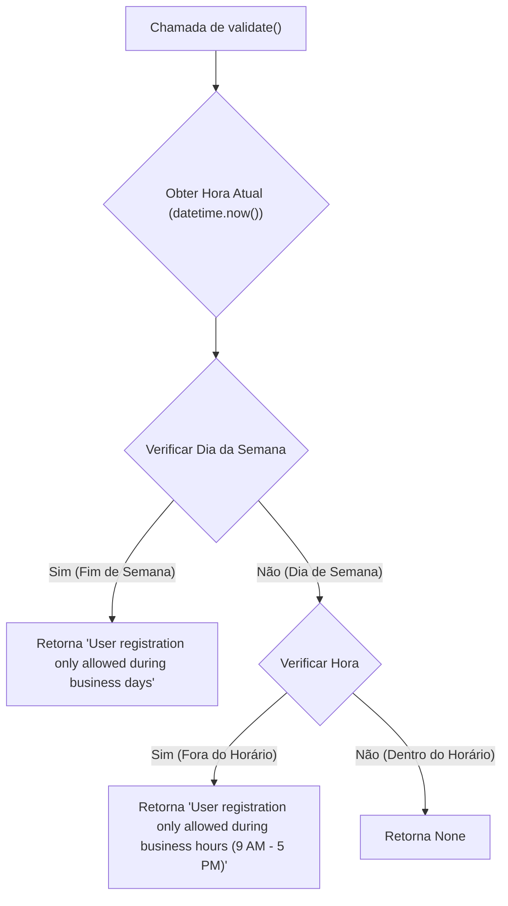

##### 1.1.1.2. Diagrama de Classe
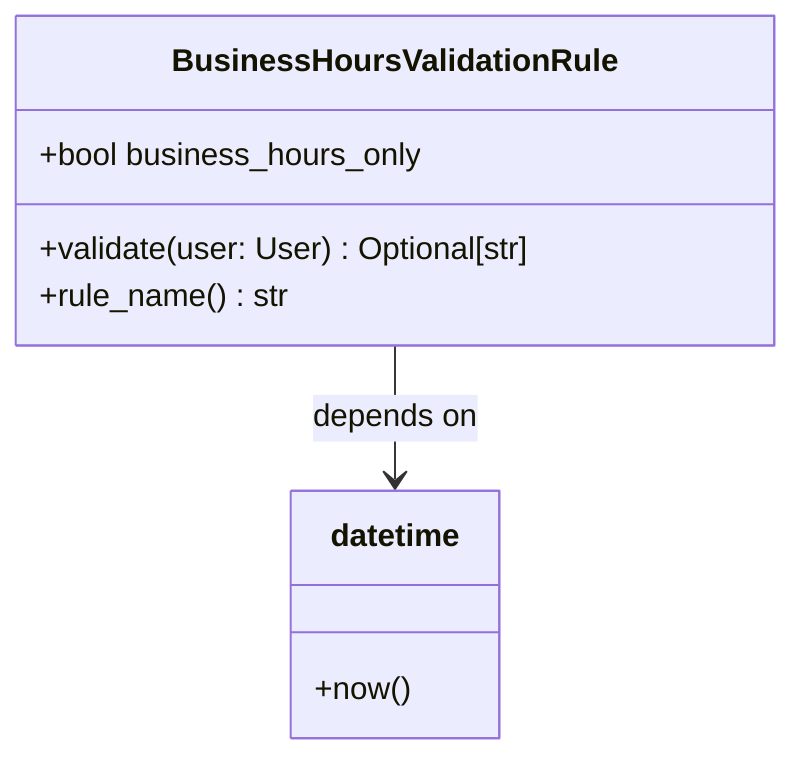

##### 1.1.1.3. Diagrama de Sequência
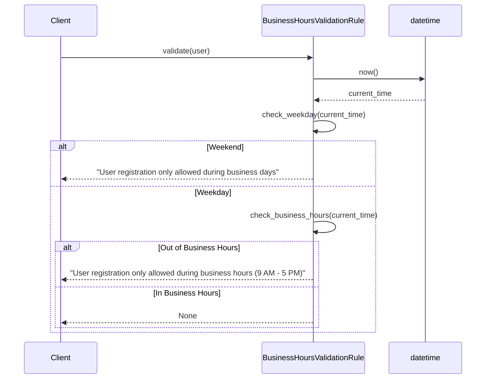

##### 1.1.1.4. Trechos de código

**Código Original (Antes):**

Python

```python
# Trecho de compilado_37.pdf, página 74
class BusinessHoursValidationRule(ValidationRule):
    """Validates if operation is within business hours."""
    def __init__(self, business_hours_only: bool = False):
        self.business_hours_only = business_hours_only

    async def validate(self, user: User) -> Optional[str]:
        if not self.business_hours_only:
            return None
        now = datetime.now() # Causa raiz: acoplamento direto com datetime.now()
        if now.weekday() >= 5:
            return "User registration only allowed during business days"
        if now.hour < 9 or now.hour >= 17:
            return "User registration only allowed during business hours (9 AM - 5 PM)"
        return None
```

#### 1.1.2. Proposta para Implementação da Solução (Depois): Injeção de Dependência para `datetime`

A solução proposta é injetar uma função ou objeto que possa fornecer a data e hora atual. Isso adere ao Princípio da Inversão de Dependência, onde módulos de alto nível (a regra de validação) não dependem de módulos de baixo nível (a implementação de `datetime.now()`), mas ambos dependem de abstrações.

##### 1.1.2.1. Fluxograma


##### 1.1.2.2. Diagrama de Classe
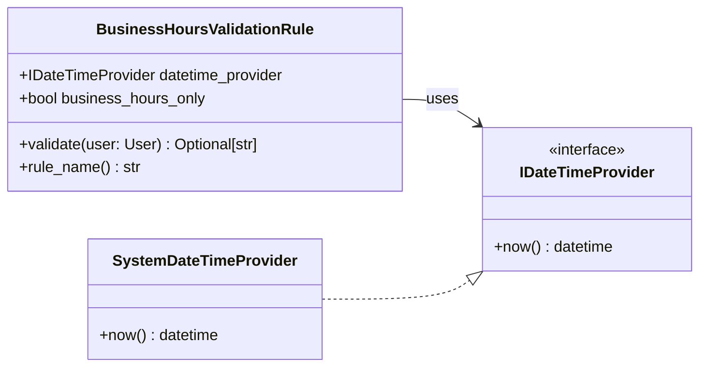

##### 1.1.2.3. Diagrama de Sequência
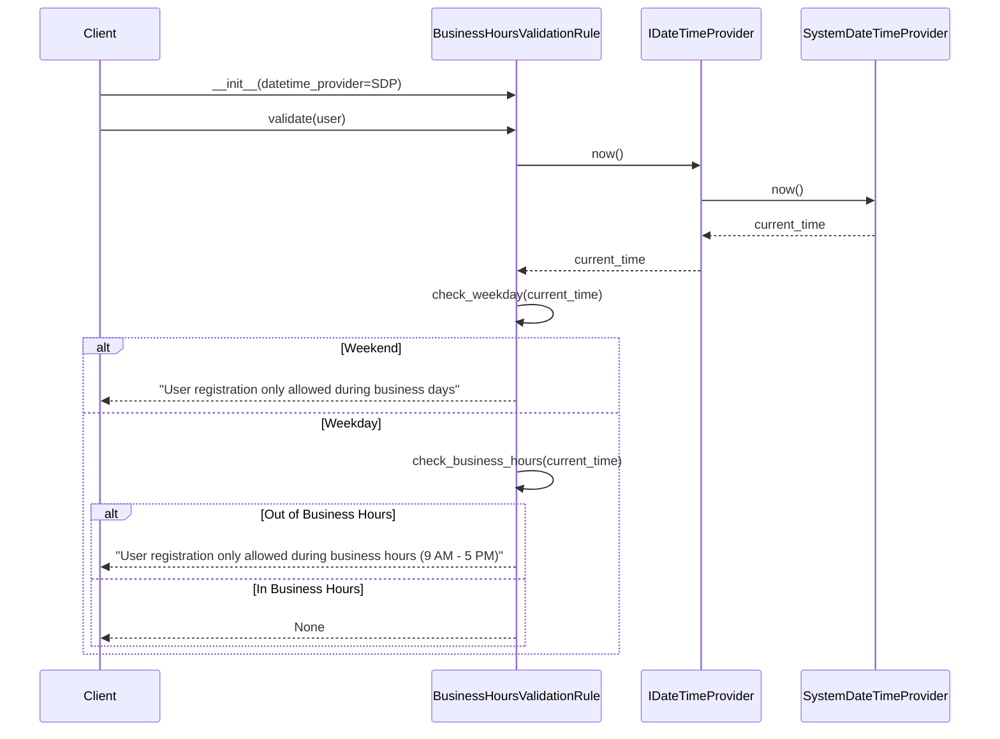

##### 1.1.2.4. Trechos de código

**Código Proposto (Depois):**

Python

```python
# Interface para provedor de data e hora
from abc import ABC, abstractmethod
from datetime import datetime
from typing import Optional

class IDateTimeProvider(ABC):
    @abstractmethod
    def now(self) -> datetime:
        pass

class SystemDateTimeProvider(IDateTimeProvider):
    def now(self) -> datetime:
        return datetime.now()

class BusinessHoursValidationRule(ValidationRule):
    """Validates if operation is within business hours."""
    def __init__(self, business_hours_only: bool = False, datetime_provider: IDateTimeProvider = None):
        self.business_hours_only = business_hours_only
        self.datetime_provider = datetime_provider if datetime_provider is not None else SystemDateTimeProvider()

    async def validate(self, user: User) -> Optional[str]:
        if not self.business_hours_only:
            return None
        now = self.datetime_provider.now() # Alteração: usando o provedor injetado
        if now.weekday() >= 5:
            return "User registration only allowed during business days"
        if now.hour < 9 or now.hour >= 17:
            return "User registration only allowed during business hours (9 AM - 5 PM)"
        return None

# Exemplo de uso:
# rule = BusinessHoursValidationRule(business_hours_only=True) # Usa o provedor padrão
# rule_test = BusinessHoursValidationRule(business_hours_only=True, datetime_provider=MockDateTimeProvider(specific_time))
```

### 1.2. Discussão das Vantagens e Desvantagens:

**Vantagens:**

- **Testabilidade Aprimorada:** Facilita a escrita de testes unitários para `BusinessHoursValidationRule`. É possível simular diferentes horas e dias da semana injetando um `MockDateTimeProvider`, sem depender do relógio do sistema.
- **Flexibilidade:** Permite trocar a fonte do tempo (e.g., para um provedor de tempo externo, ou um provedor de tempo ajustado para fuso horário específico) sem modificar a lógica central da regra de validação.
- **Adesão ao DIP:** A classe `BusinessHoursValidationRule` agora depende de uma abstração (`IDateTimeProvider`) e não de uma implementação concreta (`datetime.now()`).
- **Maior Coesão e Menor Acoplamento:** A regra de validação se concentra apenas em sua lógica de validação, enquanto a responsabilidade de fornecer o tempo atual é delegada a outra classe.

**Desvantagens:**

- **Aumento de Complexidade para Casos Simples:** Para casos onde a flexibilidade de tempo não é crucial, a introdução de uma interface e uma classe concreta adicional pode parecer um exagero.
- **Curva de Aprendizado:** Desenvolvedores menos familiarizados com Injeção de Dependência podem levar um tempo para entender o novo padrão.

### 1.3. Impactos da Alteração:

- **Impacto no Código:**
    - Necessidade de criar uma interface `IDateTimeProvider` e uma implementação concreta `SystemDateTimeProvider`.
    - O construtor de `BusinessHoursValidationRule` precisará ser atualizado para aceitar o `datetime_provider`.
    - Os locais onde `BusinessHoursValidationRule` é instanciado precisarão ser atualizados para injetar a dependência, embora um valor padrão possa ser fornecido para compatibilidade retroativa em muitos casos.
- **Impacto no Projeto:**
    - **Arquitetura:** Fortalece a adesão à Arquitetura Limpa, movendo a preocupação de "como obter o tempo" para uma camada mais externa (Frameworks/Drivers) ou para uma abstração que pode ser implementada por diferentes camadas.
    - **Desempenho:** Impacto insignificante no desempenho.
    - **Escalabilidade:** Nenhuma alteração direta na escalabilidade.
    - **Testabilidade:** Melhoria significativa na testabilidade, reduzindo a necessidade de mocks complexos ou congelamento do tempo em testes.
    - **Facilidade de Futuras Modificações:** Mais fácil de modificar a fonte de tempo no futuro sem afetar a lógica de validação.

---

## 2. Melhoria: Validação de Email como Objeto de Valor

### 2.1. Descrição Detalhada do Problema: Lógica de Validação Dentro de `__post_init__` e Regex Exposto

O código atual para a classe `Email` (definida como um Value Object) realiza a validação do formato do email dentro do método `__post_init__` e expõe a regex para validação internamente em um método privado `_is_valid()`. Embora a validação em `__post_init__` seja uma forma válida para Value Objects, a forma como a regex é gerenciada e a falta de uma validação mais robusta (como um padrão de design de especificação) podem ser melhoradas.

#### 2.1.1. Descrição da Causa Raiz (Antes): Validação Rígida e Acoplada

A causa raiz é a rigidez da validação e o acoplamento direto da lógica de validação do formato do email com a inicialização do objeto `Email`. Além disso, a regex é definida diretamente no método, dificultando a modificação ou a extensão da lógica de validação para cenários mais complexos (por exemplo, múltiplas regras de validação).

##### 2.1.1.1. Fluxograma
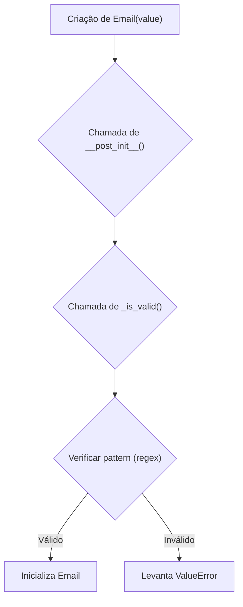

##### 1.1.1.2. Diagrama de Classe
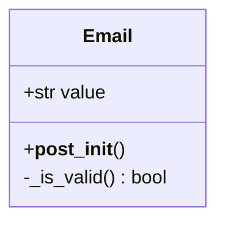

##### 1.1.1.3. Diagrama de Sequência
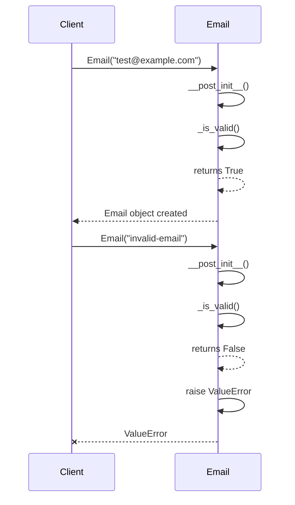

##### 1.1.1.4. Trechos de código

**Código Original (Antes):**

Python

```python
# Trecho de compilado_37.pdf, página 75
# ./src/dev_platform/domain/user/value_objects.py
# -*- coding: utf-8 -*-
"""
Este módulo define os Value Objects para o domínio de usuários, incluindo Email e UserName.
"""
from dataclasses import dataclass
import re
@dataclass(frozen=True)
class Email:
    value: str

    def __post_init__(self):
        if not self._is_valid(): # Causa raiz: validação rígida e acoplada
            raise ValueError(f"Invalid email format: {self.value}")

    def _is_valid(self) -> bool:
        pattern = r"^[a-zA-Z0-9._%+-]+@[a-zA-Z0-9.-]+\.[a-zA-Z]{2,}$" # Causa raiz: regex exposta e hardcoded
        return re.match(pattern, self.value) is not None
```

#### 2.1.2. Proposta para Implementação da Solução (Depois): Padrão Specification para Validação e Regex Isolada

A solução proposta é utilizar o padrão Specification para a validação do email. Isso permite desacoplar a lógica de validação da classe `Email` e torná-la mais flexível e extensível. A regex específica pode ser encapsulada em uma especificação, permitindo que futuras validações (e.g., verificação de domínio na lista negra) sejam adicionadas sem modificar a classe `Email`.

##### 2.1.2.1. Fluxograma
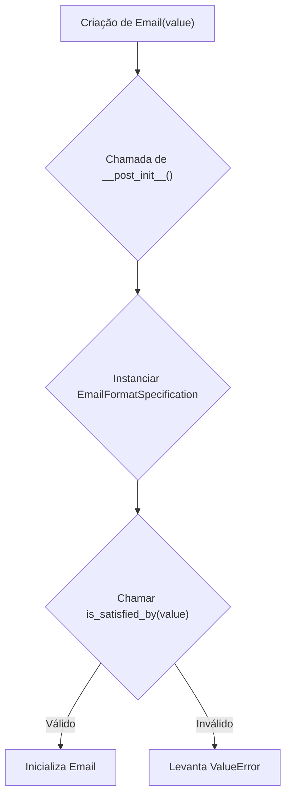

##### 2.1.2.2. Diagrama de Classe
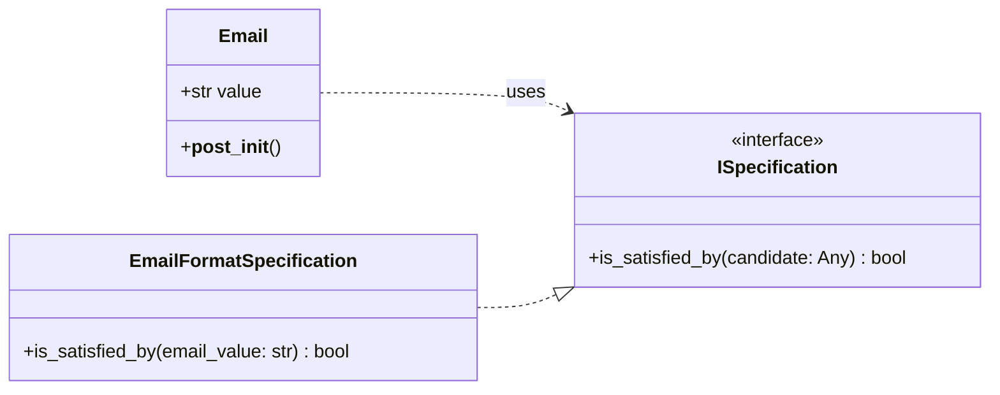

##### 2.1.2.3. Diagrama de Sequência
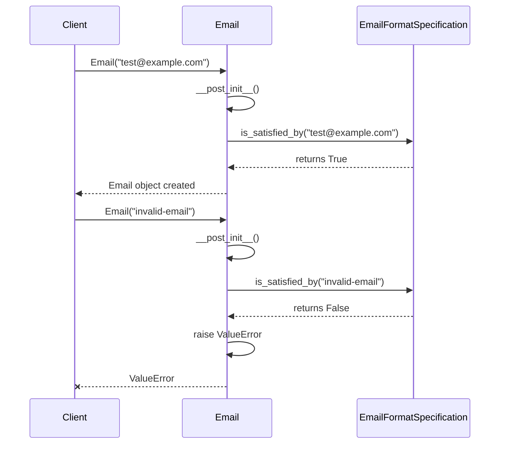

##### 2.1.2.4. Trechos de código

**Código Proposto (Depois):**

Python

```python
# ./src/dev_platform/domain/user/value_objects.py
# -*- coding: utf-8 -*-
"""
Este módulo define os Value Objects para o domínio de usuários, incluindo Email e UserName.
"""
from dataclasses import dataclass, field
import re
from abc import ABC, abstractmethod
from typing import Any

# Definição da interface de especificação
class ISpecification(ABC):
    @abstractmethod
    def is_satisfied_by(self, candidate: Any) -> bool:
        pass

# Implementação da especificação de formato de email
class EmailFormatSpecification(ISpecification):
    EMAIL_REGEX = r"^[a-zA-Z0-9._%+-]+@[a-zA-Z0-9.-]+\.[a-zA-Z]{2,}$"

    def is_satisfied_by(self, email_value: str) -> bool:
        return re.match(self.EMAIL_REGEX, email_value) is not None

@dataclass(frozen=True)
class Email:
    value: str
    # Injetando a especificação como uma dependência, com valor padrão para conveniência
    _email_format_spec: ISpecification = field(default_factory=EmailFormatSpecification, init=False, repr=False, compare=False)

    def __post_init__(self):
        if not self._email_format_spec.is_satisfied_by(self.value): # Alteração: Usando a especificação
            raise ValueError(f"Invalid email format: {self.value}")

# Exemplo de uso:
# email = Email("test@example.com")
# email_invalid = Email("invalid-email")
```

### 2.2. Discussão das Vantagens e Desvantagens:

**Vantagens:**

- **Separação de Interesses (SRP):** A responsabilidade de validar o formato do email é separada da classe `Email`. `Email` é responsável por encapsular o valor do email e garantir sua imutabilidade, enquanto a `EmailFormatSpecification` é responsável pela lógica de validação do formato.
- **Open/Closed Principle (OCP):** Novas regras de validação para `Email` (e.g., domínio permitido, validação de caracteres especiais) podem ser adicionadas criando novas especificações, sem modificar a classe `Email` existente.
- **Testabilidade:** A especificação de validação pode ser testada isoladamente, e diferentes especificações podem ser injetadas para testar diferentes cenários de validação na classe `Email`.
- **Manutenibilidade:** A regex e a lógica de validação são encapsuladas, facilitando a manutenção e a alteração futura.
- **Reusabilidade:** A `EmailFormatSpecification` pode ser reutilizada em outros contextos onde a validação de formato de email seja necessária, sem depender da classe `Email`.
- **Legibilidade:** O código se torna mais claro, com cada componente tendo uma única responsabilidade.

**Desvantagens:**

- **Aumento de Complexidade:** A introdução de uma interface e uma classe de especificação aumenta o número de arquivos e a complexidade geral para um caso de validação de email simples.
- **Over-engineering para Casos Simples:** Para aplicações pequenas onde a validação de email é estática e nunca muda, o padrão Specification pode ser considerado um exagero.

### 2.3. Impactos da Alteração:

- **Impacto no Código:**
    - Criação de uma interface `ISpecification` e uma classe `EmailFormatSpecification`.
    - A classe `Email` precisará ser modificada para aceitar (ou instanciar via `default_factory` para `dataclass`) uma instância de `ISpecification`.
    - As importações nos arquivos que utilizam `Email` não devem ser afetadas diretamente, a menos que o construtor seja alterado para exigir a especificação. Usar `default_factory` em `dataclass` minimiza essa mudança.
- **Impacto no Projeto:**
    - **Arquitetura:** Reforça os princípios do DDD ao explicitamente separar a lógica de validação (especificação) do Value Object, promovendo uma modelagem de domínio mais rica e flexível.
    - **Testabilidade:** Melhora significativamente a testabilidade da validação de email.
    - **Manutenibilidade:** Torna o sistema mais fácil de manter, especialmente se as regras de validação de email evoluírem.
    - **Escalabilidade:** Permite escalar a complexidade das regras de validação sem sobrecarregar o Value Object `Email`.
    - **Consistência:** Promove um padrão consistente para validações complexas em outros Value Objects ou Entidades.

---

## 3. Boas Práticas de Programação: Consistência na Convenção de Nomenclatura e Documentação

### 3.1. Descrição Detalhada do Problema: `_is_valid` e Docstrings

O método `_is_valid` na classe `Email` começa com um sublinhado, indicando que é um método "privado" (por convenção em Python). No entanto, o método `validate` em `BusinessHoursValidationRule` é `async def`, mas a classe não é marcada como `async` ou não usa `await` em seu corpo. Além disso, a documentação (docstrings) pode ser mais consistente e detalhada em todos os módulos e classes.

#### 3.1.1. Descrição da Causa Raiz (Antes): Inconsistência e Informação Limitada

A causa raiz é a falta de padronização nas convenções de nomenclatura e um esforço inconsistente na documentação do código. Isso leva a um código menos legível, mais propenso a erros de uso (como métodos `async` que não são `await`ed), e mais difícil de entender e manter para outros desenvolvedores.

##### 3.1.1.1. Fluxograma

Não aplicável para este tipo de problema, pois o problema é de convenção e documentação, não de fluxo lógico de execução.

##### 3.1.1.2. Diagrama de Classe

Não aplicável diretamente. A inconsistência não é estrutural, mas semântica e de estilo.

##### 3.1.1.3. Diagrama de Sequência

Não aplicável para este tipo de problema.

##### 3.1.1.4. Trechos de código

**Código Original (Antes):**

Python

```python
# Trecho de compilado_37.pdf, página 74
class BusinessHoursValidationRule(ValidationRule):
    """Validates if operation is within business hours."""
    # ...
    async def validate(self, user: User) -> Optional[str]: # Causa raiz: Método async sem uso de await
        if not self.business_hours_only:
            return None
        now = datetime.now()
        # ...
        return None

# Trecho de compilado_37.pdf, página 75
@dataclass(frozen=True)
class Email:
    value: str

    def __post_init__(self):
        if not self._is_valid(): # Causa raiz: Convenção de método "privado" que poderia ser público ou propriedade
            raise ValueError(f"Invalid email format: {self.value}")

    def _is_valid(self) -> bool:
        pattern = r"^[a-zA-Z0-9._%+-]+@[a-zA-Z0-9.-]+\.[a-zA-Z]{2,}$"
        return re.match(pattern, self.value) is not None
```

#### 3.1.2. Proposta para Implementação da Solução (Depois): Refinamento da Nomenclatura e Docstrings

A proposta é refinar a nomenclatura de métodos para refletir seu uso e natureza, e enriquecer as docstrings para fornecer uma descrição clara e concisa do propósito, argumentos, retorno e possíveis exceções.

##### 3.1.2.1. Fluxograma

Não aplicável.

##### 3.1.2.2. Diagrama de Classe

Não aplicável.

##### 3.1.2.3. Diagrama de Sequência

Não aplicável.

##### 3.1.2.4. Trechos de código

**Código Proposto (Depois):**

Python

```python
# ./src/dev_platform/domain/user/validation_rules.py (Assumindo novo arquivo ou atualização)
# -*- coding: utf-8 -*-
"""
Este módulo contém regras de validação para diversas operações no domínio de usuários.
"""
from datetime import datetime
from typing import Optional, Any # Adicionando Any para User
from abc import ABC, abstractmethod

# Assumindo que ValidationRule e User são definidos em outro lugar
class ValidationRule(ABC):
    @abstractmethod
    async def validate(self, user: Any) -> Optional[str]:
        pass

    @property
    @abstractmethod
    def rule_name(self) -> str:
        pass

class User: # Exemplo de User, adaptar conforme o código real
    def __init__(self, name: str):
        self.name = name

class BusinessHoursValidationRule(ValidationRule):
    """
    Regra de validação para verificar se uma operação está dentro do horário comercial permitido.

    Verifica o dia da semana (apenas dias úteis) e as horas (9 AM - 5 PM).
    """
    def __init__(self, business_hours_only: bool = False, datetime_provider: Any = None): # Usando Any temporariamente para datetime_provider
        """
        Inicializa a regra de validação de horário comercial.

        Args:
            business_hours_only (bool): Se True, a validação de horário comercial será aplicada.
                                        Caso contrário, a regra será ignorada.
            datetime_provider (IDateTimeProvider, optional): Provedor de data/hora para testabilidade.
                                                             Usa SystemDateTimeProvider por padrão.
        """
        self.business_hours_only = business_hours_only
        self.datetime_provider = datetime_provider if datetime_provider is not None else SystemDateTimeProvider() # Injeção de dependência sugerida anteriormente

    async def validate(self, user: User) -> Optional[str]:
        """
        Valida se o registro do usuário está dentro do horário comercial permitido.

        Args:
            user (User): O objeto do usuário a ser validado.

        Returns:
            Optional[str]: Uma mensagem de erro se a validação falhar, None caso contrário.
        """
        if not self.business_hours_only:
            return None
        current_time = self.datetime_provider.now() # Alteração: usando o provedor injetado

        if current_time.weekday() >= 5:
            return "User registration only allowed during business days"
        if current_time.hour < 9 or current_time.hour >= 17:
            return "User registration only allowed during business hours (9 AM - 5 PM)"
        return None

    @property
    def rule_name(self) -> str:
        """Retorna o nome da regra de validação."""
        return "business_hours_validation"

# ./src/dev_platform/domain/user/value_objects.py
# -*- coding: utf-8 -*-
"""
Este módulo define os Value Objects para o domínio de usuários, incluindo Email e UserName.
"""
from dataclasses import dataclass, field
import re
from abc import ABC, abstractmethod
from typing import Any

# Definição da interface de especificação
class ISpecification(ABC):
    """Interface genérica para especificações de domínio."""
    @abstractmethod
    def is_satisfied_by(self, candidate: Any) -> bool:
        """
        Verifica se o candidato satisfaz a especificação.

        Args:
            candidate (Any): O objeto a ser verificado.

        Returns:
            bool: True se o candidato satisfaz a especificação, False caso contrário.
        """
        pass

# Implementação da especificação de formato de email
class EmailFormatSpecification(ISpecification):
    """Especificação para validar o formato de um endereço de email."""
    EMAIL_REGEX = r"^[a-zA-Z0-9._%+-]+@[a-zA-Z0-9.-]+\.[a-zA-Z]{2,}$"

    def is_satisfied_by(self, email_value: str) -> bool:
        """
        Verifica se a string de email fornecida tem um formato válido.

        Args:
            email_value (str): O endereço de email a ser validado.

        Returns:
            bool: True se o formato do email for válido, False caso contrário.
        """
        return re.match(self.EMAIL_REGEX, email_value) is not None

@dataclass(frozen=True)
class Email:
    """
    Representa um Value Object para endereço de email.

    Garante que o endereço de email seja válido no momento da criação.
    """
    value: str
    _email_format_spec: ISpecification = field(default_factory=EmailFormatSpecification, init=False, repr=False, compare=False)

    def __post_init__(self):
        """
        Método chamado após a inicialização para validar o formato do email.

        Raises:
            ValueError: Se o formato do email for inválido.
        """
        if not self._email_format_spec.is_satisfied_by(self.value):
            raise ValueError(f"Invalid email format: {self.value}")

    # Método para acesso público, se necessário, ou a validação é feita apenas na construção
    # @property
    # def is_valid(self) -> bool:
    #     """Retorna True se o email for válido, False caso contrário."""
    #     return self._email_format_spec.is_satisfied_by(self.value)
```

### 3.2. Discussão das Vantagens e Desvantagens:

**Vantagens:**

- **Legibilidade e Compreensão:** Nomes de métodos claros e docstrings detalhadas tornam o código mais fácil de ler e entender, tanto para o autor quanto para outros desenvolvedores.
- **Manutenibilidade:** Reduz a probabilidade de erros causados por uso incorreto de métodos ou mal-entendidos sobre seu propósito.
- **Colaboração:** Facilita a colaboração em equipe, pois as expectativas sobre o comportamento do código são explicitamente documentadas.
- **Consistência:** Promove um estilo de codificação consistente em todo o projeto.
- **Aderência ao SRP e OCP (indirectamente):** Embora não seja uma mudança arquitetônica direta, uma documentação clara e nomes de métodos precisos incentivam o pensamento sobre as responsabilidades e a extensibilidade de uma classe ou método.

**Desvantagens:**

- **Tempo Adicional:** Escrever docstrings detalhadas e garantir a consistência da nomenclatura leva tempo extra durante o desenvolvimento inicial.
- **Sobrecarga para Casos Simples:** Para métodos muito triviais, docstrings extensas podem parecer um exagero, mas a consistência ainda é valiosa.
- **Manutenção:** As docstrings precisam ser atualizadas quando o código muda, o que pode ser esquecido, levando a documentação desatualizada.

### 3.3. Impactos da Alteração:

- **Impacto no Código:**
    - Renomear `_is_valid` para `is_valid` (se for para ser público) ou remover a necessidade de um método explícito se a validação só ocorre na inicialização (como na proposta com Specification).
    - Adicionar/atualizar docstrings para classes, métodos e módulos.
    - Revisar o uso de `async def` onde `await` não é utilizado, decidindo se a função deve ser `async` ou não. Se `BusinessHoursValidationRule.validate` não precisa esperar por nenhuma operação assíncrona, ela não precisa ser `async`. A menos que o `datetime_provider` seja assíncrono. Assumi que `datetime_provider.now()` não é assíncrono para a proposta de solução. Se for, a implementação `async` original seria mais apropriada.
- **Impacto no Projeto:**
    - **Qualidade do Código:** Aumenta a qualidade geral do código.
    - **Curva de Aprendizado:** Reduz a curva de aprendizado para novos membros da equipe.
    - **Depuração:** Facilita a depuração, pois o propósito de cada parte do código é mais claro.
    - **Manutenibilidade a Longo Prazo:** Melhora significativamente a manutenibilidade do projeto a longo prazo.
    - **Desempenho/Escalabilidade:** Nenhum impacto direto no desempenho ou escalabilidade.

---

## 4. Análise de Arquitetura Limpa (Clean Architecture) e DDD

### 4.1. Avaliação Geral

Com base nos trechos fornecidos, o projeto parece estar se esforçando para seguir os princípios da Arquitetura Limpa e do DDD, especialmente com a identificação de "Value Objects" e "Validation Rules".

- **Arquitetura Limpa:**
    
    - **Separação de Interesses:** A presença de `value_objects.py` e `validation_rules.py` (assumindo que `BusinessHoursValidationRule` está em um arquivo similar) sugere uma boa separação. Entidades e Value Objects estão na camada de Domínio (`domain/user`). As regras de validação podem ser consideradas parte da camada de Use Cases ou do Domínio, dependendo de sua complexidade e se são específicas de um caso de uso ou gerais para o domínio.
    - **Dependência Invertida:** A proposta de melhoria para `BusinessHoursValidationRule` injetando um `IDateTimeProvider` é um exemplo direto de aplicação do DIP, movendo a dependência de uma implementação concreta para uma abstração.
    - **Organização em Camadas:** Os nomes dos arquivos (`dtos.py`, `entities.py`, `interfaces.py`, `repositories.py`, `services.py`, `use_cases.py`, `value_objects.py`) listados nas primeiras páginas do PDF são um forte indicativo de que a estrutura de camadas da Arquitetura Limpa (ou pelo menos um design em camadas bem definido) está sendo aplicada. `ports.py` e `mappers.py` também são comuns em arquiteturas que buscam desacoplamento.
- **Domain-Driven Design (DDD):**
    
    - **Value Objects:** `Email` é explicitamente um Value Object (`@dataclass(frozen=True)`). A imutabilidade e a validação na construção são boas práticas de VO.
    - **Entidades:** O arquivo `entities.py` sugere a presença de Entidades.
    - **Repositórios:** `repositories.py` indica a intenção de abstrair o armazenamento de dados, o que é um padrão fundamental do DDD.
    - **Serviços de Domínio / Aplicação:** `services.py` e `use_cases.py` provavelmente abrigam a lógica de negócio principal, que pode ser interpretada como Serviços de Domínio ou Casos de Uso (Serviços de Aplicação) no contexto do DDD/Clean Architecture.
    - **Contextos Delimitados:** Não há informações suficientes para avaliar a definição de Contextos Delimitados, mas a organização por domínio (`src/dev_platform/domain/user`) é um bom começo.
- **Princípios SOLID:**
    
    - **SRP (Single Responsibility Principle):**
        - `Email`: O foco principal é encapsular o valor e a validação do formato. A proposta de Specification reforça o SRP.
        - `BusinessHoursValidationRule`: Inicialmente, tinha a responsabilidade de validar e de obter o tempo. A injeção do provedor de tempo melhora o SRP.
    - **OCP (Open/Closed Principle):** A introdução do padrão Specification para `Email` é um exemplo direto de aplicação do OCP, permitindo extensões de validação sem modificação da classe `Email`.
    - **LSP (Liskov Substitution Principle):** Não há informações suficientes nos trechos fornecidos para avaliar a aplicação deste princípio. Requer a análise de hierarquias de classes e polimorfismo.
    - **ISP (Interface Segregation Principle):** Não há informações suficientes para avaliar este princípio. A presença de `interfaces.py` é um bom sinal, mas a granularidade das interfaces precisaria ser verificada.
    - **DIP (Dependency Inversion Principle):** A melhoria proposta para `BusinessHoursValidationRule` (injeção de `IDateTimeProvider`) é um claro exemplo de aplicação do DIP. A presença de `ports.py` e `interfaces.py` também sugere uma intenção de aplicar o DIP em outras partes do sistema.

### 4.2. Pontos Fortes Observados:

- **Estrutura de Projeto:** A lista de arquivos sugere uma estrutura bem organizada e uma intenção de seguir padrões arquitetônicos.
- **Value Objects Imutáveis:** O uso de `@dataclass(frozen=True)` para `Email` é uma excelente prática para Value Objects, garantindo sua imutabilidade.
- **Validação na Construção:** A validação imediata do `Email` em `__post_init__` é apropriada para Value Objects.
- **Intenção de Abstração:** Os arquivos como `interfaces.py`, `ports.py`, `repositories.py` mostram uma clara intenção de criar abstrações e desacoplamento.

### 4.3. Oportunidades de Melhoria Adicionais (Além das já detalhadas):

- **Tratamento de Erros Consistente:** Embora a validação de `Email` levante `ValueError`, é importante garantir que o tratamento de erros seja consistente em todo o sistema (e.g., usar exceções customizadas do domínio, ou um mecanismo de notificação de erros).
- **Testes:** É crucial que o código esteja coberto por testes unitários e de integração robustos, especialmente para as regras de domínio e casos de uso.
- **Documentação Mais Abrangente:** Além das docstrings, uma documentação de arquitetura mais abrangente (visão geral das camadas, decisões de design, etc.) seria benéfica.
- **Uso de Enums para Constantes:** Se houver muitas strings mágicas ou constantes repetidas, o uso de `Enum` pode melhorar a legibilidade e evitar erros.
- **Logging:** O projeto menciona `logger.py` e `structured_logger.py`. É importante garantir que o logging seja configurado e utilizado de forma eficaz para depuração e monitoramento.
- **Uso de Ferramentas de Análise Estática:** Ferramentas como MyPy para tipagem estática e linters (Flake8, Pylint) podem ajudar a manter a qualidade e consistência do código.

Em resumo, o projeto demonstra uma base sólida em Arquitetura Limpa e DDD. As melhorias propostas visam refinar ainda mais a adesão a esses princípios, resultando em um código mais robusto, testável e manutenível.
