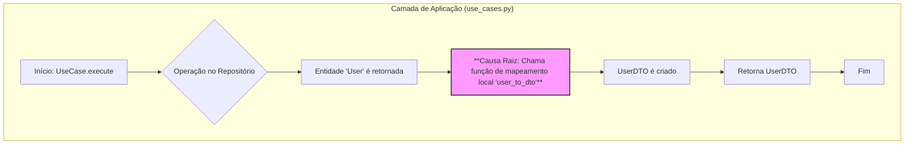
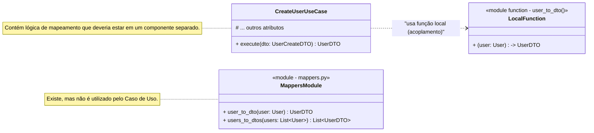
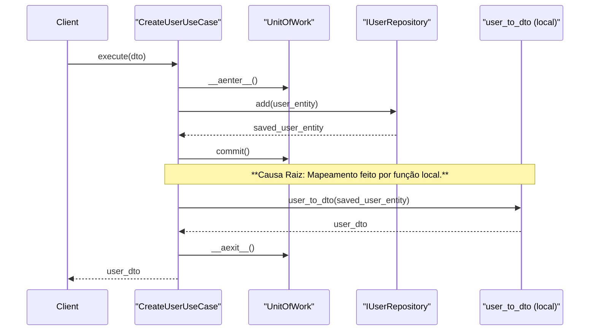
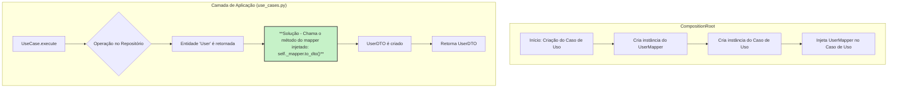
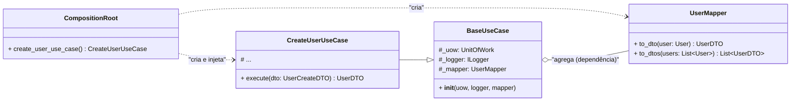
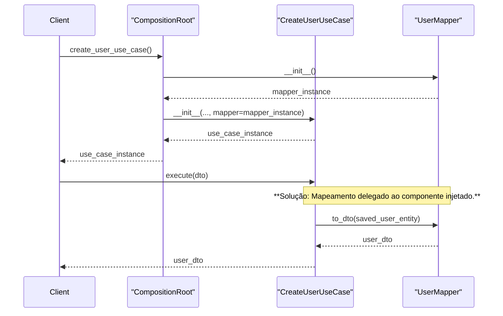

Com base em uma análise arquitetural completa e linha a linha do código-fonte fornecido no arquivo `compilado_41.pdf`, o projeto atingiu um notável estado de maturidade. As refatorações anteriores foram implementadas com sucesso: a `UnitOfWork` é corretamente injetada e seu ciclo de vida agora é encapsulado dentro da camada de Aplicação (Casos de Uso), eliminando o vazamento de abstração para a camada de Interface. A adesão à Arquitetura Limpa, DDD e aos princípios SOLID é exemplar na maior parte do código.

Contudo, a análise revelou uma nova oportunidade de melhoria que, uma vez implementada, solidificará ainda mais a separação de responsabilidades e a manutenibilidade do sistema. O problema identificado reside na duplicação da lógica de mapeamento de dados entre a camada de Domínio e a de Aplicação, violando o princípio DRY (Don't Repeat Yourself).

A seguir, a documentação detalhada para esta oportunidade de melhoria.

---

## 1. Título Descritivo da Melhoria

Centralização da Lógica de Mapeamento em uma Classe `UserMapper` e sua Injeção de Dependência nos Casos de Uso.

## 2. Descrição Detalhada do Problema

O problema central é a duplicação da lógica de conversão de dados (mapeamento) entre a entidade de domínio `User` e o `UserDTO`. Atualmente, o projeto possui um módulo dedicado para esta tarefa,

`mappers.py`1, que define funções para essa conversão. No entanto, o módulo

`use_cases.py` ignora a existência desse centralizador e define sua própria função de mapeamento local, chamada `user_to_dto`.

Isso acarreta em dois problemas arquiteturais significativos:

1. **Violação do Princípio DRY (Don't Repeat Yourself):** A mesma lógica de negócio (como converter uma entidade `User` para um `UserDTO`) existe em dois locais distintos. Se a estrutura do `UserDTO` ou da entidade `User` mudar, o desenvolvedor precisará lembrar de atualizar a lógica em ambos os arquivos. Esquecer de atualizar um deles introduzirá inconsistências e bugs difíceis de rastrear.
    
2. **Violação do Princípio da Responsabilidade Única (SRP):** O módulo `use_cases.py` tem como sua principal responsabilidade orquestrar a lógica de aplicação e o fluxo de dados. Ele não deveria ser responsável pelos detalhes de como uma entidade é transformada em um DTO. Essa é uma responsabilidade distinta que pertence a um componente de mapeamento.
    

Este acoplamento incidental entre a lógica de aplicação e a de transformação de dados torna o código menos coeso e mais frágil.

### 2.1. Descrição da Causa Raiz (Antes)

A causa raiz do problema é a implementação de uma função utilitária de mapeamento diretamente no escopo do módulo

`use_cases.py` , em vez de utilizar o módulo

`mappers.py` já existente4. Isso provavelmente ocorreu como um atalho de desenvolvimento para resolver uma necessidade local rapidamente, sem considerar a estrutura de mapeamento já estabelecida.

A ausência de um mecanismo formal de injeção de dependência para o componente de mapeamento também contribui para o problema. Como os casos de uso não recebiam um "mapper" em seu construtor, o caminho de menor resistência foi criar uma função local.

#### 2.1.1. Fluxograma (Antes)


#### 2.1.2. Diagrama de Classe (Antes)


#### 2.1.3. Diagrama de Sequência (Antes)


#### 2.1.4. Trechos de Código (Antes)

**Arquivo:** `use_cases.py` (com a lógica duplicada)

Python

```python
# ./src/dev_platform/application/user/use_cases.py 
# ... (imports)

# Causa Raiz: Função de mapeamento definida localmente neste módulo.
def user_to_dto(user: User) -> UserDTO:
    return UserDTO(
        id=str(user.id),
        name=user.name.value if hasattr(user.name, "value") else user.name,
        email=user.email.value if hasattr(user.email, "value") else user.email,
    )

class CreateUserUseCase(BaseUseCase):
    # ...
    async def execute(self, dto: UserCreateDTO) -> UserDTO:
        async with self._uow:
            # ... (lógica de negócio)
            saved_user = await self._uow.user_repository.add(user_to_create)
            await self._uow.commit()
            # ...
            # Uso da função local em vez do componente centralizado de mapeamento.
            return user_to_dto(saved_user)
# ... outros casos de uso que também utilizam a função local user_to_dto
```

**Arquivo:** `mappers.py` (o componente correto, mas ignorado)

Python

```python
# ./src/dev_platform/application/user/mappers.py 
# -*- coding: utf-8 -*-
"""
Este módulo define os mapeadores para converter entre entidades User e seus Data Transfer Objects (DTOs),
permitindo a transferência de dados entre camadas da aplicação.
"""
from dev_platform.domain.user.entities import User
from dev_platform.application.user.dtos import UserDTO, UserCreateDTO, UserUpdateDTO
from typing import List

# A função que deveria ser utilizada
def user_to_dto(user: User) -> UserDTO:
    return UserDTO(id=str(user.id), name=user.name.value, email=user.email.value)

# ... outras funções de mapeamento
```

### 2.2. Proposta para Implementação da Solução (Depois)

A solução consiste em refatorar o `mappers.py` para definir uma classe `UserMapper` coesa e injetar essa classe como uma dependência nos casos de uso.

1. **Criar a Classe `UserMapper`:** Transformar as funções soltas em `mappers.py` em métodos de uma classe `UserMapper`. Isso facilita a injeção de dependência e agrupa a lógica de forma coesa.
    
2. **Injetar o Mapper na `BaseUseCase`:** Adicionar o `UserMapper` como uma dependência no construtor da classe `BaseUseCase`, tornando-o disponível para todas as implementações de casos de uso.
    
3. **Atualizar a `CompositionRoot`:** A `CompositionRoot` será responsável por instanciar `UserMapper` e injetá-lo ao criar os casos de uso.
    
4. **Refatorar os Casos de Uso:** Remover a função `user_to_dto` local de `use_cases.py` e substituir todas as suas chamadas por `self._mapper.to_dto(...)`.
    

#### 2.2.1. Fluxograma (Depois)


#### 2.2.2. Diagrama de Classe (Depois)


#### 2.2.3. Diagrama de Sequência (Depois)


#### 2.2.4. Trechos de Código (Depois)

**Arquivo:** `mappers.py` (Solução Proposta)

Python

```python
# ./src/dev_platform/application/user/mappers.py

from dev_platform.domain.user.entities import User
from dev_platform.application.user.dtos import UserDTO
from typing import List

class UserMapper:
    """Componente responsável por mapear entre Entidades User e DTOs."""
    
    def to_dto(self, user: User) -> UserDTO:
        """Converte uma entidade User para UserDTO."""
        return UserDTO(id=str(user.id), name=user.name.value, email=user.email.value)

    def to_dtos(self, users: List[User]) -> List[UserDTO]:
        """Converte uma lista de entidades User para uma lista de UserDTOs."""
        return [self.to_dto(user) for user in users]
```

**Arquivo:** `use_cases.py` (Solução Proposta)

Python

```python
# ./src/dev_platform/application/user/use_cases.py

# ... (imports)
# A função local 'user_to_dto' foi REMOVIDA.
from dev_platform.application.user.mappers import UserMapper # Importa a classe

class BaseUseCase:
    """Classe base para casos de uso, agora com mapper injetado."""
    def __init__(self, uow: UnitOfWork, logger: ILogger, mapper: UserMapper):
        self._uow = uow
        self._logger = logger
        self._mapper = mapper # Mapper injetado

class CreateUserUseCase(BaseUseCase):
    # O __init__ agora precisa aceitar o mapper e passá-lo para a superclasse.
    def __init__(
        self,
        uow: UnitOfWork,
        logger: ILogger,
        mapper: UserMapper,
        user_validator: UserValidatorService,
        user_uniqueness_service: UserUniquenessService,
    ):
        super().__init__(uow, logger, mapper)
        self._user_validator = user_validator
        self._user_uniqueness_service = user_uniqueness_service

    async def execute(self, dto: UserCreateDTO) -> UserDTO:
        async with self._uow:
            # ... (lógica de negócio)
            saved_user = await self._uow.user_repository.add(user_to_create)
            await self._uow.commit()
            # ...
            # Solução: Usa o mapper injetado.
            return self._mapper.to_dto(saved_user)

# Outros casos de uso (List, Get, etc.) seriam adaptados de forma similar.
```

**Arquivo:** `composition_root.py` (Solução Proposta)

Python

```python
# ./src/dev_platform/infrastructure/composition_root.py

from dev_platform.application.user.mappers import UserMapper # Importa o novo mapper

class CompositionRoot:
    def __init__(self, config: ConfigurationFacade, logger: ILogger):
        self._config = config
        self._logger = logger
        # Solução: Cria uma instância única do mapper para ser reutilizada.
        self._user_mapper = UserMapper()
        # ...

    def create_user_use_case(self) -> CreateUserUseCase:
        uow = self.create_unit_of_work()
        user_repository = uow.user_repository 

        return CreateUserUseCase(
            uow=uow,
            user_validator=self.user_domain_service(),
            user_uniqueness_service=self.user_uniqueness_service(user_repository),
            logger=self._logger,
            # Solução: Injeta a instância do mapper.
            mapper=self._user_mapper, 
        )
    
    # ... outros métodos de criação de casos de uso seriam adaptados para injetar o mapper.
```

## 3. Discussão das Vantagens e Desvantagens

#### Vantagens da Alteração Proposta

1. **Garantia do Princípio DRY:** Elimina completamente a duplicação da lógica de mapeamento, criando uma "Fonte Única da Verdade" no `UserMapper`. Manutenções futuras na lógica de conversão são feitas em um único lugar.
    
2. **Alta Coesão e Baixo Acoplamento:** A lógica de mapeamento fica contida em seu próprio componente (`UserMapper`), aumentando a coesão. Os casos de uso não estão mais acoplados à implementação do mapeamento, apenas ao seu contrato (a classe `UserMapper`).
    
3. **Melhora na Testabilidade:** Torna-se possível testar os casos de uso de forma mais isolada. Pode-se injetar um _mock_ do `UserMapper` para verificar se ele foi chamado corretamente, sem depender da lógica de conversão real. Da mesma forma, o `UserMapper` pode ser testado isoladamente.
    
4. **Clareza Arquitetural:** A dependência do caso de uso em um componente de mapeamento torna-se explícita através da injeção de dependência. Isso torna a arquitetura mais fácil de entender e seguir para novos desenvolvedores.
    
5. **Adesão ao SRP:** Os casos de uso focam em sua responsabilidade principal (lógica de aplicação), delegando a responsabilidade secundária (transformação de dados) a um componente especializado.
    

#### Desvantagens ou Trade-offs da Alteração

1. **Aumento da Complexidade na Iniciação:** A `CompositionRoot` ganha uma nova responsabilidade: instanciar e injetar o `UserMapper`. Os construtores dos casos de uso também ganham um novo parâmetro. Este é um trade-off clássico da injeção de dependência, onde a complexidade na construção dos objetos é trocada por uma enorme simplificação e desacoplamento no uso desses objetos. Para este projeto, o benefício supera em muito o custo.
    

## 4. Impactos da Alteração

#### Impactos no Código

1. **`mappers.py`:** O arquivo precisa ser refatorado de funções para uma classe (`UserMapper`)5.
    
2. **`use_cases.py`:** A função local `user_to_dto` deve ser removida6. A
    
    `BaseUseCase` precisa ser alterada para aceitar e armazenar a instância do `mapper`. Todos os construtores de casos de uso concretos devem ser atualizados para receber o `mapper` e passá-lo para o construtor da classe base. Todas as chamadas à antiga função local devem ser substituídas por chamadas a `self._mapper.to_dto()`.
    
3. **`composition_root.py`:** Deve ser atualizada para instanciar `UserMapper` e injetá-lo em todos os casos de uso que cria.
    

#### Impactos no Projeto

1. **Arquitetura:** O impacto é altamente positivo. A mudança reforça a separação de responsabilidades e a modularidade do sistema. A arquitetura torna-se mais "limpa", com dependências explícitas e um fluxo de dados mais claro entre as camadas.
    
2. **Manutenibilidade:** A manutenibilidade do projeto é significativamente aprimorada. Reduz-se o risco de introduzir bugs por esquecimento ao modificar a lógica de DTOs, e o código se torna mais fácil de raciocinar e modificar.
    
3. **Escalabilidade (do Desenvolvimento):** O padrão estabelecido facilita a adição de novas entidades e DTOs no futuro. A equipe saberá que para cada nova entidade, um novo `Mapper` deve ser criado e injetado, seguindo um padrão consistente em toda a aplicação.
    
4. **Desempenho:** Não há impacto negativo esperado no desempenho. A criação da instância do `UserMapper` é uma operação leve que ocorre uma vez durante a composição do objeto na `CompositionRoot`.
