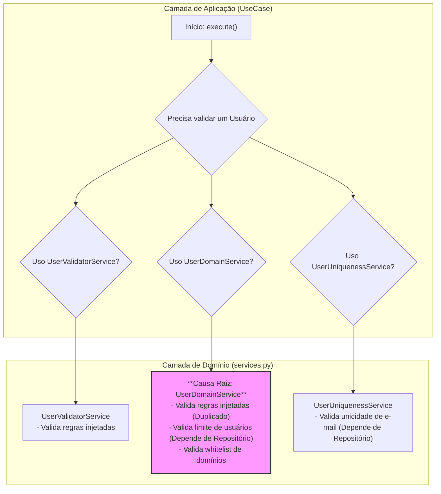
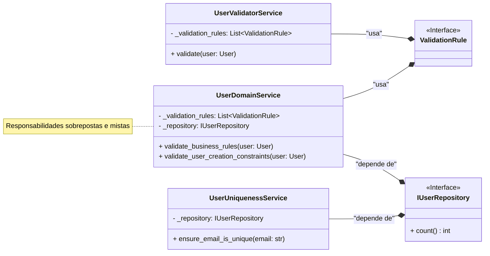
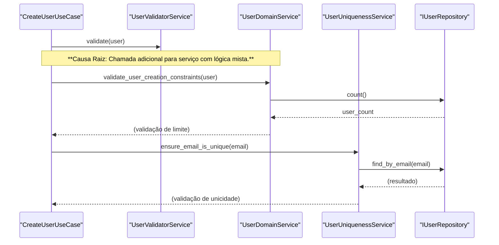
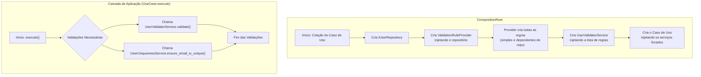
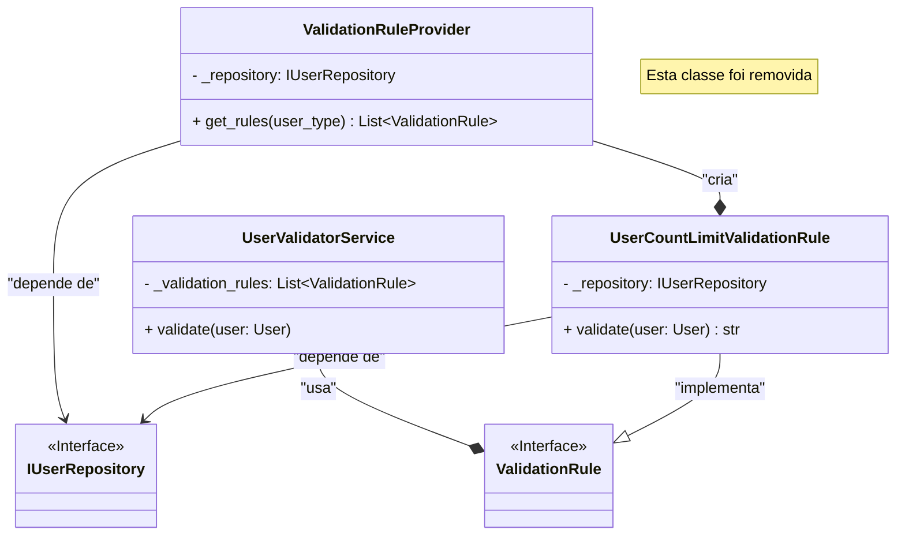
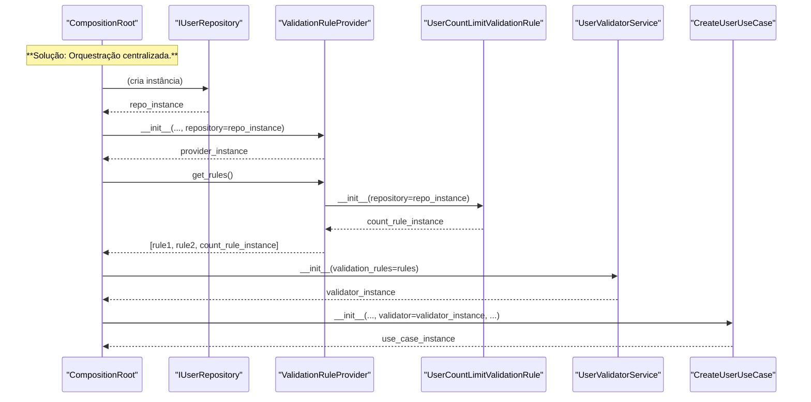

Com base em uma análise arquitetural completa do código-fonte fornecido no arquivo `compilado_42.pdf`, o projeto exibe um alto nível de maturidade e uma forte adesão aos princípios de design de software moderno. As refatorações anteriores, como a injeção de dependência da `UnitOfWork` e do `UserMapper`, foram aplicadas com sucesso, resultando em um código mais limpo e desacoplado.

No entanto, mesmo em um sistema bem estruturado, sempre há espaço para refinamento. A análise aprofundada da camada de domínio, especificamente do arquivo `services.py` , revelou uma sobreposição de responsabilidades e uma falta de coesão em como os serviços de domínio são estruturados. Existe uma classe, `UserDomainService`, cujas responsabilidades se confundem com as de outros serviços mais focados, representando um débito técnico e uma violação do Princípio da Responsabilidade Única (SRP).

A seguir, a documentação detalhada para a melhoria proposta.

---

## 1. Título Descritivo da Melhoria

Refatoração dos Serviços de Domínio para Eliminar a Classe `UserDomainService` e Decompor suas Responsabilidades em Componentes Coesos e de Responsabilidade Única.

## 2. Descrição Detalhada do Problema

O problema principal reside na existência da classe `UserDomainService` no módulo `services.py` . Esta classe aglomera múltiplas responsabilidades que já são, ou deveriam ser, tratadas por outros componentes mais especializados, gerando os seguintes problemas:

1. **Violação do Princípio da Responsabilidade Única (SRP):** A `UserDomainService` é responsável por:
    
    - Orquestrar a validação de regras de negócio (lógica duplicada da `UserValidatorService`).
        
    - Verificar restrições de nível de sistema (ex: limite total de usuários no banco de dados) .
        
    - Validar regras de negócio específicas (ex: whitelists de domínio de e-mail) .
        
        Essa mistura de validação de dados, regras de negócio e checagens de infraestrutura em uma única classe a torna um "God Object" em pequena escala, dificultando sua manutenção e compreensão.
        
2. **Violação do Princípio DRY (Don't Repeat Yourself):** O método `validate_business_rules` na `UserDomainService` replica a funcionalidade exata do método `validate` na `UserValidatorService` . Ambas as classes recebem uma lista de `ValidationRule` e iteram sobre elas. Essa duplicação é um passivo de manutenção.
    
3. **Confusão Arquitetural:** Embora a `CompositionRoot` na versão atual (`compilado_42.pdf`) pareça estar migrando para o uso dos serviços mais focados (`UserValidatorService` e `UserUniquenessService`), a presença da classe `UserDomainService` no código-fonte cria ambiguidade para os desenvolvedores sobre qual serviço utilizar em cada cenário.
    

### 2.1. Descrição da Causa Raiz (Antes)

A causa raiz do problema parece ser uma evolução orgânica do código onde novas responsabilidades foram sendo adicionadas a uma classe de serviço genérica (`UserDomainService`) por conveniência, em vez de criar novos componentes especializados. A lógica de validação baseada em regras foi posteriormente extraída para a `UserValidatorService`, mas a classe original não foi removida ou refatorada, resultando na atual sobreposição e confusão. A `UserDomainService` tornou-se um "apanhado" de lógicas de negócio que dependiam do repositório, mas que não se encaixavam claramente em outros locais.

#### 2.1.1. Fluxograma (Antes)

O fluxograma ilustra a confusão na camada de serviços, onde um Caso de Uso poderia, teoricamente, interagir com múltiplos serviços com responsabilidades sobrepostas para validar uma única operação.

Snippet de código



#### 2.1.2. Diagrama de Classe (Antes)

O diagrama mostra a redundância entre `UserValidatorService` e `UserDomainService` e a variedade de dependências desta última.

Snippet de código



#### 2.1.3. Diagrama de Sequência (Antes)

A sequência abaixo é hipotética, baseada na existência da `UserDomainService`, e ilustra como um caso de uso seria forçado a chamar múltiplos serviços para uma única operação de criação.

Snippet de código



#### 2.1.4. Trechos de Código (Antes)

**Arquivo:** `services.py`

Python

```python
# ./src/dev_platform/domain/user/services.py

# ... (imports)

class UserValidatorService:
    """Serviço focado em validação de regras de negócio para User."""
    def __init__(self, validation_rules: List[ValidationRule]):
        self._validation_rules: List[ValidationRule] = validation_rules

    async def validate(self, user: User) -> None:
        # ... (itera sobre as regras e levanta exceção)


class UserUniquenessService:
    # ... (implementação correta e focada)


# Causa Raiz: Classe com responsabilidades mistas e sobrepostas.
class UserDomainService:
    """
    Serviço de domínio para validações complexas de domínio de usuário e regras de negócio.
    Recebe explicitamente as regras de validação a serem aplicadas.
    """
    def __init__(self, validation_rules: List[ValidationRule], user_repository: IUserRepository):
        self._validation_rules: List[ValidationRule] = validation_rules
        self._repository = user_repository

    # Lógica duplicada da UserValidatorService
    async def validate_business_rules(self, user: User) -> None:
        validation_errors = {}
        for rule in self._validation_rules:
            error_message = await rule.validate(user)
            if error_message:
                validation_errors[rule.rule_name] = error_message
        if validation_errors:
            raise UserValidationException(validation_errors)

    # Responsabilidade que mistura lógica de negócio com acesso a dados de infraestrutura
    async def validate_user_creation_constraints(self, user: User) -> None:
        validation_errors = {}
        try:
            current_count = await self._repository.count()
            if current_count >= 10000: # Exemplo de limite
                validation_errors["system_limit"] = "Maximum number of users reached"
        except Exception as e:
            validation_errors["system_check"] = f"Unable to verify system constraints: {str(e)}"
        if validation_errors:
            raise UserValidationException(validation_errors)

```

### 2.2. Proposta para Implementação da Solução (Depois)

A solução é decompor completamente a `UserDomainService`, movendo suas responsabilidades para componentes mais coesos e de responsabilidade única.

1. **Eliminar `UserDomainService`:** A classe será removida do código.
    
2. **Criar Regras de Validação Dependentes:** A lógica que depende do repositório, como a verificação do limite de usuários, será extraída para sua própria classe de `ValidationRule`. Esta nova regra (ex: `UserCountLimitValidationRule`) receberá o `IUserRepository` como uma dependência.
    
3. **Aprimorar o `ValidationRuleProvider`:** O `ValidationRuleProvider` , na `CompositionRoot`, se tornará o responsável por construir _todas_ as regras de validação, incluindo aquelas que dependem do repositório. Ele receberá o `IUserRepository` para poder instanciar e fornecer essas regras mais complexas.
    
4. **Manter Serviços Focados:** O `UserValidatorService` permanece como o orquestrador agnóstico das regras, e o `UserUniquenessService` mantém sua responsabilidade única. Os Casos de Uso interagirão com estes dois serviços, que agora cobrem todas as validações necessárias de forma limpa.
    

#### 2.2.1. Fluxograma (Depois)

O novo fluxo é linear e claro. O `ValidationRuleProvider` centraliza a lógica de construção das regras, e o `UserValidatorService` as executa de forma agnóstica.

Snippet de código



#### 2.2.2. Diagrama de Classe (Depois)

O diagrama de classes reflete a nova estrutura, mais limpa e coesa.

Snippet de código



#### 2.2.3. Diagrama de Sequência (Depois)

A sequência de criação de um caso de uso agora é mais robusta, com a `CompositionRoot` orquestrando a montagem de todas as dependências de forma correta.

Snippet de código



#### 2.2.4. Trechos de Código (Depois)

**Arquivo:** `services.py` (Solução Proposta)

Python

```python
# ./src/dev_platform/domain/user/services.py
# A classe UserDomainService foi completamente REMOVIDA.

from typing import List
from dev_platform.domain.user.interfaces import IUserRepository
from dev_platform.domain.user.entities import User
from dev_platform.domain.user.user_exceptions import UserValidationException, UserAlreadyExistsException
from dev_platform.domain.user.validation_rules import ValidationRule

class UserValidatorService:
    """Serviço focado em validação de regras de negócio para User."""
    def __init__(self, validation_rules: List[ValidationRule]):
        self._validation_rules: List[ValidationRule] = validation_rules

    async def validate(self, user: User) -> None:
        validation_errors: dict = {}
        for rule in self._validation_rules:
            error_message = await rule.validate(user)
            if error_message:
                validation_errors[rule.rule_name] = error_message
        if validation_errors:
            raise UserValidationException(validation_errors)

class UserUniquenessService:
    """Service focused on uniqueness validation."""
    def __init__(self, user_repository: IUserRepository):
        self._repository = user_repository

    async def ensure_email_is_unique(self, email: str, exclude_user_id: int = None) -> None:
        existing_user = await self._repository.find_by_email(email)
        if existing_user and (exclude_user_id is None or existing_user.id != exclude_user_id):
            raise UserAlreadyExistsException(email)

# A classe UserAnalyticsService permanece inalterada.
```

**Arquivo:** `validation_rules.py` (Adição da nova regra)

Python

```python
# ./src/dev_platform/domain/user/validation_rules.py

# ... (outras regras)
from dev_platform.domain.user.interfaces import IUserRepository

# Solução: Nova regra de validação com dependência do repositório
class UserCountLimitValidationRule(ValidationRule):
    """Verifica se o número total de usuários não excedeu o limite do sistema."""
    rule_name: str = "user_count_limit"

    def __init__(self, repository: IUserRepository, max_users: int = 10000):
        self._repository = repository
        self._max_users = max_users

    async def validate(self, user: User) -> Optional[str]:
        try:
            current_count = await self._repository.count()
            if current_count >= self._max_users:
                return f"O limite do sistema de {self._max_users} usuários foi atingido."
        except Exception:
            # Não bloquear a criação se a contagem falhar, mas logar o erro.
            # O logger deve ser injetado se um log for desejado aqui.
            return "Não foi possível verificar o limite de usuários do sistema."
        return None
```

**Arquivo:** `composition_root.py` (Solução Proposta)

Python

```python
# ./src/dev_platform/infrastructure/composition_root.py

# ... (imports)
from dev_platform.domain.validation_rules import UserCountLimitValidationRule

class ValidationRuleProvider:
    # O construtor agora recebe o repositório
    def __init__(
        self,
        # ... (outros parâmetros)
        repository: IUserRepository,
        logger: ILogger
    ):
        # ... (outras atribuições)
        self._repository = repository
        self._logger = logger

    def _default_rules(self) -> List[ValidationRule]:
        rules = [
            EmailFormatAdvancedValidationRule(),
            NameContentValidationRule(),
            EmailDomainValidationRule(self._default_allowed_domains),
            NameProfanityValidationRule(forbidden_words=self._default_forbidden_words)
        ]
        # Solução: Adiciona a regra dependente do repositório
        rules.append(UserCountLimitValidationRule(repository=self._repository))
        return rules
    
    # ... (o restante da classe permanece similar)

class CompositionRoot:
    def __init__(self, config: ConfigurationFacade, logger: ILogger):
        self._config = config
        self._logger = logger
        self._user_mapper = UserMapper()
        
        # A criação do provider agora é mais complexa e ocorre dentro dos métodos de caso de uso
        # para garantir o ciclo de vida correto do repositório.

    def _create_validation_provider(self, repository: IUserRepository) -> ValidationRuleProvider:
        return ValidationRuleProvider(
            default_allowed_domains=self._config.get_list("allowed_domains"),
            default_forbidden_words=self._config.get_list("validation_forbidden_words"),
            # ... (outras configs)
            repository=repository, # Injeta o repositório
            logger=self._logger
        )

    def create_user_use_case(self) -> CreateUserUseCase:
        uow = self.create_unit_of_work()
        user_repository = uow.user_repository
        
        # O provider é criado aqui, com o repositório do UoW
        rule_provider = self._create_validation_provider(user_repository)
        validator_service = UserValidatorService(rule_provider.get_rules("default"))
        
        return CreateUserUseCase(
            uow=uow,
            user_validator=validator_service, # Serviço limpo injetado
            user_uniqueness_service=self.user_uniqueness_service(user_repository),
            logger=self._logger,
            mapper=self._user_mapper
        )
    # ... (outros casos de uso seriam adaptados de forma similar)
```

## 3. Discussão das Vantagens e Desvantagens

#### Vantagens da Alteração Proposta

1. **Adesão Estrita ao SRP:** Cada componente agora tem uma única e bem definida razão para mudar. `UserValidatorService` orquestra regras, `UserUniquenessService` checa unicidade, e as `ValidationRule`s contêm a lógica atômica de cada validação.
    
2. **Eliminação de Código Duplicado (DRY):** A lógica de iteração sobre regras de validação existe em um único lugar (`UserValidatorService`).
    
3. **Clareza e Manutenibilidade:** A arquitetura se torna mais fácil de entender. Para adicionar uma nova validação, um desenvolvedor sabe que deve criar uma nova classe `ValidationRule` e registrá-la no `ValidationRuleProvider`. Não há mais a ambiguidade de onde a lógica de domínio deve residir.
    
4. **Componibilidade e Flexibilidade (OCP):** O sistema se torna mais aberto à extensão. Novas validações, mesmo as que dependem de infraestrutura como o repositório, podem ser adicionadas sem modificar os serviços existentes (`UserValidatorService`), apenas adicionando novas classes de regras.
    
5. **Melhora na Testabilidade:** Cada regra de validação pode ser testada isoladamente. `UserCountLimitValidationRule` pode ser testado com um mock de `IUserRepository`. `UserValidatorService` pode ser testado com mocks de `ValidationRule`.
    

#### Desvantagens ou Trade-offs da Alteração

1. **Aumento do Número de Classes:** A decomposição resulta em um número maior de arquivos e classes menores. No entanto, este "aumento de complexidade" estrutural é trocado por uma drástica redução na complexidade lógica de cada componente, o que é um trade-off altamente desejável.
    
2. **Injeção de Dependência Mais Complexa:** O `ValidationRuleProvider` agora depende do `IUserRepository`, o que significa que ele precisa ser instanciado em um escopo onde uma instância de repositório esteja disponível. A solução proposta na `CompositionRoot` lida com isso de forma elegante, mas adiciona um passo à criação dos casos de uso.
    

## 4. Impactos da Alteração

#### Impactos no Código

1. **`services.py`:** A classe `UserDomainService` deve ser removida.
    
2. **`validation_rules.py`:** Uma nova classe, `UserCountLimitValidationRule`, precisa ser adicionada.
    
3. **`composition_root.py`:** O `ValidationRuleProvider` precisa ser modificado para aceitar um `IUserRepository`. Os métodos de criação de casos de uso (`create_*_use_case`) precisarão instanciar o `ValidationRuleProvider` com o repositório apropriado antes de criar e injetar o `UserValidatorService`.
    
4. **`use_cases.py`:** Qualquer caso de uso que (hipoteticamente) dependesse da `UserDomainService` precisaria ser alterado para usar apenas `UserValidatorService` e `UserUniquenessService`.
    

#### Impactos no Projeto

1. **Arquitetura:** O impacto é significativamente positivo. Ele solidifica a separação de interesses dentro da camada de Domínio, tornando a arquitetura mais robusta, resiliente e alinhada com os princípios SOLID.
    
2. **Coesão:** A coesão dos componentes de serviço aumenta drasticamente. Os serviços se tornam mais focados e com propósito claro.
    
3. **Consistência:** Estabelece um padrão claro e consistente para a implementação de todas as lógicas de validação de negócios: encapsulá-las como uma `ValidationRule`.
    
4. **Escalabilidade do Desenvolvimento:** O projeto se torna mais fácil de escalar em termos de equipe e funcionalidades. O padrão claro para adicionar novas regras de negócio reduz a curva de aprendizado e a probabilidade de erros ou inconsistências arquiteturais no futuro.
