## Avaliação Abrangente do Código Fonte do Projeto DEV Platform

Como arquiteto e engenheiro de software, realizei uma avaliação detalhada do código fonte fornecido no

`compilado_43.pdf`. O projeto "DEV Platform" demonstra uma forte intenção de aplicar princípios de Arquitetura Limpa e Domain-Driven Design (DDD), com uma estrutura de diretórios que separa bem as camadas e um foco na injeção de dependências.

A seguir, apresento uma análise dos aspectos solicitados: Arquitetura Limpa, Domain-Driven Design (DDD), Princípios SOLID e Boas Práticas de Programação, incluindo oportunidades de melhoria detalhadas onde aplicável.

### 1. Arquitetura Limpa (Clean Architecture)

O projeto DEV Platform exibe uma aderência notável aos princípios da Arquitetura Limpa. A estrutura de diretórios (

`application`, `domain`, `infrastructure`) reflete claramente as camadas propostas por esta arquitetura, promovendo a separação de interesses e a inversão de dependência.

- **Separação de Interesses e Organização em Camadas:**
    
    - **Domain (Domínio):** Contém `entities.py` (Entidades), `value_objects.py` (Objetos de Valor), `interfaces.py` (Interfaces para Repositórios e Serviços de Domínio) e `services.py` (Serviços de Domínio). Esta camada é independente e representa o coração da lógica de negócios.
        
    - **Application (Aplicação):** Inclui `use_cases.py` (Casos de Uso) e `ports.py` (Portas/Interfaces para Unidades de Trabalho e Mappers). Os Casos de Uso orquestram a lógica de negócios, utilizando entidades e serviços do domínio.
        
    - **Infrastructure (Infraestrutura):** Abriga `database` (modelos, repositórios, sessão, unit of work), `logging` (structured_logger) e `config` (configuração do sistema). Esta camada implementa as https://www.google.com/search?q=interfaces definidas nas camadas internas, lidando com detalhes técnicos como persistência de dados e logging.
        
    - **Injeção de Dependências:** O arquivo `composition_root.py` atua como a raiz de composição, centralizando a criação e injeção de todas as dependências, o que é fundamental para a Arquitetura Limpa e a inversão de dependência. Repositórios e serviços são injetados nos casos de uso, garantindo que as camadas externas dependam de abstrações (https://www.google.com/search?q=interfaces) definidas nas camadas internas.
        

**Ponto Forte:** A estrutura é bastante limpa e clara, facilitando a compreensão e manutenção do projeto. A separação entre

`domain`, `application` e `infrastructure` é bem executada, e o uso de https://www.google.com/search?q=interfaces (ex: `IUserRepository`,

`ILogger`) reforça a inversão de dependência.

### 2. Domain-Driven Design (DDD)

O projeto DEV Platform demonstra uma forte intenção de aplicar o DDD, com boa modelagem de alguns conceitos, mas há oportunidades para aprimoramento.

- **Entidades e Objetos de Valor:**
    
    - As classes
        
        `User` (em `entities.py`) e
        
        `Email`, `UserName` (em `value_objects.py`)  são exemplos claros de Entidades e Objetos de Valor, respectivamente. A imutabilidade de
        
        `Email` e `UserName`  (indicado por
        
        `@dataclass(frozen=True)`) é uma boa prática para Objetos de Valor.
        
    - A validação de formato de e-mail usando
        
        `EmailFormatSpecification` dentro do
        
        `Email` Value Object está alinhada com o DDD, onde a validação e a lógica de negócio intrínseca ao objeto devem residir com ele.
        
- **Serviços de Domínio:** `UserAnalyticsService`, `UserUniquenessService`, e `UserValidatorService` são exemplos de serviços de domínio, encapsulando lógicas de negócio que não pertencem a uma única entidade.
    
- **Repositórios:** `IUserRepository` 
    
    [cite_start](https://www.google.com/search?q=interface) e `SQLUserRepository` (implementação) seguem o padrão Repository, abstraindo os detalhes de persistência da camada de domínio e aplicação.
    
- **Unit of Work (UoW):** A implementação de `SQLUnitOfWork` é fundamental para gerenciar transações e garantir a consistência dos dados, agrupando operações de repositório em uma única unidade transacional. O uso de
    
    `async with self._uow:` dentro dos casos de uso para gerenciar a transação é um excelente exemplo de como a UoW deve ser utilizada no contexto assíncrono.
    

**Ponto Forte:** A modelagem inicial de Entidades, Objetos de Valor, Serviços de Domínio e Repositórios é um bom começo.

**Oportunidade de Melhoria: Reforçar Agregados e Contextos Delimitados**

1. **Título Descritivo da Melhoria:** Definição e Aplicação Claras de Agregados e Contextos Delimitados no DDD.
    
2. Descrição Detalhada do Problema:
    
    O código demonstra a utilização de Entidades (
    
    `User`) e Objetos de Valor (
    
    `Email`, `UserName`), mas a definição explícita de
    
    _Agregados_ e seus _Raízes de Agregado_ não é imediatamente aparente ou robusta em todos os cenários. Embora `User` possa ser implicitamente a Raiz de Agregado para si mesmo e seus Value Objects, a falta de uma declaração explícita ou de exemplos mais complexos (onde várias entidades compõem um único agregado) pode levar a violações das regras de consistência transacional do DDD. Além disso, não há indícios claros de como diferentes _Contextos Delimitados_ seriam identificados e gerenciados se o sistema crescesse, o que pode levar a um modelo de domínio anêmico ou a vazamentos de domínio em módulos futuros.
    
    1. Descrição da Causa Raiz (Antes):
        
        A causa raiz é a falta de uma modelagem explícita e documentada de agregados e seus limites, bem como a ausência de diretrizes claras para a identificação e separação de contextos delimitados. Isso pode resultar em:
        
        - Violações da regra de que "apenas a raiz do agregado deve ser acessada diretamente por fora do agregado", levando a manipulações inconsistentes de objetos internos do agregado.
            
        - Dificuldade em manter a consistência transacional, pois as transações podem inadvertently atravessar limites de agregados, gerando acoplamento indesejado entre domínios lógicos.
            
        - Aumento da complexidade à medida que o domínio cresce, com entidades e serviços se interligando de forma espaguete, em vez de serem agrupados em unidades coesas e independentes.
            
        - Conflitos de modelagem e ambiguidade no vocabulário ubíquo quando o sistema começar a abranger diferentes subdomínios.
            
        
        1. **Fluxograma (Antes):**
            ```mermaid
            graph TD
                A[Camada de Aplicação/Serviço Externo] --> B{Manipula diretamente Entidades/Value Objects};
                B --> C{Transações podem afetar múltiplas entidades não-agregadas};
                C --> D{Consistência transacional dependente da disciplina do desenvolvedor};
                D --> E(Potencial para inconsistências de dados e acoplamento forte);
            ```
            
        2. **Diagrama de Classe (Antes - Exemplo Hipotético para Agregados):**
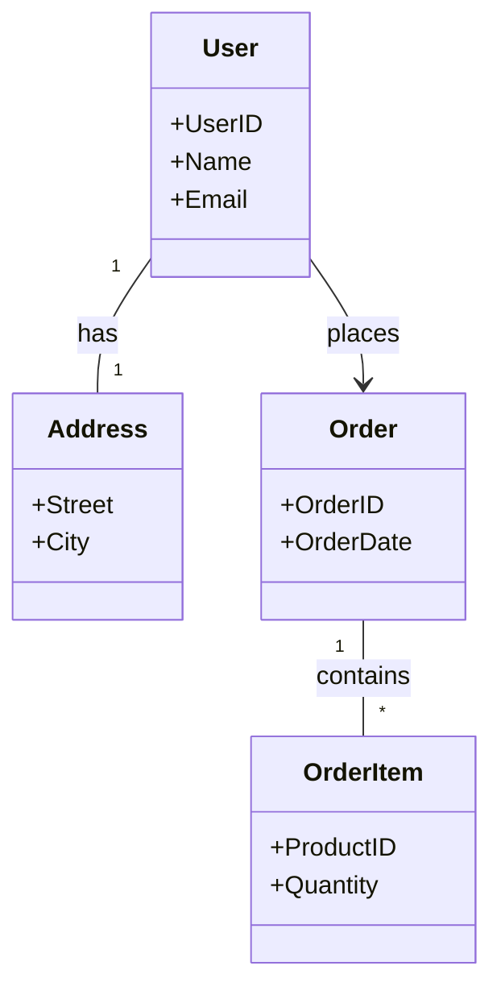
        "Não há uma fronteira clara de agregado, objetos podem ser acessados diretamente."
            
        3. **Diagrama de Sequência (Antes - Exemplo de Criação de Pedido sem Agregado Claro):**
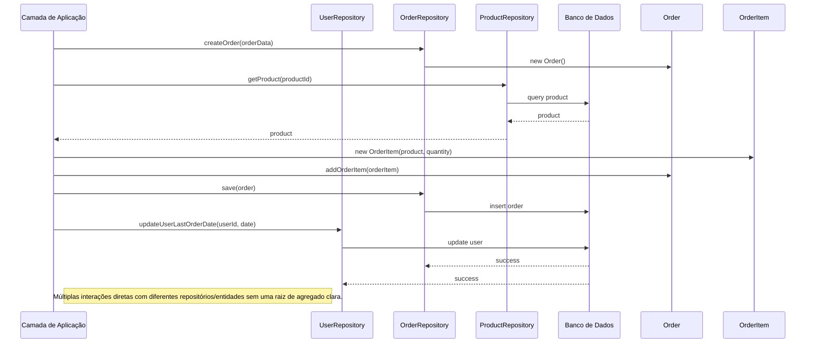
            
        4. Trechos de código (Antes):
            
            Não há um trecho de código específico no PDF que mostre uma violação direta de agregado, mas a ausência de uma estrutura para agregados é o ponto.
            
            O código atual lida com o User como uma entidade, mas não há um agrupamento explícito de outras entidades sob o User se houvesse mais complexidade.
            
            `src/dev_platform/application/user/use_cases.py` 20 (trecho simplificado):
            
            Python
            
```python
class CreateUserUseCase(BaseUseCase):
	# ...
	async def execute(self, dto: UserCreateDTO) -> UserDTO:
		async with self._uow:
			# ...
			user_to_create = User.create(name=dto.name, email=dto.email) # User é a entidade
			await self._user_validator.validate(user_to_create)
			saved_user = await self._uow.user_repository.add(user_to_create)
			await self._uow.commit()
			# ...
```
            
            Neste trecho, `User` é a entidade central. A melhoria se daria se `User` fosse uma Raiz de Agregado que contivesse outras entidades menores, e a manipulação dessas entidades internas fosse sempre feita via `User`.
            
    2. Proposta para Implementação da Solução (Depois):
        
        Aprimorar a modelagem do domínio através da identificação e formalização de Agregados, e estabelecer diretrizes para Contextos Delimitados. Isso envolve:
        
        - **Identificação de Agregados:** Analisar as relações entre as entidades e identificar quais delas devem ser tratadas como uma unidade transacional e consistência.
            
        - **Definição de Raízes de Agregado:** Designar uma entidade como a Raiz de Agregado, sendo o único ponto de entrada para manipulações dos objetos dentro do agregado.
            
        - **Garantia de Consistência Transacional:** As operações que modificam um agregado devem ser sempre iniciadas através da sua Raiz de Agregado, e a Unidade de Trabalho (UoW) deve ser usada para garantir que todas as mudanças no agregado sejam persistidas atomicamente.
            
        - **Mapeamento de Contextos Delimitados:** Se o sistema crescer, identificar os diferentes subdomínios (Contextos Delimitados) e definir as https://www.google.com/search?q=interfaces e mecanismos de comunicação entre eles (e.g., Anti-Corruption Layer, Eventos de Domínio).
            
        
        1. **Fluxograma (Depois):**
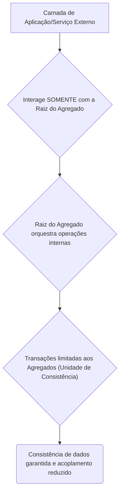
            
        2. **Diagrama de Classe (Depois - Exemplo Hipotético para Agregados):**
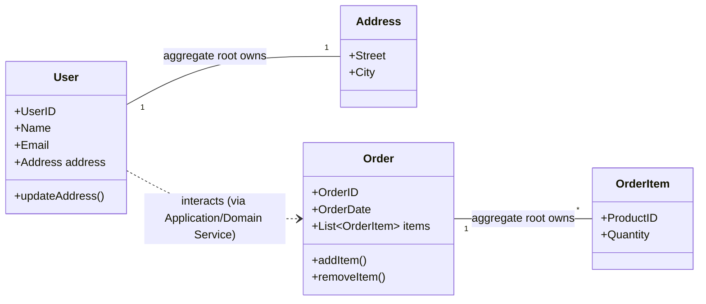
    ' User é a raiz do agregado User-Address. Order é a raiz do agregado Order-OrderItem.
	' Acesso a Address ou OrderItem deve ser feito via User ou Order, respectivamente.

			
        3. **Diagrama de Sequência (Depois - Exemplo de Criação de Pedido com Agregado Claro):**
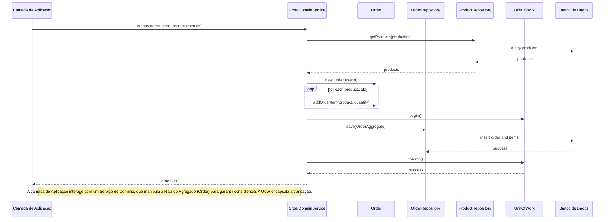
            
        4. **Trechos de código (Depois - Conceitual para Agregado de Usuário e Endereço):**
            
            `src/dev_platform/domain/user/entities.py` (Exemplo da entidade `User` como raiz de agregado):
            
            Python
            
```python
# Antes (implícito, como está hoje):
# @dataclass
# class User:
#     id: UUID
#     name: UserName
#     email: Email
#     _is_active: bool = True

# Depois (exemplo com Address como parte do agregado User):
from dataclasses import dataclass, field
from uuid import UUID
from dev_platform.domain.user.value_objects import UserName, Email, Address # Assumindo que Address é um Value Object ou entidade interna

@dataclass
class Address: # Pode ser um Value Object ou uma Entidade pertencente ao agregado User
	street: str
	city: str
	# ...

@dataclass
class User: # Esta é a Raiz do Agregado "User"
	id: UUID
	name: UserName
	email: Email
	address: Address = field(default_factory=lambda: Address("", "")) # Address é parte do agregado User
	_is_active: bool = True

	# Método para alterar o endereço, garantindo a consistência do agregado
	def update_address(self, new_street: str, new_city: str):
		# Lógica de validação e regras de negócio para o endereço
		if not new_street or not new_city:
			raise ValueError("Street and city cannot be empty.")
		self.address = Address(new_street, new_city)
		# Outras regras de negócio que afetam o agregado User-Address

	@staticmethod
	def create(name: str, email: str) -> 'User':
		# ... lógica de criação ...
		return User(id=UUID(), name=UserName(name), email=Email(email))

```
            
            A alteração principal não está em adicionar muito código existente, mas sim em _conceitualizar_ `User` como uma Raiz de Agregado e garantir que todas as modificações em objetos "filhos" (como `Address` neste exemplo hipotético) ocorram através de métodos definidos na Raiz do Agregado (`User`).
            
3. **Discussão das Vantagens e Desvantagens:**
    
    - **Vantagens:**
        
        - **Consistência de Dados:** Garante que todas as regras de negócio intrínsecas ao agregado sejam aplicadas atomicamente, prevenindo estados inconsistentes.
            
        - **Coerência Transacional:** Simplifica a lógica transacional, pois as transações podem ser limitadas aos agregados, reduzindo o risco de deadlocks e conflitos.
            
        - **Menor Acoplamento:** Reduz o acoplamento entre diferentes partes do sistema, pois a comunicação entre agregados ocorre apenas via suas raízes ou por eventos de domínio.
            
        - **Clareza do Domínio:** Torna a modelagem do domínio mais clara e expressiva, facilitando a comunicação entre a equipe de desenvolvimento e os especialistas de domínio.
            
        - **Manutenibilidade e Testabilidade:** Agregados bem definidos são mais fáceis de manter e testar isoladamente.
            
        - **Escalabilidade:** Facilita a escalabilidade horizontal, pois os agregados podem ser distribuídos e processados de forma independente.
            
    - **Desvantagens:**
        
        - **Complexidade Inicial:** A identificação e modelagem de agregados podem adicionar uma complexidade inicial ao design, especialmente para equipes menos experientes em DDD.
            
        - **Granularidade:** Escolher a granularidade correta do agregado é crucial. Agregados muito grandes podem levar a problemas de desempenho e concorrência; agregados muito pequenos podem gerar um número excessivo de transações e complexidade.
            
        - **Curva de Aprendizado:** Requer que a equipe de desenvolvimento compreenda e adote os princípios do DDD, o que pode exigir treinamento e tempo.
            
4. **Impactos da Alteração:**
    
    - **Impactos no Código para Funcionar Corretamente:**
        
        - **Refatoração de Serviços e Casos de Uso:** Qualquer serviço ou caso de uso que atualmente manipule diretamente entidades "filhas" de um agregado precisaria ser refatorado para interagir apenas com a Raiz do Agregado correspondente.
            
        - **Adaptação de Repositórios:** Os métodos dos repositórios precisariam ser ajustados para carregar e salvar agregados inteiros, em vez de entidades individuais. A
            
            `UnitOfWork`  já é um passo nessa direção.
            
        - **Criação de Eventos de Domínio:** Para comunicação entre Contextos Delimitados ou Agregados independentes, a implementação de Eventos de Domínio pode ser necessária, introduzindo infraestrutura de mensageria.
            
    - **Impactos Esperados no Projeto como Um Todo:**
        
        - **Na Arquitetura:** Reforçaria a integridade da Arquitetura Limpa, garantindo que a lógica de negócio esteja encapsulada corretamente dentro da camada de domínio.
            
        - **No Desempenho:** Poderia haver uma ligeira sobrecarga em transações que carregam agregados maiores, mas isso é geralmente compensado pela redução de acessos a dados inconsistentes. A otimização de consultas se tornaria focada na carga eficiente de agregados.
            
        - **Na Escalabilidade:** Aumentaria a escalabilidade, pois a divisão em contextos delimitados e agregados independentes permitiria a distribuição e o paralelismo mais eficazes das cargas de trabalho.
            
        - **Na Testabilidade:** Melhoraria a testabilidade, pois os testes poderiam focar em agregados específicos e suas regras de negócio, sem a necessidade de mockar grandes partes do sistema.
            
        - **Na Facilidade de Futuras Modificações:** Tornaria futuras modificações mais fáceis e seguras, pois as alterações seriam contidas dentro dos limites do agregado ou contexto delimitado, minimizando o risco de efeitos colaterais indesejados.
            

---

### 3. Princípios SOLID

A avaliação dos princípios SOLID mostra uma boa aplicação geral, mas com algumas ressalvas e oportunidades de refinamento.

- **Single Responsibility Principle (SRP):**
    
    - **Pontos Fortes:**
        
        - `EnvLoader`,
            
            `JsonConfigLoader`,
            
            `ConfigValidator`,
            
            `DatabaseDriverChecker` e
            
            `ConfigAccessor` (em
            
            `config.py`) são excelentes exemplos de classes que seguem o SRP, cada uma com uma responsabilidade única e bem definida no processo de configuração.
            
        - Os casos de uso (
            
            `CreateUserUseCase`, `ListUsersUseCase`, etc.) 282828 também aderem ao SRP, cada um lidando com uma única responsabilidade de negócio (criar usuário, listar usuários, etc.).
            
    - **Oportunidade de Melhoria:** A classe `CompositionRoot` por sua natureza, tem a responsabilidade de compor o grafo de dependências, o que pode fazer com que ela pareça violar o SRP se vista de forma estrita. No entanto, em Arquitetura Limpa, a raiz de composição é intencionalmente um ponto central para injeção de dependências e, portanto, é aceitável que ela "conheça" muitas dependências. No entanto, se ela começar a ter lógica de negócio ou de infraestrutura que não seja estritamente sobre composição, isso seria uma violação. No estado atual, parece estar ok.
        
- **Open/Closed Principle (OCP):**
    
    - **Pontos Fortes:**
        
        - O uso de
            
            `ValidationRuleProvider` em
            
            `composition_root.py` é um ótimo exemplo de OCP. Ele permite que novas regras de validação (
            
            `ValidationRule`) sejam adicionadas sem modificar o código existente do provedor ou dos serviços que o utilizam.
            
        - O uso da https://www.google.com/search?q=interface
            
            `ILogger` e a injeção de sua implementação (
            
            `StructuredLogger`) em
            
            `ConfigurationFacade` também seguem o OCP, permitindo a troca da implementação de logging sem alterar a fachada.
            
    - **Oportunidade de Melhoria:** O padrão é bem aplicado.
        
- **Liskov Substitution Principle (LSP):**
    
    - **Pontos Fortes:** A utilização de https://www.google.com/search?q=interfaces como `IUserRepository` e
        
        `UnitOfWork` é um indicativo de aderência ao LSP. As implementações (
        
        `SQLUserRepository`,
        
        `SQLUnitOfWork`) substituem suas https://www.google.com/search?q=interfaces sem alterar o comportamento esperado do programa.
        
    - **Oportunidade de Melhoria:** Não há violações óbvias com o código fornecido. A manutenção de https://www.google.com/search?q=interfaces bem definidas ajuda a garantir o LSP.
        
- **Interface Segregation Principle (ISP):**
    
    - **Pontos Fortes:** As https://www.google.com/search?q=interfaces `IUserRepository` e
        
        `UnitOfWork` parecem ser bem coesas e específicas. Não há indícios de https://www.google.com/search?q=interfaces "gordas" que forcem classes a implementar métodos que não utilizam.
        
    - **Oportunidade de Melhoria:** A https://www.google.com/search?q=interface `ILogger`  (embora não esteja no PDF, é referenciada) é uma boa prática. A granularidade das https://www.google.com/search?q=interfaces parece adequada.
        
- **Dependency Inversion Principle (DIP):**
    
    - **Pontos Fortes:**
        
        - A inversão de dependência é um pilar da Arquitetura Limpa e é fortemente aplicada. A camada de
            
            `Application` (casos de uso) depende de abstrações (https://www.google.com/search?q=interfaces `IUserRepository`, `UnitOfWork`, `UserValidatorService`) 4343 e não de implementações concretas da
            
            `Infrastructure`.
            
        - A
            
            `CompositionRoot` é a responsável por unir as abstrações com as implementações concretas.
            
        - O
            
            `UserValidatorService` 45recebe uma lista de
            
            `ValidationRule`
            
            [cite_start](https://www.google.com/search?q=abstra%C3%A7%C3%A3o), e o `ValidationRuleProvider` é responsável por fornecer as implementações concretas dessas regras.
            
    - **Oportunidade de Melhoria:** A injeção de dependências está bem estabelecida.
        

---

### 4. Boas Práticas de Programação

O código demonstra várias boas práticas de programação, mas também apresenta algumas áreas para otimização e consistência.

- **Convenções de Nomenclatura:**
    
    - As convenções (e.g., `CamelCase` para classes, `snake_case` para funções e variáveis) são geralmente seguidas, o que contribui para a legibilidade.
        
    - **Ponto Forte:** A nomenclatura é consistente e descritiva.
        
- **Tratamento de Erros:**
    
    - O uso de exceções customizadas como
        
        `UserValidationException`,
        
        `UserAlreadyExistsException`,
        
        `UserNotFoundException` e
        
        `ConfigurationException` é uma excelente prática para lidar com erros de forma mais específica e significativa.
        
    - O
        
        `handle_sqlalchemy_error` em `src/dev_platform/infrastructure/database/repositories.py` centraliza o tratamento de erros de banco de dados, mapeando
        
        `IntegrityError` 53para
        
        `UserAlreadyExistsException` ou
        
        `DataIntegrityException`, o que é muito bom para encapsular detalhes de infraestrutura e lançar exceções de domínio.
        
    - O tratamento de
        
        `Exception` genérica nos casos de uso (`CreateUserUseCase`) com rollback e log de erro é uma medida de segurança importante.
        
- **Legibilidade e Manutenibilidade:**
    
    - O código é geralmente bem comentado e os nomes de classes, métodos e variáveis são descritivos.
        
    - O uso de
        
        `dataclasses` para Value Objects (
        
        `Email`, `UserName`) melhora a legibilidade e reduz boilerplate.
        
    - **Ponto Forte:** A estrutura modular e a injeção de dependências aumentam a manutenibilidade.
        
- **Uso de Design Patterns Apropriados:**
    
    - **Repository Pattern:** Claramente implementado com https://www.google.com/search?q=interfaces e classes concretas.
        
    - **Unit of Work Pattern:** Implementação assíncrona robusta com `SQLUnitOfWork` e gerenciamento de contexto (
        
        `async with`).
        
    - **Strategy Pattern (Implícito):** O `ValidationRuleProvider` e as
        
        `ValidationRule` (e suas implementações) formam uma estrutura que se assemelha ao Strategy Pattern, permitindo a troca de algoritmos de validação.
        
    - **Facade Pattern:** `ConfigurationFacade` é um bom exemplo de fachada, simplificando o acesso às configurações e encapsulando a complexidade de carregamento e validação.
        
- **Prevenção de Duplicação de Código:**
    
    - A classe
        
        `BaseUseCase` ajuda a reduzir a duplicação de código comum entre os casos de uso (UoW, logger, mapper).
        
    - A centralização da lógica de configuração em
        
        `config.py` e de injeção em
        
        `composition_root.py`  previne duplicação.
        

**Oportunidade de Melhoria : Centralização da Criação da Unit of Work**

1. **Título Descritivo da Melhoria:** Centralização e Reutilização da Criação da Unit of Work em `CompositionRoot`.
    
2. Descrição Detalhada do Problema:
    
    No arquivo
    
    `composition_root.py`, o método `create_unit_of_work()` 66é chamado repetidamente dentro de cada método
    
    `create_X_use_case()` (e.g., `create_user_use_case()`, `list_users_use_case()`, `update_user_use_case()`, etc.)67. Embora isso garanta que cada caso de uso obtenha sua própria
    
    `UnitOfWork` (o que é correto para a gestão transacional), a duplicação da chamada `self.create_unit_of_work()` pode ser otimizada. A criação de `SQLUserRepository` dentro de `create_unit_of_work` também é um ponto de duplicação implícita, pois o `SQLUserRepository` é criado com `session=None` e depois a sessão é injetada via `set_session` pelo UoW, o que é um fluxo um pouco indireto.
    
    1. Descrição da Causa Raiz (Antes):
        
        A causa raiz é a repetição da lógica de criação da UnitOfWork (UoW) e seu repositório dependente (SQLUserRepository) em múltiplos métodos de fábrica dentro da CompositionRoot. Isso leva a:
        
        - **Duplicação de Código:** A mesma sequência de chamadas para instanciar a UoW e o repositório é copiada e colada.
            
        - **Manutenibilidade Reduzida:** Se a forma como a UoW ou seu repositório são criados precisar mudar, será necessário modificar múltiplos lugares.
            
        - **Clareza Comprometida:** Torna o código um pouco mais verboso do que o necessário na `CompositionRoot`, obscurecendo a real intenção de cada método de fábrica de caso de uso.
            
        
        1. **Fluxograma (Antes):**
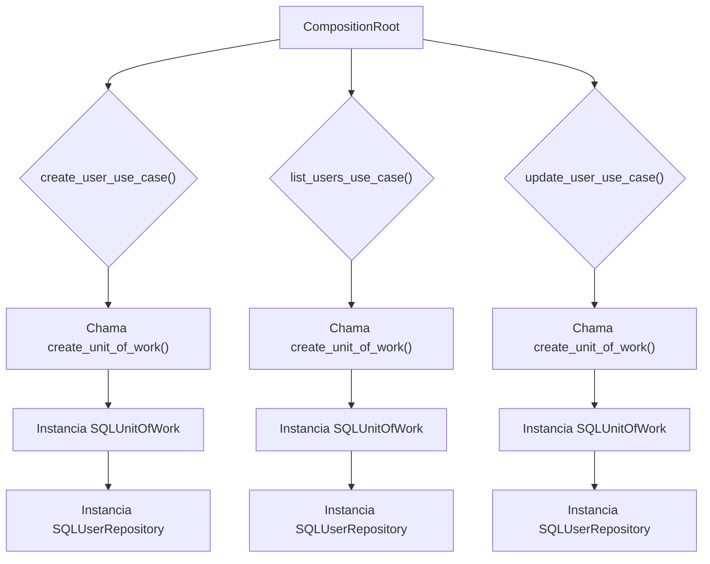
            
        2. **Diagrama de Classe (Antes):**
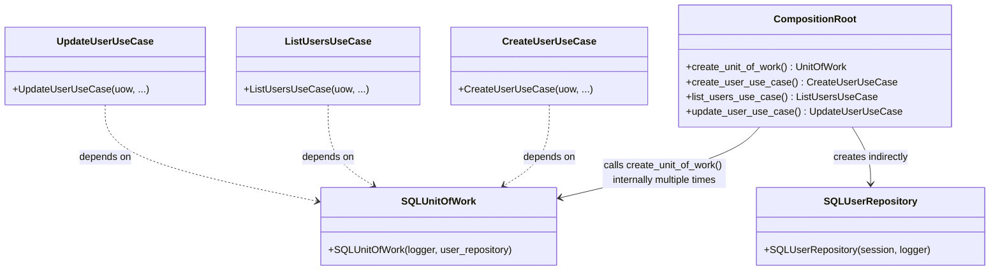
            
        3. **Diagrama de Sequência (Antes - Exemplo: Criação de Usuário):**
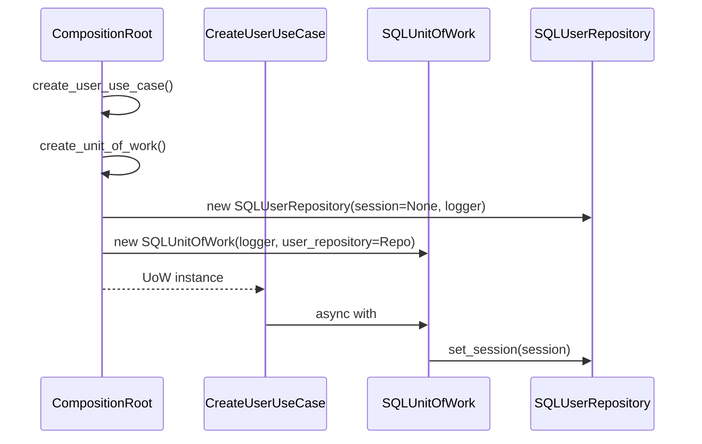
            
        4. Trechos de código (Antes - `composition_root.py` 68):
            
            Python
            
```python
# ...
class CompositionRoot:
	# ...
	def create_unit_of_work(self) -> UnitOfWork:
		user_repo = SQLUserRepository(session=None, logger=self._logger) # A sessão será injetada pelo UoW
		return SQLUnitOfWork(logger=self._logger, user_repository=user_repo) # Passa o repositório concreto

	def create_user_use_case(self) -> CreateUserUseCase:
		uow = self.create_unit_of_work() # Chamada repetida
		user_repository = uow.user_repository
		rule_provider = self._create_validation_provider(user_repository)
		validator_service = UserValidatorService(rule_provider.get_rules("default"))
		return CreateUserUseCase(
			uow=uow,
			user_validator=validator_service,
			user_uniqueness_service=self.user_uniqueness_service(user_repository),
			logger=self._logger,
			mapper=self._user_mapper
		)
	# ... outros use cases com chamadas repetidas a create_unit_of_work()
```
            
    2. Proposta para Implementação da Solução (Depois):
        
        A proposta é introduzir um método privado _create_user_repository() para encapsular a criação do repositório, e então reutilizar a injeção da UnitOfWork de forma mais direta, possivelmente passando-a como um argumento para o método _create_validation_provider ou centralizando mais a criação dos casos de uso, se a complexidade justificar. No entanto, o objetivo principal é eliminar a duplicação na criação do repositório e otimizar a criação da UoW.
        
        A abordagem preferida seria que a `CompositionRoot` _fornecesse_ a `UnitOfWork` já configurada para os casos de uso, ao invés de cada caso de uso a criar internamente através de um método do `CompositionRoot`. O trecho `user_repo = SQLUserRepository(session=None, logger=self._logger)` é problemático, pois o `session=None` indica uma inicialização incompleta. Idealmente, o repositório deveria ser criado já com uma sessão (ou um gerenciador de sessões) ou a UoW deveria ser a única responsável por gerenciar a sessão e passá-la ao repositório quando o contexto for ativado.
        
        Para manter a simplicidade e focar na duplicação, a refatoração será:
        
        1. Criar um método privado `_create_user_repository()` dentro de `CompositionRoot`.
            
        2. Ajustar `create_unit_of_work()` para usar este novo método privado.
            
        3. Remover a criação explícita de `user_repository` dentro de cada `create_X_use_case()`, delegando isso à `UnitOfWork`.
            
        4. **Fluxograma (Depois):**
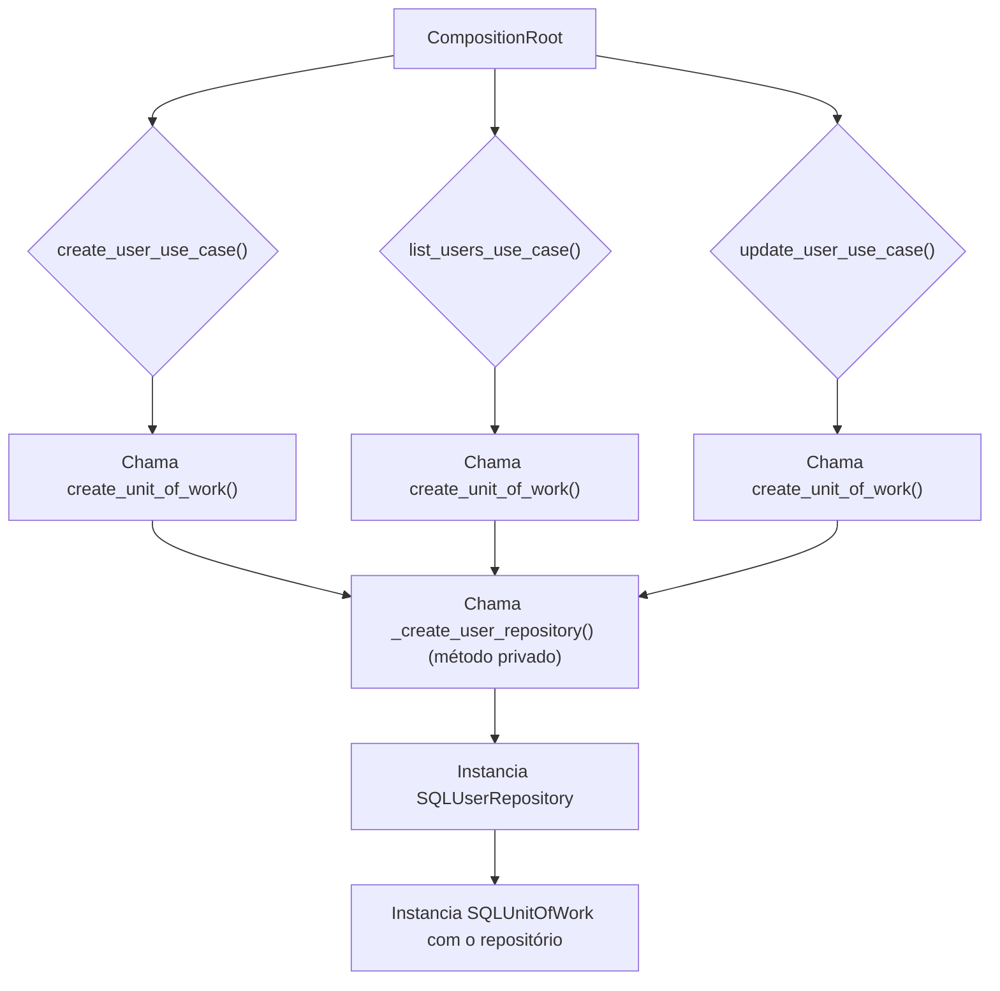
            
        5. **Diagrama de Classe (Depois):**
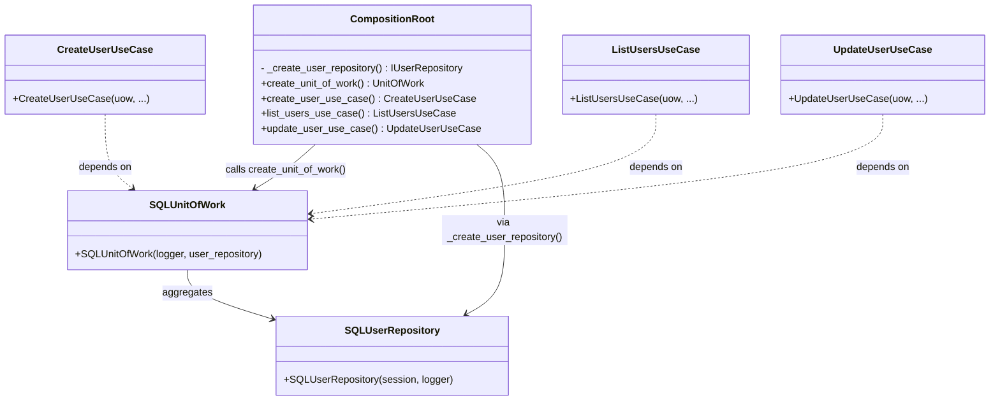
            
        6. **Diagrama de Sequência (Depois - Exemplo: Criação de Usuário):**
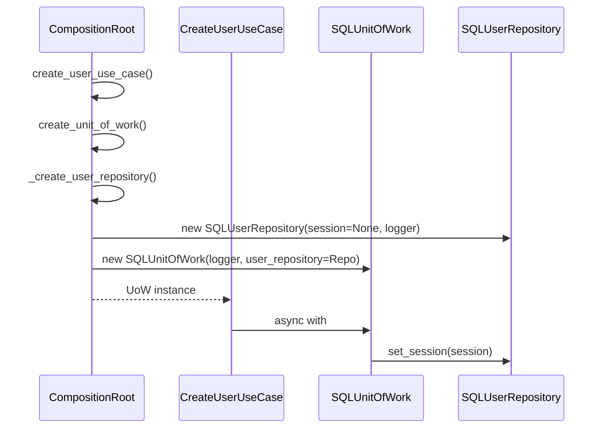
            
        7. **Trechos de código (Depois - `composition_root.py`):**
            
            Python
            
```python
# ...
from dev_platform.domain.user.interfaces import IUserRepository
from dev_platform.infrastructure.database.repositories import SQLUserRepository
# ...

class CompositionRoot:
	# ...
	def _create_user_repository(self) -> IUserRepository:
		"""
		Método privado para criar e configurar o repositório de usuários.
		Centraliza a lógica de inicialização do repositório.
		"""
		# A sessão é injetada pelo UoW posteriormente
		return SQLUserRepository(session=None, logger=self._logger)

	def create_unit_of_work(self) -> UnitOfWork:
		# Agora, create_unit_of_work utiliza o método privado para criar o repositório
		user_repo = self._create_user_repository()
		return SQLUnitOfWork(logger=self._logger, user_repository=user_repo)

	def create_user_use_case(self) -> CreateUserUseCase:
		uow = self.create_unit_of_work()
		# Acesso ao user_repository através da UoW, evitando duplicação na criação do repositório
		user_repository = uow.user_repository # Este acesso é necessário para os serviços dependentes do repositório
		rule_provider = self._create_validation_provider(user_repository)
		validator_service = UserValidatorService(rule_provider.get_rules("default"))
		return CreateUserUseCase(
			uow=uow,
			user_validator=validator_service,
			user_uniqueness_service=self.user_uniqueness_service(user_repository),
			logger=self._logger,
			mapper=self._user_mapper
		)

	def list_users_use_case(self) -> ListUsersUseCase:
		uow = self.create_unit_of_work()
		# user_repository não é necessário aqui, pois ListUsersUseCase não o utiliza diretamente fora do UoW
		return ListUsersUseCase(
			uow=uow,
			logger=self._logger,
			mapper=self._user_mapper
		)

	def update_user_use_case(self) -> UpdateUserUseCase:
		uow = self.create_unit_of_work()
		user_repository = uow.user_repository # Necessário para os serviços de domínio
		rule_provider = self._create_validation_provider(user_repository)
		validator_service = UserValidatorService(rule_provider.get_rules("default"))
		uniqueness_service = UserUniquenessService(user_repository)
		return UpdateUserUseCase(
			uow=uow,
			logger=self._logger,
			mapper=self._user_mapper,
			user_validator=validator_service,
			user_uniqueness_service=uniqueness_service,
		)
	# ... outros use cases ajustados
```
            
3. **Discussão das Vantagens e Desvantagens:**
    
    - **Vantagens:**
        
        - **Redução da Duplicação de Código:** Elimina a repetição da lógica de criação do `SQLUserRepository` em cada método de fábrica da UoW.
            
        - **Melhor Manutenibilidade:** Alterações na forma como o `SQLUserRepository` é instanciado precisam ser feitas em apenas um lugar (`_create_user_repository`).
            
        - **Aumento da Clareza:** Torna a `CompositionRoot` mais limpa e focada em sua responsabilidade principal de composição.
            
    - **Desvantagens:**
        
        - **Pequeno Aumento na Profundidade da Chamada:** Adiciona uma camada extra de https://www.google.com/search?q=abstra%C3%A7%C3%A3o (`_create_user_repository`), embora seja um detalhe de implementação interno.
            
        - **`session=None` Persiste:** A questão da inicialização de `SQLUserRepository` com `session=None` e sua injeção posterior pela UoW (via `set_session`) 69 ainda existe. Uma melhoria mais profunda envolveria injetar um factory de sessão ou um gerenciador de sessões no
            
            `SQLUserRepository` para que ele crie ou obtenha a sessão quando necessário.
            
4. **Impactos da Alteração:**
    
    - **Impactos no Código para Funcionar Corretamente:**
        
        - Nenhum impacto funcional esperado, pois a lógica de criação e injeção permanece a mesma, apenas refatorada internamente na `CompositionRoot`.
            
        - Testes existentes para a `CompositionRoot` e casos de uso podem precisar de pequenos ajustes se eles mockarem a criação interna de repositórios.
            
    - **Impactos Esperados no Projeto como Um Todo:**
        
        - **Na Arquitetura:** Reforça o SRP dentro da `CompositionRoot` ao separar a responsabilidade de criar o repositório. Mantém a aderência à Arquitetura Limpa.
            
        - **No Desempenho:** Nenhum impacto significativo no desempenho.
            
        - **Na Escalabilidade:** Não tem impacto direto na escalabilidade.
            
        - **Na Testabilidade:** Pode facilitar testes unitários da `CompositionRoot` ao isolar a criação do repositório em um método mockável.
            
        - **Na Facilidade de Futuras Modificações:** Aumenta a facilidade de modificações futuras relacionadas à inicialização do repositório ou da UoW.
            

---

**Oportunidade de Melhoria 3: Otimização da Configuração e Carga de Variáveis de Ambiente**

1. **Título Descritivo da Melhoria:** Otimização do Carregamento e Acesso a Configurações.
    
2. Descrição Detalhada do Problema:
    
    O módulo
    
    `config.py` 70 é bem estruturado com classes para carregamento de ambiente, JSON, validação e acesso. No entanto, a
    
    `ConfigurationFacade` é instanciada e recarregada (
    
    `reload()`) repetidamente em diferentes partes da aplicação (implícito pelo uso em `CompositionRoot` e possível em outros pontos), o que pode levar a um carregamento desnecessário e potencial inconsistência em tempo de execução se o ambiente mudar e nem todas as instâncias forem recarregadas. Além disso, a inicialização da
    
    `StructuredLogger` dentro do `ConfigurationFacade` se o logger não for injetado quebra a inversão de dependência para o logger, amarrando a fachada a uma implementação concreta.
    
    1. **Descrição da Causa Raiz (Antes):**
        
        - **Instanciação Repetitiva da Fachada:** Embora a `ConfigurationFacade` receba um logger e factories para seus componentes internos (o que é bom para testabilidade e DIP)74, ela não é projetada como um singleton ou um serviço de ciclo de vida gerenciado. Isso significa que, se diferentes partes da aplicação a instanciarem independentemente, cada uma terá sua própria cópia das configurações, potencialmente desincronizadas se houver um
            
            `reload()` em uma instância.
            
        - **Carga Duplicada:** Cada instanciação da fachada (que por sua vez chama `env_loader.load()` e
            
            `json_loader.load()`) implica no carregamento das variáveis de ambiente e arquivos JSON, o que pode ser ineficiente.
            
        - **Violação do DIP na Injeção do Logger:** A linha `self._logger: ILogger = StructuredLogger()` dentro do
            
            `__init__` da `ConfigurationFacade` viola o Princípio da Inversão de Dependência (DIP) para o logger. A `ConfigurationFacade` deveria sempre depender de uma https://www.google.com/search?q=abstra%C3%A7%C3%A3o (`ILogger`) e nunca de uma implementação concreta (`StructuredLogger`). A decisão de qual logger usar deve ser feita na Raiz de Composição.
            
        
        1. **Fluxograma (Antes):**
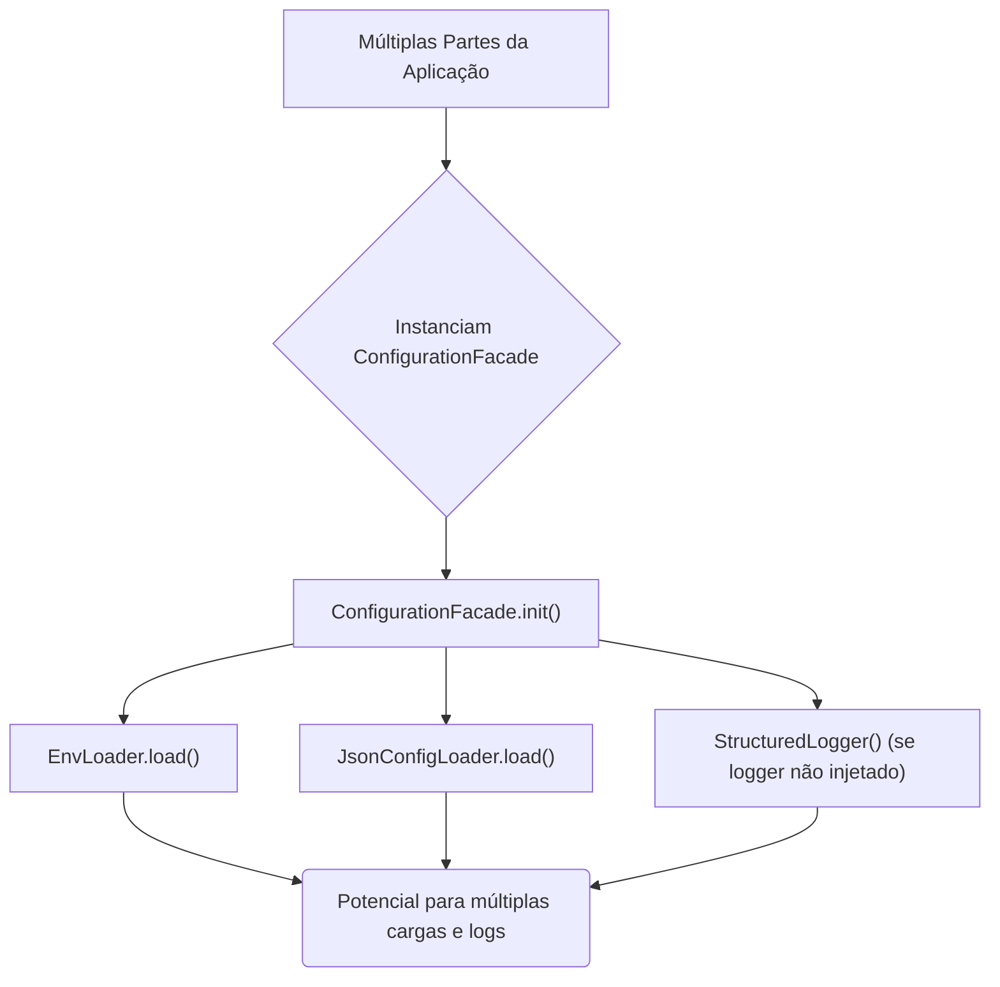
            
        2. **Diagrama de Classe (Antes):**           
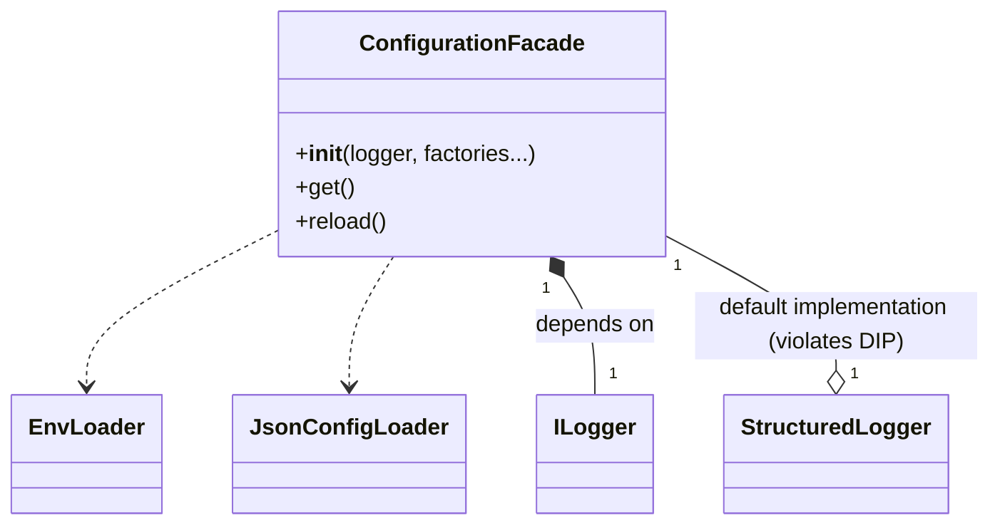
            
        3. **Diagrama de Sequência (Antes - Exemplo: Inicialização Duplicada):**
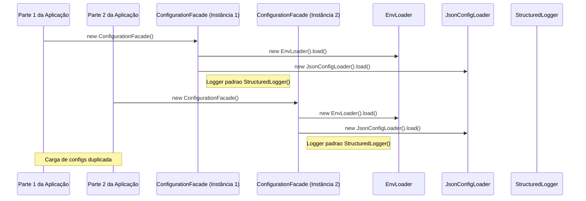
            
        4. Trechos de código (Antes - `config.py`):
            
            Python
            
```python
# ...
class ConfigurationFacade:
	# ...
	def __init__(
		self,
		logger: Optional[ILogger] = None,
		# ... outros factories ...
		environment: Optional[str] = None,
	) -> None:
		# ...
		if logger is not None:
			self._logger: ILogger = logger
		else:
			from dev_platform.infrastructure.logging.structured_logger import StructuredLogger
			self._logger: ILogger = StructuredLogger() # VIOLAÇÃO DO DIP AQUI
		# ...
		env_loader: EnvLoader = (env_loader_factory or EnvLoader)(self._environment, self._logger)
		env_loader.load() # Carga aqui
		json_loader: JsonConfigLoader = (json_loader_factory or JsonConfigLoader)(self._environment, self._logger)
		config_dict: Dict[str, Any] = json_loader.load() # Carga aqui
		# ...
```
            
    2. **Proposta para Implementação da Solução (Depois)**:
        
        1. **Gerenciar `ConfigurationFacade` como Singleton ou através da `CompositionRoot`:** A melhor prática é que a `ConfigurationFacade` seja instanciada _uma única vez_ na `CompositionRoot` e essa mesma instância seja injetada onde for necessário. Isso garante uma única fonte de verdade para as configurações e evita recarregamentos desnecessários. Se a configuração precisar ser recarregada em tempo de execução (como o método
            
            `reload()` sugere), essa funcionalidade seria invocada na
            
            _única instância_ gerenciada pela `CompositionRoot`.
            
        2. **Remover `StructuredLogger` do `ConfigurationFacade.__init__`:** A injeção do `ILogger` deve ser sempre externa. Se nenhum logger for fornecido para `ConfigurationFacade`, ele deve lançar um erro ou usar um "logger nulo" (Null Object pattern) que não faça nada, mas nunca instanciar uma implementação concreta. A decisão de qual logger usar (e sua inicialização) pertence à `CompositionRoot`.
            
        3. **Fluxograma (Depois):**
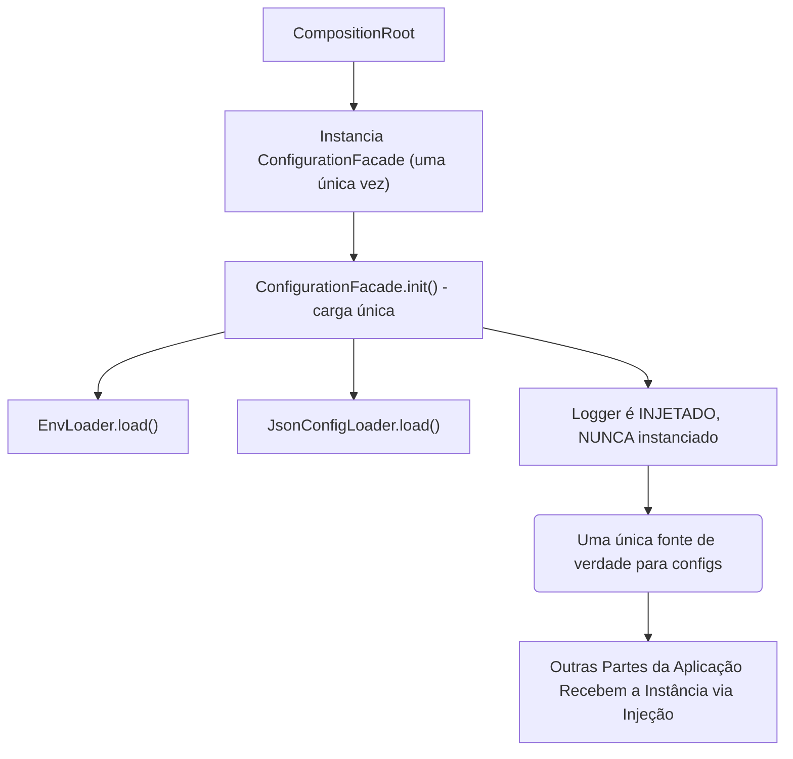
            
        4. **Diagrama de Classe (Depois):**
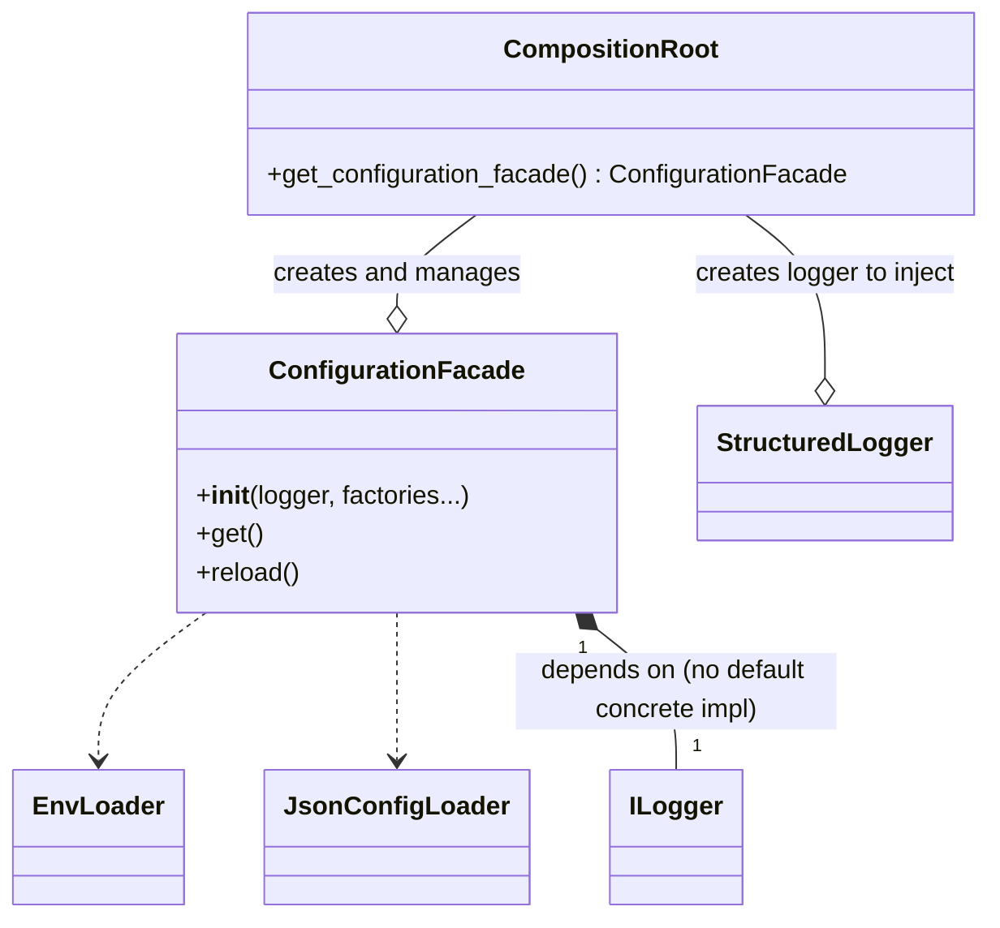
            
        5. **Diagrama de Sequência (Depois - Exemplo: Inicialização Centralizada):**
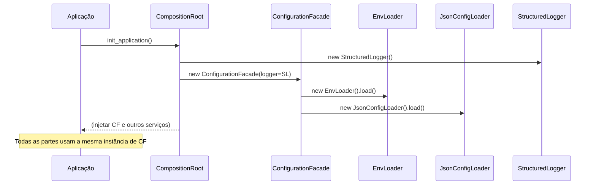
            
        6. **Trechos de código (Depois - `config.py` e `composition_root.py`):**
            
            `src/dev_platform/infrastructure/config.py` (Alteração em `ConfigurationFacade`):
            
            Python
            
```python
# Antes:
# if logger is not None:
#     self._logger: ILogger = logger
# else:
#     from dev_platform.infrastructure.logging.structured_logger import StructuredLogger
#     self._logger: ILogger = StructuredLogger() # VIOLAÇÃO DO DIP AQUI

# Depois:
class ConfigurationFacade:
	def __init__(
		self,
		logger: ILogger, # Agora é obrigatório ser injetado, não Optional
		env_loader_factory: Optional[Callable[[str, ILogger], EnvLoader]] = None,
		json_loader_factory: Optional[Callable[[str, ILogger], JsonConfigLoader]] = None,
		validator_factory: Optional[Callable[[str, ILogger], ConfigValidator]] = None,
		accessor_factory: Optional[Callable[[Dict[str, Any], ILogger], ConfigAccessor]] = None,
		environment: Optional[str] = None,
	) -> None:
		if hasattr(self, "_initialized") and self._initialized:
			return
		self._environment: str = environment or os.getenv("ENVIRONMENT", "production")
		self._logger: ILogger = logger # Logger agora é sempre injetado

		env_loader: EnvLoader = (env_loader_factory or EnvLoader)(self._environment, self._logger)
		env_loader.load()
		json_loader: JsonConfigLoader = (json_loader_factory or JsonConfigLoader)(self._environment, self._logger)
		config_dict: Dict[str, Any] = json_loader.load()
		validator: ConfigValidator = (validator_factory or ConfigValidator)(self._environment, self._logger)
		validator.validate()
		self._accessor: ConfigAccessor = (accessor_factory or ConfigAccessor)(config_dict, self._logger)
		self._initialized: bool = True
```
            
            `src/dev_platform/infrastructure/composition_root.py` (Alteração na `CompositionRoot` para inicializar a fachada):
            
            Python
            
```python
# ...
from dev_platform.infrastructure.config import ConfigurationFacade
from dev_platform.application.ports.logger import ILogger
from dev_platform.infrastructure.logging.structured_logger import StructuredLogger # Importar aqui

class CompositionRoot:
	def __init__(
		self,
		# config: ConfigurationFacade, # Remover config do init se for gerenciado aqui
		logger: ILogger, # Logger continua sendo injetado para a CompositionRoot
	):
		# self._config = config # Remover esta linha
		self._logger = logger
		self._user_mapper = UserMapper()
		# Inicializa a ConfigurationFacade UMA VEZ aqui
		self._config_facade = ConfigurationFacade(logger=self._logger) # Passa o logger existente

	def get_configuration_facade(self) -> ConfigurationFacade:
		"""Retorna a instância da fachada de configuração."""
		return self._config_facade

	# ... (outros métodos, acessando self._config_facade ao invés de self._config)
	def _create_validation_provider(self, repository: IUserRepository) -> ValidationRuleProvider:
		return ValidationRuleProvider(
			default_allowed_domains=self._config_facade.get_list("allowed_domains"), # Usar _config_facade
			default_forbidden_words=self._config_facade.get_list("validation_forbidden_words"), # Usar _config_facade
			enterprise_allowed_domains=self._config_facade.get_list("enterprise_allowed_domains"), # Usar _config_facade
			enterprise_forbidden_words=self._config_facade.get_list("enterprise_forbidden_words"), # Usar _config_facade
			enable_profanity_filter=self._config_facade.get_typed("validation_enable_profanity_filter", False, bool), # Usar _config_facade
			repository=repository,
			logger=self._logger
		)
```
            
3. **Discussão das Vantagens e Desvantagens:**
    
    - **Vantagens:**
        
        - **Consistência de Configuração:** Garante que todas as partes da aplicação acessem a mesma e única fonte de configurações, evitando inconsistências.
            
        - **Performance:** Reduz a sobrecarga de E/S ao evitar o carregamento repetitivo de arquivos de ambiente e JSON.
            
        - **Aderência ao DIP:** A `ConfigurationFacade` agora adere estritamente ao DIP, dependendo apenas da https://www.google.com/search?q=abstra%C3%A7%C3%A3o `ILogger`. A responsabilidade de instanciar o logger concreto é movida para a `CompositionRoot`.
            
        - **Centralização da Carga:** A lógica de carga de configuração é centralizada na `CompositionRoot`, facilitando o gerenciamento do ciclo de vida da configuração.
            
        - **Manutenibilidade:** Simplifica a manutenção, pois a lógica de configuração é gerida de forma mais coesa.
            
    - **Desvantagens:**
        
        - **Impacto no Setup Inicial:** Requer uma pequena mudança na forma como a `ConfigurationFacade` é instanciada na `CompositionRoot` e como ela é acessada por outras classes.
            
        - **Complexidade de Teste (potencial):** Se o `ConfigurationFacade` não for bem injetado ou se testes existentes o instanciam diretamente com mocks, pode exigir pequenos ajustes.
            
4. **Impactos da Alteração:**
    
    - **Impactos no Código para Funcionar Corretamente:**
        
        - A `CompositionRoot` precisará ser ajustada para instanciar e gerenciar a `ConfigurationFacade` uma vez.
            
        - Qualquer classe que atualmente instancie `ConfigurationFacade` diretamente precisará ser modificada para receber a instância via injeção de dependências, provavelmente através de um construtor.
            
        - Testes que dependem do `ConfigurationFacade` podem precisar ser atualizados para trabalhar com a nova abordagem de injeção.
            
    - **Impactos Esperados no Projeto como Um Todo:**
        
        - **Na Arquitetura:** Fortalece a Arquitetura Limpa e a inversão de dependência. A `CompositionRoot` se torna ainda mais central para o setup da aplicação.
            
        - **No Desempenho:** Melhoria no tempo de inicialização da aplicação devido à eliminação de cargas de configuração redundantes.
            
        - **Na Escalabilidade:** Não tem impacto direto na escalabilidade, mas a consistência de configuração é benéfica em ambientes distribuídos.
            
        - **Na Testabilidade:** Melhora a testabilidade da `ConfigurationFacade` e das classes que a utilizam, pois o `ILogger` agora é sempre injetável.
            
        - **Na Facilidade de Futuras Modificações:** Facilita futuras modificações na forma como as configurações são carregadas e acessadas, pois a lógica está centralizada e as dependências são claras.
            

---

### Conclusão Geral

O projeto DEV Platform está em um excelente caminho em termos de arquitetura e design. A adesão à Arquitetura Limpa, a intenção de aplicar DDD e o respeito aos princípios SOLID são evidentes e bem executados em grande parte do código.

As oportunidades de melhoria identificadas focam principalmente em refinar a aplicação de conceitos do DDD (agregados) e otimizar aspectos de infraestrutura (gerenciamento de configuração e UoW) para aumentar ainda mais a manutenibilidade, a clareza e a robustez do sistema.

Com as melhorias propostas, o projeto se tornará ainda mais sólido, resiliente a mudanças e fácil de expandir e manter, consolidando-se como um exemplo de boa engenharia de software.

**Diagrama Geral da Arquitetura (Conceitual):**
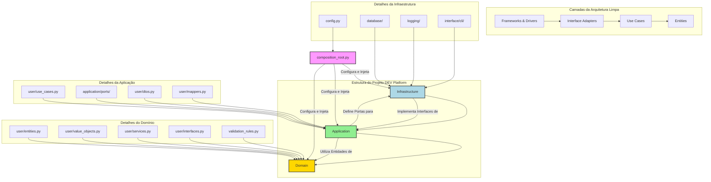
