## Avaliação do Código Fonte: Projeto DEV Platform - compilado_44.pdf

Como arquiteto e engenheiro de software, realizei uma avaliação completa do código fonte fornecido no `compilado_44.pdf`, focando nos princípios de Arquitetura Limpa (Clean Architecture), Domain-Driven Design (DDD), princípios SOLID e boas práticas de programação.

Em uma análise geral, o projeto "DEV Platform" demonstra uma sólida compreensão e aplicação de princípios de design modernos. A estrutura de diretórios (`application`, `domain`, `infrastructure`) e a separação de preocupações em módulos como `use_cases.py`, `entities.py`, `repositories.py`, `services.py`, e `config.py` são indicativos de uma arquitetura bem pensada, alinhada com a Clean Architecture. O uso de interfaces (`ILogger`, `IUserRepository`) e injeção de dependências na `composition_root.py` reforça o Princípio da Inversão de Dependência (DIP) e a testabilidade do sistema.

No contexto de Domain-Driven Design, a presença de `entities.py`, `value_objects.py`, `services.py` de domínio (`UserAnalyticsService`, `UserUniquenessService`, `UserValidatorService`), e o padrão Unit of Work (`unit_of_work.py`) sugere uma modelagem de domínio consciente e eficaz. A classe `ValidationRuleProvider` e as `ValidationRule`s demonstram um bom encapsulamento de regras de negócio complexas e aderência ao Princípio Open/Closed (OCP).

Os princípios SOLID são aplicados consistentemente em diversas partes do código. O Princípio da Responsabilidade Única (SRP) é visível na granularidade das classes de configuração (`EnvLoader`, `JsonConfigLoader`, `ConfigValidator`, `ConfigAccessor`) e nos Use Cases. O OCP é notável na gestão de regras de validação. A Inversão de Dependência (DIP) é um pilar da arquitetura, como evidenciado pela injeção de abstrações.

Apesar da alta qualidade geral do código, foram identificadas algumas oportunidades de melhoria que podem aprimorar ainda mais a manutenibilidade, testabilidade e robustez do sistema. Abaixo, detalho essas oportunidades seguindo o formato solicitado.

---

### 1. Refatoração de Singletons Implícitos/Globais para Injeção Explícita de Dependências

A aplicação atualmente gerencia a `ConfigurationFacade` e o `DatabaseSessionManager` de maneira que se assemelha a singletons globais. Embora a

`CompositionRoot` instancie `ConfigurationFacade` 1, a própria

`ConfigurationFacade` contém lógica para evitar múltiplas inicializações2. O

`DatabaseSessionManager` é explicitamente gerido como uma variável global `db_manager` inicializada por uma função `start_dbsm`3.

Este padrão, enquanto garante uma única instância, compromete a testabilidade, a flexibilidade e a clareza das dependências, tornando o código mais difícil de isolar e testar em unidades. A dependência indireta em estado global ou instâncias implicitamente únicas impede a fácil substituição por mocks ou fakes em testes unitários.

#### 1.1. Descrição da Causa Raiz (Antes):

A causa raiz é a quebra do princípio de Inversão de Controle (IoC) ao permitir que componentes busquem suas dependências de um estado global (no caso de `DatabaseSessionManager` e `StructuredLogger` que o usa) ou de uma instância implicitamente única (no caso de `ConfigurationFacade` controlando sua própria inicialização). Isso leva a:

- **Acoplamento Forte:** Módulos que precisam de configuração ou acesso ao banco de dados dependem da existência e inicialização de instâncias globais ou implicitamente únicas, em vez de recebê-las como dependências.
    
- **Dificuldade de Teste:** Testes unitários se tornam complexos, exigindo manipulação do estado global (como chamar `_reset_singleton` 4 ou redefinir
    
    `db_manager`) ou a garantia de que a inicialização implícita não interfira em outros testes.
    
- **Falta de Flexibilidade:** A substituição de implementações (por exemplo, usar uma configuração de teste ou um banco de dados em memória) é mais difícil sem a modificação do código de produção ou o uso de hacks de teste.
    

##### 1.1.1. Fluxograma (Antes):

Snippet de código

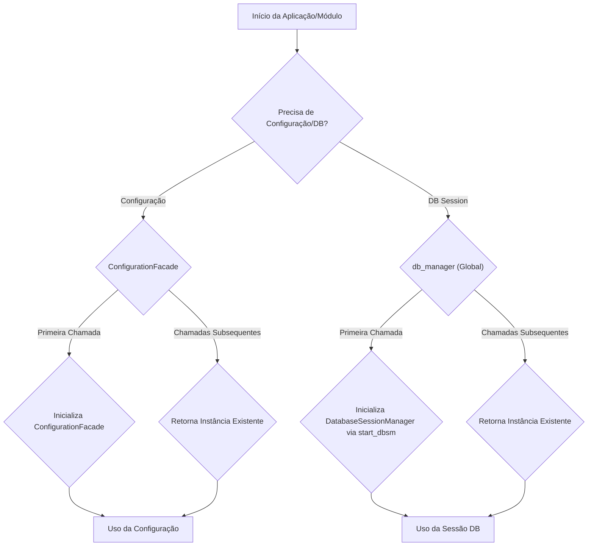
```mermaid
graph TD
    A[Início da Aplicação/Módulo] --> B{Precisa de Configuração/DB?};
    B -- Configuração --> C{ConfigurationFacade};
    C -- Primeira Chamada --> D{Inicializa ConfigurationFacade};
    C -- Chamadas Subsequentes --> E{Retorna Instância Existente};
    B -- DB Session --> F{"db_manager (Global)"};
    F -- Primeira Chamada --> G{Inicializa DatabaseSessionManager via start_dbsm};
    F -- Chamadas Subsequentes --> H{Retorna Instância Existente};
    D --> I[Uso da Configuração];
    E --> I;
    G --> J[Uso da Sessão DB];
    H --> J;
```

##### 1.1.2. Diagrama de Classe (Antes):

Snippet de código

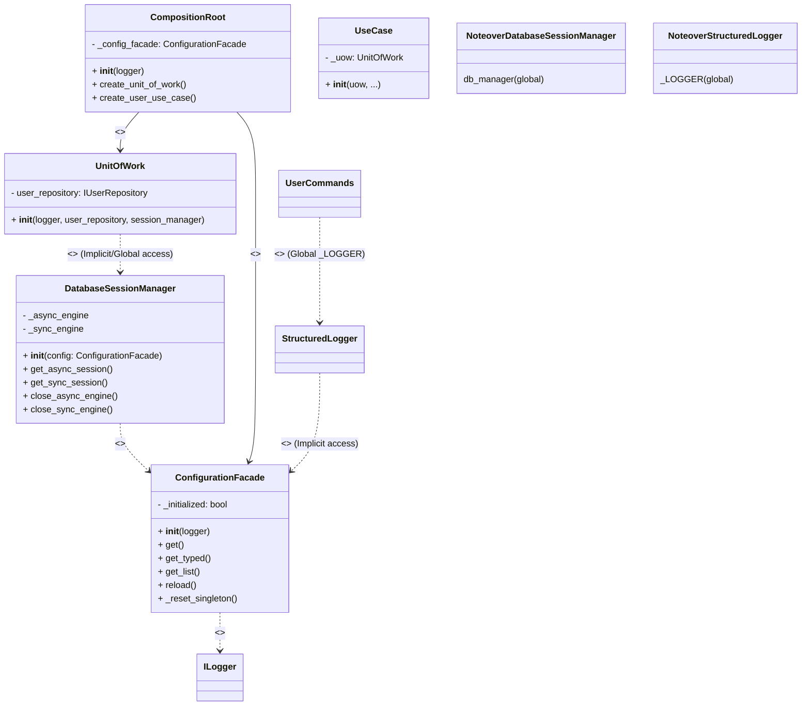
```mermaid
classDiagram
    class ConfigurationFacade {
        - _initialized: bool
        + __init__(logger)
        + get()
        + get_typed()
        + get_list()
        + reload()
        + _reset_singleton()
    }
    class DatabaseSessionManager {
        - _async_engine
        - _sync_engine
        + __init__(config: ConfigurationFacade)
        + get_async_session()
        + get_sync_session()
        + close_async_engine()
        + close_sync_engine()
    }
    class CompositionRoot {
        - _config_facade: ConfigurationFacade
        + __init__(logger)
        + create_unit_of_work()
        + create_user_use_case()
    }
    class UseCase {
        - _uow: UnitOfWork
        + __init__(uow, ...)
    }
    class UnitOfWork {
        - user_repository: IUserRepository
        + __init__(logger, user_repository, session_manager)
    }

    ConfigurationFacade ..> ILogger : <<uses>>
    DatabaseSessionManager ..> ConfigurationFacade : <<uses>>
    CompositionRoot --> ConfigurationFacade : <<creates>>
    CompositionRoot --> UnitOfWork : <<creates>>
    UnitOfWork ..> DatabaseSessionManager : <<uses>> (Implicit/Global access)
    StructuredLogger ..> ConfigurationFacade : <<uses>> (Implicit access)
    UserCommands ..> StructuredLogger : <<uses>> (Global _LOGGER)

    Note over DatabaseSessionManager : db_manager (global)
    Note over StructuredLogger : _LOGGER (global)
```

##### 1.1.3. Diagrama de Sequência (Antes):

Snippet de código

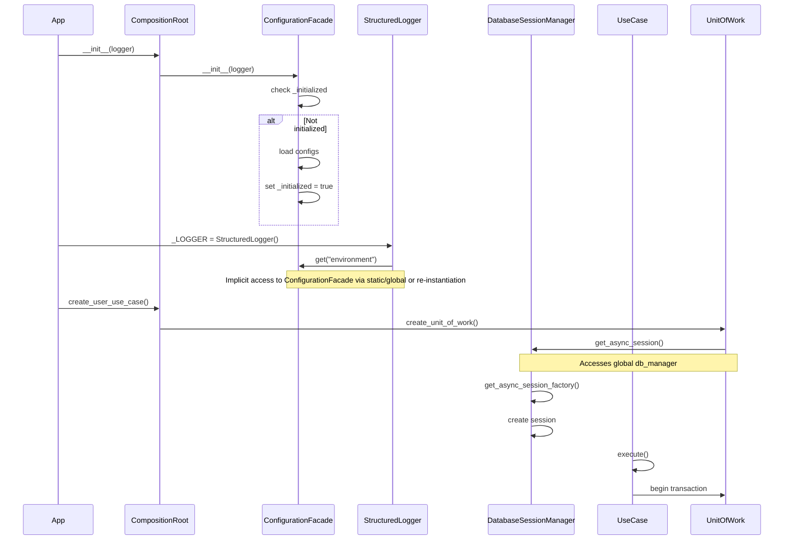
```mermaid
sequenceDiagram
    participant App
    participant CR as CompositionRoot
    participant CF as ConfigurationFacade
    participant SL as StructuredLogger
    participant DSM as DatabaseSessionManager
    participant UC as UseCase
    participant UoW as UnitOfWork

    App->>CR: __init__(logger)
    CR->>CF: __init__(logger)
    CF->>CF: check _initialized
    alt Not initialized
        CF->>CF: load configs
        CF->>CF: set _initialized = true
    end
    App->>SL: _LOGGER = StructuredLogger()
    SL->>CF: get("environment")
    note over SL,CF: Implicit access to ConfigurationFacade via static/global or re-instantiation
    App->>CR: create_user_use_case()
    CR->>UoW: create_unit_of_work()
    UoW->>DSM: get_async_session()
    note over UoW,DSM: Accesses global db_manager
    DSM->>DSM: get_async_session_factory()
    DSM->>DSM: create session
    UC->>UC: execute()
    UC->>UoW: begin transaction
```

##### 1.1.4. Trechos de código (Antes):

`src/dev_platform/infrastructure/config.py` - `ConfigurationFacade` initialization5:

Python

```python
class ConfigurationFacade:
    def __init__(
        self,
        logger: ILogger,
        env_loader_factory: Optional[Callable[[str, ILogger], EnvLoader]] = None,
        json_loader_factory: Optional[Callable[[str, ILogger], JsonConfigLoader]] = None,
        validator_factory: Optional[Callable[[str, ILogger], ConfigValidator]] = None,
        accessor_factory: Optional[Callable[[Dict[str, Any], ILogger], ConfigAccessor]] = None,
        environment: Optional[str] = None,
    ) -> None:
        if hasattr(self, "_initialized") and self._initialized: # <--- Implicit singleton check
            return
        self._environment: str = environment or os.getenv("ENVIRONMENT", "production")
        self._logger: ILogger = logger
        env_loader: EnvLoader = (env_loader_factory or EnvLoader)(self._environment, self._logger)
        env_loader.load()
        json_loader: JsonConfigLoader = (json_loader_factory or JsonConfigLoader)(self._environment, self._logger)
        config_dict: Dict[str, Any] = json_loader.load()
        validator: ConfigValidator = (validator_factory or ConfigValidator)(self._environment, self._logger)
        validator.validate()
        self._accessor: ConfigAccessor = (accessor_factory or ConfigAccessor)(config_dict, self._logger)
        self._initialized: bool = True # <--- Flag de inicialização
```

`src/dev_platform/infrastructure/database/session.py` - `DatabaseSessionManager` global instance6:

Python

```python
# Instância global do gerenciador de sessões
db_manager = None # <--- Variável global

def start_dbsm(logger: ILogger) -> DatabaseSessionManager:
    """
    Inicializa o gerenciador da sessão do banco de dados.
    """
    configuration_facade = ConfigurationFacade(logger) # <--- Cria nova instância de ConfigurationFacade
    return DatabaseSessionManager(configuration_facade)
```

`src/dev_platform/infrastructure/logging/structured_logger.py` - Accessing ConfigurationFacade implicitly7:

Python

```python
class StructuredLogger(ILogger):
    def __init__(self, name: str = "DEV Platform", config: Optional[ConfigurationFacade] = None):
        self._name = name
        self._config = config
        self._configure_logger()

    def _configure_logger(self):
        # ...
        environment = self._config.get("environment", "production") if self._config else "production" # <--- If config is None, uses default
        log_level = self._config.get("logging_level", "INFO").upper() if self._config else "INFO"
        # ...
```

#### 1.2. Proposta para Implementação da Solução (Depois):

A solução proposta é centralizar a criação e gestão do ciclo de vida da `ConfigurationFacade` e do `DatabaseSessionManager` _exclusivamente_ na `CompositionRoot`, passando-os explicitamente como dependências para os componentes que deles necessitam. Isso elimina o estado global e a inicialização implícita, tornando o fluxo de dependências claro e controlável.

As mudanças incluem:

1. **Remover lógica de singleton implícito da `ConfigurationFacade`**: A `ConfigurationFacade` não deve mais se preocupar em ser um singleton; sua unicidade será garantida pela `CompositionRoot`.
    
2. **Remover variável global `db_manager` e função `start_dbsm`**: O `DatabaseSessionManager` será instanciado e gerido pela `CompositionRoot`.
    
3. **Injetar `ConfigurationFacade` e `DatabaseSessionManager`**: Onde quer que esses objetos sejam necessários (e.g., `StructuredLogger`, `UnitOfWork`), eles serão recebidos via construtor.
    
4. **Ajustar `CompositionRoot`**: A `CompositionRoot` se torna a única responsável por criar e gerenciar essas instâncias.
    

##### 1.2.1. Fluxograma (Depois):

Snippet de código

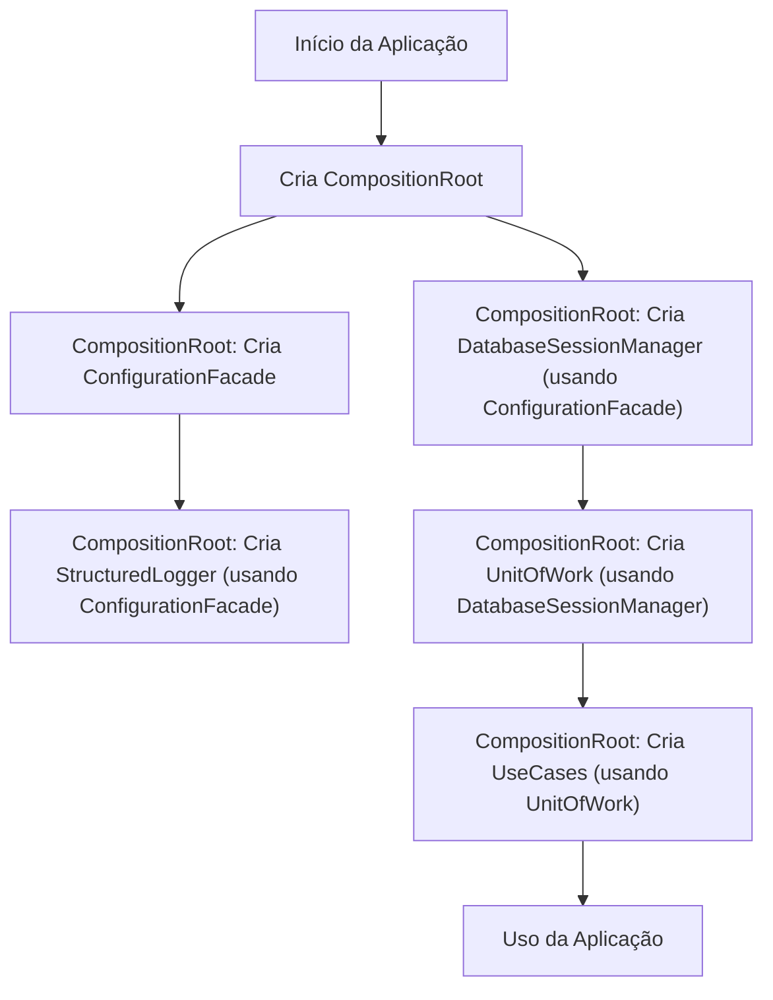
```mermaid
graph TD
    A[Início da Aplicação] --> B[Cria CompositionRoot];
    B --> C[CompositionRoot: Cria ConfigurationFacade];
    B --> D["CompositionRoot: Cria DatabaseSessionManager (usando ConfigurationFacade)"];
    C --> E["CompositionRoot: Cria StructuredLogger (usando ConfigurationFacade)"];
    D --> F["CompositionRoot: Cria UnitOfWork (usando DatabaseSessionManager)"];
    F --> G["CompositionRoot: Cria UseCases (usando UnitOfWork)"];
    G --> H[Uso da Aplicação];
```

##### 1.2.2. Diagrama de Classe (Depois):

Snippet de código

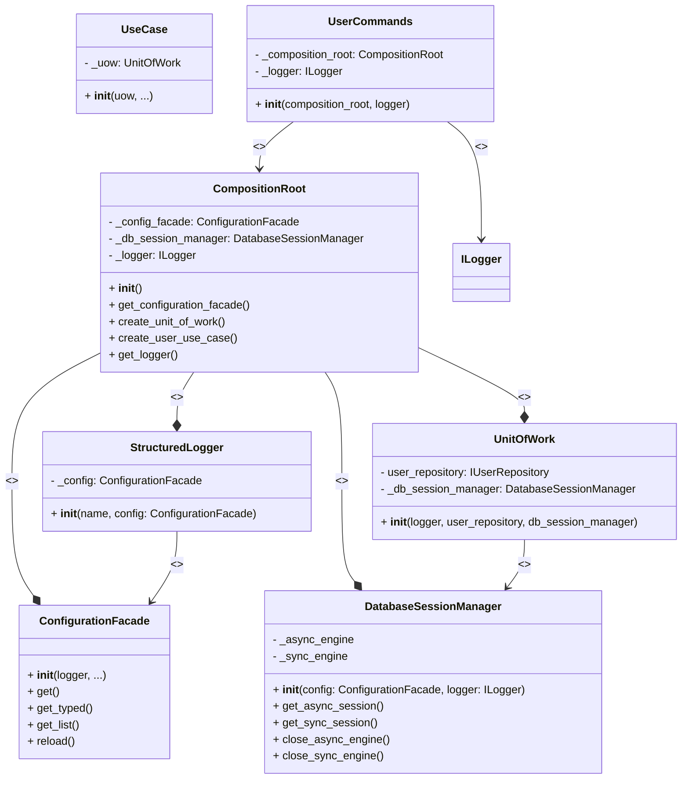
```mermaid
classDiagram
    class ConfigurationFacade {
        + __init__(logger, ...)
        + get()
        + get_typed()
        + get_list()
        + reload()
    }
    class DatabaseSessionManager {
        - _async_engine
        - _sync_engine
        + __init__(config: ConfigurationFacade, logger: ILogger)
        + get_async_session()
        + get_sync_session()
        + close_async_engine()
        + close_sync_engine()
    }
    class CompositionRoot {
        - _config_facade: ConfigurationFacade
        - _db_session_manager: DatabaseSessionManager
        - _logger: ILogger
        + __init__()
        + get_configuration_facade()
        + create_unit_of_work()
        + create_user_use_case()
        + get_logger()
    }
    class StructuredLogger {
        - _config: ConfigurationFacade
        + __init__(name, config: ConfigurationFacade)
    }
    class UnitOfWork {
        - user_repository: IUserRepository
        - _db_session_manager: DatabaseSessionManager
        + __init__(logger, user_repository, db_session_manager)
    }
    class UseCase {
        - _uow: UnitOfWork
        + __init__(uow, ...)
    }
    class UserCommands {
        - _composition_root: CompositionRoot
        - _logger: ILogger
        + __init__(composition_root, logger)
    }

    CompositionRoot --* ConfigurationFacade : <<creates and manages>>
    CompositionRoot --* DatabaseSessionManager : <<creates and manages>>
    CompositionRoot --* StructuredLogger : <<creates and manages>>
    CompositionRoot --* UnitOfWork : <<creates and manages>>
    UnitOfWork --> DatabaseSessionManager : <<uses>>
    StructuredLogger --> ConfigurationFacade : <<uses>>
    UserCommands --> CompositionRoot : <<uses>>
    UserCommands --> ILogger : <<uses>>
```

##### 1.2.3. Diagrama de Sequência (Depois):

Snippet de código

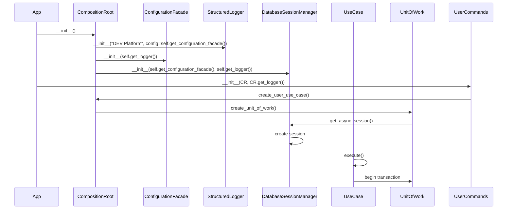
```mermaid
sequenceDiagram
    participant App
    participant CR as CompositionRoot
    participant CF as ConfigurationFacade
    participant SL as StructuredLogger
    participant DSM as DatabaseSessionManager
    participant UC as UseCase
    participant UoW as UnitOfWork
    participant CLI as UserCommands

    App->>CR: __init__()
    CR->>SL: __init__("DEV Platform", config=self.get_configuration_facade())
    CR->>CF: __init__(self.get_logger())
    CR->>DSM: __init__(self.get_configuration_facade(), self.get_logger())
    App->>CLI: __init__(CR, CR.get_logger())
    CLI->>CR: create_user_use_case()
    CR->>UoW: create_unit_of_work()
    UoW->>DSM: get_async_session()
    DSM->>DSM: create session
    UC->>UC: execute()
    UC->>UoW: begin transaction
```

##### 1.2.4. Trechos de código (Depois):

**`src/dev_platform/infrastructure/config.py` - `ConfigurationFacade` initialization (AFTER):**

Python

```python
from typing import Any, Callable, Dict, Optional, Type
import os
import json
from dotenv import load_dotenv
from dev_platform.domain.exceptions import ConfigurationException
from dev_platform.application.ports.logger import ILogger

# (Outras classes como EnvLoader, JsonConfigLoader, etc. permanecem as mesmas ou adaptadas para aceitar logger explicitamente)

class ConfigurationFacade:
    def __init__(
        self,
        logger: ILogger,
        env_loader_factory: Optional[Callable[[str, ILogger], 'EnvLoader']] = None,
        json_loader_factory: Optional[Callable[[str, ILogger], 'JsonConfigLoader']] = None,
        validator_factory: Optional[Callable[[str, ILogger], 'ConfigValidator']] = None,
        accessor_factory: Optional[Callable[[Dict[str, Any], ILogger], 'ConfigAccessor']] = None,
        environment: Optional[str] = None,
    ) -> None:
        # Removido o check de _initialized e _reset_singleton
        self._environment: str = environment or os.getenv("ENVIRONMENT", "production")
        self._logger: ILogger = logger
        env_loader: 'EnvLoader' = (env_loader_factory or EnvLoader)(self._environment, self._logger)
        env_loader.load()
        json_loader: 'JsonConfigLoader' = (json_loader_factory or JsonConfigLoader)(self._environment, self._logger)
        config_dict: Dict[str, Any] = json_loader.load()
        validator: 'ConfigValidator' = (validator_factory or ConfigValidator)(self._environment, self._logger)
        validator.validate()
        self._accessor: 'ConfigAccessor' = (accessor_factory or ConfigAccessor)(config_dict, self._logger)

    @classmethod
    def _reset_singleton(cls) -> None:
        # Este método deve ser removido ou marcado como obsoleto,
        # pois a fachada não será mais um singleton interno.
        pass
    
    def get(self, key: str, default: Any = None) -> Any:
        return self._accessor.get(key, default)

    def get_typed(self, key: str, default: Any = None, cast_type: Type = str) -> Any:
        return self._accessor.get_typed(key, default, cast_type)

    def get_list(self, key: str, default: Optional[List[str]] = None) -> List[str]:
        return self._accessor.get_list(key, default)

    def get_all_config(self) -> Dict[str, Any]:
        return self._accessor.get_all_config()

    def reload(self) -> None:
        env_loader: 'EnvLoader' = EnvLoader(self._environment, self._logger)
        env_loader.load()
        json_loader: 'JsonConfigLoader' = JsonConfigLoader(self._environment, self._logger)
        config_dict: Dict[str, Any] = json_loader.load()
        validator: 'ConfigValidator' = ConfigValidator(self._environment, self._logger)
        validator.validate()
        self._accessor = ConfigAccessor(config_dict, self._logger)
        self._logger.info("Configurações recarregadas dinamicamente.")

    @property
    def database_url(self) -> str:
        url = self.get("DATABASE_URL")
        if not url:
            raise ConfigurationException(
                config_key="DATABASE_URL",
                reason="DATABASE_URL is not configured for the current environment."
            )
        return DatabaseDriverChecker.ensure_async_driver(url)
```

**`src/dev_platform/infrastructure/database/session.py` - `DatabaseSessionManager` (AFTER):**

Python

```python
from typing import AsyncGenerator, Optional
from contextlib import asynccontextmanager

from sqlalchemy.ext.asyncio import create_async_engine, AsyncSession, async_sessionmaker, AsyncEngine
from sqlalchemy.orm import sessionmaker, Session, declarative_base
from sqlalchemy import create_engine
from dev_platform.infrastructure.config import ConfigurationFacade
from dev_platform.application.ports.logger import ILogger

Base = declarative_base()

class DatabaseSessionManager:
    def __init__(self, config: ConfigurationFacade, logger: ILogger): # <--- Injeta ConfigurationFacade e ILogger
        self._config = config
        self._logger = logger
        self._async_engine: Optional[AsyncEngine] = None
        self._async_session_factory: Optional[async_sessionmaker] = None
        self._sync_engine: Optional[Engine] = None
        self._sync_session_factory: Optional[sessionmaker] = None
        self._initialize_engines() # <--- Adicionado para inicializar na construção

    def _initialize_engines(self) -> None:
        pool_config = {
            "pool_size": self._config.get_typed("db_pool_size", 5, int),
            "max_overflow": self._config.get_typed("db_max_overflow", 10, int),
            "pool_recycle": 3600,
        }

        async_url = self._config.database_url
        self._async_engine = create_async_engine(
            async_url, echo=self._config.get_typed("db_echo", False, bool), **pool_config
        )
        self._async_session_factory = async_sessionmaker(
            bind=self._async_engine, class_=AsyncSession, expire_on_commit=False
        )

        if not async_url.startswith("sqlite+aiosqlite"):
            sync_url = self._config.get("DATABASE_URL")
            self._sync_engine = create_engine(
                sync_url, echo=self._config.get_typed("db_echo", False, bool), **pool_config
            )
            self._sync_session_factory = sessionmaker(
                bind=self._sync_engine, autocommit=False, autoflush=False
            )

    def get_async_session_factory(self):
        return self._async_session_factory

    @asynccontextmanager
    async def get_async_session(self) -> AsyncGenerator[AsyncSession, None]:
        if self._async_session_factory is None:
            raise RuntimeError("Async session factory is not initialized")
        session = self._async_session_factory()
        try:
            yield session
        finally:
            await session.close()

    def get_sync_session(self) -> Session:
        if not self._sync_session_factory:
            raise RuntimeError("Sync session not available for this database type")
        return self._sync_session_factory()

    async def close_async_engine(self):
        if self._async_engine:
            await self._async_engine.dispose()

    def close_sync_engine(self):
        if self._sync_engine:
            self._sync_engine.dispose()

    @property
    def async_engine(self) -> AsyncEngine:
        return self._async_engine

    @property
    def sync_engine(self) -> Session: # Tipo de retorno ajustado para Session, era Engine
        return self._sync_engine

# Removido: db_manager = None
# Removido: def start_dbsm(...)
# Removido: Funções de conveniência que dependem de db_manager global
```

**`src/dev_platform/infrastructure/logging/structured_logger.py` - `StructuredLogger` (AFTER):**

Python

```python
from typing import Optional, Any, Dict
import os
from uuid import uuid4
from loguru import logger
from dev_platform.infrastructure.config import ConfigurationFacade
from dev_platform.application.ports.logger import ILogger

class StructuredLogger(ILogger):
    def __init__(self, name: str = "DEV Platform", config: ConfigurationFacade = None): # <--- Config é injetado, não mais opcional com fallback global
        self._name = name
        if config is None:
            raise ValueError("ConfigurationFacade must be provided to StructuredLogger.")
        self._config = config
        self._configure_logger()

    def _configure_logger(self):
        logger.remove()
        environment = self._config.get("environment", "production") # Agora config é garantido
        log_level = self._config.get("logging_level", "INFO").upper()

        log_levels = {
            "DEBUG": "DEBUG", "INFO": "INFO", "WARNING": "WARNING", "ERROR": "ERROR", "CRITICAL": "CRITICAL"
        }
        effective_log_level = log_levels.get(log_level, "INFO")

        logger.add(
            sys.stderr,
            level=effective_log_level,
            format="{time} {level} {message}",
            colorize=True,
            backtrace=True,
            diagnose=True,
        )

        if environment == "production":
            logger.add(
                "logs/file.log",
                rotation="10 MB",
                retention="1 week",
                compression="zip",
                level=effective_log_level,
                format="{time:YYYY-MM-DD HH:mm:ss.SSS} | {level: <8} | {process.name: <10} | {thread.name: <10} | {file.name}:{line} {function} - {message}",
                serialize=True,
                enqueue=True,
            )

    def debug(self, message: str, **kwargs: Any) -> None:
        logger.debug(message, **kwargs)

    def info(self, message: str, **kwargs: Any) -> None:
        logger.info(message, **kwargs)

    def warning(self, message: str, **kwargs: Any) -> None:
        logger.warning(message, **kwargs)

    def error(self, message: str, **kwargs: Any) -> None:
        logger.error(message, **kwargs)

    def critical(self, message: str, **kwargs: Any) -> None:
        logger.critical(message, **kwargs)

    def log(self, level: str, message: str, **kwargs: Any) -> None:
        logger.log(level.upper(), message, **kwargs)
```

**`src/dev_platform/infrastructure/composition_root.py` - `CompositionRoot` (AFTER):**

Python

```python
from typing import List
from dev_platform.application.user.use_cases import (
    CreateUserUseCase, ListUsersUseCase, UpdateUserUseCase, GetUserUseCase, DeleteUserUseCase,
)
from dev_platform.domain.user.services import (
    UserAnalyticsService, UserUniquenessService, UserValidatorService
)
from dev_platform.domain.validation_rules import (
    EmailFormatAdvancedValidationRule, NameContentValidationRule, EmailDomainValidationRule,
    BusinessHoursValidationRule, NameProfanityValidationRule, ForbiddenWordsValidationRule,
    ValidationRule, UserCountLimitValidationRule
)
from dev_platform.infrastructure.config import ConfigurationFacade
from dev_platform.application.ports.logger import ILogger
from dev_platform.application.user.ports import UnitOfWork
from dev_platform.infrastructure.database.unit_of_work import SQLUnitOfWork
from dev_platform.domain.user.interfaces import IUserRepository
from dev_platform.infrastructure.database.repositories import SQLUserRepository
from dev_platform.application.user.mappers import UserMapper
from dev_platform.infrastructure.logging.structured_logger import StructuredLogger # Importa
from dev_platform.infrastructure.database.session import DatabaseSessionManager # Importa
from dev_platform.domain.user.user_types import UserType # Importa o Enum

class ValidationRuleProvider:
    def __init__(
        self,
        default_allowed_domains: List[str],
        default_forbidden_words: List[str],
        enterprise_allowed_domains: List[str],
        enterprise_forbidden_words: List[str],
        enable_profanity_filter: bool,
        repository: IUserRepository,
        logger: ILogger
    ):
        self._default_allowed_domains = default_allowed_domains
        self._default_forbidden_words = default_forbidden_words
        self._enterprise_allowed_domains = enterprise_allowed_domains
        self._enterprise_forbidden_words = enterprise_forbidden_words
        self._enable_profanity_filter = enable_profanity_filter
        self._repository = repository
        self._logger = logger

    def _default_rules(self) -> List[ValidationRule]:
        return [
            EmailFormatAdvancedValidationRule(),
            NameContentValidationRule(),
            EmailDomainValidationRule(self._default_allowed_domains),
            NameProfanityValidationRule(forbidden_words=self._default_forbidden_words),
            UserCountLimitValidationRule(repository=self._repository)
        ]

    def get_rules(self, user_type: UserType = UserType.DEFAULT) -> List[ValidationRule]: # Usa Enum
        if user_type == UserType.ENTERPRISE: # Usa Enum
            return self._enterprise_rules()
        return self._default_rules()

    def _enterprise_rules(self) -> List[ValidationRule]:
        if self._enable_profanity_filter and not self._enterprise_forbidden_words:
            self._logger.warning("Profanity filter enabled for enterprise, but forbidden words list is empty.")
        rules: List[ValidationRule] = [
            EmailFormatAdvancedValidationRule(),
            NameContentValidationRule(),
            EmailDomainValidationRule(self._enterprise_allowed_domains),
            NameProfanityValidationRule(forbidden_words=self._enterprise_forbidden_words),
            ForbiddenWordsValidationRule(forbidden_words=self._enterprise_forbidden_words),
            BusinessHoursValidationRule(True),
        ]
        return rules

class CompositionRoot:
    def __init__(self):
        self._logger: ILogger # Declara o tipo antes de inicializar para evitar circular dependency ao instanciar StructuredLogger
        self._config_facade = ConfigurationFacade(logger=self._get_temp_logger()) # Cria ConfigurationFacade primeiro com um logger temporário
        self._logger = StructuredLogger(config=self._config_facade) # Agora StructuredLogger usa a config facade
        self._db_session_manager = DatabaseSessionManager(
            config=self._config_facade,
            logger=self._logger
        )
        self._user_mapper = UserMapper()

    def _get_temp_logger(self) -> ILogger:
        # Cria um logger simples temporário para ConfigurationFacade durante a inicialização
        class TempLogger(ILogger):
            def debug(self, message: str, **kwargs: Any) -> None: pass
            def info(self, message: str, **kwargs: Any) -> None: pass
            def warning(self, message: str, **kwargs: Any) -> None: pass
            def error(self, message: str, **kwargs: Any) -> None: pass
            def critical(self, message: str, **kwargs: Any) -> None: pass
            def log(self, level: str, message: str, **kwargs: Any) -> None: pass
        return TempLogger()

    def get_logger(self) -> ILogger:
        return self._logger

    def get_configuration_facade(self) -> ConfigurationFacade:
        return self._config_facade

    def _create_validation_provider(self, repository: IUserRepository) -> ValidationRuleProvider:
        return ValidationRuleProvider(
            default_allowed_domains=self._config_facade.get_list("allowed_domains"),
            default_forbidden_words=self._config_facade.get_list("validation_forbidden_words"),
            enterprise_allowed_domains=self._config_facade.get_list("enterprise_allowed_domains"),
            enterprise_forbidden_words=self._config_facade.get_list("enterprise_forbidden_words"),
            enable_profanity_filter=self._config_facade.get_typed("validation_enable_profanity_filter", False, bool),
            repository=repository,
            logger=self._logger
        )

    def _create_user_repository(self) -> IUserRepository:
        return SQLUserRepository(session=None, logger=self._logger)

    def create_unit_of_work(self) -> UnitOfWork:
        user_repo: SQLUserRepository = self._create_user_repository()
        return SQLUnitOfWork(
            logger=self._logger,
            user_repository=user_repo,
            db_session_manager=self._db_session_manager # <--- Injeta DatabaseSessionManager
        )

    def create_user_use_case(self) -> CreateUserUseCase:
        uow: SQLUnitOfWork = self.create_unit_of_work()
        user_repository: IUserRepository = uow.user_repository
        rule_provider = self._create_validation_provider(user_repository)
        validator_service = UserValidatorService(rule_provider.get_rules(UserType.DEFAULT)) # Usa Enum
        return CreateUserUseCase(
            uow=uow,
            user_validator=validator_service,
            user_uniqueness_service=self.user_uniqueness_service(user_repository),
            logger=self._logger,
            mapper=self._user_mapper
        )

    def list_users_use_case(self) -> ListUsersUseCase:
        uow: SQLUnitOfWork = self.create_unit_of_work()
        return ListUsersUseCase(
            uow=uow,
            logger=self._logger,
            mapper=self._user_mapper
        )

    def update_user_use_case(self) -> UpdateUserUseCase:
        uow: SQLUnitOfWork = self.create_unit_of_work()
        user_repository: IUserRepository = uow.user_repository
        rule_provider = self._create_validation_provider(user_repository)
        validator_service = UserValidatorService(rule_provider.get_rules(UserType.DEFAULT)) # Usa Enum
        uniqueness_service = UserUniquenessService(user_repository)
        return UpdateUserUseCase(
            uow=uow,
            logger=self._logger,
            mapper=self._user_mapper,
            user_validator=validator_service,
            user_uniqueness_service=uniqueness_service,
        )

    def get_user_use_case(self) -> GetUserUseCase:
        uow: SQLUnitOfWork = self.create_unit_of_work()
        user_repository: IUserRepository = uow.user_repository
        rule_provider = self._create_validation_provider(user_repository)
        validator_service = UserValidatorService(rule_provider.get_rules(UserType.DEFAULT)) # Usa Enum
        uniqueness_service = UserUniquenessService(user_repository)
        return GetUserUseCase(
            uow=uow,
            user_validator=validator_service,
            domain_service=self.user_domain_service(UserType.DEFAULT), # Usa Enum
            logger=self._logger,
            mapper=self._user_mapper,
            user_uniqueness_service=uniqueness_service
        )

    def delete_user_use_case(self) -> DeleteUserUseCase:
        uow: SQLUnitOfWork = self.create_unit_of_work()
        user_repository: IUserRepository = uow.user_repository
        rule_provider = self._create_validation_provider(user_repository)
        validator_service = UserValidatorService(rule_provider.get_rules(UserType.DEFAULT)) # Usa Enum
        uniqueness_service = UserUniquenessService(user_repository)
        return DeleteUserUseCase(
            uow=uow,
            user_validator=validator_service,
            domain_service=self.user_domain_service(UserType.DEFAULT), # Usa Enum
            logger=self._logger,
            mapper=self._user_mapper,
            user_uniqueness_service=uniqueness_service
        )

    def user_domain_service(self, user_type: UserType = UserType.DEFAULT) -> UserValidatorService: # Usa Enum
        rules = self._create_validation_provider(self._create_user_repository()).get_rules(user_type) # Adaptação
        return UserValidatorService(validation_rules=rules)

    def user_uniqueness_service(self, user_repository: IUserRepository) -> UserUniquenessService:
        return UserUniquenessService(user_repository)

    def user_analytics_service(self, user_repository: IUserRepository) -> UserAnalyticsService:
        return UserAnalyticsService(user_repository)
```

**`src/dev_platform/infrastructure/database/unit_of_work.py` (assumindo que `SQLUnitOfWork` é implementado aqui) - `SQLUnitOfWork` (AFTER):**

Python

```python
from typing import AsyncGenerator
from contextlib import asynccontextmanager

from dev_platform.application.ports.logger import ILogger
from dev_platform.domain.user.interfaces import IUserRepository
from dev_platform.application.user.ports import UnitOfWork
from dev_platform.infrastructure.database.session import DatabaseSessionManager # Importa

class SQLUnitOfWork(UnitOfWork):
    def __init__(self, logger: ILogger, user_repository: IUserRepository, db_session_manager: DatabaseSessionManager):
        self._logger = logger
        self._user_repository = user_repository
        self._db_session_manager = db_session_manager

    @property
    def user_repository(self) -> IUserRepository:
        if self.session is None:
            raise RuntimeError("Session not available. Call UoW from an async with block.")
        self._user_repository.session = self.session # Garante que o repositório use a sessão atual
        return self._user_repository

    async def __aenter__(self):
        self.session = await self._db_session_manager.get_async_session().__aenter__()
        return self

    async def __aexit__(self, exc_type, exc_val, exc_tb):
        if exc_type is not None:
            await self.rollback()
        else:
            await self.commit()
        await self._db_session_manager.get_async_session().__aexit__(exc_type, exc_val, exc_tb)
        self.session = None

    async def commit(self) -> None:
        if self.session:
            await self.session.commit()

    async def rollback(self) -> None:
        if self.session:
            await self.session.rollback()
```

#### 1.3. Discussão das Vantagens e Desvantagens:

#### Vantagens:

- **Maior Testabilidade:** Permite que `ConfigurationFacade`, `DatabaseSessionManager`, `StructuredLogger` e `UnitOfWork` sejam facilmente testados em isolamento. Mocks e fakes podem ser injetados durante os testes, eliminando dependências de estado global ou de arquivos reais. 8 (para
    
    `_reset_singleton` workaround)
    
- **Acoplamento Reduzido:** Remove as dependências de componentes em variáveis globais ou instâncias implicitamente únicas. As dependências são explicitamente declaradas nos construtores, seguindo o Princípio da Inversão de Dependência.
    
- **Maior Clareza e Rastreabilidade:** O fluxo de dependências é explícito e fácil de rastrear. É imediatamente óbvio quais componentes precisam de configuração ou acesso ao banco de dados.
    
- **Flexibilidade Aumentada:** Facilita a substituição de implementações. Por exemplo, em ambientes de teste ou desenvolvimento, pode-se injetar configurações ou managers de sessão de banco de dados diferentes sem alterar o código principal.
    
- **Manutenibilidade:** O código se torna mais previsível e fácil de manter, pois as interações entre os componentes são diretas e claras, sem efeitos colaterais de estado global.
    

#### Desvantagens:

- **Aumento de Código Boilerplate na `CompositionRoot`:** A `CompositionRoot` se torna mais complexa, pois precisa orquestrar a criação e injeção de todas as dependências, incluindo as anteriormente globais/implícitas.
    
- **Ajuste de Assinaturas de Construtores:** Muitos construtores de classes precisarão ser atualizados para aceitar as novas dependências. Isso pode exigir refatorações significativas em todo o codebase.
    
- **Curva de Aprendizagem (para iniciantes):** Para desenvolvedores menos familiarizados com Injeção de Dependências, o padrão pode parecer inicialmente mais complexo do que o acesso a singletons globais.
    

#### 1.4. Impactos da Alteração:

- **Impacto no Código Existente:**
    
    - **`ConfigurationFacade`:** O método `_reset_singleton` e a lógica interna de `_initialized` precisam ser removidos ou adaptados.
        
    - **`DatabaseSessionManager`:** A classe precisará de um construtor que aceite `ConfigurationFacade` e `ILogger`. A lógica de inicialização dos engines deve ser movida para o `__init__`. Todas as funções globais como `start_dbsm` e `get_async_session` (de conveniência) deverão ser removidas.
        
    - **`StructuredLogger`:** Seu construtor precisará exigir uma `ConfigurationFacade` (não mais opcional).
        
    - **`UnitOfWork` (e suas implementações):** O construtor precisará aceitar uma instância de `DatabaseSessionManager`. A forma como a sessão é obtida (`__aenter__` e `__aexit__`) será alterada para usar o manager injetado.
        
    - **`CompositionRoot`:** Será o ponto central para a criação e gestão do ciclo de vida de `ConfigurationFacade`, `DatabaseSessionManager`, e `StructuredLogger`.
        
    - **Módulos Cliente:** Quaisquer módulos (como `user_commands.py` 9) que atualmente acessam
        
        `db_manager` globalmente ou instanciam `StructuredLogger` sem passar a configuração precisarão ser ajustados para receber essas dependências via `CompositionRoot`.
        
- **Impactos Esperados no Projeto:**
    
    - **Arquitetura:** Fortalece a adesão à Arquitetura Limpa e ao Princípio da Inversão de Dependência, resultando em uma arquitetura mais robusta e modular.
        
    - **Manutenibilidade:** O código se torna mais fácil de entender, modificar e estender, pois as dependências são transparentes.
        
    - **Testabilidade:** Melhoria drástica na capacidade de realizar testes unitários e de integração, permitindo isolar componentes e simular cenários de forma mais eficaz.
        
    - **Escalabilidade:** A separação de preocupações e a flexibilidade na injeção de dependências facilitam a adaptação do sistema a novas exigências e a integração com novos serviços ou tecnologias.
        
    - **Desempenho:** Não há impacto direto significativo no desempenho. O overhead de injeção de dependência é geralmente insignificante em comparação com as operações de I/O (banco de dados, rede).
        
    - **Curva de Aprendizado:** Para novos membros da equipe, a adoção de um padrão de injeção de dependências mais formal pode exigir um breve período de adaptação, mas o benefício a longo prazo na compreensão do sistema compensa.
        

---

### 2. Centralização do Tratamento de Erros Repetitivos em Comandos CLI

Os comandos da interface de linha de comando (CLI) definidos em

`user_commands.py` (e.g., `create_user_async` 10,

`list_users_async` 11,

`update_user_async` 12) contêm blocos

`try-except` extensivos e repetitivos. Cada método duplica a lógica de captura de exceções específicas (como `UserAlreadyExistsException`, `UserValidationException`, `ConfigurationException`, `UserNotFoundException`) e a lógica de logging e formatação da mensagem de erro retornada ao usuário.

Essa duplicação de código viola o princípio DRY (Don't Repeat Yourself), tornando o código mais longo, mais difícil de ler, e propenso a erros. Qualquer mudança na forma como as exceções são tratadas ou as mensagens são formatadas exigiria modificações em múltiplos locais, aumentando o custo de manutenção e o risco de inconsistências.

#### 2.1. Descrição da Causa Raiz (Antes):

A causa raiz é a falta de uma abstração ou mecanismo para encapsular a lógica comum de tratamento de erros que é transversal a vários comandos CLI. Cada comando "resolve" o tratamento de erros de forma isolada, copiando e colando a estrutura básica do `try-except`.

- **Duplicação de Código:** A mesma lógica de captura e tratamento de exceções é repetida em cada método de comando.
    
- **Manutenção Dificultada:** Alterações no tratamento de erros ou formatação de mensagens exigem modificações em N lugares.
    
- **Aumento de Superfície de Erro:** A chance de introduzir bugs ou inconsistências é maior quando a mesma lógica é reescrita várias vezes.
    
- **Redução da Legibilidade:** O código dos comandos é poluído pela lógica de tratamento de erros, obscurecendo a intenção principal do comando.
    

##### 2.1.1. Fluxograma (Antes):

Snippet de código

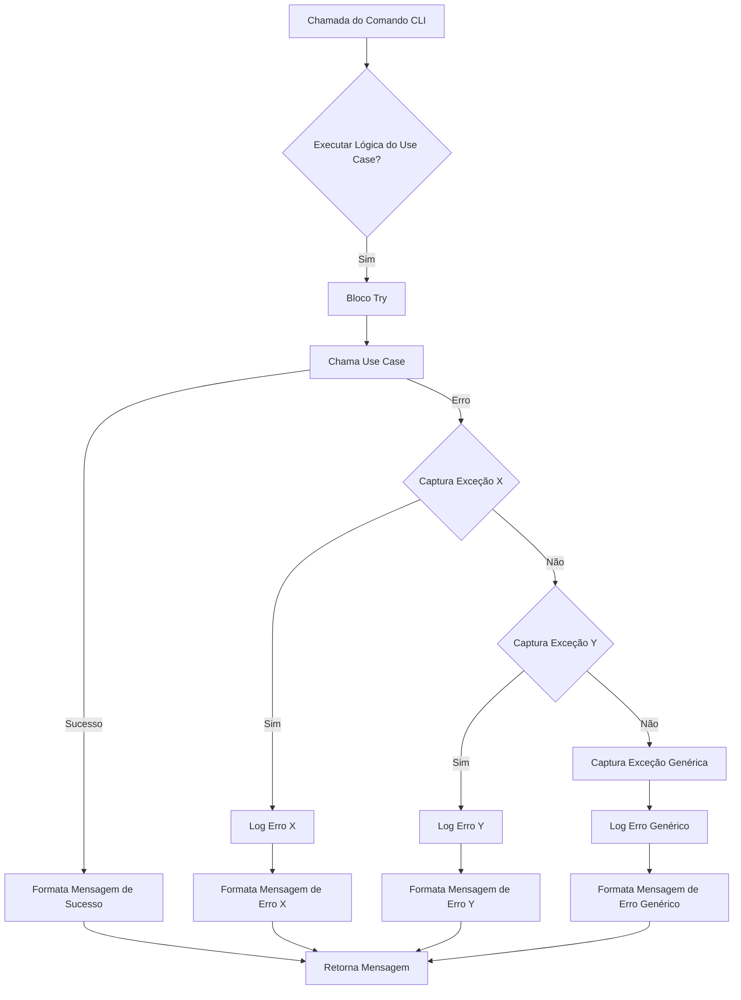
```mermaid
graph TD
    A[Chamada do Comando CLI] --> B{Executar Lógica do Use Case?};
    B -- Sim --> C[Bloco Try];
    C --> D[Chama Use Case];
    D -- Sucesso --> E[Formata Mensagem de Sucesso];
    D -- Erro --> F{Captura Exceção X};
    F -- Sim --> G[Log Erro X];
    G --> H[Formata Mensagem de Erro X];
    F -- Não --> I{Captura Exceção Y};
    I -- Sim --> J[Log Erro Y];
    J --> K[Formata Mensagem de Erro Y];
    I -- Não --> L[Captura Exceção Genérica];
    L --> M[Log Erro Genérico];
    M --> N[Formata Mensagem de Erro Genérico];
    E --> O[Retorna Mensagem];
    H --> O;
    K --> O;
    N --> O;
```

##### 2.1.2. Diagrama de Classe (Antes):

Snippet de código

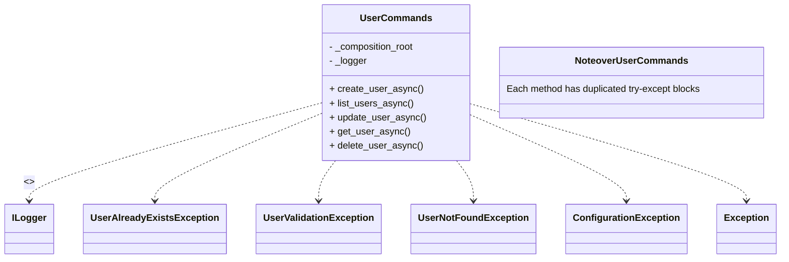
```mermaid
classDiagram
    class UserCommands {
        - _composition_root
        - _logger
        + create_user_async()
        + list_users_async()
        + update_user_async()
        + get_user_async()
        + delete_user_async()
    }
    UserCommands ..> ILogger : <<uses>>
    UserCommands ..> UserAlreadyExistsException
    UserCommands ..> UserValidationException
    UserCommands ..> UserNotFoundException
    UserCommands ..> ConfigurationException
    UserCommands ..> Exception
    Note over UserCommands : Each method has duplicated try-except blocks
```

##### 2.1.3. Diagrama de Sequência (Antes):

Snippet de código

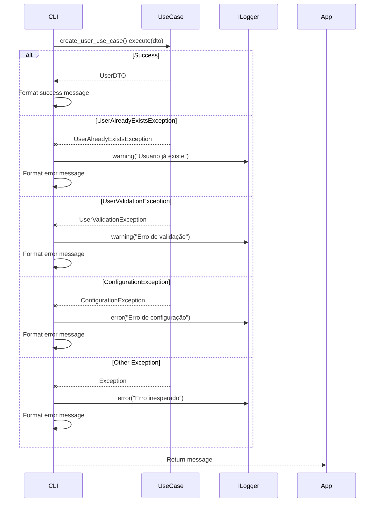
```mermaid
sequenceDiagram
    participant CLI
    participant UC as UseCase
    participant Log as ILogger

    CLI->>UC: create_user_use_case().execute(dto)
    alt Success
        UC-->>CLI: UserDTO
        CLI->>CLI: Format success message
    else UserAlreadyExistsException
        UC--xCLI: UserAlreadyExistsException
        CLI->>Log: warning("Usuário já existe")
        CLI->>CLI: Format error message
    else UserValidationException
        UC--xCLI: UserValidationException
        CLI->>Log: warning("Erro de validação")
        CLI->>CLI: Format error message
    else ConfigurationException
        UC--xCLI: ConfigurationException
        CLI->>Log: error("Erro de configuração")
        CLI->>CLI: Format error message
    else Other Exception
        UC--xCLI: Exception
        CLI->>Log: error("Erro inesperado")
        CLI->>CLI: Format error message
    end
    CLI-->>App: Return message
```

##### 2.1.4. Trechos de código (Antes):

`src/dev_platform/client/cli/user_commands.py` - Exemplo de `create_user_async`13:

Python

```python
class UserCommands:
    # ...
    async def create_user_async(self, name: str, email: str) -> str:
        """ Cria um novo usuário. """
        try:
            use_case = self._composition_root.create_user_use_case()
            dto: UserCreateDTO = UserCreateDTO(name=name, email=email)
            user: UserDTO = await use_case.execute(dto)
            return f"Usuário criado com sucesso: ID {user.id}, Nome: {user.name}, E-mail: {user.email}"
        except UserAlreadyExistsException as e:
            self._logger.warning(f"Usuário já existe: {e}")
            return f"Erro: Usuário já existe: {e}"
        except UserValidationException as e:
            self._logger.warning(f"Erro de validação: {e}")
            return f"Erro: Validação: {e}"
        except ConfigurationException as ce:
            self._logger.error(f"Erro de configuração: {ce}", exception=str(ce))
            return f"Erro: Configuração: {ce}"
        except Exception as e:
            self._logger.error(f"Erro inesperado ao criar usuário: {e}", exception=str(e))
            return f"Erro: Erro inesperado ao criar usuário: {e}"

    async def list_users_async(self) -> List[str]:
        """ Lista todos os usuários. """
        try:
            use_case = self._composition_root.list_users_use_case()
            users: List[UserDTO] = await use_case.execute()
            if not users:
                return ["Nenhum usuário encontrado"]
            result: List[str] = []
            for user in users:
                result.append(f"ID: {user.id}, Nome: {user.name}, E-mail: {user.email}")
            return result
        except UserNotFoundException as e: # <--- Exception específica para list_users
            self._logger.warning(f"Usuário não encontrado: {e}")
            return [f"Erro: Usuário não encontrado: {e}"]
        except UserValidationException as e:
            self._logger.warning(f"Erro de validação: {e}")
            return [f"Erro: Validação: {e}"]
        except ConfigurationException as ce:
            self._logger.error(f"Erro de configuração: {ce}", exception=str(ce))
            return [f"Erro: Configuração: {ce}"]
        except Exception as e:
            self._logger.error(f"Erro inesperado ao listar usuários: {e}", exception=str(e))
            return [f"Erro: Erro inesperado ao listar usuários: {e}"]
```

#### 2.2. Proposta para Implementação da Solução (Depois):

A solução proposta é criar uma função auxiliar ou um decorador para encapsular a lógica comum de tratamento de exceções. Isso reduzirá a duplicação, melhorará a legibilidade e centralizará a lógica de tratamento de erros.

Python

```python
# Exemplo de um dicionário de mapeamento para exceções e suas mensagens/níveis de log
EXCEPTION_MAPPINGS = {
    UserAlreadyExistsException: {"level": "warning", "message": "Usuário já existe: {e}"},
    UserValidationException: {"level": "warning", "message": "Erro de validação: {e}"},
    UserNotFoundException: {"level": "warning", "message": "Usuário não encontrado: {e}"},
    ConfigurationException: {"level": "error", "message": "Erro de configuração: {e}"},
}
```

A função auxiliar pode ser um método da classe `UserCommands` ou uma função standalone.

##### 2.2.1. Fluxograma (Depois):

Snippet de código

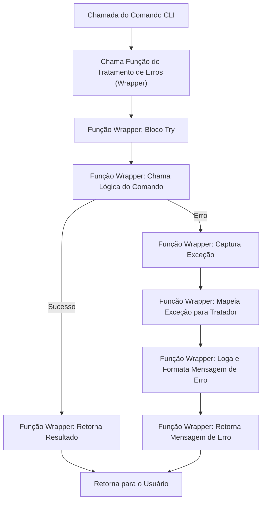
```mermaid
graph TD
    A[Chamada do Comando CLI] --> B["Chama Função de Tratamento de Erros (Wrapper)"];
    B --> C[Função Wrapper: Bloco Try];
    C --> D[Função Wrapper: Chama Lógica do Comando];
    D -- Sucesso --> E[Função Wrapper: Retorna Resultado];
    D -- Erro --> F[Função Wrapper: Captura Exceção];
    F --> G[Função Wrapper: Mapeia Exceção para Tratador];
    G --> H[Função Wrapper: Loga e Formata Mensagem de Erro];
    H --> I[Função Wrapper: Retorna Mensagem de Erro];
    E --> J[Retorna para o Usuário];
    I --> J;
```

##### 2.2.2. Diagrama de Classe (Depois):

Snippet de código

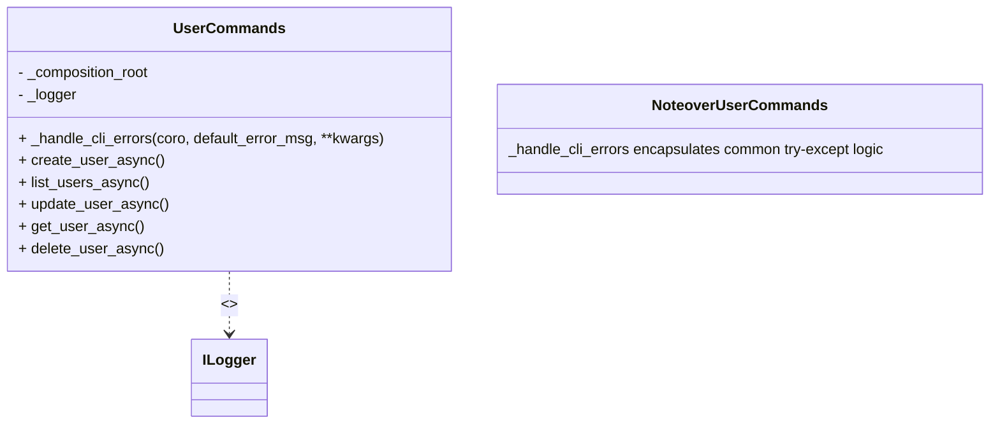
```mermaid
classDiagram
    class UserCommands {
        - _composition_root
        - _logger
        + _handle_cli_errors(coro, default_error_msg, **kwargs)
        + create_user_async()
        + list_users_async()
        + update_user_async()
        + get_user_async()
        + delete_user_async()
    }
    UserCommands ..> ILogger : <<uses>>
    Note over UserCommands : _handle_cli_errors encapsulates common try-except logic
```

##### 2.2.3. Diagrama de Sequência (Depois):

Snippet de código

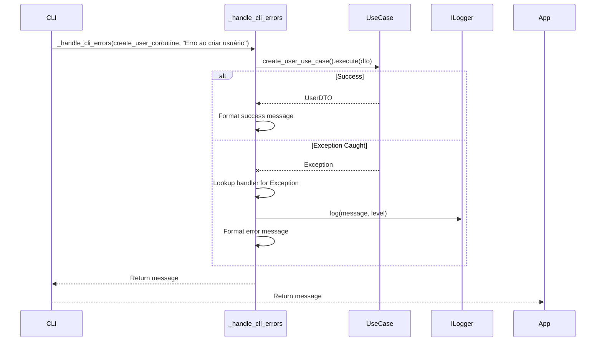
```mermaid
sequenceDiagram
    participant CLI
    participant Wrapper as _handle_cli_errors
    participant UC as UseCase
    participant Log as ILogger

    CLI->>Wrapper: _handle_cli_errors(create_user_coroutine, "Erro ao criar usuário")
    Wrapper->>UC: create_user_use_case().execute(dto)
    alt Success
        UC-->>Wrapper: UserDTO
        Wrapper->>Wrapper: Format success message
    else Exception Caught
        UC--xWrapper: Exception
        Wrapper->>Wrapper: Lookup handler for Exception
        Wrapper->>Log: log(message, level)
        Wrapper->>Wrapper: Format error message
    end
    Wrapper-->>CLI: Return message
    CLI-->>App: Return message
```

##### 2.2.4. Trechos de código (Depois):

**`src/dev_platform/client/cli/user_commands.py` - Adicionar função auxiliar `_handle_cli_errors` e refatorar comandos (AFTER):**

Python

```python
from typing import Callable, Awaitable, Any, Dict, List, Optional
import asyncio
import click
import sys, os

from dev_platform.infrastructure.config import ConfigurationFacade
from dev_platform.application.user.dtos import UserCreateDTO, UserUpdateDTO, UserDTO
from dev_platform.infrastructure.composition_root import CompositionRoot
from dev_platform.application.ports.logger import ILogger
from dev_platform.infrastructure.logging.structured_logger import StructuredLogger
from dev_platform.domain.exceptions import ConfigurationException
from dev_platform.domain.user.user_exceptions import (
    UserAlreadyExistsException, UserValidationException, UserNotFoundException,
)

# _LOGGER: ILogger = StructuredLogger() # Esta linha será removida ou gerenciada pela CompositionRoot

def run_async(coro) -> None:
    try:
        loop = asyncio.get_event_loop()
        if loop.is_running():
            raise RuntimeError(
                "Já existe um loop de eventos rodando. "
                "Execute este comando em um terminal/CLI puro."
            )
        return loop.run_until_complete(coro)
    except RuntimeError as re:
        # _LOGGER.critical(f"Ocorreu erro em tempo de execução: {re}", exception=str(re)) # Usar logger injetado
        print(f"Erro crítico: {re}")
        sys.exit(1)
    except Exception as e:
        # _LOGGER.error(f"Erro: {e}", exception=str(e)) # Usar logger injetado
        print(f"Erro: {e}")
        sys.exit(1)

EXCEPTION_MAPPINGS = {
    UserAlreadyExistsException: {"log_level": "warning", "user_message": "Erro: Usuário já existe: {e}"},
    UserValidationException: {"log_level": "warning", "user_message": "Erro: Validação: {e}"},
    UserNotFoundException: {"log_level": "warning", "user_message": "Erro: Usuário não encontrado: {e}"},
    ConfigurationException: {"log_level": "error", "user_message": "Erro: Configuração: {e}"},
}

class UserCommands:
    def __init__(self, composition_root: CompositionRoot, logger: ILogger):
        self._composition_root: CompositionRoot = composition_root
        self._logger: ILogger = logger

    async def _handle_cli_errors(self, func: Callable[..., Awaitable[Any]], default_error_message: str, **kwargs) -> Any:
        try:
            return await func(**kwargs)
        except Exception as e:
            handler = EXCEPTION_MAPPINGS.get(type(e))
            if handler:
                log_level = handler["log_level"]
                user_message = handler["user_message"].format(e=e)
                if log_level == "warning":
                    self._logger.warning(user_message, exception=str(e))
                elif log_level == "error":
                    self._logger.error(user_message, exception=str(e))
                return user_message
            else:
                self._logger.error(f"{default_error_message}: {e}", exception=str(e))
                return f"{default_error_message}: {e}"

    async def create_user_async(self, name: str, email: str) -> str:
        async def _create_user_logic():
            use_case = self._composition_root.create_user_use_case()
            dto: UserCreateDTO = UserCreateDTO(name=name, email=email)
            user: UserDTO = await use_case.execute(dto)
            return f"Usuário criado com sucesso: ID {user.id}, Nome: {user.name}, E-mail: {user.email}"
        
        return await self._handle_cli_errors(
            _create_user_logic,
            default_error_message="Erro inesperado ao criar usuário"
        )

    async def list_users_async(self) -> List[str]:
        async def _list_users_logic():
            use_case = self._composition_root.list_users_use_case()
            users: List[UserDTO] = await use_case.execute()
            if not users:
                return ["Nenhum usuário encontrado"]
            result: List[str] = []
            for user in users:
                result.append(f"ID: {user.id}, Nome: {user.name}, E-mail: {user.email}")
            return result
        
        return await self._handle_cli_errors(
            _list_users_logic,
            default_error_message="Erro inesperado ao listar usuários"
        )

    async def update_user_async( self, user_id: int, name: Optional[str] = None, email: Optional[str] = None ) -> str:
        async def _update_user_logic():
            update_use_case = self._composition_root.update_user_use_case()
            update_dto = UserUpdateDTO(name=name, email=email)
            updated_user = await update_use_case.execute(user_id=user_id, dto=update_dto)
            return f"Usuário {user_id} atualizado com sucesso: Nome: {updated_user.name}, E-mail: {updated_user.email}"

        return await self._handle_cli_errors(
            _update_user_logic,
            default_error_message="Erro inesperado ao atualizar usuário"
        )

    async def get_user_async(self, user_id: int) -> str:
        async def _get_user_logic():
            get_use_case = self._composition_root.get_user_use_case()
            user = await get_use_case.execute(user_id)
            return f"ID: {user.id}, Nome: {user.name}, E-mail: {user.email}"

        return await self._handle_cli_errors(
            _get_user_logic,
            default_error_message="Erro inesperado ao obter usuário",
            user_id=user_id # Passa user_id para o contexto de log, se necessário
        )

    async def delete_user_async(self, user_id: int) -> str:
        async def _delete_user_logic():
            delete_use_case = self._composition_root.delete_user_use_case()
            success = await delete_use_case.execute(user_id)
            if success:
                return f"Usuário {user_id} excluído com sucesso."
            else:
                return f"Falha ao excluir usuário {user_id}."
        
        return await self._handle_cli_errors(
            _delete_user_logic,
            default_error_message="Erro inesperado ao excluir usuário",
            user_id=user_id
        )

# click commands (mantidos como estavam, mas chamarão os métodos da instância UserCommands)
# Exemplo de como usar com CompositionRoot:
# @click.group()
# def cli():
#    pass

# @cli.command()
# @click.option("--name", required=True, help="Nome do usuário.")
# @click.option("--email", required=True, help="E-mail do usuário.")
# def create(name: str, email: str):
#    # Inicializa CompositionRoot e UserCommands aqui, ou passa de nível superior
#    root = CompositionRoot()
#    commands = UserCommands(root, root.get_logger())
#    result = run_async(commands.create_user_async(name, email))
#    click.echo(result)
```

#### 2.3. Discussão das Vantagens e Desvantagens:

#### Vantagens:

- **Redução da Duplicação de Código (DRY):** A lógica de tratamento de erros é escrita uma única vez na função `_handle_cli_errors`, eliminando a repetição em cada comando.
    
- **Manutenibilidade Aprimorada:** Alterações nas exceções a serem tratadas, nos níveis de log ou no formato das mensagens de erro podem ser feitas em um único local, facilitando a manutenção e reduzindo a probabilidade de erros.
    
- **Maior Clareza do Código:** Os comandos CLI ficam mais limpos e focados em sua lógica principal, sem a poluição visual dos blocos `try-except` repetitivos. Isso melhora a legibilidade.
    
- **Consistência no Tratamento de Erros:** Garante que todas as exceções esperadas sejam tratadas de forma consistente em todos os comandos CLI.
    
- **Extensibilidade:** Adicionar novos tipos de exceções a serem tratadas ou modificar o comportamento do tratamento de erros é simples, exigindo apenas a atualização do `EXCEPTION_MAPPINGS` ou da lógica interna de `_handle_cli_errors`.
    

#### Desvantagens:

- **Aumento de Complexidade para Casos Simples:** Para comandos muito simples que só poderiam ter uma exceção, introduzir a função `_handle_cli_errors` pode parecer um overhead inicial.
    
- **Curva de Aprendizado Inicial:** Novos desenvolvedores podem precisar entender o padrão da função auxiliar ou decorador para tratar erros.
    
- **Dificuldade em Tratamentos de Erro Altamente Específicos:** Se um comando exigir um tratamento de erro drasticamente diferente do padrão, a função auxiliar pode se tornar excessivamente complexa ou exigir que o comando ignore a função auxiliar, perdendo parte do benefício. No entanto, para a maioria dos casos de CLI, o tratamento padrão é suficiente.
    

#### 2.4. Impactos da Alteração:

- **Impacto no Código Existente:**
    
    - **`user_commands.py`:**
        
        - Será criada uma nova função auxiliar (e.g., `_handle_cli_errors`) ou decorador dentro da classe `UserCommands`.
            
        - Os métodos `create_user_async`, `list_users_async`, `update_user_async`, `get_user_async`, e `delete_user_async` serão refatorados para chamar esta nova função auxiliar, passando sua lógica principal como um argumento (neste caso, como uma função assíncrona aninhada ou lambda).
            
        - Um dicionário de mapeamento de exceções (`EXCEPTION_MAPPINGS`) pode ser introduzido para configurar mensagens e níveis de log.
            
    - **Classes de Exceção:** Não há impacto direto nas classes de exceção existentes, pois elas continuam sendo levantadas normalmente.
        
    - **Logger:** A forma como o logger é chamado será centralizada na função `_handle_cli_errors`.
        
- **Impactos Esperados no Projeto:**
    
    - **Manutenibilidade:** Melhora significativamente a manutenibilidade dos comandos CLI, reduzindo o tempo e o esforço necessários para modificações futuras no tratamento de erros.
        
    - **Confiabilidade:** A consistência no tratamento de erros aumenta a confiabilidade da CLI, garantindo que os usuários recebam feedback adequado para diferentes tipos de problemas.
        
    - **Qualidade do Código:** Contribui para um código mais limpo, mais legível e que adere melhor aos princípios de design de software.
        
    - **Produtividade:** Desenvolvedores podem implementar novos comandos CLI mais rapidamente, focando na lógica de negócios sem se preocupar em reescrever o boilerplate de tratamento de erros.
        

---

### 3. Substituição de Strings Mágicas por Constantes/Enum para Tipos de Usuário

No método

`get_rules` da classe `ValidationRuleProvider`14, os tipos de usuário (

`"default"` e `"enterprise"`) são representados por strings literais (magic strings).

Python

```python
# ANTES - Trecho relevante de ValidationRuleProvider.get_rules
def get_rules(self, user_type: str = "default") -> List[ValidationRule]:
    """
    Retorna a lista de regras de validação conforme o tipo de usuário.
    """
    if user_type == "enterprise": # <--- Magic string
        return self._enterprise_rules()
    return self._default_rules()
```

O uso de strings mágicas pode levar a:

- **Erros de Digitação:** Um erro de digitação na string pode passar despercebido até o tempo de execução.
    
- **Falta de Clareza:** O significado da string pode não ser imediatamente óbvio para novos desenvolvedores.
    
- **Dificuldade de Refatoração:** Renomear um tipo de usuário exigiria buscar e substituir todas as ocorrências da string.
    

#### 3.1. Descrição da Causa Raiz (Antes):

A causa raiz é a ausência de uma definição explícita e centralizada para os diferentes tipos de usuário que influenciam a lógica de regras de validação. Isso leva à dispersão da representação desses tipos por meio de strings literais.

- **Acoplamento Explícito à String:** A lógica depende diretamente da string literal, não de um identificador simbólico.
    
- **Dispersão da Definição:** Se novos tipos de usuário forem adicionados, suas strings correspondentes aparecerão em vários locais, aumentando a chance de inconsistência.
    

##### 3.1.1. Fluxograma (Antes):

Snippet de código

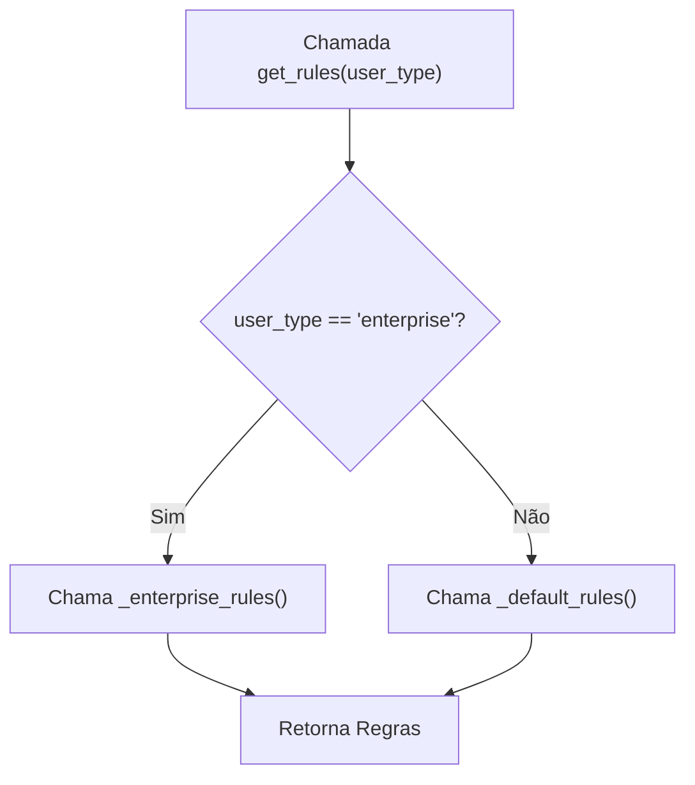
```mermaid
graph TD
    A["Chamada get_rules(user_type)"] --> B{"user_type == 'enterprise'?"};
    B -- Sim --> C["Chama _enterprise_rules()"];
    B -- Não --> D["Chama _default_rules()"];
    C --> E[Retorna Regras];
    D --> E;
```

##### 3.1.2. Diagrama de Classe (Antes):

Snippet de código

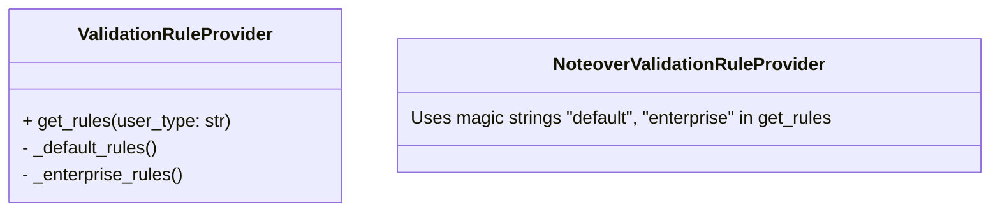
```mermaid
classDiagram
    class ValidationRuleProvider {
        + get_rules(user_type: str)
        - _default_rules()
        - _enterprise_rules()
    }
    Note over ValidationRuleProvider : Uses magic strings "default", "enterprise" in get_rules
```

##### 3.1.3. Diagrama de Sequência (Antes):

Snippet de código

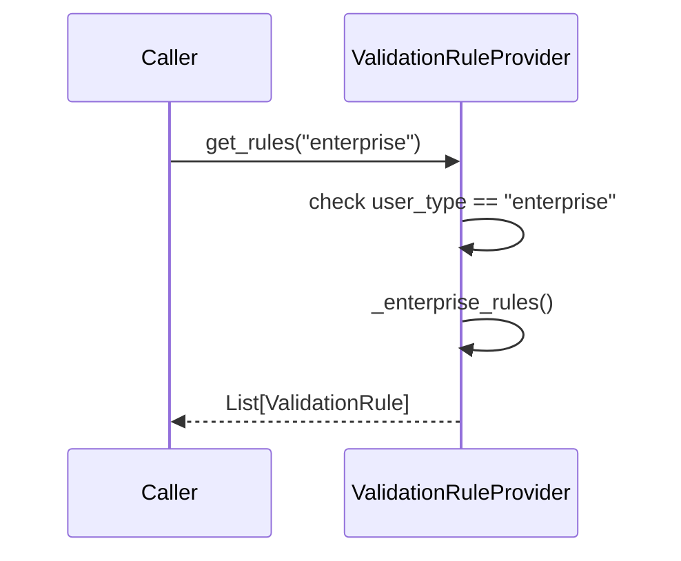
```mermaid
sequenceDiagram
    participant Caller
    participant VRP as ValidationRuleProvider

    Caller->>VRP: get_rules("enterprise")
    VRP->>VRP: check user_type == "enterprise"
    VRP->>VRP: _enterprise_rules()
    VRP-->>Caller: List[ValidationRule]
```

##### 3.1.4. Trechos de código (Antes):

`src/dev_platform/infrastructure/composition_root.py` - `ValidationRuleProvider.get_rules`15:

Python

```python
class ValidationRuleProvider:
    # ...
    def get_rules(self, user_type: str = "default") -> List[ValidationRule]:
        """
        Retorna a lista de regras de validação conforme o tipo de usuário.
        """
        if user_type == "enterprise": # <--- Magic string
            return self._enterprise_rules()
        return self._default_rules()
```

#### 3.2. Proposta para Implementação da Solução (Depois):

A solução é definir um `Enum` para os tipos de usuário. Isso fornece um conjunto limitado de opções válidas, melhora a legibilidade e permite que ferramentas de desenvolvimento verifiquem a validade dos valores.

Python

```python
# DEPOIS - src/dev_platform/domain/user/user_types.py (Novo arquivo) ou similar
from enum import Enum

class UserType(Enum):
    DEFAULT = "default"
    ENTERPRISE = "enterprise"
    # Adicionar outros tipos conforme necessário
```

**`src/dev_platform/infrastructure/composition_root.py` - `ValidationRuleProvider.get_rules` (AFTER):**

Python

```python
from dev_platform.domain.user.user_types import UserType # Importa o Enum

class ValidationRuleProvider:
    # ...
    def get_rules(self, user_type: UserType = UserType.DEFAULT) -> List[ValidationRule]: # <--- Usa Enum
        """
        Retorna a lista de regras de validação conforme o tipo de usuário.
        """
        if user_type == UserType.ENTERPRISE: # <--- Usa Enum
            return self._enterprise_rules()
        return self._default_rules()
```

E a chamada na `CompositionRoot` (e em outros lugares):

Python

```python
from dev_platform.domain.user.user_types import UserType # Importa o Enum

# ...
validator_service = UserValidatorService(rule_provider.get_rules(UserType.DEFAULT)) # <--- Usa Enum
# ...
```

##### 3.2.1. Fluxograma (Depois):

Snippet de código

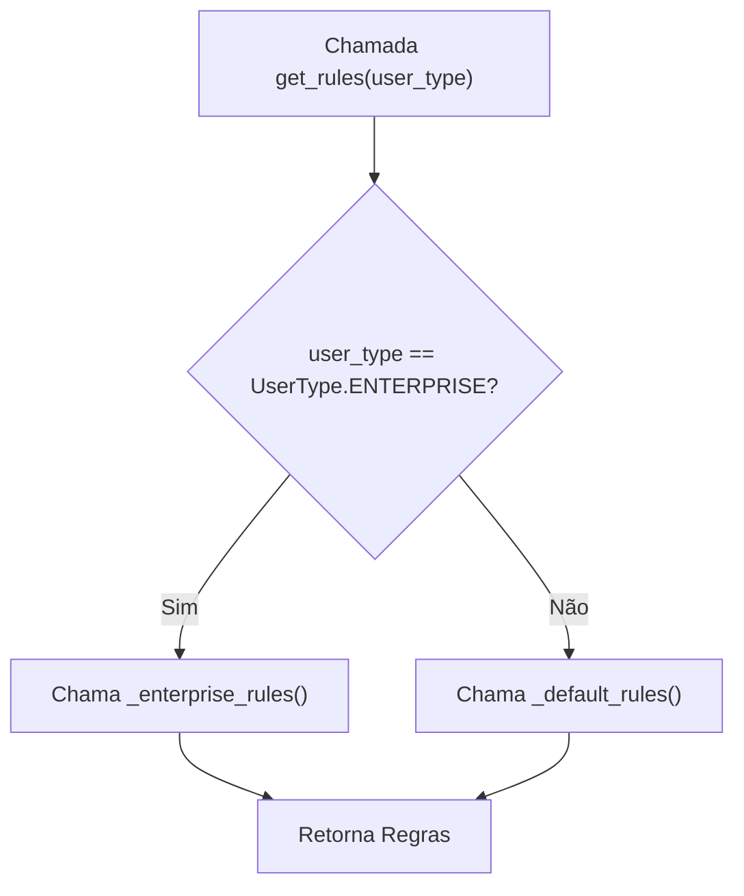
```mermaid
graph TD
    A["Chamada get_rules(user_type)"] --> B{user_type == UserType.ENTERPRISE?};
    B -- Sim --> C["Chama _enterprise_rules()"];
    B -- Não --> D["Chama _default_rules()"];
    C --> E[Retorna Regras];
    D --> E;
```

##### 3.2.2. Diagrama de Classe (Depois):

Snippet de código

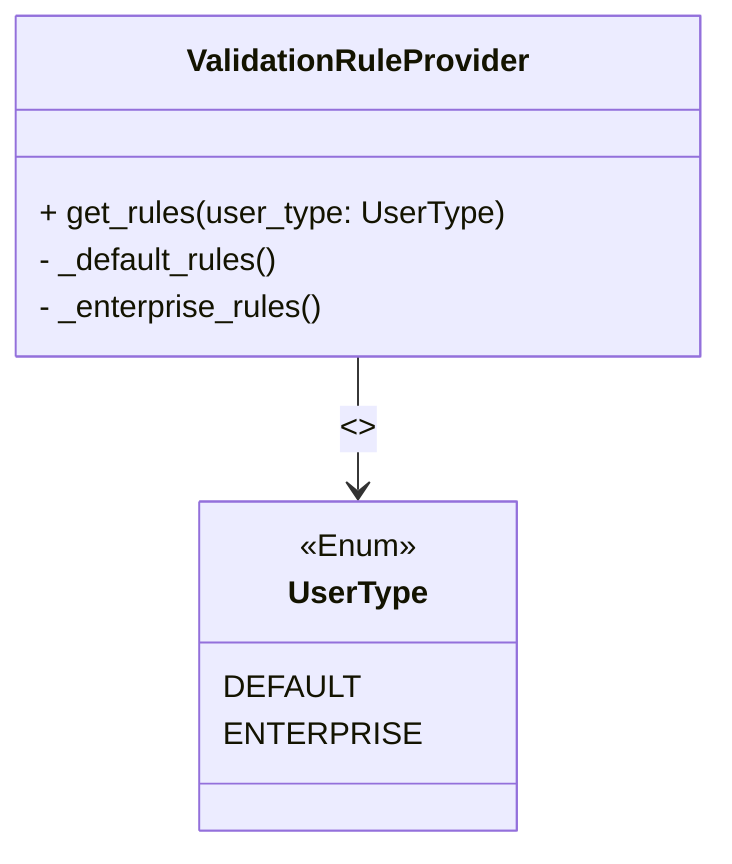
```mermaid
classDiagram
    class UserType {
        <<Enum>>
        DEFAULT
        ENTERPRISE
    }
    class ValidationRuleProvider {
        + get_rules(user_type: UserType)
        - _default_rules()
        - _enterprise_rules()
    }
    ValidationRuleProvider --> UserType : <<uses>>
```

##### 3.2.3. Diagrama de Sequência (Depois):

Snippet de código

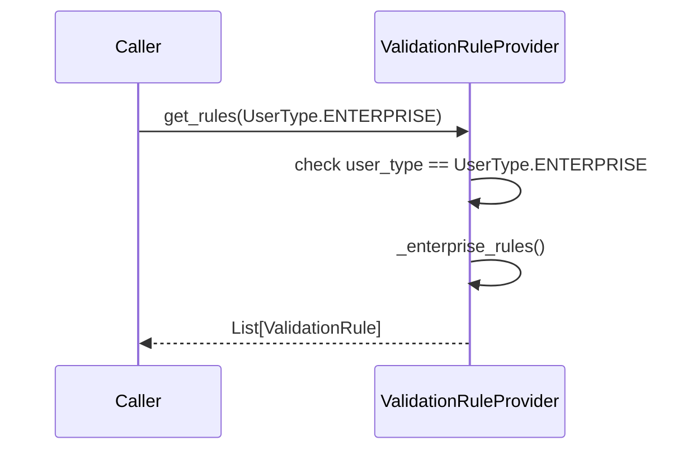
```mermaid
sequenceDiagram
    participant Caller
    participant VRP as ValidationRuleProvider

    Caller->>VRP: get_rules(UserType.ENTERPRISE)
    VRP->>VRP: check user_type == UserType.ENTERPRISE
    VRP->>VRP: _enterprise_rules()
    VRP-->>Caller: List[ValidationRule]
```

##### 3.2.4. Trechos de código (Depois):

Ver seções acima.

#### 3.3. Discussão das Vantagens e Desvantagens:

#### Vantagens:

- **Robustez:** Elimina erros de digitação, pois o IDE/linter pode verificar o uso de membros do Enum.
    
- **Legibilidade:** O código se torna mais legível ao usar nomes simbólicos (`UserType.ENTERPRISE`) em vez de strings literais.
    
- **Manutenibilidade:** Renomear um tipo de usuário é uma refatoração segura (se o Enum for alterado, as referências serão automaticamente atualizadas pelo IDE).
    
- **Autocompletar:** Ferramentas de desenvolvimento podem oferecer autocompletar para os membros do Enum.
    
- **Validação em Tempo de Desenvolvimento:** O uso do `Enum` pode permitir validações mais fortes em tempo de compilação/desenvolvimento (com type checkers).
    

#### Desvantagens:

- **Pequeno Aumento de Código:** Exige a criação de uma nova classe `Enum` e um import adicional onde for usado.
    
- **Flexibilidade Reduzida (em casos extremos):** Se os tipos de usuário fossem extremamente dinâmicos (carregados de um banco de dados, por exemplo), um Enum fixo não seria apropriado. No entanto, para tipos de usuário definidos no código, é a melhor abordagem.
    

#### 3.4. Impactos da Alteração:

- **Impacto no Código Existente:**
    
    - **Criação de Novo Arquivo:** Um novo arquivo (e.g., `src/dev_platform/domain/user/user_types.py`) será criado para definir o `UserType` Enum.
        
    - **`ValidationRuleProvider.get_rules`:** A assinatura do método será alterada para `user_type: UserType`, e as comparações usarão os membros do Enum.
        
    - **`CompositionRoot`:** As chamadas para `rule_provider.get_rules` precisarão ser atualizadas para passar os membros do `UserType` Enum.
        
    - **Outros Módulos:** Quaisquer outros módulos que atualmente usam as strings "default" ou "enterprise" para tipos de usuário precisarão ser atualizados para usar o `UserType` Enum.
        
- **Impactos Esperados no Projeto:**
    
    - **Qualidade do Código:** Melhora a qualidade geral do código, tornando-o mais robusto, legível e manutenível.
        
    - **Redução de Bugs:** Diminui a probabilidade de bugs relacionados a erros de digitação ou inconsistências nas strings.
        
    - **Padronização:** Estabelece um padrão para a representação de categorias ou tipos definidos no domínio.
