## 1. Refatoração da Unidade de Trabalho (Unit of Work) para Gerenciamento Automático de Transações

### **Descrição Detalhada do Problema**

Atualmente, a implementação do padrão Unidade de Trabalho (UoW) exige que a camada de aplicação (Casos de Uso) seja explicitamente responsável por gerenciar a transação, chamando os métodos `.commit()` ou `.rollback()`. Isso representa um vazamento de responsabilidade da camada de infraestrutura para a camada de aplicação, violando um dos preceitos da Arquitetura Limpa.

A responsabilidade de um UoW, quando usado como um gerenciador de contexto (`async with`), é garantir a atomicidade da operação. O ideal é que a transação seja automaticamente confirmada (`commit`) se o bloco de código for concluído sem erros, e desfeita (`rollback`) se uma exceção for levantada. A implementação atual força a repetição dessa lógica em todos os casos de uso, aumentando o boilerplate e o risco de erros, como esquecer de chamar `rollback` em um novo fluxo de exceção.

#### **Descrição da Causa Raiz (Antes)**

A causa raiz do problema está na implementação do método

`__aexit__` da classe `SQLUnitOfWork` e na documentação conflitante no

`DatabaseSessionManager`. O

`SQLUnitOfWork` delega a responsabilidade de `commit` e `rollback` ao seu chamador, em vez de encapsular essa lógica. O método `__aexit__` apenas finaliza o contexto da sessão, sem tomar qualquer ação sobre a transação pendente. Isso obriga o caso de uso

`CreateUserUseCase` a ter um bloco `try/except` complexo para chamar manualmente `await self._uow.commit()` em caso de sucesso ou

`await self._uow.rollback()` em caso de falha.

##### **Fluxograma (Antes)**

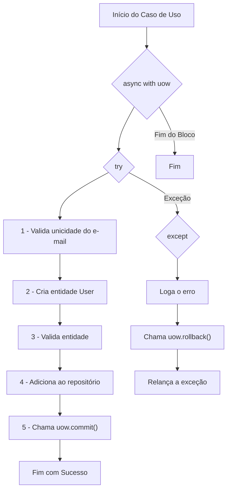

##### **Diagrama de Classe (Antes)**

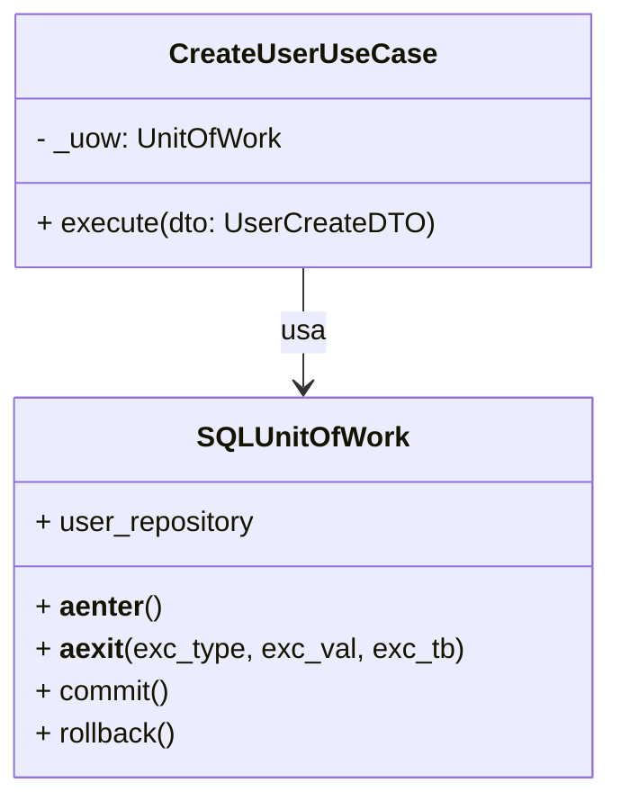

##### **Diagrama de Sequência (Antes)**

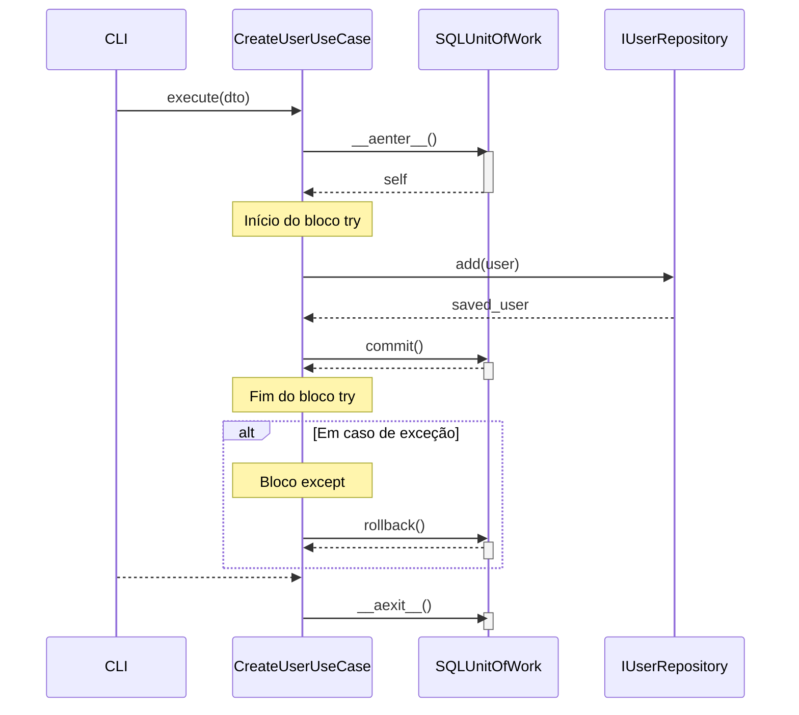

##### **Trechos de código (Antes)**

`./src/dev_platform/application/user/use_cases.py` 6666

Python

```python
async def execute(self, dto: UserCreateDTO) -> UserDTO:
    # Solução: O 'async with' é movido para cá, encapsulando a transação. [cite: 152]
    async with self._uow:
        self._logger.info("Iniciando criação de usuário", name=dto.name, email=dto.email)
        # O bloco try/except original agora fica dentro do 'async with'. [cite: 154]
        # O rollback é tratado automaticamente pelo __aexit__ da UoW em caso de exceção. [cite: 154]
        try:
            await self._user_uniqueness_service.ensure_email_is_unique(dto.email)
            user_to_create = User.create(name=dto.name, email=dto.email) # User é a entidade <<<<<<<
            await self._user_validator.validate(user_to_create)
            saved_user = await self._uow.user_repository.add(user_to_create)
            # O commit agora é explícito dentro do bloco de sucesso. 
            await self._uow.commit()
            self._logger.info(
                "Usuário criado com sucesso",
                user_id=saved_user.id,
                name=saved_user.name.value,
                email=saved_user.email.value
            )
            return self._mapper.to_dto(saved_user)
        except UserAlreadyExistsException as e:
            await self._uow.rollback() [cite: 157]
            self._logger.warning(
                "Validação de domínio tentou criar usuário duplicado", email=dto.email
            )
            raise
        except UserValidationException as e:
            await self._uow.rollback() [cite: 157]
            self._logger.warning(
                "Validação de regras de negócio falhou", validation_errors=e.validation_errors
            )
            raise
        except Exception as e:
            await self._uow.rollback() [cite: 157]
            self._logger.error(
                "Erro inesperado durante a criação do usuário",
                error=str(e),
            )
            raise
```

`./src/dev_platform/infrastructure/database/unit_of_work.py` 7

Python

```python
async def __aexit__(self, exc_type, exc_val, exc_tb):
    # Delega TODA a lógica de saída para o gerenciador de sessão. 
    # O gerenciador já cuida do commit, rollback e fechamento. [cite: 149]
    if self._session_context:
        await self._session_context.__aexit__(exc_type, exc_val, exc_tb)
    # Limpa as referências
    self._session = None
    self._session_context = None

async def commit(self):
    await self._session.commit()

async def rollback(self):
    await self._session.rollback()
```

#### **Proposta para Implementação da Solução (Depois)**

A solução proposta é modificar a classe `SQLUnitOfWork` para que ela gerencie a transação automaticamente. O método `__aexit__` será alterado para verificar se ocorreu uma exceção (`exc_type` não é `None`). Se nenhuma exceção ocorreu, ele chamará `commit()`. Se uma exceção ocorreu, ele chamará `rollback()`.

Com isso, os métodos `commit()` e `rollback()` podem se tornar privados (prefixados com `_`) ou até mesmo removidos se não houver outro uso para eles, e a lógica de `try/except` nos casos de uso pode ser drasticamente simplificada, focando apenas no tratamento de erros para logging e feedback, sem a necessidade de gerenciar a transação.

##### **Fluxograma (Depois)**
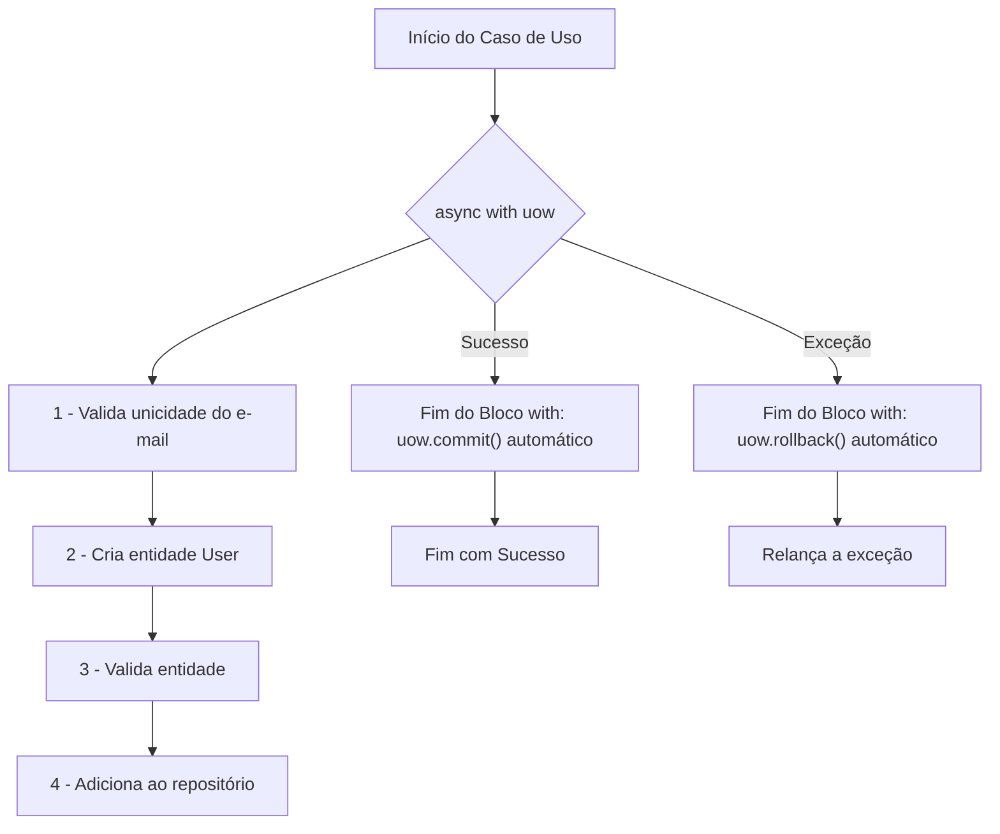

##### **Diagrama de Classe (Depois)**
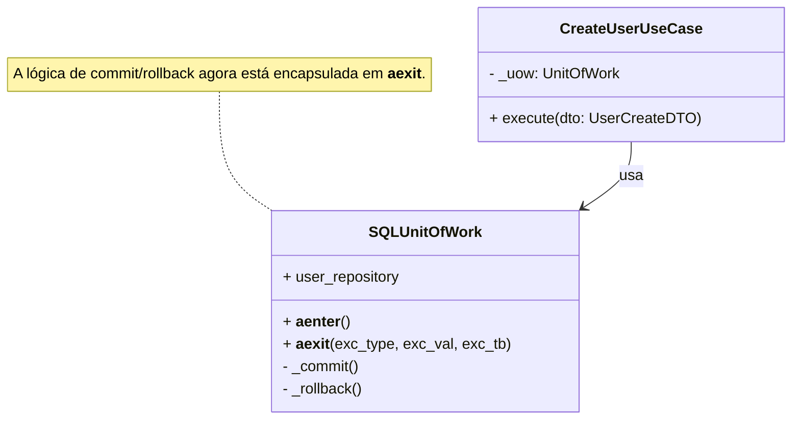

##### **Diagrama de Sequência (Depois)**
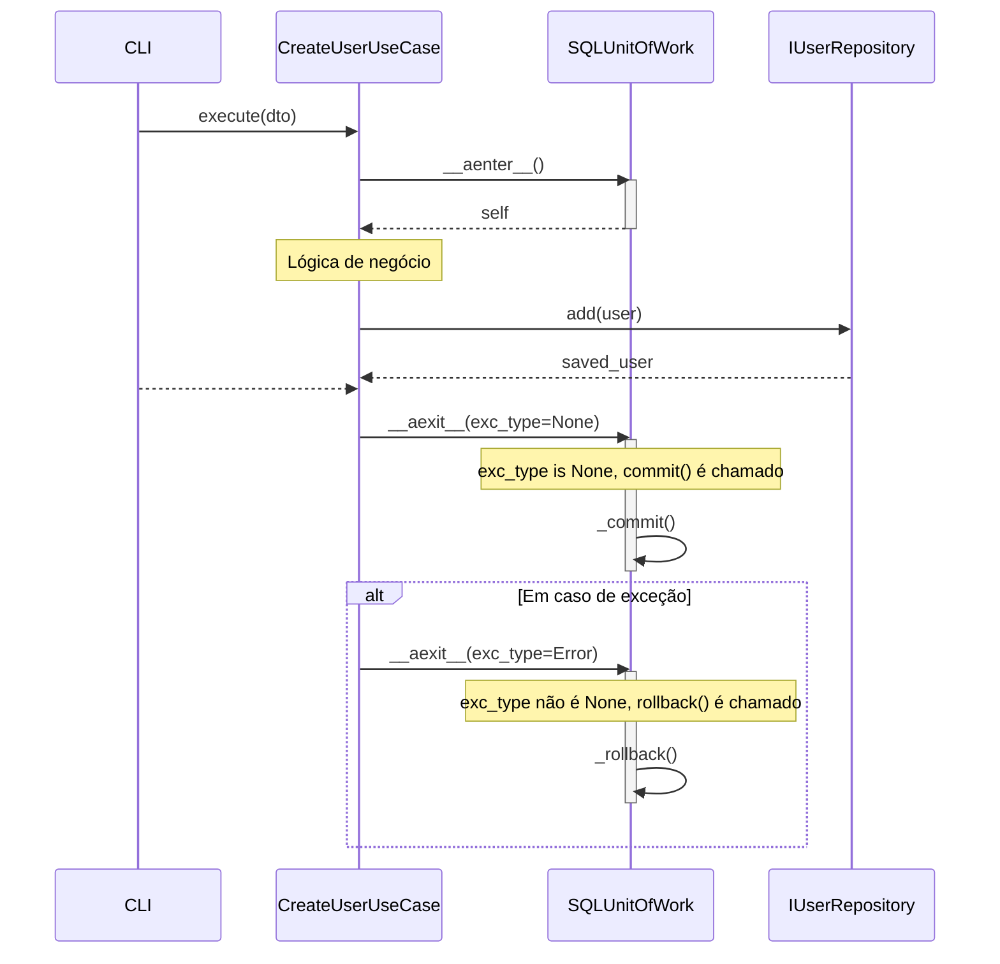

##### **Trechos de código (Depois)**

**`./src/dev_platform/infrastructure/database/unit_of_work.py` (Proposta)**

Python

```python
# ./src/dev_platform/infrastructure/database/unit_of_work.py

# ... (imports)

class SQLUnitOfWork(UnitOfWork):
    def __init__(self, logger: ILogger, user_repository: IUserRepository, db_session_manager: DatabaseSessionManager):
        self._logger: ILogger = logger
        self._user_repository: IUserRepository = user_repository
        self._db_session_manager: DatabaseSessionManager = db_session_manager
        self._session: Optional[AsyncSession] = None

    @property
    def user_repository(self) -> IUserRepository:
        return self._user_repository

    async def __aenter__(self):
        # A sessão é obtida do gerenciador
        self._session = self._db_session_manager.get_async_session_factory()()
        # Injeta a sessão no repositório
        if hasattr(self._user_repository, 'set_session'):
            self._user_repository.set_session(self._session)
        return self

    async def __aexit__(self, exc_type, exc_val, exc_tb):
        try:
            if exc_type:
                # Se uma exceção ocorreu, faz o rollback
                self._logger.warning("Ocorreu uma exceção, revertendo a transação.", exc_info=(exc_type, exc_val, exc_tb))
                await self._session.rollback()
            else:
                # Se não houve exceção, faz o commit
                await self._session.commit()
        finally:
            # Garante que a sessão seja fechada
            await self._session.close()
            self._session = None
            
    # Os métodos de commit e rollback explícitos não são mais necessários para o chamador
    # e podem ser removidos ou tornados privados se houver uso interno.
    async def _commit(self):
        await self._session.commit()

    async def _rollback(self):
        await self._session.rollback()
```

**`./src/dev_platform/application/user/use_cases.py` (Proposta)**

Python

```python
# ./src/dev_platform/application/user/use_cases.py

# ... (imports)

class CreateUserUseCase(BaseUseCase):
    # ... (__init__ permanece o mesmo)

    async def execute(self, dto: UserCreateDTO) -> UserDTO:
        # O 'async with' agora gerencia a transação automaticamente.
        # O rollback é implícito em caso de exceção, e o commit é implícito em caso de sucesso.
        async with self._uow:
            try:
                self._logger.info("Iniciando criação de usuário", name=dto.name, email=dto.email)
                
                await self._user_uniqueness_service.ensure_email_is_unique(dto.email)
                user_to_create = User.create(name=dto.name, email=dto.email)
                await self._user_validator.validate(user_to_create)
                saved_user = await self._uow.user_repository.add(user_to_create)
                
                self._logger.info(
                    "Transação será commitada. Usuário criado com sucesso.",
                    user_id=saved_user.id
                )
                return self._mapper.to_dto(saved_user)
            except (UserAlreadyExistsException, UserValidationException) as e:
                self._logger.warning(
                    "Falha de negócio na criação do usuário. A transação será revertida.",
                    error=str(e)
                )
                raise # A UoW cuidará do rollback ao capturar a exceção.
            except Exception as e:
                self._logger.error(
                    "Erro inesperado durante a criação do usuário. A transação será revertida.",
                    error=str(e),
                )
                raise # A UoW cuidará do rollback.
```

### **Discussão das Vantagens e Desvantagens**

- **Vantagens:**
    
    - **Adesão à Arquitetura Limpa:** A lógica de infraestrutura (gerenciamento de transação) é completamente encapsulada na camada de infraestrutura (UoW), não vazando para a camada de aplicação.
        
    - **Redução de Boilerplate:** Elimina a necessidade de blocos `try/except` para `commit/rollback` em todos os casos de uso, tornando o código mais limpo e conciso.
        
    - **Princípio da Responsabilidade Única (SRP):** Os casos de uso se concentram exclusivamente na orquestração da lógica de negócios, enquanto o UoW tem a responsabilidade única de gerenciar a transação.
        
    - **Menor Risco de Erros:** Reduz a chance de um desenvolvedor esquecer de chamar `rollback` em um novo caminho de exceção, o que poderia deixar o banco de dados em um estado inconsistente.
        
    - **Manutenibilidade:** Simplifica a manutenção e a adição de novos casos de uso.
        
- **Desvantagens:**
    
    - **Menos Controle Explícito:** Em cenários muito complexos onde um controle fino sobre a transação dentro de um único caso de uso pode ser desejado (o que geralmente é um anti-padrão), essa abordagem pode ser vista como menos flexível. No entanto, para a grande maioria dos casos, o gerenciamento automático é superior.
        

### **Impactos da Alteração**

- **Impacto no Código:** Todos os casos de uso que utilizam o `SQLUnitOfWork` como um gerenciador de contexto (`async with self._uow:`) precisarão ser refatorados para remover as chamadas explícitas a `self._uow.commit()` e `self._uow.rollback()`. A lógica de `try/except` pode ser simplificada para apenas capturar, logar e relançar exceções, confiando no `__aexit__` do UoW para o `rollback`.
    
- **Impacto na Arquitetura:** A alteração reforça a separação de camadas e o encapsulamento, tornando a arquitetura mais limpa e alinhada com seus princípios declarados.
    
- **Impacto na Testabilidade:** A testabilidade dos casos de uso melhora, pois eles não precisam mais ser testados quanto à chamada correta de `commit` ou `rollback`. O teste do UoW pode verificar isoladamente se ele gerencia a transação corretamente.
    
- **Impacto no Desempenho:** Não há impacto negativo no desempenho; a mesma quantidade de operações de banco de dados será executada.
    

---

## 2. Correção de Violação de Imutabilidade na Entidade `User`

### **Descrição Detalhada do Problema**

A entidade

`User` é definida como um objeto imutável usando `@dataclass(frozen=True)`8. Esta é uma excelente prática de DDD, pois garante que o estado da entidade seja sempre consistente e válido após sua criação. No entanto, o método

`update_address` tenta violar essa imutabilidade ao tentar atribuir um novo valor diretamente a `self.address`.

Devido à propriedade `frozen=True`, qualquer tentativa de chamar este método resultará em uma exceção `dataclasses.FrozenInstanceError` em tempo de execução, quebrando a aplicação. O método não segue o padrão estabelecido por outros métodos na mesma classe, como `with_id` e `update_details`, que corretamente criam e retornam uma nova instância da entidade com os valores atualizados.

#### **Descrição da Causa Raiz (Antes)**

A causa raiz é um erro de implementação no método

`update_address`9. O desenvolvedor escreveu o método como se a classe

`User` fosse mutável, usando a sintaxe de atribuição `self.address = Address(...)`. Isso entra em conflito direto com a decoração `@dataclass(frozen=True)` da classe, que proíbe tais modificações após a inicialização do objeto.

##### **Fluxograma (Antes)**

Snippet de código

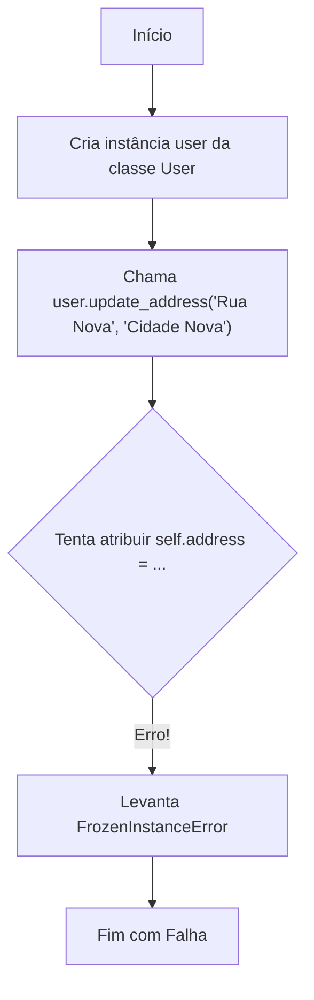

##### **Diagrama de Classe (Antes)**

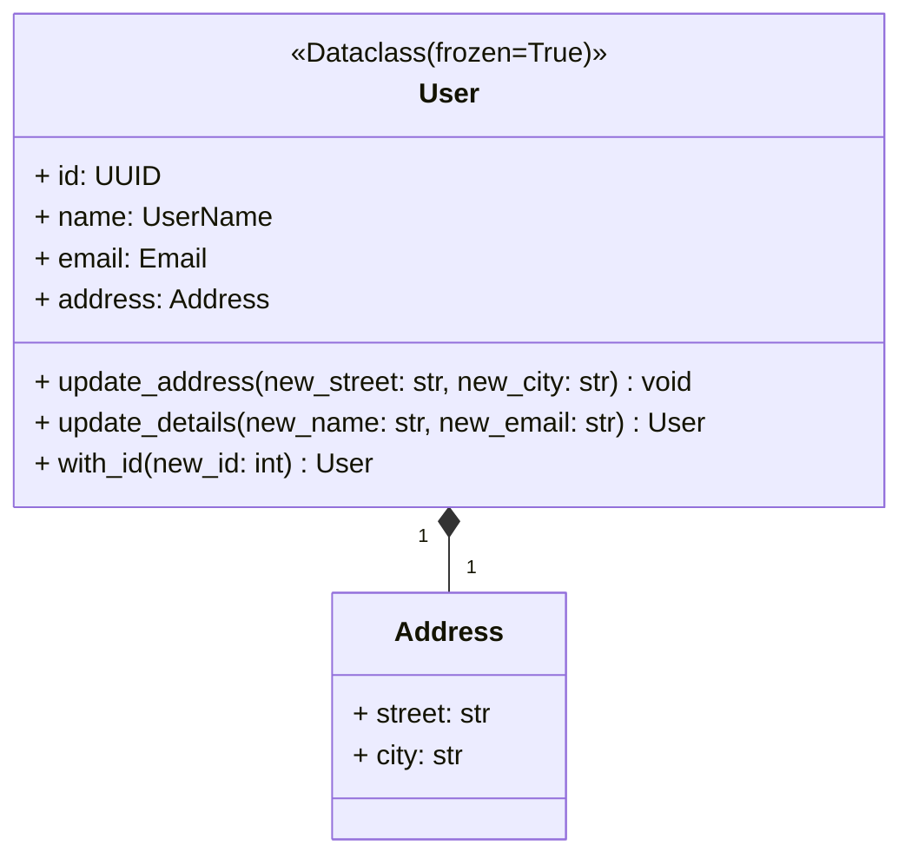

##### **Diagrama de Sequência (Antes)**
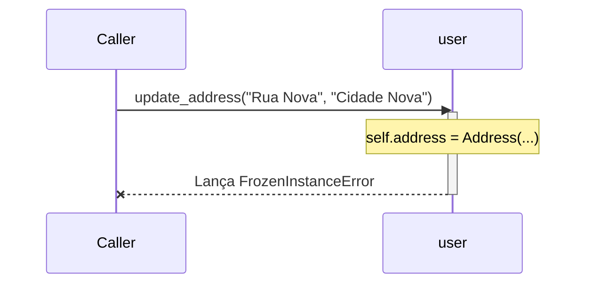

##### **Trechos de código (Antes)**

`./src/dev_platform/domain/user/entities.py` 10

Python

```python
from dataclasses import dataclass, field, replace
# ... outros imports

@dataclass(frozen=True)
class User:
    """Entidade de domínio representando um usuário (imutável)."""
    # ... outros atributos
    id: UUID
    name: UserName
    email: Email
    address: Address = field(default_factory=lambda: Address("", "")) # Address é parte do agregado User

    # Método para alterar o endereço, garantindo a consistência do agregado
    def update_address(self, new_street: str, new_city: str):
        # Lógica de validação e regras de negócio para o endereço
        if not new_street or not new_city:
            raise ValueError("Street and city cannot be empty.")
        # ESTA LINHA CAUSA O ERRO!
        self.address = Address(new_street, new_city) [cite: 72]

    # ... outros métodos
    def update_details(self, new_name: str, new_email: str) -> "User":
        """Retorna uma nova instância do usuário com nome e e-mail atualizados."""
        return replace(self, name=UserName(new_name), email=Email(new_email))
```

#### **Proposta para Implementação da Solução (Depois)**

A solução é corrigir o método `update_address` para que ele siga o padrão de imutabilidade. Em vez de tentar modificar a instância atual, ele deve criar e retornar uma **nova** instância de `User` com o endereço atualizado. Isso pode ser feito de forma limpa e eficiente usando a função `dataclasses.replace`, que já é usada corretamente em outros métodos da classe.

##### **Fluxograma (Depois)**

Snippet de código

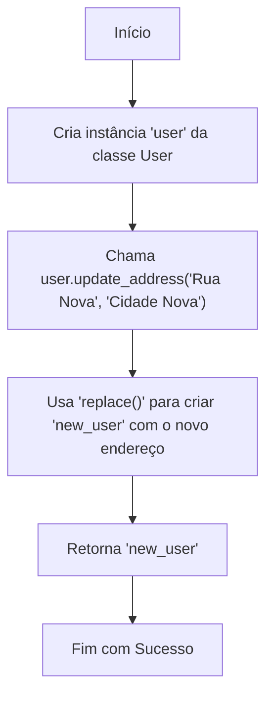

##### **Diagrama de Classe (Depois)**
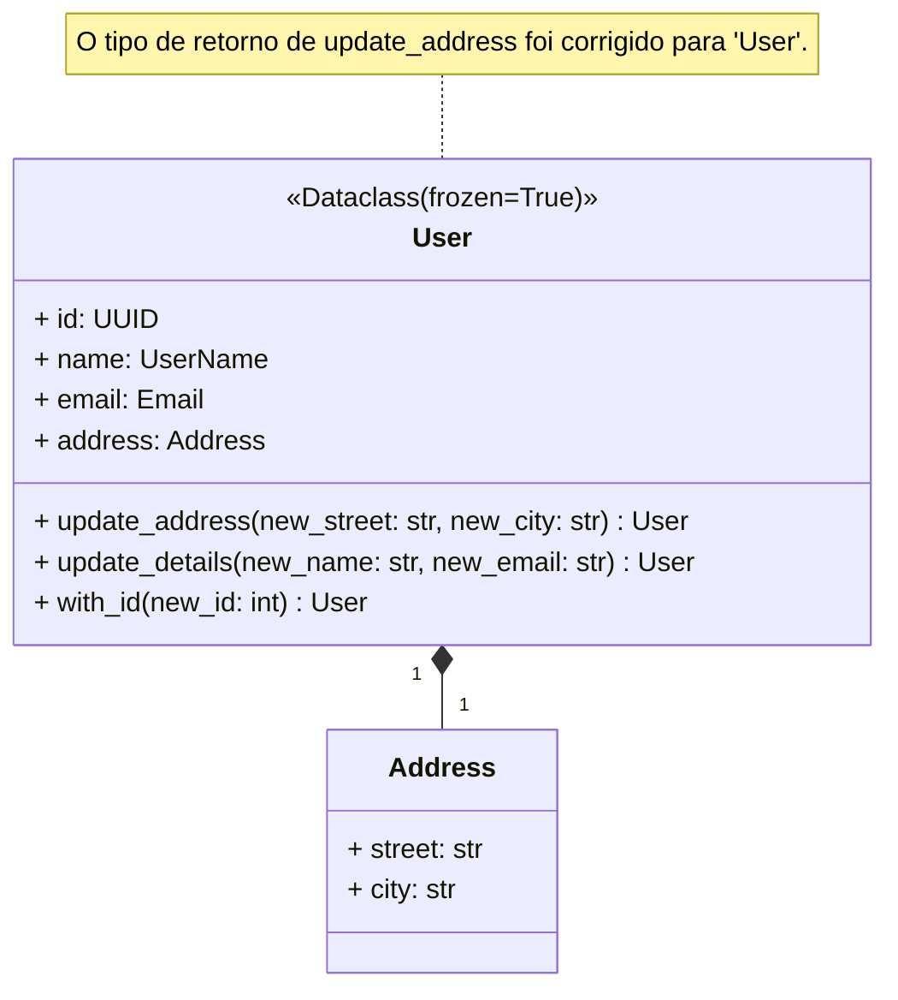

##### **Diagrama de Sequência (Depois)**
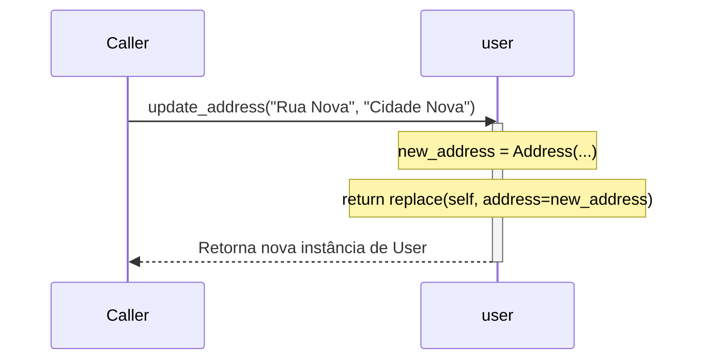

##### **Trechos de código (Depois)**

**`./src/dev_platform/domain/user/entities.py` (Proposta)**

Python

```python
from dataclasses import dataclass, field, replace
# ... outros imports

@dataclass(frozen=True)
class User:
    """Entidade de domínio representando um usuário (imutável)."""
    # ... outros atributos
    id: UUID
    name: UserName
    email: Email
    address: Address = field(default_factory=lambda: Address("", ""))

    # Método corrigido para alterar o endereço, respeitando a imutabilidade.
    def update_address(self, new_street: str, new_city: str) -> "User":
        """Retorna uma nova instância do usuário com o endereço atualizado."""
        if not new_street or not new_city:
            raise ValueError("Street and city cannot be empty.")
        
        # Cria um novo Address
        new_address = Address(street=new_street, city=new_city)
        
        # Usa 'replace' para criar e retornar uma nova instância de User
        return replace(self, address=new_address)

    # ... outros métodos
    def update_details(self, new_name: str, new_email: str) -> "User":
        """Retorna uma nova instância do usuário com nome e e-mail atualizados."""
        return replace(self, name=UserName(new_name), email=Email(new_email))
```

### **Discussão das Vantagens e Desvantagens**

- **Vantagens:**
    
    - **Correção de Bug Crítico:** A principal vantagem é a correção de um erro que causaria uma falha em tempo de execução, tornando o código funcional.
        
    - **Consistência do Padrão:** O método passa a seguir o mesmo padrão de imutabilidade dos outros métodos da classe (`with_id`, `update_details`), tornando a API da entidade coesa e previsível.
        
    - **Manutenção da Imutabilidade:** Garante que a propriedade fundamental de imutabilidade da entidade seja respeitada, prevenindo efeitos colaterais e tornando o estado do objeto mais fácil de rastrear e depurar.
        
- **Desvantagens:**
    
    - Não há desvantagens em corrigir um bug. A alteração é estritamente necessária para o funcionamento correto do código.
        

### **Impactos da Alteração**

- **Impacto no Código:** Qualquer código que atualmente chame `user.update_address(...)` (que estaria quebrando) precisará ser modificado para receber a nova instância retornada. Por exemplo:
    
    - **Antes (quebrado):** `my_user.update_address("Rua Nova", "Cidade Nova")`
        
    - Depois (correto): my_user = my_user.update_address("Rua Nova", "Cidade Nova")
        
        Esta é uma mudança necessária na forma como o método é chamado, mas é a maneira correta de interagir com objetos imutáveis.
        
- **Impacto na Arquitetura:** O impacto é positivo, pois reforça a integridade do domínio e a correta aplicação do padrão de Entidade Imutável.
    
- **Impacto na Testabilidade:** Simplifica o teste do método, que agora pode ser verificado pelo valor de retorno, em vez de uma tentativa de verificar a mutação de estado (que falharia). Um teste para este método se tornaria:
    
    Python
    
    ```python
    # Arrange
    user_original = User(...)
    
    # Act
    user_atualizado = user_original.update_address("Rua Nova", "Cidade Nova")
    
    # Assert
    assert user_atualizado is not user_original
    assert user_atualizado.address.street == "Rua Nova"
    ```
