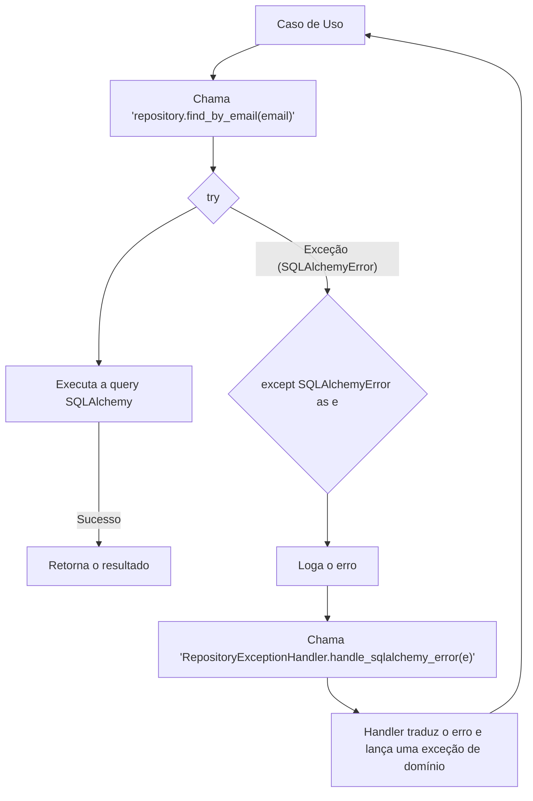
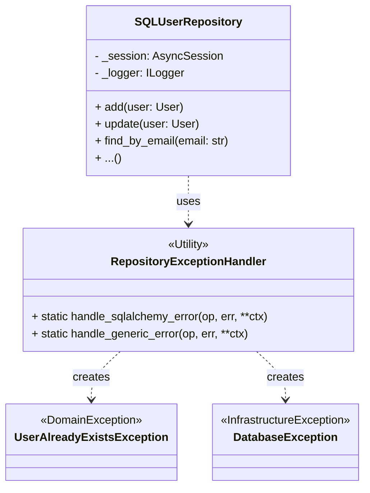
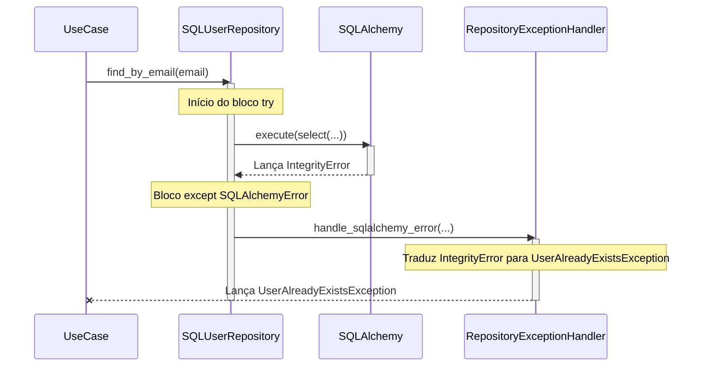
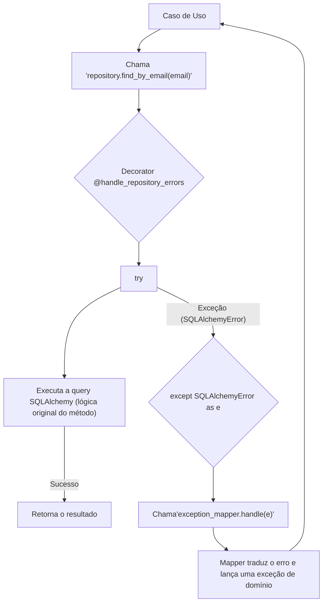
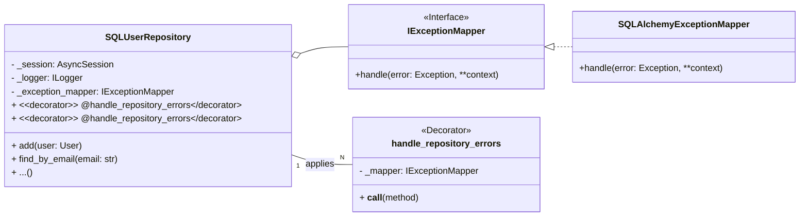
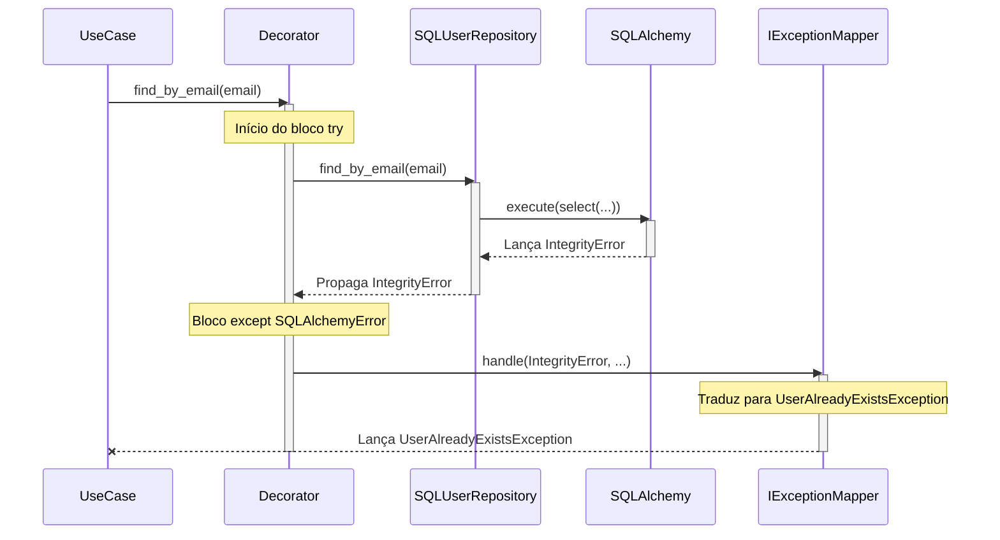

Com base em uma análise aprofundada do código-fonte fornecido no arquivo `compilado_46.pdf`, o projeto "DEV Platform" continua a demonstrar uma base de código madura e bem arquitetada, com forte adesão aos princípios da Arquitetura Limpa, DDD e SOLID. As melhorias identificadas na análise anterior, como o gerenciamento automático de transações na Unidade de Trabalho, já foram incorporadas a esta versão do código, o que simplificou os Casos de Uso e reforçou a separação de responsabilidades.

No entanto, uma nova oportunidade de refatoração foi identificada na camada de repositório, focada em desacoplar e centralizar o tratamento de exceções. A seguir, a documentação detalhada para este ponto de melhoria.

---

## 1. Refatoração do Tratamento de Exceções no Repositório para Desacoplamento e Centralização

### **Descrição Detalhada do Problema**

Atualmente, a classe `SQLUserRepository` possui uma forte acoplamento com a lógica de tratamento e tradução de exceções. Cada método público (como `find_by_email`, `add`, `delete`, etc.) contém um bloco `try...except` idêntico que captura `SQLAlchemyError`, loga o erro e delega a responsabilidade de traduzir o erro para uma classe utilitária estática, a `RepositoryExceptionHandler`.

Este padrão apresenta vários problemas:

1. **Violação do Princípio da Responsabilidade Única (SRP):** O repositório, cuja principal responsabilidade deveria ser a persistência e recuperação de entidades de domínio, também está assumindo a responsabilidade de orquestrar o tratamento e a tradução de exceções de infraestrutura.
    
2. **Violação do Princípio Aberto/Fechado (OCP):** Para adicionar um novo tipo de mapeamento de erro, é necessário alterar a classe `RepositoryExceptionHandler`, que é uma dependência concreta e estática do repositório.
    
3. **Código Repetitivo (Violação de DRY - Don't Repeat Yourself):** O bloco `try...except` é repetido em quase todos os métodos do repositório, aumentando a verbosidade e a chance de inconsistências caso um novo método seja adicionado e o bloco de tratamento de erro seja esquecido ou implementado de forma diferente.
    
4. **Acoplamento Forte:** O `SQLUserRepository` está diretamente acoplado à implementação concreta `RepositoryExceptionHandler`. Isso dificulta a testabilidade e a substituição da estratégia de tratamento de erros.
    

#### **Descrição da Causa Raiz (Antes)**

A causa raiz é a decisão de implementar o tratamento de exceções diretamente dentro de cada método do repositório, utilizando uma chamada para um método estático (`RepositoryExceptionHandler.handle_sqlalchemy_error`). Embora a intenção de centralizar a lógica de tradução de erro no `RepositoryExceptionHandler` seja boa, a forma como ela é invocada cria um acoplamento indesejado e espalha a lógica de captura de exceção por toda a classe.

##### **Fluxograma (Antes)**

Snippet de código



##### **Diagrama de Classe (Antes)**

Snippet de código



##### **Diagrama de Sequência (Antes)**

Snippet de código



##### **Trechos de código (Antes)**

**`./src/dev_platform/infrastructure/database/repositories.py`**

Python

```python
class SQLUserRepository(IUserRepository):
    # ... (__init__, _convert_to_domain_user, etc.)

    async def find_by_email(self, email: str) -> Optional[User]:
        """Find a user by email address."""
        try:
            result = await self._session.execute(
                select(UserModel).where(UserModel.email == email)
            )
            db_user = result.scalars().first()
            if db_user:
                return self._convert_to_domain_user(db_user)
            return None
        except SQLAlchemyError as e:
            self._logger.error(
                "SQLAlchemy error in find_by_email",
                extra={"operation": "find_by_email", "email": email, "error": str(e)}
            )
            # CAUSA RAIZ: Chamada direta ao handler estático e código repetitivo
            RepositoryExceptionHandler.handle_sqlalchemy_error(operation="find_by_email", error=e, email=email)

    async def find_all(self) -> List[User]:
        """Find all users in the database."""
        try:
            result = await self._session.execute(select(UserModel))
            db_users = result.scalars().all()
            return [self._convert_to_domain_user(db_user) for db_user in db_users]
        except SQLAlchemyError as e:
            self._logger.error(
                "SQLAlchemy error in find_all_users",
                extra={"operation": "find_all_users", "error": str(e)}
            )
            # CAUSA RAIZ: Chamada direta ao handler estático e código repetitivo
            RepositoryExceptionHandler.handle_sqlalchemy_error(operation="find_all_users", error=e)
            return []
    # ... outros métodos com o mesmo bloco try/except ...
```

#### **Proposta para Implementação da Solução (Depois)**

A solução proposta consiste em criar um **Decorator** em Python para encapsular a lógica de tratamento de exceções. Este decorator será aplicado a todos os métodos do repositório que interagem com o banco de dados.

1. **Criar o Decorator `handle_repository_errors`:** Este decorator conterá o bloco `try...except SQLAlchemyError`.
    
2. **Criar um `ExceptionMapper`:** O decorator, ao capturar uma exceção, a passará para um serviço de "mapeamento de exceções" injetado no repositório. Este serviço será responsável por traduzir a `SQLAlchemyError` para a exceção de domínio apropriada. Isso inverte a dependência, fazendo com que o repositório dependa de uma abstração (`IExceptionMapper`) em vez de uma implementação concreta.
    
3. **Limpar o Repositório:** Remover todos os blocos `try...except` dos métodos do repositório e aplicar o novo decorator a eles. O `RepositoryExceptionHandler` será substituído pela nova implementação do `IExceptionMapper`.
    

##### **Fluxograma (Depois)**

Snippet de código



##### **Diagrama de Classe (Depois)**

Snippet de código



##### **Diagrama de Sequência (Depois)**

Snippet de código



##### **Trechos de código (Depois)**

**1. Novo arquivo: `src/dev_platform/infrastructure/database/exception_handler.py` (Proposta)**

Python

```python
# src/dev_platform/infrastructure/database/exception_handler.py
from functools import wraps
from sqlalchemy.exc import SQLAlchemyError, IntegrityError
from dev_platform.domain.user.user_exceptions import UserAlreadyExistsException
from dev_platform.domain.exceptions import DatabaseException, DataIntegrityException
from dev_platform.application.ports.logger import ILogger

class IExceptionMapper(ABC):
    @abstractmethod
    def map_and_raise(self, error: Exception, **context):
        pass

class SQLAlchemyExceptionMapper(IExceptionMapper):
    def __init__(self, logger: ILogger):
        self._logger = logger

    def map_and_raise(self, error: Exception, **context):
        self._logger.error(
            "SQLAlchemy error captured by decorator",
            error=str(error),
            context=context
        )
        if isinstance(error, IntegrityError):
            dbapi_exception = error.orig
            # Lógica de tradução de erro, agora centralizada e desacoplada
            if hasattr(dbapi_exception, 'errno') and dbapi_exception.errno == 1062: # MySQL duplicate entry
                if "'uq_users_email'" in str(dbapi_exception):
                    raise UserAlreadyExistsException(context.get("email", "unknown")) from error
            raise DataIntegrityException(
                constraint_name="unknown",
                details=str(error),
                original_exception=error
            ) from error
        
        # Erro genérico do SQLAlchemy
        raise DatabaseException(
            operation=context.get("operation", "unknown"),
            reason=str(error),
            original_exception=error
        )

def handle_repository_errors(mapper: IExceptionMapper):
    def decorator(func):
        @wraps(func)
        async def wrapper(*args, **kwargs):
            try:
                return await func(*args, **kwargs)
            except SQLAlchemyError as e:
                # Delega a responsabilidade para o mapper injetado
                context = {"operation": func.__name__, **kwargs}
                mapper.map_and_raise(e, **context)
        return wrapper
    return decorator

```

**2. `composition_root.py` (Modificações para injetar o mapper)**

Python

```python
# ./src/dev_platform/infrastructure/composition_root.py
# ... (outros imports)
from dev_platform.infrastructure.database.exception_handler import SQLAlchemyExceptionMapper

class CompositionRoot:
    # ...

    def _create_user_repository(self) -> IUserRepository:
        """
        Método privado para criar e configurar o repositório de usuários.
        """
        # Cria e injeta o mapeador de exceções
        exception_mapper = SQLAlchemyExceptionMapper(logger=self._logger)
        
        # A sessão é injetada pelo UoW posteriormente
        return SQLUserRepository(
            session=None, 
            logger=self._logger,
            exception_mapper=exception_mapper # <-- Injeta o mapper
        )
    # ...
```

**3. `repositories.py` (Refatorado para usar o decorator)**

Python

```python
# ./src/dev_platform/infrastructure/database/repositories.py
from .exception_handler import handle_repository_errors, IExceptionMapper

class SQLUserRepository(IUserRepository):
    """SQLAlchemy implementation of the IUserRepository interface."""
    def __init__(self, session: AsyncSession, logger: ILogger, exception_mapper: IExceptionMapper):
        self._session: AsyncSession = session
        self._logger: ILogger = logger
        self._exception_mapper = exception_mapper
        # Criamos uma instância do decorator com o mapper injetado
        self._handle_errors = handle_repository_errors(self._exception_mapper)

    def __getattribute__(self, name):
        """Aplica o decorator dinamicamente aos métodos."""
        attr = super().__getattribute__(name)
        if callable(attr) and name not in ['__init__', '_convert_to_domain_user', 'set_session']:
             # Verifica se o método já não é o wrapper do decorator para evitar recursão
            if hasattr(attr, '__wrapped__'):
                return attr
            return self._handle_errors(attr)
        return attr
    
    # Os métodos agora são limpos, sem try/except
    async def find_by_email(self, email: str) -> Optional[User]:
        result = await self._session.execute(
            select(UserModel).where(UserModel.email == email)
        )
        db_user = result.scalars().first()
        if db_user:
            return self._convert_to_domain_user(db_user)
        return None

    async def find_all(self) -> List[User]:
        result = await self._session.execute(select(UserModel))
        db_users = result.scalars().all()
        return [self._convert_to_domain_user(db_user) for db_user in db_users]

    # ... outros métodos seguem o mesmo padrão limpo ...
```

### **Discussão das Vantagens e Desvantagens**

- **Vantagens:**
    
    - **Código Limpo e Legível:** Os métodos do repositório ficam drasticamente mais limpos e focados em sua responsabilidade principal (acesso a dados).
        
    - **Centralização da Lógica:** A lógica de tratamento e tradução de erros fica em um único lugar (o decorator e o `ExceptionMapper`), facilitando a manutenção e a garantia de consistência.
        
    - **Desacoplamento (DIP):** O repositório agora depende de uma abstração (`IExceptionMapper`), e não de uma implementação concreta. Isso permite trocar facilmente a estratégia de tratamento de erros (ex: para outro banco de dados com erros diferentes) sem alterar o repositório.
        
    - **Manutenção Simplificada (DRY):** Evita a repetição de código, reduzindo o risco de erros e facilitando a adição de novos métodos ao repositório.
        
    - **Testabilidade:** Torna-se mais fácil testar o repositório isoladamente (sem precisar se preocupar com a lógica de exceção) e testar a lógica de mapeamento de exceções de forma independente.
        
- **Desvantagens:**
    
    - **Curva de Aprendizado:** Para desenvolvedores não familiarizados com decorators ou injeção de dependência, a nova estrutura pode adicionar uma camada de complexidade inicial.
        
    - **Magia implícita:** A aplicação dinâmica do decorator via `__getattribute__` pode parecer "mágica" e menos explícita do que decorar cada método individualmente, o que pode dificultar a depuração para alguns desenvolvedores. Uma alternativa seria decorar cada método com `@handle_repository_errors`, que é mais explícito, mas um pouco mais verboso.
        

### **Impactos da Alteração**

- **Impacto no Código:**
    
    - O arquivo `repositories.py` será significativamente alterado para remover a lógica de exceção e aplicar o decorator.
        
    - A classe `RepositoryExceptionHandler` será removida e substituída pelo novo `SQLAlchemyExceptionMapper`.
        
    - O `composition_root.py` será modificado para construir e injetar o `SQLAlchemyExceptionMapper` no `SQLUserRepository`.
        
- **Impacto na Arquitetura:** A arquitetura se torna mais limpa e robusta, com uma separação mais clara das responsabilidades e melhor adesão aos princípios SOLID. O acoplamento entre a camada de infraestrutura (repositório) e sua lógica de tratamento de erros é reduzido.
    
- **Impacto na Testabilidade:** A testabilidade geral do sistema melhora. É possível fornecer um "mock" do `IExceptionMapper` para os testes do repositório e testar o `SQLAlchemyExceptionMapper` de forma completamente isolada.
    
- **Impacto no Desempenho:** O impacto no desempenho é desprezível. A sobrecarga de uma chamada de função extra para o decorator é mínima e não afetará o desempenho geral da aplicação.
