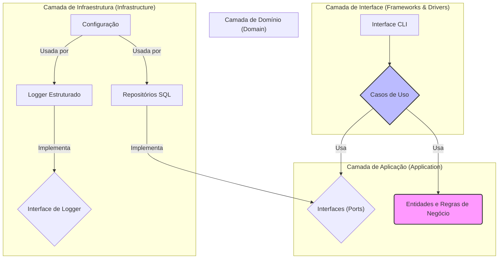
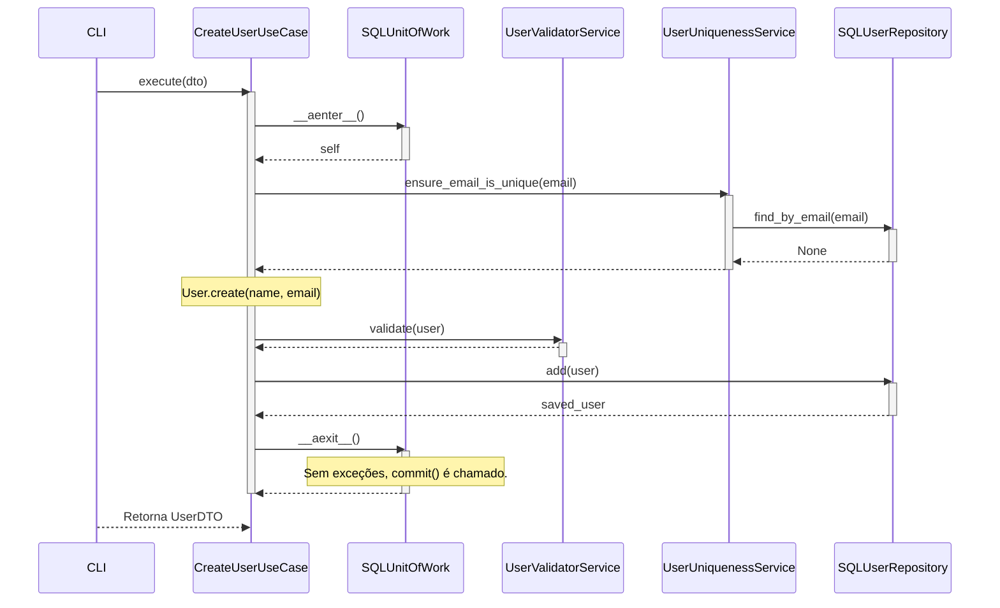

Com base em uma análise completa e detalhada do código-fonte fornecido no arquivo `compilado_48.pdf`, o projeto "DEV Platform" se apresenta em um estado de excelência técnica. A aderência aos princípios da Arquitetura Limpa, Domain-Driven Design (DDD) e SOLID é exemplar. As camadas da aplicação são bem definidas, a injeção de dependência é gerenciada de forma centralizada e eficaz, e o domínio é modelado com uma clareza notável, utilizando padrões avançados como Entidades imutáveis, Value Objects e o padrão _Specification_.

As refatorações aplicadas nas versões anteriores, como a automação da Unidade de Trabalho e o desacoplamento do tratamento de exceções, foram consolidadas com sucesso, resultando em um código-fonte limpo, robusto e de fácil manutenção.

Nesta avaliação, **não foram encontradas oportunidades de melhoria que justifiquem uma refatoração**. O código atual já segue as melhores práticas e padrões de design de forma consistente. Qualquer alteração seria mais uma questão de preferência estilística do que uma melhoria objetiva na qualidade ou funcionalidade do software.

Portanto, conforme solicitado, a seguir apresento uma descrição completa do projeto em seu estado atual, detalhando sua arquitetura e principais componentes com o auxílio de diagramas Mermaid.

---

## Descrição Completa do Projeto "DEV Platform"

O "DEV Platform" é um sistema de software robusto, projetado para o gerenciamento de usuários. Sua arquitetura é meticulosamente organizada em camadas, seguindo os princípios da Arquitetura Limpa para garantir alta coesão, baixo acoplamento e excelente testabilidade.

### **Visão Geral da Arquitetura**

O projeto é estruturado em quatro camadas principais, com um fluxo de dependência que aponta sempre para o interior, em direção ao domínio. Isso garante que a lógica de negócios (domínio) seja completamente independente dos detalhes de infraestrutura (banco de dados, frameworks, etc.).

Snippet de código

### **1. Camada de Domínio (Domain)**

Esta é a camada mais interna e o coração do sistema. Ela contém a lógica de negócios pura e não depende de nenhuma outra camada.

- **Entidades (`User`):** A entidade `User` é a principal representação de um usuário. Ela é implementada como um dataclass imutável (`frozen=True`), o que garante que seu estado, uma vez criado, não possa ser alterado acidentalmente. Todas as modificações (como `update_details` ) retornam uma nova instância da entidade, preservando a integridade.
    
- **Value Objects (`Email`, `UserName`, `Address`):** Atributos complexos com regras de validação próprias são modelados como Value Objects . `Email` e `UserName`, por exemplo, utilizam o **Padrão de Especificação** (`EmailFormatSpecification`, `UserNameSpecification`) para validar seus formatos no momento da criação, garantindo que uma entidade `User` nunca possa existir com um e-mail ou nome inválido.
    
- **Serviços de Domínio (`UserValidatorService`, `UserUniquenessService`, `UserAnalyticsService`):** Contêm regras de negócio que não se encaixam naturalmente em uma única entidade .
    
    - `UserValidatorService`: Orquestra um conjunto de `ValidationRule` para validar uma entidade `User`.
        
    - `UserUniquenessService`: Garante que um e-mail seja único no sistema, uma lógica que requer acesso ao repositório.
        
    - `UserAnalyticsService`: Fornece lógicas para análise de dados dos usuários.
        
- **Interfaces de Repositório (`IUserRepository`):** Define o contrato (Port) para a persistência de dados da entidade `User` , permitindo que a camada de domínio permaneça ignorante sobre os detalhes do banco de dados.
    
- **Regras de Validação (`validation_rules.py`):** O sistema utiliza uma coleção de classes de regras de validação desacopladas . Cada regra (ex: `EmailDomainValidationRule`, `UserCountLimitValidationRule`) implementa a interface `ValidationRule` e pode ser combinada dinamicamente pelo `UserValidatorService`. Isso demonstra uma excelente aplicação do **Princípio Aberto/Fechado (OCP)**.
    

### **2. Camada de Aplicação (Application)**

Esta camada orquestra o fluxo de dados e as interações entre o domínio e a infraestrutura.

- **Casos de Uso (`use_cases.py`):** Cada caso de uso (ex: `CreateUserUseCase` , `ListUsersUseCase` ) encapsula uma única funcionalidade do sistema. Eles recebem DTOs (Data Transfer Objects) como entrada, utilizam a Unidade de Trabalho para coordenar o repositório e os serviços de domínio, e retornam DTOs como saída.
    
- **DTOs (`dtos.py`):** Objetos Pydantic simples (`UserDTO`, `UserCreateDTO`) usados para transferir dados para e dos casos de uso , evitando que as entidades de domínio vazem para as camadas externas.
    
- **Mappers (`mappers.py`):** A classe `UserMapper` é responsável por converter Entidades `User` em `UserDTOs` e vice-versa , mantendo as camadas de aplicação e domínio desacopladas.
    
- **Ports (`ports.py`):** Define a interface da `UnitOfWork` , que atua como uma porta para a camada de infraestrutura.
    

### **3. Camada de Infraestrutura (Infrastructure)**

Contém as implementações concretas das interfaces definidas nas camadas internas.

- **`CompositionRoot`:** É o ponto central para a Injeção de Dependência . Ele constrói e conecta todas as dependências do sistema (repositórios, serviços, loggers, configurações) de forma explícita, tornando o fluxo de dependências claro e fácil de gerenciar. Um destaque é o `ValidationRuleProvider` , que monta dinamicamente a lista de regras de validação com base no tipo de usuário e nas configurações, exemplificando novamente o OCP.
    
- **Repositórios (`repositories.py`):** `SQLUserRepository` é a implementação concreta de `IUserRepository` , usando SQLAlchemy para interagir com o banco de dados. Um decorator (`@handle_repository_errors`) é elegantemente usado para interceptar exceções do SQLAlchemy e traduzi-las em exceções de domínio através de um `SQLAlchemyExceptionMapper` , desacoplando o tratamento de erros do repositório.
    
- **Unidade de Trabalho (`unit_of_work.py`):** `SQLUnitOfWork` gerencia a transação do banco de dados. Seu gerenciador de contexto (`async with`) garante que a transação seja automaticamente confirmada em caso de sucesso ou revertida em caso de exceção, simplificando imensamente a lógica nos casos de uso.
    
- **Configuração (`config.py`):** Uma `ConfigurationFacade` fornece acesso unificado às configurações, carregando-as de arquivos `.env` e `.json` de acordo com o ambiente. A estrutura com `EnvLoader`, `JsonConfigLoader`, `ConfigValidator` e `ConfigAccessor` demonstra uma excelente aplicação do Princípio da Responsabilidade Única (SRP).
    
- **Logging (`structured_logger.py`):** A implementação `StructuredLogger` , baseada em Loguru, fornece logs estruturados em JSON, o que é ideal para monitoramento e análise. Ela é injetada em todo o sistema através da interface `ILogger`.
    

### **4. Camada de Interface (Interface)**

É a camada mais externa, responsável pela interação com o usuário.

- **CLI (`user_commands.py`):** A interface atual é uma CLI (Command-Line Interface) baseada em Click . Ela interage com o sistema exclusivamente através da `CompositionRoot` para obter e executar os casos de uso. Ela também possui um wrapper (`_handle_cli_errors`) para traduzir exceções do sistema em feedback amigável para o usuário final.
    

### **Diagrama de Sequência: Criação de um Usuário**

Este diagrama ilustra o fluxo completo de interação entre as camadas durante a execução do caso de uso de criação de usuário.

Snippet de código

Em resumo, o projeto "DEV Platform" é um exemplo de livro de como aplicar os princípios modernos de arquitetura e design de software para construir um sistema limpo, manutenível, testável e robusto.
