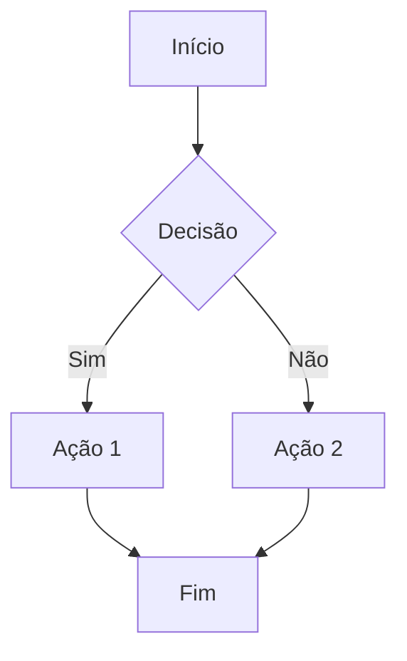
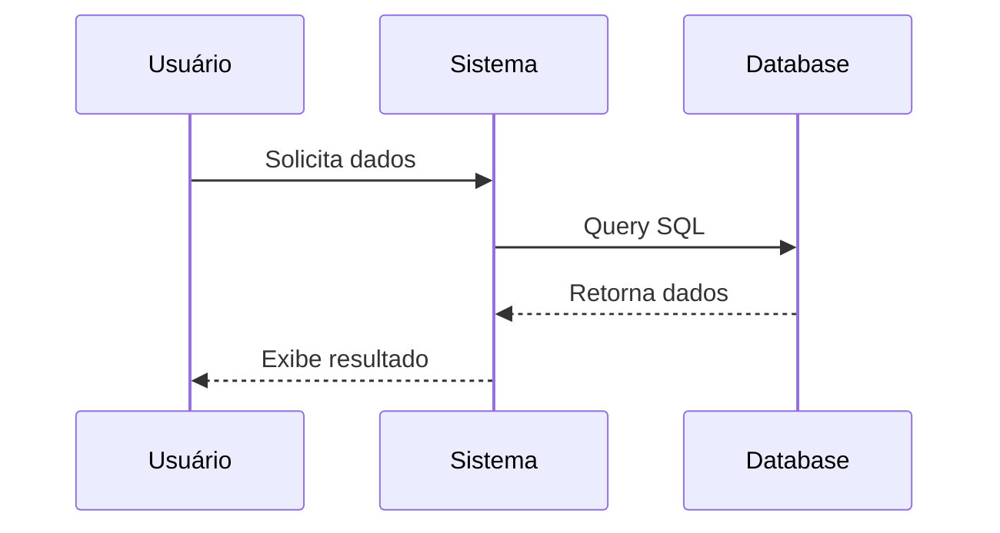

# Documento de Exemplo

## Introdução

Este é um documento de **exemplo** para demonstrar a conversão de Markdown para Word.

### Características suportadas:

- **Texto em negrito**
- *Texto em itálico*
- `Código inline`
- [Links](https://www.example.com)

### Lista numerada:

1. Primeiro item
2. Segundo item
3. Terceiro item

### Bloco de código:

```python
def hello_world():
    print("Olá, mundo!")
    return True
```

### Diagrama Mermaid - Fluxograma:



### Diagrama Mermaid - Sequência:



### Tabela:

| Nome | Idade | Cidade |
|------|-------|--------|
| Ana  | 25    | São Paulo |
| João | 30    | Rio de Janeiro |

### Citação:

> "A vida é o que acontece enquanto você está ocupado fazendo outros planos."
> — John Lennon

---

**Fim do documento de exemplo.**
